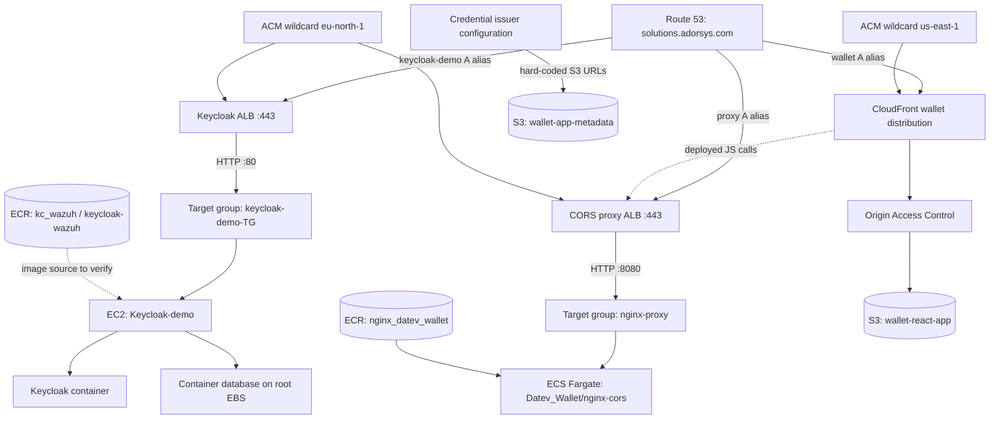
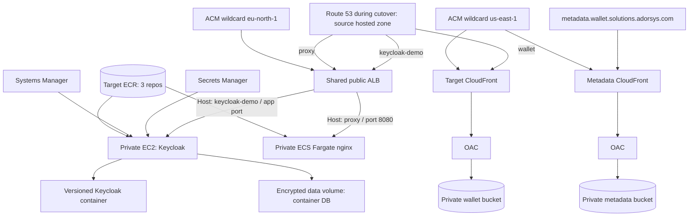

# AWS Sandbox Remaining-Resources Migration Plan

**Source account:** `917848404243` using profile `sandbox`  
**Target account:** `982081049921` using the default profile  
**Primary Region:** `eu-north-1`  
**Global services:** Route 53, CloudFront, and S3 naming  
**Plan date:** 2026-08-11  
**Status:** Planning only; no migration changes have been executed

## 1. Objective

Migrate the remaining Keycloak, nginx proxy, container images, wallet frontend,
metadata assets, TLS certificates, load-balancer routing, and public DNS names
from the sandbox account to the target account while preserving:

- `https://keycloak-demo.solutions.adorsys.com`
- `https://proxy.solutions.adorsys.com`
- `https://wallet.solutions.adorsys.com`
- Keycloak realms, clients, users, keys, and database state
- Wallet static assets and deep-link behavior
- The wallet's hard-coded nginx proxy URL
- Credential-display images currently addressed through the metadata bucket

The migration should also remove the source design's avoidable security risks rather
than reproduce them in the new account.

## 2. Evidence and Planning Boundaries

This plan is based on live, read-only AWS queries in both accounts and local
deployment source inspection.

The target account currently has:

- One default VPC (`172.31.0.0/16`) with three public subnets
- No ECS clusters
- No ECR repositories
- No ACM certificates in `eu-north-1`
- No CloudFront distributions
- No `solutions.adorsys.com` hosted zone

The exact Keycloak host configuration is not remotely visible because the source
EC2 instance has no IAM instance profile, is not registered with Systems Manager,
and has no EC2 user data. Before migration, an operator with host access must
inventory the running containers, Compose/scripts, secrets, database engine, and
persistent mounts. This is a mandatory gate, not an optional discovery task.

## 3. Current Source Architecture

### 3.1 Keycloak EC2

| Property | Current value |
|---|---|
| Instance | `Keycloak-demo` / `i-03eac5cc262731ede` |
| Operating system | Ubuntu 24.04 LTS, x86_64 |
| Instance type | `t3.medium` |
| Network | Default VPC, public subnet, public IPv4 |
| Storage | One 100-GiB gp3 root volume |
| Encryption | Root EBS volume is not encrypted |
| Instance profile | None |
| Systems Manager | Not registered |
| Metadata service | IMDSv2 required, hop limit 2 |
| Load balancer target | Instance port 80 |
| Health | Target currently unhealthy because `/` returns 302 but matcher requires 200 |

The source security group exposes ports 22, 80, 443, 4200, and 8443 to the
internet. The destination must not copy these rules.

The host reportedly runs Keycloak plus a containerized database through scripts.
The database engine, Compose project, image actually in use, volume driver, mount
path, and secrets source remain to be confirmed on the host.

### 3.2 ECS nginx CORS Proxy

| Property | Current value |
|---|---|
| Cluster/service | `Datev_Wallet/nginx-cors` |
| Runtime | Fargate, x86_64 Linux |
| Desired/running | 1 / 1 |
| Task definition | `cors_proxy:6` |
| CPU/memory | 1024 CPU units / 3072 MiB |
| Container port | 8080 |
| Image | `nginx_datev_wallet:latest` |
| Logs | `/ecs/cors_proxy` |
| Target type | IP, port 8080 |
| Public IP | Enabled |
| Deployment rollback | ECS circuit breaker enabled |

The deployed wallet JavaScript contains
`https://proxy.solutions.adorsys.com/cors`, so preserving the hostname prevents a
wallet rebuild solely for the account migration.

The nginx configuration is a general outbound proxy. It accepts a target URL in
the request path and reflects the caller's origin into CORS headers. This makes
rate limiting, upstream restrictions, SSRF controls, and monitoring part of the
migration security scope.

### 3.3 ECR

| Repository | Current content | Migration relevance |
|---|---|---|
| `kc_wazuh` | Two image records; `latest` is tagged | Retain until host inventory identifies the active Keycloak image |
| `keycloak-wazuh` | One image record tagged `latest` | Retain until host inventory identifies the active Keycloak image |
| `nginx_datev_wallet` | 213 records; `latest` and `deployment` tagged | `latest` is used by ECS |

The nginx image should preferably be rebuilt from `eudiw-app/nginx`. The existing
GitHub workflow points to the source account, uses long-lived AWS access-key
secrets, and deploys a mutable `latest` tag.

### 3.4 S3 and CloudFront

| Resource | Current use | Size |
|---|---|---:|
| `wallet-react-app` | CloudFront origin for the wallet SPA | 55 objects, about 14 MB |
| `wallet-app-metadata` | Public images referenced by credential-display configuration | 9 objects, about 0.5 MB |

The wallet CloudFront distribution:

- Uses `wallet.solutions.adorsys.com`
- Uses an Origin Access Control
- Redirects viewers to HTTPS
- Uses `index.html` as the default root object
- Maps 403 and 404 responses to `/index.html` with HTTP 200 for SPA routing
- Uses the managed caching-optimized policy
- Uses a wildcard ACM certificate in `us-east-1`

Both source buckets are publicly readable and have all four S3 public-access-block
settings disabled. The wallet bucket's OAC policy references a stale CloudFront
distribution ID, so anonymous access is currently masking the policy error.

The metadata bucket name appears directly in credential-display configuration as:

`https://wallet-app-metadata.s3.eu-north-1.amazonaws.com/<object>`

Unlike the wallet website bucket, its bucket name cannot change transparently
without updating those URLs.

### 3.5 DNS and Certificates

The source Route 53 hosted zone `solutions.adorsys.com` contains:

| Record | Destination |
|---|---|
| `keycloak-demo.solutions.adorsys.com` | Source Keycloak ALB |
| `proxy.solutions.adorsys.com` | Source nginx ALB |
| `wallet.solutions.adorsys.com` | Source CloudFront distribution |

The registered parent domain is not registered in either the source or target AWS
account. The `solutions.adorsys.com` hosted zone is therefore a delegated subdomain
managed in the source account.

Two Amazon-issued wildcard certificates exist:

- `eu-north-1` certificate for the two ALBs
- `us-east-1` certificate for CloudFront

The source certificates are account-bound resources. Request new DNS-validated
certificates in the target account instead of treating certificate transfer as a
dependency. CloudFront requires its ACM certificate in `us-east-1`.

## 4. Recommended Target Architecture

Use a clean target VPC rather than deploying production-like workloads into the
target account's default VPC.

### 4.1 Network

Recommended baseline:

- Dedicated VPC, for example `10.60.0.0/16`
- At least two public subnets across different Availability Zones for ALB and NAT
- At least two private application subnets for EC2 and Fargate
- Internet Gateway for public subnets
- NAT egress for Keycloak updates and nginx outbound proxy traffic
- S3 gateway endpoint
- Optional ECR API, ECR DKR, CloudWatch Logs, Secrets Manager, and SSM VPC endpoints
- VPC Flow Logs

Use one shared ALB with host-based listener rules unless workload isolation
requirements justify two ALBs:

- `keycloak-demo.solutions.adorsys.com` → Keycloak target group
- `proxy.solutions.adorsys.com` → nginx IP target group
- Port 80 → redirect to 443
- Port 443 → target wildcard ACM certificate and current TLS policy

Security groups:

1. **ALB SG:** inbound 80/443 from the internet; no admin or database ports.
2. **Keycloak SG:** application port only from the ALB SG; no public SSH.
3. **nginx task SG:** port 8080 only from the ALB SG.
4. **Management:** Systems Manager instead of inbound SSH.
5. **Database:** database port accessible only inside the Keycloak host/container
   network. If later moved to RDS, allow it only from the Keycloak SG.

### 4.2 Keycloak Target

Recommended migration architecture for the first cutover:

- New Ubuntu 24.04 x86_64 EC2 instance built from a launch template
- Same initial size (`t3.medium`) pending CPU/memory measurements
- 30-GiB encrypted root volume
- Separate encrypted gp3 data volume sized from measured database usage
- IMDSv2 required with hop limit 2 because containers run on the instance
- SSM instance profile and no public IP
- Docker/Compose scripts stored in version control
- Images referenced by immutable digest or migration tag
- Secrets loaded from target Secrets Manager or SSM SecureString
- CloudWatch agent/container log shipping
- Automated EBS snapshots or AWS Backup

This is a lift-and-improve target. After the account move stabilizes, move the
container database to RDS PostgreSQL if the host inventory confirms PostgreSQL,
and consider moving Keycloak itself to ECS. Combining account migration, database
replatforming, and Keycloak runtime replatforming in one cutover creates
unnecessary rollback complexity.

### 4.3 Keycloak Health and Proxy Configuration

Do not reproduce the unhealthy source target group.

Preferred sequence:

1. Confirm the Keycloak version and enable a readiness endpoint.
2. Use a path that returns HTTP 200 without authentication.
3. If that cannot be completed before migration, temporarily accept `200-399` so
   the known root redirect does not mark the instance unhealthy.
4. Configure Keycloak's external hostname as
   `https://keycloak-demo.solutions.adorsys.com`.
5. Configure forwarded-header handling for TLS termination at the ALB.
6. Validate issuer URLs and redirect URIs after restore.

### 4.4 ECS and nginx

Create in the target account:

- ECR repository `nginx_datev_wallet`
- ECS cluster `Datev_Wallet`
- CloudWatch log group `/ecs/cors_proxy` with retention
- ECS execution role with ECR pull and log-write permissions
- No task role unless nginx genuinely calls AWS APIs
- Fargate task with 1024 CPU, 3072 MiB memory, port 8080
- Private subnets and `assignPublicIp=DISABLED`
- ALB IP target group on port 8080
- Health check on `/` expecting 200
- Circuit breaker with rollback enabled
- Deployment alarms and access logs

Before exposing the target proxy:

- Restrict acceptable caller origins where practical
- Block link-local, loopback, RFC1918, and VPC destinations
- Restrict upstream ports and schemes
- Add AWS WAF rate limiting or equivalent controls
- Test GET, POST, OPTIONS, DPoP headers, and redirect rewriting

### 4.5 ECR Image Migration

Create all three target repositories with:

- Scan-on-push or registry-level enhanced scanning
- Immutable tags, with an explicit exception only if `latest` must remain mutable
- Lifecycle policies
- Least-privilege pull/push policies

For nginx, rebuild from the repository and push a content-addressable release tag.
For the two Keycloak/Wazuh images, use the following priority:

1. Rebuild from verified source and Dockerfile.
2. If source cannot be reproduced, pull from source ECR, verify the digest, tag with
   a migration-specific immutable tag, and push to target ECR.
3. Copy both images initially; delete the unused one only after host inventory and
   target validation identify the actual dependency.

Do not rely on ECR replication to backfill the existing images. AWS documents that
replication only processes content pushed or restored after replication is configured.

Update the GitHub workflow to:

- Use target account `982081049921`
- Use GitHub OIDC and an assumable deployment role instead of stored AWS access keys
- Register a new task-definition revision with the immutable image
- Deploy that revision, wait for service stability, and retain rollback metadata

## 5. Data Migration Procedures

### 5.1 Mandatory Keycloak Host Inventory

Run on the source host before designing the final backup command. Do not print
secret values into tickets or logs.

Collect:

- `docker ps --format '{{.Names}}\t{{.Image}}\t{{.Ports}}'`
- `docker compose ls`
- Paths and Git revisions of deployment scripts
- Container mount sources and destinations
- Docker named-volume locations
- Database image, engine, and version
- Database name and approximate size
- Keycloak image and version
- Provider JARs, themes, realm imports, keystores, and local certificates
- External URLs, proxy/hostname flags, and health configuration
- Scheduled jobs and systemd units
- Backup/restore commands already used by the team

Record only secret names and their intended target location. Migrate secret values
through an approved secure channel directly into target Secrets Manager.

### 5.2 Keycloak Database

Use a logical database backup as the authoritative migration artifact.

If PostgreSQL is confirmed:

1. Create a compressed custom-format dump with `pg_dump` or a cluster-wide dump
   with `pg_dumpall` when roles/global objects are required.
2. Record database and extension versions.
3. Hash the dump and store it in a temporary encrypted migration bucket.
4. Restore into a matching target database container.
5. Compare schemas, row counts, realms, clients, users, and keys.
6. Repeat as a rehearsal before the final cutover.
7. During final cutover, stop Keycloak or put it into maintenance mode before the
   final dump so no writes occur after the recovery point.

If another database engine is found, replace this with that engine's
transactionally consistent logical backup procedure.

### 5.3 EC2 Recovery Image

Create a recovery AMI only as a fallback, not as the primary deployment mechanism.

Because the source volume is unencrypted:

1. Quiesce the database or stop the instance for a consistent AMI.
2. Create the source AMI without `--no-reboot` unless the filesystem was explicitly
   flushed and quiesced.
3. Scrub or account for credentials captured in the image.
4. Share the AMI with target account `982081049921`.
5. Copy it in the target account with encryption enabled.
6. Do not launch the copied image as the final design until security groups, IAM,
   secrets, and storage have been corrected.

A rebuild plus logical restore remains preferred because an AMI copies host drift,
stale secrets, the unencrypted single-volume layout, and unknown scripts.

### 5.4 Wallet Website Bucket

S3 bucket names are globally unique and the source account owns
`wallet-react-app`. Do not delete the source bucket merely to race for the same name.

Create a target bucket such as:

`wallet-react-app-982081049921-eu-north-1`

Configure:

- Bucket-owner-enforced object ownership
- All four public-access-block settings enabled
- Versioning enabled
- Default encryption
- OAC-only bucket policy scoped to the new CloudFront distribution
- Optional access logging and deployment retention

For this 14-MB dataset, a cross-account `aws s3 sync` through a temporary migration
role is sufficient. Perform an initial copy and a final differential sync.

Recreate the CloudFront behavior:

- Private S3 REST origin with OAC
- `index.html` default root
- HTTPS redirect
- Compression
- 403 and 404 mapped to `/index.html` with response 200
- TLS 1.2 or later
- Target certificate from `us-east-1`
- Logging and WAF according to sandbox requirements

### 5.5 Metadata Bucket

Create a uniquely named private target bucket such as:

`wallet-app-metadata-982081049921-eu-north-1`

Copy the nine objects and expose them through a stable custom hostname:

`https://metadata.wallet.solutions.adorsys.com/<object>`

Use CloudFront plus OAC and block direct public S3 access. Then update every
credential-display configuration currently referencing the source S3 hostname.

Known references exist in:

- Terraform example variables
- City Registry Credential client-scope JSON
- DATEV Company Credential client-scope JSON variants
- Bank Employee Credential client-scope JSON

Existing credentials or issuer metadata may retain the old URLs. Keep the source
metadata bucket readable until all issuing configurations and validation tests have
moved to the new hostname. Do not attempt a delete-and-recreate bucket-name handoff;
AWS warns that deleted names can be taken by another account and may receive traffic
intended for the former owner.

## 6. Certificates and DNS

### 6.1 Certificate Reissuance

Request two target-account wildcard certificates for
`*.solutions.adorsys.com`:

1. In `eu-north-1` for the Application Load Balancer.
2. In `us-east-1` for CloudFront.

Add the ACM DNS-validation CNAMEs to the current source hosted zone. Keep those
validation records permanently so ACM can renew the certificates.

The historical Amazon-issued certificates predate current exportable-certificate
support and should be treated as non-transferable. Reissuance also avoids coupling
the target to source-account certificate lifecycle.

### 6.2 Recommended DNS Cutover

Keep the `solutions.adorsys.com` hosted zone in the source account during workload
migration. Route 53 records can point to target-account ALBs and CloudFront
distributions.

Cut over in this order:

1. Validate target Keycloak on a temporary hostname.
2. Validate target proxy on a temporary hostname.
3. Validate target wallet through the target CloudFront domain.
4. Switch `keycloak-demo.solutions.adorsys.com` to the target ALB.
5. Switch `proxy.solutions.adorsys.com` to the target ALB.
6. Move the CloudFront alias and switch `wallet.solutions.adorsys.com`.
7. Add `metadata.wallet.solutions.adorsys.com` and update issuer metadata.
8. Observe before migrating the hosted zone itself.

This separates workload rollback from DNS-authority migration.

### 6.3 CloudFront Alias Move

A CloudFront alternate domain can belong to only one distribution. Because the
source and target distributions are in different accounts and the alias is not an
apex name, use AWS's supported cross-account wildcard procedure:

1. Attach the target `us-east-1` wildcard certificate.
2. Configure the target distribution and prove domain ownership with the required
   TXT record.
3. Add the covering wildcard alias to the target distribution.
4. Wait for the target distribution to deploy.
5. Point the wallet DNS alias to the target distribution and test.
6. Remove the exact `wallet.solutions.adorsys.com` alias from the source distribution.
7. Add the exact alias to the target distribution.
8. Remove the temporary wildcard alias if it is no longer needed.

If organizational policy does not allow the wildcard method, schedule a source
distribution disablement and use the domain-association procedure, or open an AWS
Support case.

### 6.4 Optional Hosted-Zone Migration

After all workloads have been stable in the target account:

1. Create `solutions.adorsys.com` as a public hosted zone in the target account.
2. Copy all non-SOA/non-NS records and replace source ARNs/aliases.
3. Compare answers between old and new authoritative name servers.
4. Lower the source NS TTL from 172800 seconds at least two days before delegation.
5. Ask the owner of the parent `adorsys.com` zone to change the
   `solutions.adorsys.com` NS delegation to the target name servers.
6. Keep the source hosted zone during the rollback window.
7. Restore a normal NS TTL after validation.
8. Delete the source zone only after certificate renewals and DNS answers are verified.

This is a hosted-zone migration, not a domain-registration transfer. Neither AWS
account holds the `adorsys.com` registration.

## 7. Migration Phases and Gates

| Phase | Work | Exit gate |
|---|---|---|
| 0. Ownership | Confirm DNS parent owner, maintenance window, RTO/RPO, and `fifa` exclusion | Written approvals |
| 1. Discovery | Complete Keycloak host/container/database inventory | Reproducible manifest and backup command |
| 2. Infrastructure | Build target VPC, IAM, KMS, logging, ECR, ECS, EC2, ALB, buckets | IaC review and security review |
| 3. Certificates | Issue target certificates and add validation records | Both certificates `ISSUED` |
| 4. Images/data | Rebuild or copy ECR images; initial S3 sync; DB rehearsal | Digest, object, and restore checks pass |
| 5. Deploy | Start nginx and Keycloak behind temporary target hostnames | Functional tests pass |
| 6. Final sync | Freeze Keycloak writes, final DB dump/restore, final S3 sync | Source/target validation reconciles |
| 7. DNS cutover | Keycloak, proxy, wallet, then metadata | Production hostnames pass |
| 8. Observe | Logs, alarms, auth flows, proxy calls, wallet deep links | Acceptance window completes |
| 9. DNS authority | Optionally migrate Route 53 hosted zone | Parent delegation verified |
| 10. Decommission | Remove source only after rollback retention | Explicit deletion approval |

## 8. Cutover Runbook

### T-14 to T-7 days

- Complete host discovery and database rehearsal.
- Build target infrastructure from reviewed IaC.
- Request target certificates.
- Create temporary validation hostnames.
- Update CI/CD to target account using GitHub OIDC.
- Copy images and S3 objects.
- Test backup restore and container restart persistence.

### T-48 hours

- Freeze unrelated infrastructure changes.
- If moving the hosted zone in the same window, lower NS TTL. Prefer moving it later.
- Confirm source backups and target rollback images.
- Confirm certificate and DNS validation.
- Confirm source and target account access for the entire window.

### Cutover window

1. Announce maintenance and stop Keycloak writes.
2. Create the final logical database dump and checksum.
3. Restore and validate the target database.
4. Start target Keycloak and validate through its temporary hostname.
5. Switch `keycloak-demo.solutions.adorsys.com`.
6. Confirm OIDC discovery, issuer URLs, admin login, realms, clients, and OID4VC endpoints.
7. Confirm target nginx, then switch `proxy.solutions.adorsys.com`.
8. Test wallet proxy GET, POST, OPTIONS, DPoP-related headers, and redirects.
9. Perform final S3 differential sync.
10. Execute the CloudFront alias move and switch `wallet.solutions.adorsys.com`.
11. Invalidate changed CloudFront paths where necessary.
12. Verify wallet root and deep routes.
13. Update metadata URLs and verify every credential image.
14. Monitor ALB, ECS, EC2, CloudFront, and application logs.

## 9. Acceptance Tests

### Keycloak

- ALB target is healthy.
- `/.well-known` or realm OIDC discovery returns the expected issuer.
- Admin login works.
- Required realms, clients, users, credentials, and keys exist.
- Redirect URIs use the preserved hostname.
- OID4VC issuer/verifier metadata uses the preserved hostname.
- Database row counts and migration history match.
- A host/container restart preserves data.
- No port 22, 5432, 8080, or 8443 is publicly reachable.

### nginx proxy

- ECS desired and running counts are equal.
- Target is healthy.
- Root returns the expected page.
- GET, POST, and OPTIONS work through `/cors/`.
- Redirect rewriting is correct.
- Required authorization, DPoP, and attestation headers pass.
- Private/link-local destinations are blocked.
- Rate-limit and access logs are visible.

### Wallet and metadata

- CloudFront status is deployed.
- `wallet.solutions.adorsys.com` has a valid target certificate.
- Root and client-side deep links load.
- 403/404 SPA fallback works.
- Browser requests use the target `proxy` hostname successfully.
- All 55 wallet objects and nine metadata objects match by checksum or inventory.
- Direct target S3 access is blocked.
- Metadata images load through the new stable hostname.
- No credential display still depends on the source bucket URL unless explicitly accepted.

## 10. Rollback Plan

Keep all source resources intact and running during the agreed rollback period.

### Before target writes

Rollback is straightforward:

- Restore the Keycloak and proxy Route 53 aliases to source ALBs.
- Restore the wallet alias to the source CloudFront distribution.
- Re-enable or reverse the CloudFront alias association if moved.
- Resume source Keycloak.

### After target writes

Do not blindly point Keycloak back to the source database. First decide how to
reconcile target writes. Options are:

- Treat target as authoritative and repair forward.
- Stop target, export its database, restore source, then revert DNS.
- Accept a documented data-loss window only if the business owner approves.

Define the decision owner before cutover.

Rollback triggers include:

- Keycloak target remains unhealthy
- OIDC issuer or redirect URI mismatch
- Database validation failure
- Proxy breaks wallet credential flows
- CloudFront alias/certificate failure
- Unrecoverable metadata URL failures
- Elevated 5xx or authentication error rate

## 11. Decommissioning Rules

Do not delete source resources immediately after DNS cutover.

Recommended retention:

- Keycloak EC2 and database: at least seven days or the approved recovery period
- Source ECR images: until target digests and rollback are verified
- Source S3 buckets: until object inventories and all URLs are migrated
- Source CloudFront: until alias rollback is no longer required
- Source Route 53 zone: until target delegation and certificate renewal are proven
- Source ACM certificates: until no source endpoint references them

Each deletion requires a fresh dependency check and explicit approval.

## 12. Open Decisions

1. Which Keycloak/Wazuh image is actually running on EC2?
2. What database engine/version and data path does the host use?
3. Are Keycloak scripts and Compose definitions complete in version control?
4. What RTO and RPO are acceptable?
5. Is a single shared ALB acceptable for the sandbox target?
6. Is NAT Gateway cost acceptable, or should controlled public task egress be retained?
7. Who controls the parent `adorsys.com` DNS delegation?
8. Should `solutions.adorsys.com` move entirely, or remain centrally managed?
9. Which deployed issuers still publish direct `wallet-app-metadata` URLs?
10. What is the required source retention period?
11. Can the public CORS proxy be restricted to approved origins/upstreams?
12. Should the post-migration database be moved to RDS as a separate project?

## 13. Recommended Implementation Artifacts

Before execution, create and review:

- Target infrastructure-as-code modules/stacks
- Source inventory manifest with no secret values
- Target resource naming and tagging standard
- Keycloak logical backup and restore runbook
- ECR digest manifest
- S3 object inventory/checksum report
- Route 53 change batches and rollback batches
- CloudFront alias-move runbook
- Acceptance-test checklist
- Cutover communication and decision-owner list
- Decommission checklist

## 14. AWS References

- [Migrate a Route 53 hosted zone to another account](https://docs.aws.amazon.com/Route53/latest/DeveloperGuide/hosted-zones-migrating.html)
- [Move a CloudFront alternate domain name](https://docs.aws.amazon.com/AmazonCloudFront/latest/DeveloperGuide/alternate-domain-names-move-options.html)
- [Prepare the target CloudFront distribution](https://docs.aws.amazon.com/AmazonCloudFront/latest/DeveloperGuide/alternate-domain-names-move-create-target.html)
- [CloudFront certificate requirements](https://docs.aws.amazon.com/AmazonCloudFront/latest/DeveloperGuide/cnames-and-https-requirements.html)
- [Request an ACM public certificate](https://docs.aws.amazon.com/acm/latest/userguide/acm-public-certificates.html)
- [Cross-account S3 copy pattern](https://docs.aws.amazon.com/prescriptive-guidance/latest/patterns/copy-data-from-an-s3-bucket-to-another-account-and-region-by-using-the-aws-cli.html)
- [S3 bucket naming and deletion risks](https://docs.aws.amazon.com/AmazonS3/latest/userguide/bucketnamingrules.html)
- [Cross-account AMI copying](https://docs.aws.amazon.com/AWSEC2/latest/UserGuide/how-ami-copy-works.html)
- [ECR cross-account replication behavior](https://docs.aws.amazon.com/AmazonECR/latest/userguide/replication.html)
