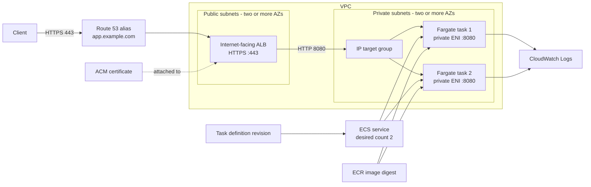
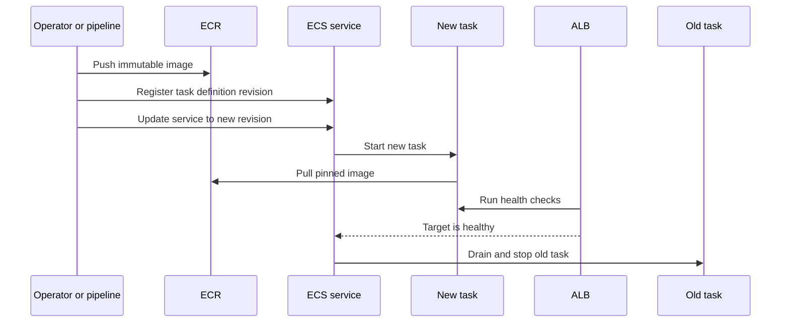

# Understanding Amazon ECS on Fargate: Components, Workflow, and HTTPS Setup

This guide explains how to run a containerized web service on Amazon ECS with
AWS Fargate, expose it through an Application Load Balancer (ALB), and secure its
custom domain with an ACM certificate. The final section maps this design to the
`nginx-cors` migration in `aws-sandbox-audi`.

## 1. Mental model

| Layer | AWS resource | Responsibility |
|---|---|---|
| Application package | ECR image | Stores the container image |
| Runtime blueprint | ECS task definition | Defines image, CPU, memory, port, logs, secrets, and IAM roles |
| Running copy | ECS task | One running instance of a task definition |
| Availability controller | ECS service | Keeps the desired task count running and replaces unhealthy tasks |
| Logical group | ECS cluster | Groups services and tasks; with Fargate it does not contain servers you manage |
| Compute | Fargate | Provides and operates compute for each task |
| Health and routing | Target group | Registers healthy task IPs and application ports |
| Public entry point | ALB | Accepts and distributes client requests |
| TLS identity | ACM certificate | Proves the hostname and encrypts client-to-ALB traffic |
| Public name | Route 53 alias | Maps the application hostname to the ALB |
| Firewall | Security groups | Restrict ALB and task traffic |
| AWS access | IAM roles | Let ECS start tasks and application code call permitted AWS APIs |
| Runtime output | CloudWatch Logs | Collects container stdout and stderr |

A task definition is a versioned blueprint. An ECS service starts tasks from it,
keeps the desired count running, and registers task IPs in the ALB target group.

### A simple analogy

Imagine that the application is a restaurant:

- The **container image** is the packaged recipe and kitchen equipment.
- The **task definition** is the instruction sheet describing which package to
  use, how much CPU and memory it needs, and which port it opens.
- A **task** is one working kitchen created from that instruction sheet.
- The **ECS service** is the manager who keeps the requested number of kitchens
  operating.
- The **ECS cluster** is the logical location where the manager and kitchens are
  organized.
- **Fargate** supplies the building and machines, so you do not manage servers.
- The **target group** is the current list of kitchens ready to accept orders.
- The **load balancer** is the front desk that sends each order to a healthy
  kitchen.
- **Route 53** publishes the restaurant's name and directs customers to the front
  desk.
- The **ACM certificate** proves customers reached the correct restaurant and
  encrypts their connection.

## Components explained one by one

### Amazon ECS

Amazon Elastic Container Service is the orchestrator. It coordinates container
deployment, task replacement, scaling, and service health. ECS does not store the
application image and, when Fargate is used, does not require you to operate EC2
servers.

You tell ECS which task definition to use and how many tasks you want. ECS asks
Fargate to run them, monitors them, and replaces tasks that stop.

### ECR repository and container image

Amazon Elastic Container Registry stores the packaged application. An ECR
**repository** is comparable to a folder for one application, while an **image**
is a particular packaged build in that repository.

For example:

```text
Repository: nginx_datev_wallet
Image tag:  migration-2f7482...
Image digest: sha256:2f7482...
```

A tag is a human-readable label. A digest identifies the exact image content. The
task definition references the image; ECS/Fargate pulls it when starting a task.
Pinning the digest prevents a later image push from silently changing what runs.

### ECS cluster

An ECS cluster is a logical grouping for services and tasks. It organizes
workloads by application or environment and provides one place to see their
combined state.

With Fargate, a cluster is **not a server** and does not need EC2 instances. An
empty Fargate cluster consumes no application compute by itself. Here,
`Datev_Wallet` is the cluster containing the `nginx-cors` service.

### Task definition

A task definition is a versioned JSON blueprint describing how ECS must run the
application. It normally specifies:

- ECR image;
- container name and application port;
- task CPU and memory;
- Fargate compatibility and CPU architecture;
- environment configuration and secret references;
- CloudWatch logging; and
- execution and application IAM roles.

It is configuration, not a running container. Each registration creates a
revision such as `cors_proxy:1`, `cors_proxy:2`, and so on. Registering revision 2
does not replace tasks using revision 1; the service must be updated to use it.

### ECS task

A task is a running instance of a task definition. If the task definition is the
blueprint, the task is the actual running application.

One task can contain one or more related containers, although this proxy uses one
container. Every Fargate task receives isolated compute, a private IP address,
and a network interface. Desired count 1 means one task; desired count 2 means two
independent copies.

A task is temporary. ECS can replace it during a deployment, after a failure, or
when desired count changes. Persistent data should not live only inside the task.

### ECS service

An ECS service continuously manages tasks for a long-running application. It
connects the task definition to operational settings such as:

- desired task count;
- private subnets and task security group;
- Fargate launch type;
- target group registration; and
- rolling deployment and rollback behavior.

If a managed task stops and desired count is still 1, the service starts a
replacement. When the service is changed to a new task-definition revision, it
performs the deployment. A service is the controller; a task is one running unit
controlled by it.

### Desired, running, and pending counts

These service values show whether ECS achieved the requested state:

- **Desired count**: how many tasks the service should maintain.
- **Running count**: how many tasks are currently running.
- **Pending count**: how many tasks ECS is still trying to start.

For this low-traffic proxy, healthy steady state is `desired=1`, `running=1`, and
`pending=0`. One task saves cost but can briefly interrupt service when it fails
or is replaced. Two tasks provide task-level redundancy.

### AWS Fargate

Fargate is the compute engine that runs tasks without requiring you to create,
patch, or scale EC2 container hosts. ECS handles orchestration; Fargate supplies
the isolated CPU, memory, and operating environment.

CPU and memory are selected in the task definition and charged while tasks run.
Changing desired count from two to one removes one continuously running Fargate
task and reduces compute cost.

### VPC, subnets, network interface, and private IP

The VPC is the private network containing the ALB and tasks. Subnets divide that
network by address range and Availability Zone:

- **Public subnets** host the internet-facing ALB and route to an internet gateway.
- **Private subnets** host Fargate tasks without public IP addresses.

Because Fargate uses `awsvpc` networking, each task receives an elastic network
interface (ENI) and private IP. The ALB communicates with that private IP. A task
in a private subnet still needs controlled outbound access through NAT or VPC
endpoints to pull images, send logs, retrieve secrets, or call external services.

### Security groups

A security group is a stateful virtual firewall attached to network interfaces.
This design uses two groups:

- The **ALB security group** accepts public HTTPS on TCP 443.
- The **task security group** accepts TCP 8080 only from the ALB security group.

The task is not publicly reachable. Clients reach the ALB, and only the ALB can
reach the application port.

### Target group

A target group is the load balancer's list of application destinations plus the
rules used to decide whether each destination is healthy. For Fargate it uses
target type `ip` because every task has its own private IP.

The ECS service automatically registers new task IPs and deregisters old ones.
The target group checks a path such as `/` or `/health` on the application port.
Only healthy task IPs receive normal requests.

The target group does not start tasks and is not the load balancer itself. It is
the bridge between the service's changing tasks and the ALB's stable listener.

### Application Load Balancer

The ALB is the stable network entry point. Its AWS DNS destination remains stable
from the application's perspective while ECS replaces task IPs behind it.

The ALB:

1. accepts the client's HTTPS connection;
2. presents the ACM certificate;
3. evaluates listener rules;
4. selects a healthy target through the target group; and
5. forwards the request to that task.

### Listener and listener rule

A listener waits for connections on a protocol and port. Here, the listener uses
HTTPS on port 443.

The listener owns the certificate and TLS policy. Its default rule forwards to
the target group. A more complex ALB can use rules to send different hostnames or
paths to different target groups.

### ACM certificate

AWS Certificate Manager issues or stores the TLS certificate used by the HTTPS
listener. It proves the hostname's identity and encrypts browser-to-ALB traffic.

The visited hostname must match the certificate. That is why the ALB's AWS
hostname can show a certificate warning while `proxy.solutions.adorsys.com` is
secure: the certificate covers the custom domain, not `*.elb.amazonaws.com`.

An ALB certificate must be in the same Region as the ALB. CloudFront follows a
different rule: its viewer certificate must be in `us-east-1`.

### Route 53 record

Route 53 is DNS: it translates the memorable application hostname into the ALB
destination. An alias such as `proxy.solutions.adorsys.com` points to the ALB DNS
name and canonical hosted-zone ID.

Route 53 does not process HTTPS or forward application requests. It only tells
the client where to connect; the ALB handles the connection.

### IAM execution role and task role

The **execution role** is used by ECS/Fargate while preparing the task. It
commonly permits ECR image pulls, CloudWatch log delivery, and retrieval of
secrets referenced by the task definition.

The optional **task role** is used by application code inside the container. It is
needed when the code calls AWS APIs, such as reading S3. The nginx proxy has an
execution role but no task role because it does not call AWS APIs directly.

### CloudWatch Logs

Containers normally write logs to stdout and stderr. The `awslogs` driver sends
those streams to a CloudWatch log group, so logs remain available after a
temporary task is replaced.

The task definition names the log group, Region, and stream prefix. The execution
role grants permission to publish log events.

### How the components connect

```text
ECR image
   -> referenced by task definition
      -> used by ECS service
         -> starts Fargate task(s) inside the ECS cluster
            -> task private IPs register in the target group
               -> ALB listener forwards HTTPS requests to healthy task IPs
                  <- Route 53 custom domain points clients to the ALB
                  <- ACM certificate secures the domain on the listener
```

## 2. End-to-end architecture



This example terminates TLS at the ALB. ALB-to-task traffic uses HTTP inside the
VPC. If policy requires end-to-end encryption, use HTTPS targets and configure
the application to serve a suitable certificate.

## 3. Request flow

1. The client resolves `app.example.com`.
2. Route 53 returns an alias to the ALB.
3. The client connects to the ALB on TCP 443.
4. The ALB presents its ACM certificate and completes the TLS handshake.
5. The HTTPS listener forwards the request to its target group.
6. The target group selects a healthy task IP.
7. The ALB security group sends the request to the task security group on the
   application port, for example TCP 8080.
8. The application responds through the ALB.

Only healthy targets receive normal traffic, so health checks are part of both
availability and deployment safety.

## 4. Networking and security

### Subnets

- Put an internet-facing ALB in public subnets in at least two Availability Zones.
- Put tasks in private subnets in at least two Availability Zones.
- Set `assignPublicIp=DISABLED` for private tasks.
- Give tasks an outbound path to their dependencies. Use a NAT gateway or the
  required VPC endpoints for ECR, S3 image layers, CloudWatch Logs, Secrets
  Manager, and any application dependencies.

Fargate tasks using `awsvpc` receive their own network interface and private IP.
The target group must therefore use target type `ip`, not `instance`.

### Security groups

| Security group | Inbound | Outbound |
|---|---|---|
| ALB security group | TCP 443 from intended clients, often `0.0.0.0/0` and `::/0` for a public service | Application port to the task security group |
| Task security group | Application port, such as TCP 8080, from the ALB security group only | Required AWS services and application dependencies |

Do not expose the task port directly to the internet. Referencing the ALB
security group as the inbound source means only traffic through that ALB reaches
the container.

## 5. ECR image

A normal image flow is:

1. Build and test the image.
2. Create the ECR repository if needed.
3. Authenticate the container client to ECR.
4. Push a unique release tag.
5. Record the resulting image digest.
6. Reference that immutable image in the task definition.

Avoid mutable references such as `latest`. Prefer an immutable tag or a digest:

```text
123456789012.dkr.ecr.eu-central-1.amazonaws.com/example-proxy@sha256:...
```

Enable image scanning and lifecycle rules based on security and retention needs.

## 6. Task definition

Registering a change creates a new task-definition revision. Existing tasks do
not change until the ECS service is updated to use that revision.

Important fields are:

- `family`: stable name shared by all revisions.
- `requiresCompatibilities`: include `FARGATE`.
- `networkMode`: use `awsvpc`.
- `cpu` and `memory`: per-task resources using a supported Fargate combination.
- `executionRoleArn`: permissions ECS uses to prepare and run the task.
- `taskRoleArn`: optional permissions application code uses.
- `image`: immutable ECR reference.
- `portMappings`: port reached by the target group.
- `environment` and `secrets`: ordinary configuration and secret references.
- `logConfiguration`: normally the `awslogs` driver.
- `runtimePlatform`: operating system and CPU architecture matching the image.

Minimal example:

```json
{
  "family": "example-proxy",
  "networkMode": "awsvpc",
  "requiresCompatibilities": ["FARGATE"],
  "cpu": "512",
  "memory": "1024",
  "executionRoleArn": "arn:aws:iam::123456789012:role/ecsTaskExecutionRole",
  "taskRoleArn": "arn:aws:iam::123456789012:role/exampleProxyTaskRole",
  "runtimePlatform": {
    "operatingSystemFamily": "LINUX",
    "cpuArchitecture": "X86_64"
  },
  "containerDefinitions": [
    {
      "name": "example-proxy",
      "image": "123456789012.dkr.ecr.eu-central-1.amazonaws.com/example-proxy@sha256:REPLACE_ME",
      "essential": true,
      "portMappings": [
        {
          "containerPort": 8080,
          "hostPort": 8080,
          "protocol": "tcp",
          "appProtocol": "http"
        }
      ],
      "logConfiguration": {
        "logDriver": "awslogs",
        "options": {
          "awslogs-group": "/ecs/example-proxy",
          "awslogs-region": "eu-central-1",
          "awslogs-stream-prefix": "ecs"
        }
      }
    }
  ]
}
```

Remove `taskRoleArn` if the application calls no AWS APIs. Never put secret
values directly in the definition. Reference Secrets Manager or Systems Manager
Parameter Store with `secrets` and grant only required access.

### Execution role versus task role

| Role | Used by | Typical permissions |
|---|---|---|
| Task execution role | ECS/Fargate agent | Pull ECR image, publish logs, retrieve referenced secrets |
| Task role | Application code | Call S3, DynamoDB, SQS, or another required AWS API |

Application code does not inherit the execution role's permissions.

## 7. Target group, health checks, and ALB

For Fargate with `awsvpc`, configure the target group with:

- HTTP when TLS terminates at the ALB.
- The application port, such as 8080.
- Target type `ip`.
- The same VPC as the ALB and tasks.
- A fast unauthenticated health path, such as `/health`.
- A success matcher, usually HTTP 200.

ECS automatically registers and deregisters service task IPs.

Two different checks may exist:

- A container health check tests the process from inside the task.
- A target-group health check proves that the ALB can reach the application over
  the real network path.

Use target-group health checks even with a container check. Add an ECS
health-check grace period if startup takes time.

Create the internet-facing ALB across public subnets in at least two Availability
Zones. Its HTTPS listener on port 443 needs:

- an issued ACM certificate matching the hostname;
- an appropriate AWS-managed TLS security policy; and
- a forward action to the target group.

An optional port 80 listener can redirect all requests to HTTPS.

## 8. Certificate and DNS

An ALB certificate must be in the same Region as the ALB. For example, an ALB in
`eu-central-1` uses an ACM certificate in `eu-central-1`. CloudFront differs: its
viewer certificate must be in `us-east-1`.

DNS validation works as follows:

1. Request the certificate for an exact hostname or suitable wildcard.
2. Add the ACM validation CNAME to the publicly authoritative DNS zone.
3. Wait for status `ISSUED`.
4. Attach the certificate to the HTTPS listener.

A wildcard covers one label: `*.example.com` covers `app.example.com`, but not
`example.com` or `a.b.example.com`.

After testing the stack, create a Route 53 `A` alias and, if IPv6 is enabled, an
`AAAA` alias from the hostname to the ALB. DNS is the final cutover step.

## 9. ECS service and deployments

The service connects these settings:

- cluster, service name, and task-definition revision;
- Fargate launch type or capacity provider;
- desired count;
- private subnets and task security group;
- `assignPublicIp=DISABLED`;
- target group, container name, and port;
- rolling deployment percentages; and
- deployment circuit breaker with rollback.

For availability, run at least two tasks across Availability Zones. A common
rolling configuration is `minimumHealthyPercent=100` and
`maximumPercent=200`. ECS can start replacements before stopping old tasks when
capacity allows.

The circuit breaker can fail a deployment that cannot reach steady state and
roll back to the last successful deployment. It does not replace monitoring,
application tests, or a documented rollback procedure.

## 10. Recommended creation order

1. Confirm the VPC, public/private subnets, routes, and outbound access.
2. Build the image, push it to ECR, and record its digest.
3. Create the CloudWatch log group and retention setting.
4. Create the execution role and optional task role.
5. Request and validate the regional ACM certificate.
6. Create separate ALB and task security groups.
7. Create the IP target group and health check.
8. Create the internet-facing ALB in public subnets.
9. Create the HTTPS listener with certificate and target group.
10. Register the task definition.
11. Create the cluster if it does not exist.
12. Create the service in private subnets and attach the target group.
13. Wait for service steady state and healthy targets.
14. Test the ALB without changing production DNS.
15. Change Route 53 only after tests pass.
16. Monitor errors, latency, health, task count, CPU, memory, and logs.

## 11. Test before changing DNS

To test `app.example.com` against a new ALB without a temporary DNS record:

```bash
curl --verbose \
  --connect-to app.example.com:443:new-alb-123.eu-central-1.elb.amazonaws.com:443 \
  https://app.example.com/health
```

The connection reaches the new ALB while `app.example.com` remains the
certificate name, TLS SNI, and HTTP `Host` header. Test real routes and methods,
not only the health path.

After DNS cutover:

```bash
dig +short app.example.com
curl --fail --show-error --verbose https://app.example.com/health
```

Also inspect ECS service events, running/pending counts, target health, ALB status
metrics, and CloudWatch logs.

## 12. Application update flow



The ALB sends traffic to a new task only after it becomes healthy. If tasks fail,
inspect service events and stopped-task reasons. With rollback enabled, the
circuit breaker can restore the last successful deployment.

## 13. Troubleshooting

| Symptom | First checks |
|---|---|
| Task stays `PENDING` or stops | Service events, stopped reason, role, digest, CPU architecture, subnet capacity, NAT/endpoints |
| `CannotPullContainerError` | Image reference, ECR permissions, execution role, ECR and S3 network access |
| No logs | `awslogs` settings, log group/Region, execution role, outbound path |
| Target unhealthy | Health path/status, port, task SG, app listening on `0.0.0.0` rather than only `127.0.0.1` |
| ALB 502 | App crash/reset, wrong port, invalid response, or unusable backend |
| ALB 504 | Slow or unreachable app/dependency |
| Certificate mismatch | Certificate names/Region, listener certificate, DNS target, SNI |
| Deployment never stabilizes | Stopped reasons, target health, events, capacity, deployment limits |
| Direct task access fails | Expected for private tasks; test through ALB or ECS Exec |

## 14. Production checklist

- Two or more tasks across two or more Availability Zones.
- Private task subnets and separate ALB/task security groups.
- Immutable images and ECR scanning.
- Separate least-privilege execution and task roles.
- Secrets Manager or Parameter Store for secrets.
- CloudWatch log retention and alarms.
- Alarms for unhealthy targets, ALB 5xx, latency, CPU/memory, and task shortages.
- Target-tracking scaling when needed; CPU, memory, and
  `ALBRequestCountPerTarget` are common metrics.
- Deployment rollback tested.
- Graceful shutdown and connection draining.
- Persistent data outside the container.
- ALB access logs, WAF, Shield, and deletion protection based on risk.
- Application, environment, owner, and cost tags.

## 15. Worked example: nginx proxy migration

[`aws-sandbox-audi/scripts/migrate-nginx-proxy.sh`](aws-sandbox-audi/scripts/migrate-nginx-proxy.sh)
implements this architecture in the target account:

| General concept | nginx implementation |
|---|---|
| Region | `eu-central-1` |
| ECR | `nginx_datev_wallet`, source image copied and pinned by digest |
| ECS | Cluster `Datev_Wallet`, service `nginx-cors` |
| Task | Family `cors_proxy`, container `nginx-proxy`, TCP 8080 |
| Fargate size | 1 vCPU, 3 GiB memory |
| Desired count | 1, selected for this low-traffic proxy to reduce cost |
| Network | Private subnets, `awsvpc`, no public IP |
| Target group | `nginx-proxy-targets`, HTTP 8080, target type `ip`, health path `/` |
| ALB | New public `nginx-proxy-migration` ALB |
| HTTPS | Listener 443 with target `eu-central-1` ACM certificate |
| Security | Public 443 to ALB; TCP 8080 from ALB SG to task SG |
| Logs | `/ecs/cors_proxy` via `awslogs` |
| Hostname | `proxy.solutions.adorsys.com` |
| Safety | Circuit breaker and rollback; one task means no task-level redundancy |

The script separates traffic movement from resource creation:

- `--dry-run` validates and plans without creating resources.
- No option creates/reuses the target, waits for health, and tests without DNS.
- `--cutover` revalidates the target, then changes the Route 53 alias.
- `--rollback` revalidates the source, then restores the source alias.

The general production recommendation remains two or more tasks. This particular
proxy intentionally uses one; a task failure or replacement can therefore cause
a short interruption while ECS starts its replacement.

## 16. Official AWS references

- [ECS task definitions](https://docs.aws.amazon.com/AmazonECS/latest/developerguide/task_definitions.html)
- [Fargate tasks and services](https://docs.aws.amazon.com/AmazonECS/latest/developerguide/fargate-tasks-services.html)
- [Fargate `awsvpc` networking](https://docs.aws.amazon.com/AmazonECS/latest/developerguide/task-networking-awsvpc.html)
- [ECS service load balancing](https://docs.aws.amazon.com/AmazonECS/latest/developerguide/service-load-balancing.html)
- [Creating an ALB HTTPS listener](https://docs.aws.amazon.com/elasticloadbalancing/latest/application/create-https-listener.html)
- [ALB HTTPS certificates](https://docs.aws.amazon.com/elasticloadbalancing/latest/application/https-listener-certificates.html)
- [ECS load-balancer health checks](https://docs.aws.amazon.com/AmazonECS/latest/developerguide/load-balancer-healthcheck.html)
- [Task execution role](https://docs.aws.amazon.com/AmazonECS/latest/developerguide/task_execution_IAM_role.html)
- [Task role](https://docs.aws.amazon.com/AmazonECS/latest/developerguide/task-iam-roles.html)
- [CloudWatch logs for ECS](https://docs.aws.amazon.com/AmazonECS/latest/developerguide/using_awslogs.html)
- [ECS rolling deployments](https://docs.aws.amazon.com/AmazonECS/latest/developerguide/deployment-type-ecs.html)
- [Amazon ECR](https://docs.aws.amazon.com/AmazonECR/latest/userguide/what-is-ecr.html)
