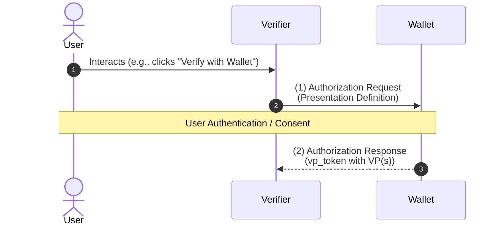
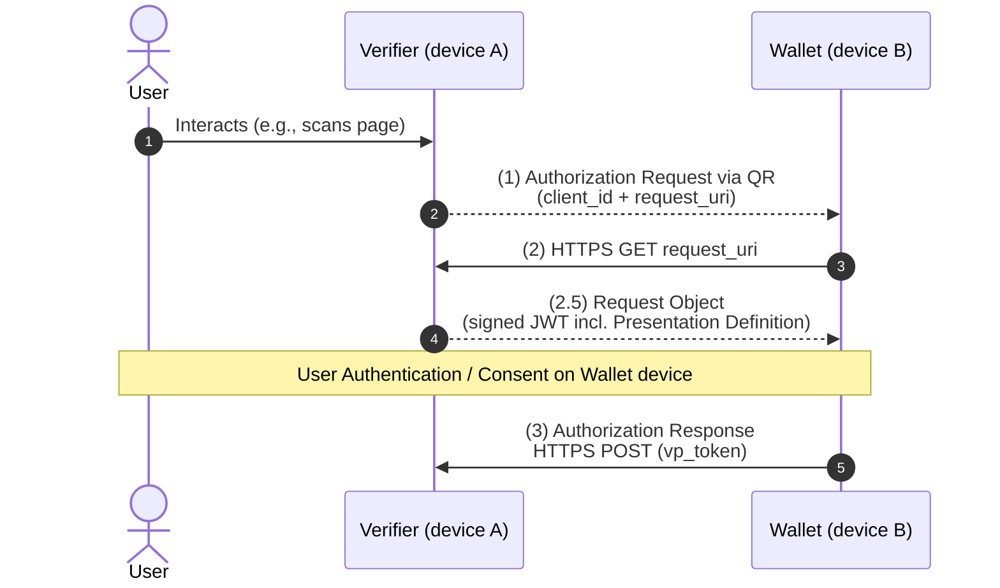
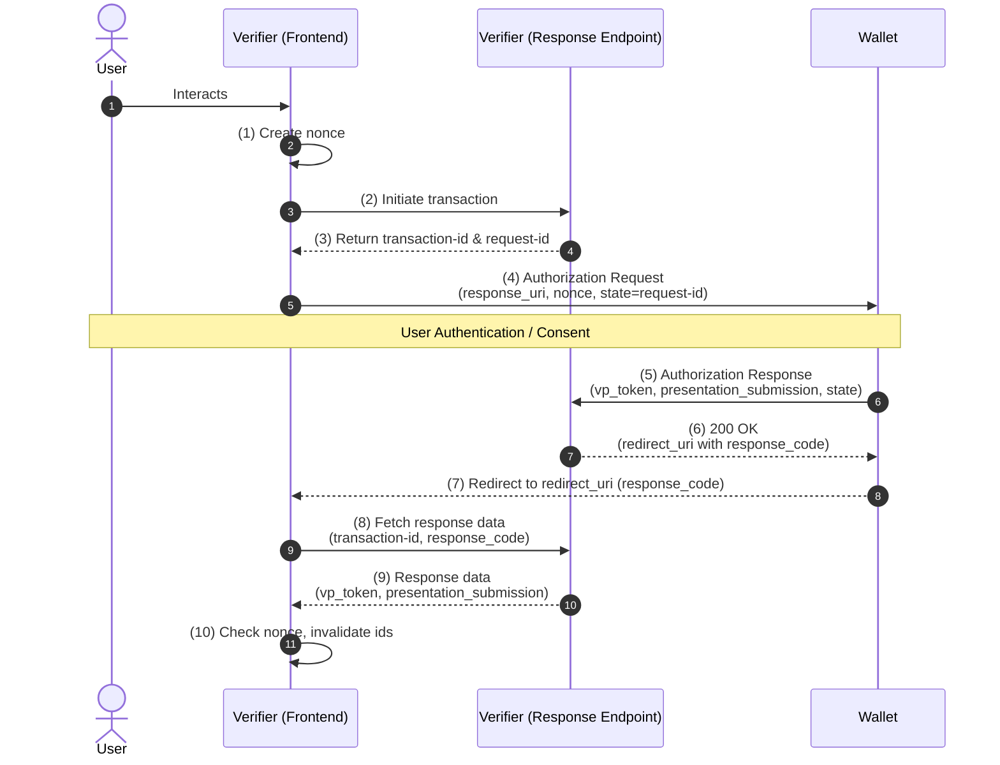

# OID4VP Draft 20

## Part 1 - Introduction and Terminology (Simplified)

### 1) What this spec is for

This specification defines how to use **OAuth 2.0** [RFC6749] to request and receive **Verifiable Presentations (VPs)** that are derived from **Verifiable Credentials (VCs)**.

In short:
- OAuth 2.0 provides the protocol flow ("rails").
- OID4VP adds a credential-presentation layer on top.
- A Verifier can ask a Wallet to present credentials in a secure and developer-friendly way.

**Why OAuth 2.0 as the base?**
- It is a well-understood, broadly deployed protocol, so the credential-presentation layer can stay simple, secure, and developer-friendly.
- A single interface can support **both** Credential presentation **and** the issuance of OAuth Access Tokens for APIs whose access is gated by Verifiable Credentials in the Wallet.
- Existing **OpenID Connect** [OpenID.Core] deployments can extend their implementations with this spec to transport Verifiable Presentations without abandoning their OIDC stack.

The spec is **format-agnostic** and supports any VC format used in the Issuer-Holder-Verifier model, including:
- W3C VC Data Model [VC_DATA]
- ISO mdoc [ISO.18013-5]
- AnonCreds [Hyperledger.Indy]

It can also be combined with:
- **OpenID Connect Core** (for existing OIDC deployments that want VP transport).
- **SIOPv2** (if Self-Issued ID Token features are needed).

### 1.1) Requirement keywords

Normative words are interpreted per RFC 2119:
`MUST`, `MUST NOT`, `REQUIRED`, `SHALL`, `SHALL NOT`, `SHOULD`, `SHOULD NOT`, `RECOMMENDED`, `NOT RECOMMENDED`, `MAY`, `OPTIONAL`.

### 2) Terminology used by this spec

This spec **reuses** the following terms from other specifications. Where a term is redefined here, **this spec's definition takes precedence**.

Reused terms (do not redefine):
- From **OAuth 2.0** [RFC6749]: Access Token, Authorization Request, Authorization Response, Client, Client Authentication, Client Identifier, Grant Type, Response Type, Token Request, Token Response.
- From **OpenID Connect Core** [OpenID.Core]: End-User, Entity, Request Object, Request URI.
- From **JWT** [RFC7519]: JSON Web Token (JWT).
- From **JWS** [RFC7515]: JOSE Header, Base64url Encoding.
- From **JWE** [RFC7516]: JSON Web Encryption (JWE).
- From **OAuth.Responses**: Response Mode.

#### Credential / Presentation terms

- **Credential**: A set of one or more claims about a subject made by a Credential Issuer. (Note: this differs from the meaning of "Credential" in OpenID Connect Core.)
- **Verifiable Credential (VC)**: An Issuer-signed credential whose authenticity can be cryptographically verified. Can be in any format used in the Issuer-Holder-Verifier model (W3C VC, ISO mdoc, AnonCreds, etc.).
- **W3C Verifiable Credential**: A VC compliant with the W3C VC Data Model [VC_DATA].
- **Presentation**: Data presented to a specific Verifier, derived from one or more VCs that may come from the same or different Issuers.
- **Verifiable Presentation (VP)**: A Holder-signed credential whose authenticity can be cryptographically verified, providing **Cryptographic Holder Binding**. Can be in any format used in the Issuer-Holder-Verifier model.
- **W3C Verifiable Presentation**: A VP compliant with [VC_DATA].
- **VP Token**: Artifact defined by this spec containing a single VP or an array of VPs (see Section 6.1).

#### Actors

- **Credential Issuer (Issuer)**: Issues Verifiable Credentials.
- **Holder**: Entity that receives VCs, controls them, and presents them to Verifiers as VPs.
- **Verifier**: Entity that requests, receives, and validates VPs. In this spec, the Verifier acts as an **OAuth 2.0 Client** toward the Wallet — it is a specific case of OAuth 2.0 Client, just like a Relying Party (RP) in OpenID Connect Core.
- **Wallet**: Entity used by the Holder to receive, store, present, and manage VCs and key material. In this spec, the Wallet acts as an **OAuth 2.0 Authorization Server** toward the Verifier. There is **no single deployment model**: VCs and keys may be stored locally on the user's device, in a self-hosted remote service, or in a third-party remote service.

#### Issuance / presentation model

- **Issuer-Holder-Verifier model**: Claims are issued in the form of VCs **independently** of how/when they are presented. An issued VC **can** be presented multiple times but does not have to be.

#### Holder binding types

- **Holder Binding**: Proof that the Holder legitimately possesses a VC.
- **Cryptographic Holder Binding**: Holder proves possession by proving control of the **same private key** at both issuance and presentation. The exact mechanism is format-specific. Example: in `jwt_vc_json`, the VC contains the Holder's public key (or a reference to one) that matches a private key controlled by the Holder.
- **Claim-based Holder Binding**: Holder proves possession by proving certain claims about themselves (e.g., name + date of birth), possibly via another VC. Supports long-term, cross-device use because it does **not** rely on key material on a particular device. Example: a Diploma.
- **Biometrics-based Holder Binding**: Holder proves possession via a biometric trait (e.g., fingerprint, face). Example: a mobile driving license (mdoc) containing a portrait of the Holder.

## Part 2 - Overview and Main Flows (Simplified)

### 3) High-level overview

OID4VP extends OAuth 2.0 so a Verifier can request credentials and receive them as **Verifiable Presentations** via a **VP Token**.

Core points:
- **VP Token** is the main new container introduced by this spec.
- A VP Token can include one or many VPs.
- VPs in the same transaction can be in one or multiple credential formats.
- The spec is **format-agnostic** (e.g., W3C VC, mdoc, AnonCreds).
- Implementations can use any pre-existing OAuth 2.0 **Grant Type** and **Response Type** in conjunction with this spec to fit different deployment architectures.

The spec supports:
- **Same-device** and **cross-device** user journeys.
- Returning responses by **redirect** or by **HTTPS POST** — the POST option allows cross-device responses **and** responses that exceed redirect-URL size limits.
- OIDC-based deployments, including optional SIOPv2 features.

Examples in the main body of this spec use **W3C Verifiable Credentials**. Examples in other formats (mdoc, AnonCreds, etc.) live in **Appendix A**.

OID4VP is compatible with — and can be combined with — the following related OAuth 2.0 specs and BCPs:
- **PAR** — Pushed Authorization Requests [RFC9126].
- **JAR** — JWT-Secured Authorization Request [RFC9101] (used for signed/encrypted Request Objects, especially in the cross-device flow).
- **Mobile BCP** — OAuth 2.0 for Native Apps [RFC8252].
- **OAuth 2.0 Security Best Current Practice** [I-D.ietf-oauth-security-topics].

### 3.1) Same-device flow

Use case:
- The user interacts with the Verifier and Wallet on the **same device**.
- This flow uses simple HTTP redirects to pass the Authorization Request and Authorization Response between Verifier and Wallet.
- When `response_mode=fragment`, the Verifiable Presentations are returned in the **fragment part** of the redirect URI.

How it works:



**(1) Verifier → Wallet — Authorization Request.**
The Verifier sends an Authorization Request containing a **Presentation Definition** (DIF Presentation Exchange) describing what is needed: which credential type(s), which format(s), which individual claims (selective disclosure), etc. The Wallet evaluates available credentials, authenticates the End-User, and gathers consent.

**Non-normative example — Authorization Request (URL-encoded, redirect to Wallet)**:

```http
GET /authorize
  ?response_type=vp_token
  &client_id=https%3A%2F%2Fclient.example.com%2Fcb
  &redirect_uri=https%3A%2F%2Fclient.example.com%2Fcb
  &presentation_definition=%7B%22id%22%3A%22..%22%2C%22input_descriptors%22%3A%5B..%5D%7D
  &nonce=n-0S6_WzA2Mj
  &state=af0ifjsldkj HTTP/1.1
Host: wallet.example.org
```

Decoded `presentation_definition` (sent inline above):

```json
{
  "id": "vp-request-1",
  "input_descriptors": [
    {
      "id": "id_credential",
      "format": { "jwt_vc_json": { "alg": ["ES256"] } },
      "constraints": {
        "fields": [
          { "path": ["$.vc.type"], "filter": { "type": "array", "contains": { "const": "IDCredential" } } }
        ]
      }
    }
  ]
}
```

**(2) Wallet → Verifier — Authorization Response.**
The Wallet builds VP(s) from the consented credentials and returns them in `vp_token`. With `response_mode=fragment`, the response is sent on the redirect URI's fragment.

**Non-normative example — Authorization Response (fragment redirect)**:

```http
HTTP/1.1 302 Found
Location: https://client.example.com/cb#
  vp_token=%7B...VP%20JSON...%7D
  &presentation_submission=%7B...PS%20JSON...%7D
  &state=af0ifjsldkj
```

### 3.2) Cross-device flow

Use case:
- The user interacts with the Verifier on **device A**; the Wallet lives on **device B**.
- The Verifier renders the Authorization Request as a **QR code**; the user scans it with the Wallet.
- The response is returned over a direct **HTTPS POST** to a URL the Verifier controls — required because the two devices are not in the same browser session.

This flow typically uses `response_type=vp_token` together with `response_mode=direct_post`. To keep the QR code small **and** to allow the Authorization Request to be signed/encrypted, the QR usually contains only a `request_uri` per JAR [RFC9101]; the Wallet fetches the full Request Object from that URI.

> **Note**: Using `request_uri` is **independent** of same-device vs cross-device. It can be used in either flow.



**(1) Verifier → Wallet — Authorization Request via QR.**
To keep the QR small, the Verifier puts only `client_id` and `request_uri` in the request. The Wallet will fetch the actual Request Object from `request_uri`.

**Non-normative example — QR-encoded Authorization Request URL**:

```text
openid4vp://authorize?
  client_id=https%3A%2F%2Fverifier.example.org%2Fcb
  &request_uri=https%3A%2F%2Fverifier.example.org%2Frequest%2Fabc123
```

**(2) Wallet → Verifier — fetch Request Object.**

```http
GET /request/abc123 HTTP/1.1
Host: verifier.example.org
Accept: application/oauth-authz-req+jwt
```

**(2.5) Verifier → Wallet — Request Object response.**
The Verifier returns a signed JWT (a JAR Request Object). The JWT payload carries the standard Authorization Request parameters, including the Presentation Definition.

```http
HTTP/1.1 200 OK
Content-Type: application/oauth-authz-req+jwt

eyJhbGciOiJFUzI1NiIsImtpZCI6InZlcmlmaWVyLTEifQ.eyJpc3MiOiJ...<JWT>...
```

Decoded JWT payload (Request Object):

```json
{
  "iss": "https://verifier.example.org",
  "aud": "https://wallet.example.org",
  "response_type": "vp_token",
  "response_mode": "direct_post",
  "client_id": "https://verifier.example.org/cb",
  "response_uri": "https://verifier.example.org/post",
  "nonce": "n-0S6_WzA2Mj",
  "state": "af0ifjsldkj",
  "presentation_definition": {
    "id": "vp-request-1",
    "input_descriptors": [
      {
        "id": "id_credential",
        "format": { "jwt_vc_json": { "alg": ["ES256"] } },
        "constraints": {
          "fields": [
            { "path": ["$.vc.type"], "filter": { "type": "array", "contains": { "const": "IDCredential" } } }
          ]
        }
      }
    ]
  }
}
```

The Wallet validates the Request Object signature, authenticates the End-User, and obtains consent for the requested credentials.

**(3) Wallet → Verifier — Authorization Response via `direct_post`.**
The Wallet sends the response as an HTTPS POST (form-encoded) to the `response_uri` advertised in the Request Object.

```http
POST /post HTTP/1.1
Host: verifier.example.org
Content-Type: application/x-www-form-urlencoded

vp_token=%7B...VP%20JSON...%7D
&presentation_submission=%7B...PS%20JSON...%7D
&state=af0ifjsldkj
```

The Verifier validates the VP(s), correlates them via `state`, and completes the transaction.

## Part 3 - Scope of OID4VP Extensions (Simplified)

### 4) What OID4VP adds to OAuth 2.0

This section summarizes the protocol extensions introduced by OID4VP. All cross-references point to later sections in this document.

1. **`presentation_definition` request parameter** (see Section 5)
   - New Authorization Request parameter using **DIF Presentation Exchange** syntax.
   - Lets the Verifier express which credential type(s), format(s), and claim-level constraints it needs.

2. **`vp_token` response parameter** (see Section 6)
   - New response parameter used to return Verifiable Presentation(s) to the Verifier.
   - Can appear in the **Authorization Response** or **Token Response** depending on the Response Type / grant flow.

3. **New Response Types** (see Section 6)
   - `vp_token` — VP(s) returned directly in the Authorization Response.
   - `vp_token id_token` — VP(s) returned together with a SIOPv2 Self-Issued ID Token.

4. **New Response Mode: `direct_post`** (see Section 6.2)
   - HTTPS POST-based delivery of the Authorization Response.
   - Required for cross-device scenarios and for responses that exceed redirect-URL size limits.

5. **Format-aware processing via DIF PE `format`**
   - The DIF PE `format` field is used throughout the protocol to adapt behavior per credential format.
   - Examples for W3C VC, ISO mdoc, and AnonCreds appear in **Appendix A**.

6. **`client_id_scheme` request parameter** (see Section 5.7)
   - New Authorization Request parameter.
   - Enables multiple Verifier-metadata trust models beyond plain OAuth 2.0 (pre-registered, `redirect_uri`, OpenID Federation `entity_id`, DID, Verifier Attestation, X.509 SAN DNS/URI).

7. **Composability with other features**
   - Credential presentation via OID4VP can be combined with:
     - **SIOPv2** user authentication.
     - **OAuth 2.0 Access Token issuance** for VC-gated APIs.

## Part 4 - Authorization Request (Simplified)

### 5) Authorization Request fundamentals

OID4VP uses the OAuth 2.0 Authorization Request model, with OAuth security best-practice guidance applied.

The Verifier can send the request:
- directly (by value), or
- as a Request Object (JAR), by value or by reference (`request_uri` style approach from RFC 9101).

### How credential requirements are expressed

The Verifier describes required credentials using:
- `presentation_definition`, or
- `presentation_definition_uri`, or
- (in some deployments) a scope value that maps to a Presentation Definition.

Wallet behavior:
- Wallets **MUST** process Presentation Definition JSON per DIF Presentation Exchange.
- Wallets **MUST** evaluate/select candidate credentials using the DIF evaluation process.

### Client identity and metadata model

OID4VP adds a flexible Verifier identification mechanism via `client_id_scheme` so Wallets can interpret `client_id` correctly in different trust models.

Key points:
- A scheme may require signed authorization requests and/or extra parameters.
- Verifier metadata can be sent:
  - by value: `client_metadata`
  - by reference: `client_metadata_uri`
- Metadata fields follow OpenID Dynamic Client Registration / RFC 7591 style name-value conventions.
- Presentation Definition and Client Metadata can each be sent by value or by reference.

### New request parameters defined by OID4VP

- **`presentation_definition`** (string JSON object)
  - Contains Presentation Definition JSON.
  - **MUST** be present if neither `presentation_definition_uri` nor scope-based definition is present.

- **`presentation_definition_uri`** (HTTPS URL)
  - Points to Presentation Definition JSON resource.
  - **MUST** be present if neither `presentation_definition` nor scope-based definition is present.

- **`client_id_scheme`** (optional string)
  - Identifies how to interpret `client_id`.
  - If present, Wallet **MUST** process `client_id` in that scheme's namespace/context.
  - If absent, Wallet **MUST** follow default OAuth behavior (RFC 6749).
  - Same `client_id` under different schemes **MUST** be treated as different Verifiers.
  - Verifier should discover Wallet-supported schemes before sending request.

- **`client_metadata`** (optional JSON object, UTF-8)
  - Contains Verifier metadata.
  - **MUST NOT** be present if `client_metadata_uri` is present.

- **`client_metadata_uri`** (optional HTTPS URL)
  - Points to Verifier metadata JSON.
  - URL scheme **MUST** be `https`.
  - Resource **MUST** be reachable by the Wallet.
  - **MUST NOT** be present if `client_metadata` is present.

Encryption key advertisement:
- Verifier may provide key material (`jwks` or `jwks_uri` claims inside client metadata) for response encryption/key agreement.

### Important existing parameters with OID4VP-specific meaning

- **`nonce`** - **REQUIRED**
  - Used to bind returned VP(s) to the specific transaction and prevent replay/misbinding.

- **`scope`** - optional
  - Wallet may support predefined scope values that map to credential presentation requirements.

- **`response_mode`** - optional
  - Can request HTTPS delivery (`direct_post`) and can be relevant for signing/encryption handling.
  - Default is `fragment` if omitted.

### Parameter summary

| Parameter | Required? | Notes |
|---|---|---|
| `response_type` | REQUIRED | New OID4VP value: `vp_token` (or `vp_token id_token` with SIOPv2). |
| `client_id` | REQUIRED | Interpreted via `client_id_scheme` if present, otherwise per RFC 6749. |
| `redirect_uri` | Conditional | Required for redirect-style response modes. May be omitted when `client_id_scheme=redirect_uri`. |
| `response_mode` | OPTIONAL | Defaults to `fragment` for `response_type=vp_token`. Use `direct_post` for cross-device. |
| `presentation_definition` | One of these three | PE JSON inline. |
| `presentation_definition_uri` | One of these three | HTTPS URL pointing to PE JSON. |
| `scope` | One of these three | Wallet-defined alias for a Presentation Definition. |
| `client_id_scheme` | OPTIONAL | Selects how Wallet interprets `client_id` and obtains Verifier metadata. |
| `client_metadata` / `client_metadata_uri` | OPTIONAL, mutually exclusive | Verifier metadata by value or by reference. |
| `nonce` | REQUIRED | Binds returned VP(s) to this transaction; prevents replay. |
| `state` | OPTIONAL | Standard OAuth state for client-side correlation. |

> Verifier MUST send exactly one of `presentation_definition`, `presentation_definition_uri`, or a scope value that maps to a Presentation Definition.

### Non-normative example — minimal Authorization Request

```http
GET /authorize
  ?response_type=vp_token
  &client_id=https%3A%2F%2Fclient.example.org%2Fcb
  &redirect_uri=https%3A%2F%2Fclient.example.org%2Fcb
  &presentation_definition=...
  &nonce=n-0S6_WzA2Mj HTTP/1.1
Host: wallet.example.org
```

(`presentation_definition=…` is a placeholder for the URL-encoded JSON shown in Section 5.1.)

### 5.1) `presentation_definition` parameter (Simplified)

`presentation_definition` carries a Presentation Definition JSON object (per **DIF Presentation Exchange** syntax, Section 5 of `[DIF.PresentationExchange]`).

It is the main way a Verifier tells the Wallet exactly what kind of credential evidence is acceptable.

What it can express:
- **Credential type requirements** (e.g., "must be an ID card credential").
- **Format constraints** (e.g., proof type, JWT algorithm, etc.).
- **Field-level constraints** on claims using JSON paths.
- **Selective disclosure requirements** (only specific claims should be disclosed).
- **Alternative credential options** (e.g., "ID card OR passport").

Wallet processing rule:
- Wallet **MUST** evaluate the Presentation Definition and select candidate Verifiable Credential(s) per the evaluation process in Section 8 of `[DIF.PresentationExchange]`.

#### Pattern 1 — Simple type match

Request one credential of a specific type. Here: an ID card credential in `ldp_vc` format signed with `Ed25519Signature2018`.

```json
{
  "id": "vp token example",
  "input_descriptors": [
    {
      "id": "id card credential",
      "format": {
        "ldp_vc": {
          "proof_type": ["Ed25519Signature2018"]
        }
      },
      "constraints": {
        "fields": [
          {
            "path": ["$.type"],
            "filter": {
              "type": "string",
              "pattern": "IDCardCredential"
            }
          }
        ]
      }
    }
  ]
}
```

#### Pattern 2 — Selective disclosure

Require minimal disclosure. The Wallet must reveal **only** the listed fields (`given_name`, `family_name`, `birthdate`) and **must not** include the rest of the credential.

```json
{
  "id": "example with selective disclosure",
  "input_descriptors": [
    {
      "id": "ID card with constraints",
      "format": {
        "ldp_vc": {
          "proof_type": ["Ed25519Signature2018"]
        }
      },
      "constraints": {
        "limit_disclosure": "required",
        "fields": [
          { "path": ["$.type"], "filter": { "type": "string", "pattern": "IDCardCredential" } },
          { "path": ["$.credentialSubject.given_name"] },
          { "path": ["$.credentialSubject.family_name"] },
          { "path": ["$.credentialSubject.birthdate"] }
        ]
      }
    }
  ]
}
```

> Note: `limit_disclosure: "required"` is what tells the Wallet **not** to include any claim other than those listed in `fields`.

#### Pattern 3 — Alternatives via `submission_requirements`

Verifier accepts **either** an `IDCardCredential` (ldp_vc) **or** a `PassportCredential` (jwt_vc_json). The `submission_requirements` rule says: "pick exactly **one** input descriptor from group A".

```json
{
  "id": "alternative credentials",
  "submission_requirements": [
    {
      "name": "Citizenship Information",
      "rule": "pick",
      "count": 1,
      "from": "A"
    }
  ],
  "input_descriptors": [
    {
      "id": "id card credential",
      "group": ["A"],
      "format": {
        "ldp_vc": { "proof_type": ["Ed25519Signature2018"] }
      },
      "constraints": {
        "fields": [
          { "path": ["$.type"], "filter": { "type": "string", "pattern": "IDCardCredential" } }
        ]
      }
    },
    {
      "id": "passport credential",
      "group": ["A"],
      "format": {
        "jwt_vc_json": { "alg": ["RS256"] }
      },
      "constraints": {
        "fields": [
          { "path": ["$.vc.type"], "filter": { "type": "string", "pattern": "PassportCredential" } }
        ]
      }
    }
  ]
}
```

### Format capability coordination rules

Wallet-side capability publication:
- Wallet **SHOULD** publish supported VC/VP formats in its server metadata via `vp_formats_supported` (see Section 8).

Verifier-side request capability:
- Verifier **SHOULD** indicate supported formats via `vp_formats` in its client metadata (see Section 9.1).

Critical processing rule:
- Wallet **MUST ignore** any `format` entry inside a `presentation_definition` object if that format is **not** listed in the Verifier's `vp_formats`.

Important note:
- If the Verifier requests a Verifiable **Presentation** that itself contains Verifiable **Credential(s)**, the Verifier **MUST** declare support for **both** the VC format(s) **and** the VP format(s) in `vp_formats`.

### 5.2) `presentation_definition_uri` parameter (Simplified)

`presentation_definition_uri` lets the Verifier provide the Presentation Definition **by reference** (URL) instead of embedding the JSON directly in the Authorization Request.

Required behavior:
- Wallet **MUST** fetch it using **HTTPS GET**.
- Wallet **MUST NOT** add extra query parameters to the URL.
- The referenced resource **MUST** be publicly retrievable in this flow (no auth challenge).
- URI scheme **MUST** be `https`.

Operationally:
- Wallet receives `presentation_definition_uri`.
- Wallet performs HTTPS GET to that URL.
- Verifier returns JSON Presentation Definition with `Content-Type: application/json`.
- Wallet then processes it the same way as if it had been received inline.

#### Non-normative example — Wallet → Verifier GET

```http
GET /presentationdefs?ref=idcard_presentation_request HTTP/1.1
Host: server.example.com
```

#### Non-normative example — Verifier → Wallet 200 OK

```http
HTTP/1.1 200 OK
Content-Type: application/json

{
  "id": "vp token example",
  "input_descriptors": [
    {
      "id": "id card credential",
      "format": {
        "ldp_vc": { "proof_type": ["Ed25519Signature2018"] }
      },
      "constraints": {
        "fields": [
          {
            "path": ["$.type"],
            "filter": { "type": "string", "pattern": "IDCardCredential" }
          }
        ]
      }
    }
  ]
}
```

### 5.3) Using `scope` to request credential presentation (Simplified)

Wallets **MAY** support credential presentation requests via OAuth `scope` values.

In this pattern:
- A scope value acts as an **alias** to a well-defined Presentation Definition.
- That alias must resolve unambiguously so the Verifier can predict the response shape (the identifiers used in `presentation_submission` and the credential types/formats in `vp_token`).

Important constraints:
- Exact scope names and the mapping mechanism are **out of scope** of this specification.
- Mapping may be standardized in a separate spec **or** published in machine-readable Wallet metadata.
- Scope values **SHOULD** be collision-resistant (e.g., reverse-domain-name style).

Why this matters — the Verifier must be able to predict, from the scope alias alone:
- `presentation_submission.definition_id`,
- `presentation_submission.descriptor_map.id`, and
- the expected credential types/formats in `vp_token` (see Section 6.1).

#### Non-normative example — scope-based Authorization Request

The scope value `com.example.healthCardCredential_presentation` is an alias for a Presentation Definition known to both parties.

```http
GET /authorize
  ?response_type=vp_token
  &client_id=https%3A%2F%2Fclient.example.org%2Fcb
  &redirect_uri=https%3A%2F%2Fclient.example.org%2Fcb
  &scope=com.example.healthCardCredential_presentation
  &nonce=n-0S6_WzA2Mj HTTP/1.1
Host: wallet.example.org
```

### 5.4) Response Type `vp_token` (Simplified)

OID4VP defines a new OAuth response type: `vp_token`.

Behavior when `response_type=vp_token`:
- Successful authorization response **MUST** include `vp_token`.
- Wallet **SHOULD NOT** include OAuth authorization code, access token, or token type in that success response.
- Default response mode is `fragment` (response parameters returned in redirect URI fragment).
- Other OAuth response modes may be used when supported.
- Success and error responses **SHOULD** use the chosen response mode (or default if none was supplied).

### 5.5) Passing Authorization Request across devices (Simplified)

For cross-device scenarios (Verifier UI on one device, Wallet on another) the Authorization Request is typically transferred via **QR code**.

**RECOMMENDED pattern**: combine `request_uri` (per JAR [RFC9101]) with `response_mode=direct_post` (Section 6.2).

Why:
- Authorization Requests are often **too large** to embed verbatim in a QR code (a Presentation Definition with multiple input descriptors and constraints can be many hundreds of bytes).
- Putting only a `request_uri` in the QR keeps the QR payload small, while still letting the Wallet retrieve a fully signed/encrypted Request Object.
- The response cannot use redirect modes across devices, so `direct_post` is the natural pairing.

> See **Section 3.2** for the full cross-device sequence diagram and concrete examples.

### 5.6) `aud` in Request Object (Simplified)

When the Verifier sends a Request Object (per JAR [RFC9101]), the `aud` claim depends on whether the Verifier can identify the recipient Wallet:

- **Dynamic discovery used** (the Verifier discovered the specific Wallet's issuer URL):
  - `aud` **MUST** equal the Wallet's `issuer` value.

- **Static discovery metadata used** (the Verifier does not know the specific Wallet, only its profile):
  - `aud` **MUST** be `"https://self-issued.me/v2"`.

> Note: `"https://self-issued.me/v2"` is a **symbolic** audience value. It can be used as `aud` even when this spec is used **standalone** — i.e., outside a SIOPv2 deployment.

#### Non-normative example — Request Object with dynamic discovery

```json
{
  "iss": "https://verifier.example.org",
  "aud": "https://wallet.example.org",
  "response_type": "vp_token",
  "client_id": "https://verifier.example.org/cb",
  "nonce": "n-0S6_WzA2Mj",
  "presentation_definition": { "...": "..." }
}
```

#### Non-normative example — Request Object with static discovery

```json
{
  "iss": "https://verifier.example.org",
  "aud": "https://self-issued.me/v2",
  "response_type": "vp_token",
  "client_id": "https://verifier.example.org/cb",
  "nonce": "n-0S6_WzA2Mj",
  "presentation_definition": { "...": "..." }
}
```

### 5.7) Verifier metadata management via `client_id_scheme` (Simplified)

`client_id_scheme` defines how Wallet should interpret `client_id` and how Verifier metadata is discovered/validated.

This extends plain OAuth client identification with multiple trust models.

#### Supported `client_id_scheme` values in this draft

1. **`pre-registered`**
   - Default OAuth-style behavior.
   - Verifier is known to Wallet ahead of time.
   - Metadata comes from registration (RFC 7591) or out-of-band setup.

2. **`redirect_uri`**
   - `client_id` is the same value as Verifier redirect URI.
   - Authorization Request **MUST NOT** be signed.
   - `redirect_uri` parameter may be omitted by Verifier.
   - Verifier metadata **MUST** be provided via `client_metadata` or `client_metadata_uri`.

   **Non-normative example — Authorization Request when `client_id` equals `redirect_uri`** (line breaks added to `client_metadata` for readability):

   ```http
   HTTP/1.1 302 Found
   Location: https://client.example.org/universal-link?
     response_type=vp_token
     &client_id=https%3A%2F%2Fclient.example.org%2Fcb
     &client_id_scheme=redirect_uri
     &redirect_uri=https%3A%2F%2Fclient.example.org%2Fcb
     &presentation_definition=...
     &nonce=n-0S6_WzA2Mj
     &client_metadata=%7B%22vp_formats%22%3A%7B%22jwt_vp%22%3A%7B%22alg%22%3A%5B%22EdDSA%22%2C%22ES256K%22%5D%7D%2C%22ldp_vp%22%3A%7B%22proof_type%22%3A%5B%22Ed25519Signature2018%22%5D%7D%7D%7D
   ```

   Decoded `client_metadata`:

   ```json
   {
     "vp_formats": {
       "jwt_vp": { "alg": ["EdDSA", "ES256K"] },
       "ldp_vp": { "proof_type": ["Ed25519Signature2018"] }
     }
   }
   ```

3. **`entity_id`**
   - `client_id` is an OpenID Federation Entity Identifier.
   - Wallet **MUST** follow OpenID Federation processing rules.
   - Automatic Registration from OpenID Federation **MUST** be used.
   - Request may include `trust_chain`.
   - Effective Verifier metadata is taken from resolved trust chain after policy processing.
   - `client_metadata` / `client_metadata_uri` in request, if present, **MUST be ignored**.

4. **`did`**
   - `client_id` is a DID (per [DID-Core]).
   - Request **MUST** be signed with the private key associated with the DID.
   - Wallet resolves the DID Document via DID method resolution.
   - The verification key comes from the DID Document's `verificationMethod` property.
   - Since a DID Document may include multiple keys, the JOSE `kid` header **MUST** identify the specific key used to sign the request.
   - Non-key metadata is provided via `client_metadata` / `client_metadata_uri`.

   **Non-normative example — signed Request Object when `client_id` is a DID**:

   JOSE header:

   ```json
   {
     "typ": "oauth-authz-req+jwt",
     "alg": "RS256",
     "kid": "did:example:123#1"
   }
   ```

   JWT payload:

   ```json
   {
     "client_id": "did:example:123",
     "client_id_scheme": "did",
     "response_type": "vp_token",
     "redirect_uri": "https://client.example.org/callback",
     "nonce": "n-0S6_WzA2Mj",
     "presentation_definition": "...",
     "client_metadata": {
       "vp_formats": {
         "jwt_vp": { "alg": ["EdDSA", "ES256K"] },
         "ldp_vp": { "proof_type": ["Ed25519Signature2018"] }
       }
     }
   }
   ```

5. **`verifier_attestation`**
   - Verifier authenticates using a Verifier Attestation JWT (details in Section 10).
   - `client_id` **MUST** equal attestation JWT `sub`.
   - Request **MUST** be signed by key bound in attestation JWT `cnf`.
   - Attestation JWT **MUST** be included in Request Object JOSE header (`jwt` header parameter).
   - Wallet **MUST** validate attestation signature and trust its issuer (`iss`).
   - If trust cannot be established, Wallet **MUST** reject request.
   - If attestation contains `redirect_uris`, request `redirect_uri` **MUST** exactly match one entry.
   - Non-key metadata comes via `client_metadata` / `client_metadata_uri`.

6. **`x509_san_dns`**
   - `client_id` **MUST** be a DNS name.
   - It must match a `dNSName` SAN entry in leaf certificate.
   - Request **MUST** be signed with private key of leaf certificate (chain provided via JOSE `x5c`).
   - Wallet **MUST** validate signature and certificate trust chain.
   - Non-key metadata is obtained from `client_metadata`.
   - Redirect URI rule:
     - If Wallet has established strong trust for this client, it may allow flexible `redirect_uri`.
     - Otherwise, redirect URI FQDN **MUST** match `client_id`.

7. **`x509_san_uri`**
   - `client_id` **MUST** be a URI.
   - It must match a `uniformResourceIdentifier` SAN entry in leaf certificate.
   - Request signing and certificate validation requirements are same as `x509_san_dns`.
   - Non-key metadata is obtained from `client_metadata`.
   - Redirect URI rule:
     - If Wallet has established strong trust, it may allow flexible `redirect_uri`.
     - Otherwise, `redirect_uri` **MUST** match `client_id`.

### Confidential client requirement

For these schemes, Verifier **MUST** be a confidential client:
- `entity_id`
- `did`
- `verifier_attestation`
- `x509_san_dns`
- `x509_san_uri`

Implication:
- Native/public-client designs may need architectural changes to use these schemes securely.

### Extensibility

Other specifications may define additional `client_id_scheme` values.
Using collision-resistant names for new scheme values is recommended.

## Part 5 - Response Handling (Simplified)

### 6) When and where VP Token is returned

A VP Token is returned only when the corresponding authorization request asked for credential presentation using at least one of:
- `presentation_definition`
- `presentation_definition_uri`
- a `scope` value that represents a Presentation Definition

VP Token location depends on `response_type`:

- **`response_type=vp_token`**
  - VP Token is returned in **Authorization Response**.

- **`response_type=vp_token id_token`** (with `scope` including `openid`)
  - VP Token is returned in **Authorization Response**.
  - A Self-Issued ID Token (SIOPv2) is also returned.

- **`response_type=code`** (authorization code flow)
  - VP Token is returned in **Token Response**.

Equivalent mapping:
- `vp_token` -> Authorization Response
- `vp_token id_token` -> Authorization Response
- `code` -> Token Response

Important boundary:
- For any other response type value (or combinations), VP Token behavior is **unspecified** by this section.

### 6.1) Response parameters (Simplified)

When a VP Token is returned, the response **MUST** contain:
- `vp_token` (REQUIRED)
- `presentation_submission` (REQUIRED)

Other parameters such as `state`, `code` (RFC 6749), `id_token` (OIDC Core), and `iss` (RFC 9207) **MAY** also appear when relevant per their base specs.

#### `vp_token` rules

`vp_token` can be:
- a single VP (a JSON string **or** a JSON object), or
- an array whose elements are JSON strings and/or JSON objects, each containing one VP.

Encoding/representation rules:
- Representation follows the rules in **Annex E of [OpenID.VCI]** for each credential/presentation format. If Annex E defines encoding rules for a format, those rules apply here too.
- If a format is already naturally a JSON object/string, no extra encoding is required by this spec.
- **If only one VP is returned, the array syntax MUST NOT be used.**

#### `presentation_submission` rules

`presentation_submission` follows DIF Presentation Exchange and maps requested descriptors to actual returned content (the `descriptor_map` array contains Input Descriptor Mapping Objects).

Critical location rule:
- `presentation_submission` **MUST** be a separate top-level response parameter next to `vp_token`.
- Clients **MUST ignore** any `presentation_submission` found *inside* a Verifiable Presentation.

Why a separate parameter matters:
- Lets the Wallet provide structure/format mapping metadata **before** the Verifier deeply parses the VP Token.
- Supports credential formats that cannot embed `presentation_submission` internally.

#### `descriptor_map.path` requirements

For each Input Descriptor Mapping Object in `descriptor_map`:
- If the VP Token contains exactly **one** VP, the top-level `path` **MUST** be `$`.
- If the VP Token contains **multiple** VPs, the top-level `path` **MUST** be `$[n]` (the array index of the selected VP).

Nested mapping:
- `path_nested` is used to locate the actual Credential **inside** the selected VP.
- Each `descriptor_map` entry **MUST** include `path_nested` pointing to the credential location.
- The exact nested path syntax depends on the credential/presentation format.

#### Non-normative example — Authorization Response (fragment redirect, single VP)

```http
HTTP/1.1 302 Found
Location: https://client.example.org/cb#
  presentation_submission=...
  &vp_token=...
```

#### Non-normative example — `vp_token` containing a single Verifiable Presentation

```json
{
  "@context": ["https://www.w3.org/2018/credentials/v1"],
  "type": ["VerifiablePresentation"],
  "verifiableCredential": [
    {
      "@context": [
        "https://www.w3.org/2018/credentials/v1",
        "https://www.w3.org/2018/credentials/examples/v1"
      ],
      "id": "https://example.com/credentials/1872",
      "type": ["VerifiableCredential", "IDCardCredential"],
      "issuer": { "id": "did:example:issuer" },
      "issuanceDate": "2010-01-01T19:23:24Z",
      "credentialSubject": {
        "given_name": "Fredrik",
        "family_name": "Strömberg",
        "birthdate": "1949-01-22"
      },
      "proof": {
        "type": "Ed25519Signature2018",
        "created": "2021-03-19T15:30:15Z",
        "jws": "eyJhb...JQdBw",
        "proofPurpose": "assertionMethod",
        "verificationMethod": "did:example:issuer#keys-1"
      }
    }
  ],
  "id": "ebc6f1c2",
  "holder": "did:example:holder",
  "proof": {
    "type": "Ed25519Signature2018",
    "created": "2021-03-19T15:30:15Z",
    "challenge": "n-0S6_WzA2Mj",
    "domain": "https://client.example.org/cb",
    "jws": "eyJhbG...IAoDA",
    "proofPurpose": "authentication",
    "verificationMethod": "did:example:holder#key-1"
  }
}
```

> Notice that the **VP-level proof** uses `challenge: n-0S6_WzA2Mj` (the value of the request's `nonce`) and `domain: https://client.example.org/cb` (the Verifier's redirect URI / origin). This is how the VP is bound to **this specific transaction**.

#### Non-normative example — matching `presentation_submission` (single-VP case)

This example matches Pattern 2 ("selective disclosure") from Section 5.1: top-level `path` is `$` because there is only one VP; `path_nested` points to the first credential within it.

```json
{
  "id": "Presentation example 1",
  "definition_id": "Example with selective disclosure",
  "descriptor_map": [
    {
      "id": "ID card with constraints",
      "format": "ldp_vp",
      "path": "$",
      "path_nested": {
        "format": "ldp_vc",
        "path": "$.verifiableCredential[0]"
      }
    }
  ]
}
```

#### Non-normative example — `vp_token` containing multiple Verifiable Presentations

When two VPs are returned (here: a JSON-LD VP and a JWT VP), the `vp_token` is a JSON array. The first element is a `ldp_vp` JSON object; the second is a JWS-encoded `jwt_vp_json` string.

```json
[
  {
    "@context": ["https://www.w3.org/2018/credentials/v1"],
    "type": ["VerifiablePresentation"],
    "verifiableCredential": [
      {
        "@context": [
          "https://www.w3.org/2018/credentials/v1",
          "https://www.w3.org/2018/credentials/examples/v1"
        ],
        "id": "https://example.com/credentials/1872",
        "type": ["VerifiableCredential", "IDCardCredential"],
        "issuer": { "id": "did:example:issuer" },
        "issuanceDate": "2010-01-01T19:23:24Z",
        "credentialSubject": {
          "given_name": "Fredrik",
          "family_name": "Strömberg",
          "birthdate": "1949-01-22"
        },
        "proof": { "type": "Ed25519Signature2018", "jws": "eyJhb...IAoDA", "...": "..." }
      }
    ],
    "id": "ebc6f1c2",
    "holder": "did:example:holder",
    "proof": { "type": "Ed25519Signature2018", "challenge": "n-0S6_WzA2Mj", "...": "..." }
  },
  "eyJhbGciOiJSUzI1NiIsInR5cCI6IkpXVCIsImtpZCI6ImRpZDpleGFtcGxlOjB4YWJjI2tleTEifQ.eyJpc3MiOiJkaWQ6ZXhhbXBsZTplYmZlYjFmNzEyZWJjNmYxYzI3NmUxMmVjMjEiLCJub25jZSI6Im4tMFM2X1d6QTJNaiIsInZwIjp7Ii4uLiI6Ii4uLiJ9fQ.signature"
]
```

#### Non-normative example — matching `presentation_submission` (multi-VP case)

The top-level `path` becomes `$[0]` and `$[1]`; the nested paths reflect each format's internal structure (`ldp_vp` puts VCs at `$.verifiableCredential[…]`; JWT-VP wraps the credential in `$.vp.verifiableCredential[…]`).

```json
{
  "id": "Presentation example 2",
  "definition_id": "Example with multiple VPs",
  "descriptor_map": [
    {
      "id": "ID Card with constraints",
      "format": "ldp_vp",
      "path": "$[0]",
      "path_nested": {
        "format": "ldp_vc",
        "path": "$[0].verifiableCredential[0]"
      }
    },
    {
      "id": "Ontario Health Insurance Plan",
      "format": "jwt_vp_json",
      "path": "$[1]",
      "path_nested": {
        "format": "jwt_vc_json",
        "path": "$[1].vp.verifiableCredential[0]"
      }
    }
  ]
}
```

### 6.2) Response Mode `direct_post` (Simplified)

`direct_post` lets the Wallet send the Authorization Response **directly** to a Verifier-controlled endpoint via an HTTPS POST request.

#### Why `direct_post` exists

Primary use cases:
- **Cross-device flow**, where the Wallet cannot complete a browser redirect back to the Verifier's UX device.
- **Large response payloads** that may exceed URL-size limits in redirect-based modes (e.g., `fragment`).

This enables VP delivery without requiring the Wallet to run a backend callback service.

#### Protocol behavior

In `direct_post` mode:
- The Wallet sends Authorization Response parameters in the POST body.
- Content type is `application/x-www-form-urlencoded`.
- The endpoint is controlled by the Verifier.
- The flow may end at the POST, **or** continue if the Verifier returns a follow-up `redirect_uri` to the Wallet.

#### `response_uri` request parameter

`response_uri` is defined for use with `direct_post`.

Rules:
- Declared OPTIONAL in syntax, but it **MUST be present** when `response_mode=direct_post`.
- The Wallet **MUST** POST the Authorization Response to this URI.
- If `response_uri` is present, the `redirect_uri` request parameter **MUST NOT** be present.
- If a request uses `direct_post` **and** includes `redirect_uri`, the Wallet **MUST** return an `invalid_request` Authorization Response error.

Operational note:
- The Verifier's UI component (Frontend) and the Verifier's Response Endpoint must correlate Authorization Requests and Responses. The Verifier **MAY** use the `state` parameter for this purpose (see Section 11.5).

Special scheme rule:
- If `client_id_scheme=redirect_uri` **and** `response_uri` is present, the `client_id` value **MUST** equal the `response_uri` value.

#### Non-normative example — Request Object payload (`response_mode=direct_post`)

The Verifier's Request Object specifies `response_uri` instead of `redirect_uri`. Note `client_id` equals `response_uri` because `client_id_scheme=redirect_uri`.

```json
{
  "client_id": "https://client.example.org/post",
  "client_id_scheme": "redirect_uri",
  "response_uri": "https://client.example.org/post",
  "response_type": "vp_token",
  "response_mode": "direct_post",
  "presentation_definition": { "...": "..." },
  "nonce": "n-0S6_WzA2Mj",
  "state": "eyJhb...6-sVA"
}
```

#### Non-normative example — QR-encoded Authorization Request (referencing the Request Object above)

Only `client_id` and `request_uri` need to fit in the QR; the Wallet fetches the full Request Object from `request_uri`.

```text
https://wallet.example.com?
  client_id=https%3A%2F%2Fclient.example.org%2Fcb
  &request_uri=https%3A%2F%2Fclient.example.org%2F567545564
```

#### Non-normative example — Wallet → Verifier HTTPS POST (Authorization Response)

```http
POST /post HTTP/1.1
Host: client.example.org
Content-Type: application/x-www-form-urlencoded

presentation_submission=...&vp_token=...&state=eyJhb...6-sVA
```

#### Verifier endpoint response requirements

After successfully processing the Wallet POST:
- The Response Endpoint **MUST** return HTTPS status `200`.

The endpoint response **MAY** include:
- **`redirect_uri`** (response parameter, OPTIONAL)
  - If present, the Wallet **MUST** send the User Agent to that URI.
  - Lets the Verifier continue the interaction with the End-User on the Wallet device.
  - **Especially enables prevention of session-fixation attacks** (see Section 12.2).

If the endpoint response does not include any parameter, the Wallet is not required by this spec to perform any further steps.

#### Security expectations for the returned redirect URI

- The Verifier-chosen redirect URI **MUST** be an absolute URI per [RFC3986] §4.3.
- The Verifier **MUST** include a fresh, cryptographically random value in the URI (e.g., as a path component or query parameter — see `response_code` in Section 11.5). This ensures only the intended recipient can retrieve/process the authorization result.
- **RECOMMENDED** randomness: at least **128 bits** of cryptographic randomness at the time of writing.

#### Non-normative example — Verifier 200 OK with redirect_uri (using `response_code`)

```http
HTTP/1.1 200 OK
Content-Type: application/json;charset=UTF-8
Cache-Control: no-store

{
  "redirect_uri": "https://client.example.org/cb#response_code=091535f699ea575c7937fa5f0f454aee"
}
```

#### Security & implementation notes

- **`direct_post` without a follow-up `redirect_uri` can be less secure** than redirect-based modes (session-fixation considerations — see Section 12.2).
- In `direct_post` (and `direct_post.jwt`), the Wallet UI can adapt based on the Verifier's callback behavior after the response is submitted.

### 6.3) Signed and encrypted responses (Simplified)

This section covers application-layer protection for Authorization Responses containing VP data (when response type is `vp_token` or `vp_token id_token`).

#### Why this matters

Signing and/or encrypting response data protects VP-related personal data, especially in front-channel returns (e.g., browser-mediated flows).

#### Supported protection patterns

Implementations may use JARM to:
- sign responses, or
- sign and encrypt responses.

This draft also allows:
- **encrypted but unsigned** authorization responses (JWE-only), by extending JARM-style handling.

Reason to allow encrypted-only:
- Avoids using a stable signing key that could become a correlation signal.
- Can simplify trust dependencies where signing-key authenticity is hard to establish.
- Security tradeoffs are addressed in security section (notably encrypted-unsigned considerations).

#### Rules for encrypted-only JWT responses (JWE without JWS)

If the response JWT is only a JWE, Wallet/Verifier processing **MUST** follow these rules:
- `iss`, `exp`, and `aud` **MUST be omitted** from the JWT Claims Set.
- JARM claim-processing rules tied to those claims do **not** apply.
- JARM JWS-processing rules **MUST be ignored**.

#### Non-normative example — encrypted-only Authorization Response payload (JWE inner JSON)

Note the absence of `iss`, `exp`, `aud`. Only the OID4VP-specific parameters are present.

```json
{
  "vp_token": "eyJhb...YMetA",
  "presentation_submission": {
    "definition_id": "example_jwt_vc",
    "id": "example_jwt_vc_presentation_submission",
    "descriptor_map": [
      {
        "id": "id_credential",
        "path": "$",
        "format": "jwt_vp",
        "path_nested": {
          "path": "$.vp.verifiableCredential[0]",
          "format": "jwt_vc"
        }
      }
    ]
  }
}
```

#### Payload requirements

Regardless of signing choice, the JWT response document **MUST** include:
- `vp_token`
- `presentation_submission`

These follow the same semantics defined in Section 6.1.

#### Key material sourcing

Encryption keys:
- Wallet obtains Verifier public key for response encryption from metadata mechanisms such as:
  - `jwks` / `jwks_uri` in `client_metadata`,
  - federation metadata (e.g., entity configuration when federation is used),
  - or equivalent supported mechanisms.

Signing keys:
- If Wallet signs authorization response, it **MUST** use a private key whose corresponding public key is published in Wallet metadata.

### 6.3.1) Response Mode `direct_post.jwt` (Simplified)

OID4VP defines `direct_post.jwt` to combine:
- direct HTTPS POST delivery (the `direct_post` transport from Section 6.2), and
- JARM-style JWT Authorization Response packaging (the JWS/JWE protection from Section 6.3).

Behavior:
- The Wallet sends the Authorization Response to the Verifier endpoint via an HTTPS POST request (not a browser redirect return).
- The POST body uses `application/x-www-form-urlencoded`.
- The body contains a single `response=<JWT>` parameter (per JARM Section 4.1).

The JWT payload follows Section 6.3 / JARM rules for the chosen signing/encryption mode and **MUST** carry `vp_token` and `presentation_submission`.

#### Non-normative example — Wallet → Verifier HTTPS POST

```http
POST /post HTTP/1.1
Host: client.example.org
Content-Type: application/x-www-form-urlencoded

response=eyJra...9t2LQ
```

#### Non-normative example — decoded JWT payload (signed JARM response)

This payload uses the **signed** JARM profile (so `iss`, `aud`, `exp` are present). For the encrypted-only profile, omit those claims (see Section 6.3 above).

```json
{
  "iss": "did:example:ebfeb1f712ebc6f1c276e12ec21",
  "aud": "https://client.example.org/cb",
  "exp": 1573029723,
  "vp_token": "eyJhb...YMetA",
  "presentation_submission": {
    "definition_id": "example_jwt_vc",
    "id": "example_jwt_vc_presentation_submission",
    "descriptor_map": [
      {
        "id": "id_credential",
        "path": "$",
        "format": "jwt_vp",
        "path_nested": {
          "path": "$.vp.verifiableCredential[0]",
          "format": "jwt_vc"
        }
      }
    ]
  }
}
```

## Part 6 - Error Handling (Simplified)

### 6.4) Error response rules

Base error model follows OAuth 2.0 error handling [RFC6749], with OID4VP clarifications and additional error codes.

#### Quick reference

| Error code | Origin | Triggers |
|---|---|---|
| `invalid_scope` | OAuth 2.0 (clarified) | Requested scope value is invalid, unknown, or malformed. |
| `invalid_request` | OAuth 2.0 (clarified) | Multiple credential-request mechanisms used simultaneously; PE not DIF-PEv2 compliant; Wallet does not support `client_id_scheme`; `client_id` does not satisfy declared scheme rules. |
| `invalid_client` | OAuth 2.0 (clarified) | Mutual exclusion between `client_metadata`/`client_metadata_uri` and pre-registered metadata is violated. |
| `vp_formats_not_supported` | OID4VP (new) | Wallet supports none of the formats requested via `vp_formats`. |
| `invalid_presentation_definition_uri` | OID4VP (new) | The PE URL cannot be reached. |
| `invalid_presentation_definition_reference` | OID4VP (new) | The PE URL is reachable, but the resolved resource is not the requested PE. |

#### Clarified existing errors

- **`invalid_scope`**
  - The requested `scope` value is invalid, unknown, or malformed.

- **`invalid_request`**
  - The request uses **more than one** of the three credential-request mechanisms simultaneously: `presentation_definition`, `presentation_definition_uri`, or a scope value representing a Presentation Definition.
  - The requested Presentation Definition does not conform to DIF PEv2.
  - The Wallet does not support the `client_id_scheme` value passed in the request.
  - The `client_id` in the request does not match the declared `client_id_scheme`, **or** scheme requirements are violated (example: an unsigned request was sent with `client_id_scheme=entity_id`).

- **`invalid_client`**
  - `client_metadata` / `client_metadata_uri` is present, **but** the Wallet already recognizes the `client_id` and has pre-registered metadata for it.
  - Pre-registered metadata exists for this `client_id` **and** `client_metadata` is also present (mutual exclusion is violated).
  - More generally: using `client_metadata`/`client_metadata_uri` with a `client_id` that the Wallet might be seeing for the first time is **mutually exclusive** with the registration mechanism where the Self-Issued OP assigns a `client_id` to the Verifier after receiving Verifier metadata.

#### New OID4VP-specific errors

- **`vp_formats_not_supported`**
  - The Wallet supports **none** of the formats requested by the Verifier (including those listed in the Verifier's `vp_formats` registration parameter).

- **`invalid_presentation_definition_uri`**
  - The Presentation Definition URL cannot be reached.

- **`invalid_presentation_definition_reference`**
  - The Presentation Definition URL **can** be reached, but the specified `presentation_definition` cannot be found at that URL.

### 6.5) VP Token validation (Simplified)

Verifier validation is mandatory and should follow this sequence:

1. **Map submissions to returned data**
   - Determine how many VPs were returned.
   - Use `presentation_submission.descriptor_map` to identify which requested credential is located in which VP/path.

2. **Validate each VP**
   - Verify VP integrity and authenticity using its format rules.
   - Verify holder binding according to that format's model.
   - Include replay-prevention checks required by this profile.

3. **Validate each VC**
   - Apply credential-format-specific checks (including signature verification on each VC).

4. **Match against request constraints**
   - Ensure returned credentials satisfy all Presentation Definition requirements from the authorization request.

5. **Apply verifier policy / trust framework checks**
   - Run policy-driven checks (for example revocation and trust framework requirements) when applicable.

Note:
- DIF Presentation Exchange defines additional relevant processing guidance for Presentation Definition and Presentation Submission.

## Part 7 - Wallet Invocation (Simplified)

### 7) How the Verifier can invoke the Wallet

The Verifier has three main mechanisms to invoke a Wallet:

1. **Custom URL scheme authorization endpoint** — e.g., `openid4vp://` (see Section 11.1.2).
2. **Domain-bound Universal Link / App Link authorization endpoint** — OS-verified deep link that opens the Wallet app.
3. **No specific authorization endpoint** — the user manually opens the Wallet and scans a QR code carrying the Authorization Request (no custom-scheme or app-link is used).

#### Typical pairings

| Invocation | Common pairing |
|---|---|
| Custom URL scheme (`openid4vp://`) | Same-device same-browser flow with redirect-based response. |
| Universal/App Link | Same-device flow where the OS routes the authorization endpoint to the Wallet app. |
| Manual QR scan | Cross-device flow with `request_uri` + `response_mode=direct_post` (Section 5.5). |

## Part 8 - Metadata Exchange (Simplified)

### 8) Wallet metadata (authorization server metadata)

Purpose:
- Lets Verifier discover what credential/presentation formats, proof types, and crypto algorithms the Wallet supports.

#### 8.1 Additional Wallet metadata parameters

These parameters extend the standard OAuth 2.0 Authorization Server Metadata [RFC8414].

- **`presentation_definition_uri_supported`** (OPTIONAL, boolean)
  - Whether the Wallet supports the transfer of `presentation_definition` by reference. Default is `true` if omitted.

- **`vp_formats_supported`** (REQUIRED, object)
  - Map of supported credential/presentation format identifiers to per-format capability descriptors.
  - Format identifiers follow OpenID4VCI Annex E (plus profile-defined extensions).
  - Each format entry contains:
    - `alg_values_supported` — array of case-sensitive strings identifying supported cryptographic suites. The exact values are format-specific (see Appendix A).

- **`client_id_schemes_supported`** (OPTIONAL, array of strings)
  - Lists the `client_id_scheme` values the Wallet supports.
  - Draft 20 defined values: `pre-registered`, `redirect_uri`, `entity_id`, `did`. Default is `pre-registered` if omitted.
  - Profiles may define additional values.

#### Non-normative example — `vp_formats_supported`

```json
{
  "vp_formats_supported": {
    "jwt_vc_json": {
      "alg_values_supported": ["ES256K", "ES384"]
    },
    "jwt_vp_json": {
      "alg_values_supported": ["ES256K", "EdDSA"]
    }
  }
}
```

#### 8.2 How the Verifier obtains Wallet metadata

The Verifier has two options:
- **Dynamically** — using OAuth Authorization Server Metadata [RFC8414] or equivalent out-of-band mechanisms (see Section 8 for parameter details).
- **Statically** — using a pre-obtained, profile-defined set of metadata values (see Section 11.1.2 for an example bound to `openid4vp://`).

### 9) Verifier metadata (client metadata)

OID4VP reuses the OAuth Dynamic Client Registration metadata model from Section 2 of [RFC7591] to carry Verifier capabilities to the Wallet.

Purpose:
- Lets the Wallet determine which credential/presentation formats, proof types, and algorithms the Verifier can process — so it knows which VCs from the Holder's collection to consider.

#### 9.1 Additional Verifier metadata parameter

- **`vp_formats`** (REQUIRED, object)
  - Object defining the formats and proof types of VPs and VCs the Verifier supports.
  - Values that can be used for each format are illustrated in Appendix A.
  - Deployments **may** extend the formats supported, provided Issuers, Holders, and Verifiers all understand the new format.

> **Important coordination rule** (already noted in Section 5.1): the Wallet **MUST ignore** any `format` entry inside a `presentation_definition` if that format is not listed in the Verifier's `vp_formats`. If a VP carrying VCs is requested, the Verifier **MUST** declare both the VP format(s) **and** the VC format(s).

#### Non-normative example — `vp_formats`

```json
{
  "vp_formats": {
    "jwt_vc_json": { "alg": ["ES256K", "ES384"] },
    "jwt_vp_json": { "alg": ["ES256K", "EdDSA"] },
    "ldp_vc": { "proof_type": ["Ed25519Signature2018"] },
    "ldp_vp": { "proof_type": ["Ed25519Signature2018"] }
  }
}
```

## Part 9 - Verifier Attestation (Simplified)

### 10) Verifier Attestation JWT

Verifier Attestation JWT provides a structured way for Wallets to authenticate Verifiers.

Model:
- A trusted attestation issuer issues an attestation JWT to the Verifier.
- Verifier identity is bound to a public key.
- Verifier must present:
  - the attestation JWT, and
  - proof-of-possession of the bound private key.
- In `client_id_scheme=verifier_attestation`, this proof-of-possession is provided by signing the authorization request with that key.

Trust establishment details between Wallet and attestation issuer are out of scope.

#### Required/optional claims in Verifier Attestation JWT

- **`iss`** (required)
  - Identifies attestation issuer.
  - May be used for key lookup/verification context.

- **`sub`** (required)
  - Must equal Verifier `client_id`.

- **`iat`** (optional, numeric date)
  - Issuance time.

- **`exp`** (required, numeric date)
  - Expiration time.
  - Wallet must reject expired attestations (allowing normal clock skew tolerance).

- **`nbf`** (optional)
  - Not-before constraint.

- **`cnf`** (required)
  - Confirmation claim per RFC 7800, containing a JWK.
  - Identifies key for which Verifier must prove possession.
  - Prevents simple replay of captured attestation by an attacker who lacks private key.

Additional registered JWT claims may be included.

#### Media type and JOSE header requirements

- Verifier Attestation JWT media type:
  - `application/verifier-attestation+jwt`

- Attestation JWT JOSE `typ` header:
  - must be `verifier-attestation+jwt`

#### Conveying attestation in signed objects

The attestation JWT **MAY** be carried in the JOSE header of a signed object using:
- **`jwt`** JOSE header parameter (contains a JWT).

In the OID4VP context, the JWT carried in this header **MUST** itself be a Verifier Attestation JWT with `typ=verifier-attestation+jwt`.

#### Non-normative example — Verifier Attestation JWT

JOSE header:

```json
{
  "typ": "verifier-attestation+jwt",
  "alg": "ES256",
  "kid": "attestation-issuer-key-1"
}
```

JWT payload:

```json
{
  "iss": "https://attestation-issuer.example.com",
  "sub": "https://verifier.example.org",
  "iat": 1716566400,
  "exp": 1719158400,
  "cnf": {
    "jwk": {
      "kty": "EC",
      "crv": "P-256",
      "x": "f83OJ3D2xF1Bg8vub9tLe1gHMzV76e8Tus9uPHvRVEU",
      "y": "x_FEzRu9DRBkZbuMc1LzFafnBd_X2nKthSBMu-1f0Js"
    }
  },
  "redirect_uris": [
    "https://verifier.example.org/cb"
  ]
}
```

#### Non-normative example — Request Object header carrying the attestation

The Verifier's signed Authorization Request Object includes the attestation JWT in the `jwt` JOSE header. The Request Object **MUST** be signed with the private key whose public counterpart is in the attestation's `cnf` (proof of possession).

```json
{
  "typ": "oauth-authz-req+jwt",
  "alg": "ES256",
  "kid": "verifier-key-1",
  "jwt": "eyJ0eXAiOiJ2ZXJpZmllci1hdHRlc3RhdGlvbitqd3QiLC...full-attestation-JWT..."
}
```

## Part 10 - Implementation Considerations (Simplified)

### 11) Implementation considerations

This section gives practical deployment guidance for Wallet configuration, trust/federation filtering, nesting behavior, and state handling.

### 11.1 Static Wallet configuration values

If Verifier cannot do dynamic discovery, it can rely on profile-defined or pre-agreed static Wallet settings.

#### 11.1.1 Profiles defining static values

Example profile called out in this draft:
- JWT VC Presentation Profile

#### 11.1.2 Static values bound to `openid4vp://`

A static configuration that uses `vp_token` as a supported Response Type and binds the authorization endpoint to the `openid4vp://` custom URL scheme.

#### Non-normative example — static Wallet configuration

```json
{
  "authorization_endpoint": "openid4vp:",
  "response_types_supported": ["vp_token"],
  "vp_formats_supported": {
    "jwt_vp_json": { "alg_values_supported": ["ES256"] },
    "jwt_vc_json": { "alg_values_supported": ["ES256"] }
  },
  "request_object_signing_alg_values_supported": ["ES256"]
}
```

Practical meaning:
- Enables bootstrapping interoperability in environments where dynamic metadata retrieval is unavailable.
- The Verifier targets the Wallet by simply linking to `openid4vp://...` and assumes the listed capabilities.

### 11.2 Support for federations / trust schemes

Use case:
- A Verifier often wants to request a credential from **any issuer** that belongs to a trusted federation or trust scheme — e.g., "any UK university in the `eduCreds` scheme" — rather than from a specific named issuer.

Approach described:
- The Issuer indicates federation/trust-scheme membership in the VC, typically via the `termsOfUse` property [VC_DATA].
- The Verifier includes matching criteria in `presentation_definition` (filtering on `$.termsOfUse.type` and `$.termsOfUse.federations`).
- The Wallet selects candidate credentials matching those criteria.
- After receiving the VP, the Verifier can call the federation's API/policy to confirm that the Issuer is indeed a member.

#### Federation/trust-scheme identifiers (Draft 20)

| Scheme | `termsOfUse.type` | Federation identifier shape |
|---|---|---|
| OpenID Federation [OpenID.Federation] | `urn:ietf:params:oauth:federation` | Entity Identifier of the trust anchor |
| OpenID Federation Trust Mark | `urn:ietf:params:oauth:federation_trust_mark` | Entity Identifier of the trust mark issuer |
| TRAIN [TRAIN] | `https://train.trust-scheme.de/info` | DNS name of the federation |

#### Non-normative example — Issuer-asserted `termsOfUse` (inside a VC)

```json
{
  "termsOfUse": [
    {
      "type": "<uri that identifies this type of terms of use>",
      "federations": [
        "<list of federations/trust schemes the Credential Issuer asserts it is a member of>"
      ]
    }
  ]
}
```

#### Non-normative example — Verifier filtering by federation membership

This Presentation Definition selects a VC issued by a UK university that is a member of the `ukuniversities.ac.uk` federation **and** uses the TRAIN terms-of-use type for federation assertions.

```json
{
  "vp_token": {
    "presentation_definition": {
      "id": "32f54163-7166-48f1",
      "input_descriptors": [
        {
          "id": "federationExample",
          "purpose": "To pick a UK university that is a member of the UK academic federation",
          "constraints": {
            "fields": [
              {
                "path": ["$.termsOfUse.type"],
                "filter": {
                  "type": "string",
                  "const": "https://train.trust-scheme.de/info"
                }
              },
              {
                "path": ["$.termsOfUse.federations"],
                "filter": {
                  "type": "string",
                  "const": "ukuniversities.ac.uk"
                }
              }
            ]
          }
        }
      ]
    }
  }
}
```

### 11.3 Nested Verifiable Presentations

Current draft position:
- Nested VP-inside-VP presentation is **not supported**.
- Although DIF PE allows deeper nesting in theory, this draft only relies on one nesting level (`path_nested`) to locate VC inside VP.

### 11.4 State management

`state` can be used to correlate authorization requests and responses (standard OAuth anti-mixup/session-linking usage).

Additional note:
- In `direct_post` flows, state handling and correlation concerns are especially important and should follow corresponding security guidance.

### 11.5 Response Mode `direct_post` reference design (Simplified)

This section is **implementation guidance** for Verifier internals — especially the split between Verifier Frontend and Verifier Response Endpoint. It does **not** change Wallet ↔ Verifier protocol semantics. It proposes a secure pattern aligned with the Security Considerations in Section 12.

#### Core idea — four distinct high-entropy values

| Value | Purpose | Carried where |
|---|---|---|
| `nonce` | Binds VP / credential proof to this Verifier session. | Authorization Request `nonce` parameter. |
| `request-id` | Binds the Wallet's callback to the initiated Authorization Request. | OAuth `state`. |
| `transaction-id` | Backend handle proving the Verifier Frontend is authorized to fetch the stored response data. | Verifier session (server-side). |
| `response_code` | One-time bridge from the Wallet redirect back to the Frontend retrieval call. | `redirect_uri` returned by Response Endpoint, then forwarded to Frontend. |

#### Reference flow



#### Step-by-step

1. The Verifier creates a fresh, cryptographically random `nonce` with sufficient entropy and associates it with the session.
2. The Verifier initiates a new transaction at the Response Endpoint.
3. The Response Endpoint sets up the transaction and returns two fresh, cryptographically random values: `transaction-id` (to ensure only the Verifier can later fetch the response) and `request-id` (to identify which response belongs to which request).
4. The Verifier sends the Authorization Request to the Wallet with `response_uri`, the `nonce` from step (1), and `state=request-id`.
5. After authenticating the End-User and getting consent, the Wallet POSTs the Authorization Response (`vp_token`, `presentation_submission`, `state`) to `response_uri`.
6. The Response Endpoint checks that `state` is a known `request-id`. If so, it stores the Authorization Response data linked to the corresponding `transaction-id`, creates a fresh `response_code`, links it to that response data, and returns a `redirect_uri` containing the `response_code` to the Wallet.
   > Note: If the Response Endpoint does **not** return a `redirect_uri`, processing at the Wallet stops here. The Verifier is then expected to poll the Response Endpoint without waiting for a redirect (see step 8 note).
7. The Wallet sends the User Agent to the `redirect_uri`. The Verifier Frontend extracts the `response_code` from it.
8. The Frontend sends `response_code` together with the session's `transaction-id` to the Response Endpoint:
   - The endpoint uses `transaction-id` to look up the stored response (this implicitly authenticates the Verifier session).
   - The endpoint then verifies that `response_code` was the one associated with that response in step (6).
   > Note: If no `redirect_uri` was returned in step (6), the Frontend periodically polls the Response Endpoint with `transaction-id` until the response is available.
9. The Response Endpoint returns the stored `vp_token` and `presentation_submission` to the Verifier Frontend.
10. The Verifier checks that the `nonce` echoed back inside the VP/credential proofs matches the session nonce from step (1), then consumes the VP Token and **invalidates** `transaction-id`, `request-id`, and `nonce`.

#### Security outcomes of this design

- **Separates browser-facing and backend-facing secrets** — the Frontend never sees `transaction-id`'s lookup-only key shape used by the Response Endpoint, and the Wallet never sees `transaction-id`.
- **Prevents unauthorized response retrieval** — only the Verifier session that initiated the transaction can fetch the result, because only it knows `transaction-id`.
- **Reduces session-fixation / mix-up risk** — every value is single-use; `state=request-id` binds Wallet callback to the original request; `response_code` binds the redirect back to the response data.
- **Single-use lifecycle** — `transaction-id`, `request-id`, and `nonce` are invalidated immediately after consumption, so a captured transcript cannot be replayed.

## Part 11 - Security Considerations (Simplified)

### 12.1 Preventing replay of VP Token

Threat:
- An attacker reuses a previously obtained VP Token (or individual VP) in a different authorization response to impersonate a user.

This draft requires explicit replay defenses.

#### Mandatory anti-replay model

Every presentation must be cryptographically bound to:
- **intended audience** = Verifier `client_id`
- **specific transaction** = request `nonce`

This specification assumes that a Verifiable Credential is **always** presented with a cryptographic proof of possession (which can itself be a VP). That proof of possession **MUST** be bound by the Wallet to:
- the **intended audience** — the Verifier's Client Identifier (`client_id`), and
- the **specific transaction** — the `nonce` from the Authorization Request.

The Verifier **MUST** verify both bindings.

Both parties' duties:

- **Verifier MUST**:
  - generate a fresh, cryptographically random `nonce` with sufficient entropy for **every** Authorization Request,
  - store it with the current session,
  - send it in the `nonce` Authorization Request parameter,
  - validate **every individual VP** in the Authorization Response against the `client_id` and `nonce` it used for that request.

- **Wallet MUST**:
  - link every Verifiable Presentation it returns in the VP Token to the `client_id` and `nonce` of the corresponding Authorization Request.

Why each value matters:
- **`client_id` binding** lets the Verifier detect a Presentation that was originally created for a different party — i.e., a misdirected presentation.
- **`nonce` binding** detects injection of a previously-captured Presentation into the current flow — especially important in front-channel returns (browser fragment / redirect modes).

#### Format-specific representation differences

How the binding appears depends on the VP format / proof scheme:
- Some formats carry the values as explicit JWT claims (e.g., `aud`, `nonce`).
- Others fold them into the cryptographic proof input (e.g., LD proofs use `domain` for audience and `challenge` for the nonce).

The Verifier determines the format from `presentation_submission.descriptor_map[].format` and applies the corresponding binding-validation rules.

#### Non-normative example — JWT VP payload (`jwt_vp_json`)

`aud` carries the Verifier's `client_id`; `nonce` echoes the request `nonce`.

```json
{
  "iss": "did:example:ebfeb1f712ebc6f1c276e12ec21",
  "jti": "urn:uuid:3978344f-8596-4c3a-a978-8fcaba3903c5",
  "aud": "s6BhdRkqt3",
  "nonce": "343s$FSFDa-",
  "nbf": 1541493724,
  "iat": 1541493724,
  "exp": 1573029723,
  "vp": {
    "@context": [
      "https://www.w3.org/2018/credentials/v1",
      "https://www.w3.org/2018/credentials/examples/v1"
    ],
    "type": ["VerifiablePresentation"],
    "verifiableCredential": [""]
  }
}
```

#### Non-normative example — Linked-Data VP proof (`ldp_vp`)

`proof.domain` carries the Verifier's `client_id`; `proof.challenge` echoes the request `nonce`.

```json
{
  "@context": [ "..." ],
  "type": "VerifiablePresentation",
  "verifiableCredential": [ "..." ],
  "proof": {
    "type": "RsaSignature2018",
    "created": "2018-09-14T21:19:10Z",
    "proofPurpose": "authentication",
    "verificationMethod": "did:example:ebfeb1f712ebc6f1c276e12ec21#keys-1",
    "challenge": "343s$FSFDa-",
    "domain": "s6BhdRkqt3",
    "jws": "eyJhb...nKb78"
  }
}
```

### 12.2 Session fixation

Risk model:
- The attacker starts a flow using a Verifier on a device they control, captures the resulting Authorization Request, and relays it to the **victim's** device. The attacker then periodically tries to "complete" the flow on their own Verifier — which causes their Verifier to try to fetch and verify the Authorization Response that the victim's Wallet is producing.

Impact by Response Mode:
- **`fragment` mode**: inherently safe here. The Wallet always returns the VP Token to the redirect endpoint **on the same device** as itself, so the attacker can extract a valid Authorization Request but **cannot** intercept the resulting VP Token.
- **`direct_post` mode**: vulnerable, because the response is sent **out-of-band** from the Wallet to the Verifier's Response Endpoint — independently of the device that initiated the request.

Required/recommended controls for `direct_post`:
- Use `direct_post` **in conjunction with a follow-up `redirect_uri`** to the Verifier Frontend. This routes the flow back to the device where the transaction was concluded.
- The Verifier's Response Endpoint **MUST** include a fresh secret (the `response_code`) in the `redirect_uri` it returns to the Wallet.
- The Verifier's Response Endpoint **MUST** require that `response_code` when the Frontend later fetches the Authorization Response data.
- This stops session-fixation attacks **as long as** the attacker cannot get hold of the `response_code`.
- Without this redirect-based protection, the Verifier has weaker session context; additional hardening is **RECOMMENDED**. See [I-D.ietf-oauth-cross-device-security] for attack analysis and mitigations.

> See **Section 11.5** for a full reference design that implements these controls.

### 12.3 Security for Response Mode `direct_post`

#### 12.3.1 Validation of the Response URI

The Wallet **MUST** ensure the data in the Authorization Response cannot leak through Response URIs.

- When using **pre-registered** Response URIs, the Wallet **MUST** comply with redirect-URI validation best practices in [I-D.ietf-oauth-security-topics].
- The Wallet **MAY** also rely on a Client Identifier scheme combined with Client Authentication and integrity-protected requests to establish trust in the Response URI provided by a given Verifier.

#### 12.3.2 Protection of the Response URI

The Verifier **SHOULD** protect its Response URI from unsolicited / inadvertent requests by:
- checking that the received `state` parameter corresponds to a recent Authorization Request, and
- optionally using JARM [JARM] to authenticate the originator of the request.

#### 12.3.3 Protection of the Authorization Response data (internal interface)

Risk:
- The Verifier's Response Endpoint typically exposes an **internal interface** to other Verifier components so they can fetch (and process) the Authorization Response data. An attacker could try to abuse this internal interface to steal valid VPs containing PII.

Requirement:
- Implementations **MUST** have security mechanisms that prevent unauthorized requests against this internal interface.

Implementation options that fulfill this requirement:
- **Authentication between the Verifier's components.**
- **Dual cryptographically-random-secret pattern**:
  - one secret manages state between Wallet and Verifier (e.g., `state`/`request-id`),
  - a second secret ensures only a legitimate Verifier component can fetch the stored Authorization Response data (e.g., `transaction-id` / `response_code` — see Section 11.5).

### 12.4 User authentication using Verifiable Credentials

When a Verifier (Client) authenticates an End-User using a claim from a Verifiable Credential, that claim **MUST**:
- be **stable** over time for the End-User,
- be **locally unique** within the Credential Issuer's namespace, and
- **never be reassigned** within the Credential Issuer to another End-User.

The claim **MUST** also be used **together with the Credential Issuer identifier** to ensure global uniqueness and to prevent attacks where an attacker obtains the same claim value from a different Credential Issuer and tries to impersonate the legitimate user.

### 12.5 Encrypting an unsigned response

If an encrypted Authorization Response has **no additional integrity protection**, an attacker may be able to:
- alter top-level Authorization Response parameters (e.g., `presentation_submission`),
- re-encrypt the modified response using the Verifier's public key (which is typically widely known), and
- inject a **new** VP Token.

However, the contents of the **VP Token itself** remain integrity-protected by the cryptographic proofs on the VPs and VCs inside it. Tampering with the VP Token contents is therefore detectable by the Verifier during VP Token validation (Section 6.5). For the binding checks that detect such tampering, see Section 12.1.

### 12.6 DIF Presentation Exchange 2.0.0 considerations

#### 12.6.1 Fetching Presentation Definitions by reference

The server hosting a referenced Presentation Definition is often operated by a known federation or trusted operator, and the URL's domain name is typically widely known. Wallets fetching `presentation_definition_uri` can mitigate request forgeries by:
- maintaining a **pre-configured allowlist of trusted domain names** and only fetching from those sources, and
- optionally requiring that Presentation Definitions be **signed** by a trusted authority (e.g., the federation operator).

#### 12.6.2 JSONPath and arbitrary scripting

Implementers **MUST** ensure that JSONPath used as part of `presentation_definition` and `presentation_submission` parameters cannot be used to execute arbitrary scripts on a server.

Practical safeguard:
- Implement the entire JSONPath syntax **without relying** on the parsers/evaluators of the host programming language engine.
- See Section 4 of [I-D.ietf-jsonpath-base] for details on safe JSONPath processing.

#### 12.6.3 `filter` property

Implementers should be careful with what is used as a `filter` property in [DIF.PresentationExchange]. For example, when using regular expressions or JSON Schemas as filters, implementations **MUST**:
- **bound computation and resource access** with security in mind,
- prevent **denial-of-service** attacks via expensive evaluations (e.g., catastrophic-backtracking regexes), and
- avoid unintended data / resource access paths.

### 12.7 TLS requirements

- Implementations **MUST** follow [BCP195].
- Whenever TLS is used, a TLS server-certificate check **MUST** be performed per [RFC6125].

## Appendix A - Examples Across Credential Formats (Simplified)

OpenID4VP is **format-agnostic**: it can request and return VPs/VCs in multiple credential formats, not only classic VC Data Model serializations.

Customization for non-default formats is done via Presentation Exchange extension points (`format`, `constraints`, format-specific properties).

### A.1 W3C Verifiable Credentials

#### A.1.1 VC signed as JWT (not using JSON-LD)

This example family illustrates a VC conformant to [VC_DATA] that is signed using JWS and does **not** use JSON-LD.

Format identifiers:
- `jwt_vc_json` for the W3C VC,
- `jwt_vp_json` for the W3C VP.

Cipher suites should use algorithm names from the IANA JOSE Algorithms Registry.

##### A.1.1.1 Example VC

Non-normative example of the payload of a JWT-based W3C VC used throughout this section:

```json
{
  "iss": "https://example.gov/issuers/565049",
  "nbf": 1262304000,
  "jti": "http://example.gov/credentials/3732",
  "sub": "did:example:ebfeb1f712ebc6f1c276e12ec21",
  "vc": {
    "@context": [
      "https://www.w3.org/2018/credentials/v1",
      "https://www.w3.org/2018/credentials/examples/v1"
    ],
    "type": ["VerifiableCredential", "IDCredential"],
    "credentialSubject": {
      "given_name": "Max",
      "family_name": "Mustermann",
      "birthdate": "1998-01-11",
      "address": {
        "street_address": "Sandanger 25",
        "locality": "Musterstadt",
        "postal_code": "123456",
        "country": "DE"
      }
    }
  }
}
```

##### A.1.1.2 Presentation Request

Non-normative example of the Authorization Request:

```http
GET /authorize
  ?response_type=vp_token
  &client_id=https%3A%2F%2Fclient.example.org%2Fcb
  &redirect_uri=https%3A%2F%2Fclient.example.org%2Fcb
  &presentation_definition=...
  &nonce=n-0S6_WzA2Mj HTTP/1.1
Host: wallet.example.com
```

Non-normative example of the `presentation_definition`. It contains a single Input Descriptor that sets `format` to `jwt_vc_json` and constrains `$.vc.type` to contain `IDCredential`:

```json
{
  "id": "example_jwt_vc",
  "input_descriptors": [
    {
      "id": "id_credential",
      "format": {
        "jwt_vc_json": {
          "proof_type": ["JsonWebSignature2020"]
        }
      },
      "constraints": {
        "fields": [
          {
            "path": ["$.vc.type"],
            "filter": {
              "type": "array",
              "contains": { "const": "IDCredential" }
            }
          }
        ]
      }
    }
  ]
}
```

##### A.1.1.3 Presentation Response

Non-normative example of the Authorization Response:

```http
HTTP/1.1 302 Found
Location: https://client.example.org/cb#
  presentation_submission=...
  &vp_token=...
```

Non-normative example of the `presentation_submission`. The top-level `path: "$"` says there is a single VP at the VP-token root; `path_nested` locates the VC inside the VP at `$.vp.verifiableCredential[0]`:

```json
{
  "definition_id": "example_jwt_vc",
  "id": "example_jwt_vc_presentation_submission",
  "descriptor_map": [
    {
      "id": "id_credential",
      "path": "$",
      "format": "jwt_vp_json",
      "path_nested": {
        "path": "$.vp.verifiableCredential[0]",
        "format": "jwt_vc_json"
      }
    }
  ]
}
```

Non-normative example of the VP Token payload (decoded JWT). The `nonce` claim echoes the request `nonce` and the `aud` claim carries the Verifier's `client_id` — these two bindings are what the Verifier uses to detect replay or misdirected presentation (Section 12.1):

```json
{
  "iss": "did:example:ebfeb1f712ebc6f1c276e12ec21",
  "jti": "urn:uuid:3978344f-8596-4c3a-a978-8fcaba3903c5",
  "aud": "https://client.example.org/cb",
  "nbf": 1541493724,
  "iat": 1541493724,
  "exp": 1573029723,
  "nonce": "n-0S6_WzA2Mj",
  "vp": {
    "@context": ["https://www.w3.org/2018/credentials/v1"],
    "type": ["VerifiablePresentation"],
    "verifiableCredential": ["eyJhb...ssw5c"]
  }
}
```

### A.3 ISO mobile Driving License (mDL)

This section illustrates how a mobile driving license expressed using the data model and data sets of [ISO.18013-5] — encoded as **CBOR** — can be presented from the End-User's device directly to the Verifier using OID4VP.

Format identifier: `mso_mdoc`. Cipher suites should use signature-suite names defined in [ISO.18013-5].

#### A.3.1 Presentation Request

The Authorization Request envelope is the same as other examples — what changes is the `presentation_definition`:

```http
GET /authorize
  ?response_type=vp_token
  &client_id=https%3A%2F%2Fclient.example.org%2Fcb
  &redirect_uri=https%3A%2F%2Fclient.example.org%2Fcb
  &presentation_definition=...
  &nonce=n-0S6_WzA2Mj HTTP/1.1
Host: wallet.example.com
```

Non-normative example of the `presentation_definition`. The Verifier requests four mDL data elements; for each it indicates whether it intends to retain the disclosed value (`intent_to_retain`):

```json
{
  "id": "mDL-sample-req",
  "input_descriptors": [
    {
      "id": "org.iso.18013.5.1.mDL",
      "format": {
        "mso_mdoc": {
          "alg": ["EdDSA", "ES256"]
        }
      },
      "constraints": {
        "limit_disclosure": "required",
        "fields": [
          { "path": ["$['org.iso.18013.5.1']['family_name']"], "intent_to_retain": false },
          { "path": ["$['org.iso.18013.5.1']['portrait']"], "intent_to_retain": false },
          { "path": ["$['org.iso.18013.5.1']['driving_privileges']"], "intent_to_retain": false },
          { "path": ["$['domestic_namespace']['domestic_data_element_id']"], "intent_to_retain": false }
        ]
      }
    }
  ]
}
```

Key mDL-specific points:
- `format` is `mso_mdoc` — i.e., the Verifier is asking for an mDL in CBOR.
- ISO/IEC 18013-5:2021 mDL requires specifying a **doctype** and **namespace** for each requested claim — encoded in this example as JSONPath bracket notation under the namespace name.
- `intent_to_retain` is an mDL-specific property (introduced in this example to satisfy ISO/IEC 18013-5 requirements).
- `limit_disclosure: "required"` (DIF PE) enables selective release: the Wallet **MUST** submit only the listed fields. Selective release is a built-in requirement of the ISO/IEC 18013-5 mDL data model.

#### A.3.2 Presentation Response

The Authorization Response envelope is the same as in other examples.

Non-normative example of the `presentation_submission`. The descriptor refers to the input descriptor with `id: "mDL"`, format `mso_mdoc`, and `path: "$"` — i.e., the mDL is **directly** at the VP Token root:

```json
{
  "definition_id": "mDL-sample-req",
  "id": "org.iso.18013.5.1.mDL",
  "descriptor_map": [
    {
      "id": "mDL",
      "format": "mso_mdoc",
      "path": "$"
    }
  ]
}
```

> When ISO/IEC 18013-5 mDL is expressed as **CBOR**, `path_nested` cannot be used to point inside the mdoc — the requested claims live in `issuerSigned`. `path_nested` **can** be used when a JSON-encoded mDL is returned.

Non-normative example of the `vp_token` containing an ISO/IEC 18013-5 mDL in **CBOR diagnostic notation** (binary blobs are heavily truncated for readability — the real values are hundreds of bytes each):

```text
{
  "status": 0,
  "version": "1.0",
  "documents": [
    {
      "docType": "org.iso.18013.5.1.mDL",
      "deviceSigned": {
        "deviceAuth": {
          "deviceMac": [
            << {1: 5} >>,                    / protected header: alg = HMAC-256 /
            {},                              / unprotected header /
            null,                            / payload (detached) /
            h'A574C64F18902BFE...'           / MAC tag /
          ]
        },
        "nameSpaces": 24(h'A0')              / empty self-attested namespaces /
      },
      "issuerSigned": {
        "issuerAuth": [
          << {1: -7} >>,                     / protected header: alg = ES256 /
          {
            33: h'30820215308201BC...'       / x5chain DER cert chain /
          },
          << 24(<< {                         / signed Mobile Security Object (MSO) /
              "docType": "org.iso.18013.5.1.mDL",
              "version": "1.0",
              "validityInfo": {
                "signed":     0("2022-04-15T06:23:56Z"),
                "validFrom":  0("2022-04-15T06:23:56Z"),
                "validUntil": 0("2027-01-02T00:00:00Z")
              },
              "valueDigests": {
                "org.iso.18013.5.1": {
                  1:  h'0F1571A97FFB...',     / hash for digestID 1  (expiry_date)        /
                  6:  h'BB6E6C68D1B4...',     / hash for digestID 6  (given_name)         /
                  11: h'38CE9A09DC01...',     / hash for digestID 11 (issuing_country)    /
                  13: h'A8868DF71AA4...',     / hash for digestID 13 (document_number)    /
                  15: h'95B651F1BA60...',     / hash for digestID 15 (portrait)           /
                  19: h'95501E3E7692...',     / hash for digestID 19 (birth_date)         /
                  20: h'677FACBBCA2E...',     / hash for digestID 20 (family_name)        /
                  22: h'BCCFB15CB361...',     / hash for digestID 22 (issue_date)         /
                  25: h'AFC5A127BE44...',     / hash for digestID 25 (driving_privileges) /
                  26: h'1E1DA854356D...'      / hash for digestID 26 (issuing_authority)  /
                }
              },
              "deviceKeyInfo": {
                "deviceKey": {
                  1: 2, -1: 1,
                  -2: h'B820963964E5...',
                  -3: h'0A6DA0AF437E...'
                }
              },
              "digestAlgorithm": "SHA-256"
            }
          >>) >>,
          h'1AD0D6A7313EFDC3...'              / Issuer signature over the MSO /
        ],
        "nameSpaces": {
          "org.iso.18013.5.1": [
            24(<< {
              "digestID": 6,
              "random": h'AE84834F389EE69888665B90A3E4FCCE',
              "elementIdentifier": "given_name",
              "elementValue": "Doe"
            } >>),
            24(<< {
              "digestID": 20,
              "random": h'6059FF1CE27B4997B4ADE1DE7B01DC60',
              "elementIdentifier": "family_name",
              "elementValue": "John"
            } >>),
            24(<< {
              "digestID": 19,
              "random": h'DB143143538F3C8D41DC024F9CB25C9D',
              "elementIdentifier": "birth_date",
              "elementValue": 1004("1980-02-05")
            } >>),
            24(<< {
              "digestID": 15,
              "random": h'EB12193DC66C6174530CDC29B274381F',
              "elementIdentifier": "portrait",
              "elementValue": h'89504E470D0A1A0A...'    / PNG portrait bytes (~50 KB), truncated /
            } >>),
            24(<< {
              "digestID": 25,
              "random": h'CAD1F6A38F603451F1FA653F81FF309D',
              "elementIdentifier": "driving_privileges",
              "elementValue": [
                {
                  "issue_date":  1004("2018-08-09"),
                  "expiry_date": 1004("2024-10-20"),
                  "vehicle_category_code": "A"
                },
                {
                  "issue_date":  1004("2017-02-20"),
                  "expiry_date": 1004("2024-10-20"),
                  "vehicle_category_code": "B"
                }
              ]
            } >>)
          ]
        }
      }
    }
  ]
}
```

#### mDL cryptographic structure

The returned mdoc contains two important signed areas:

- **`deviceSigned` → `deviceAuth`**
  - The Holder's device proves possession of the credential via a signature/MAC produced with the **device key** that the Issuer bound to the credential at issuance time.
  - The `deviceKey` does **not** have to be hardware-bound.
- **`issuerSigned` → `issuerAuth`**
  - The Issuer signs over the **digests** of all user claims (the `valueDigests` map in the MSO) at issuance time.
  - At presentation, only the **claim values the End-User consents to disclose** are included in `nameSpaces`.
  - The Verifier confirms each disclosed value's hash matches the corresponding digest in the issuer-signed MSO.

Selective-disclosure model in mDL:
1. Issuer signs digests of the full claim set during issuance.
2. Holder reveals only the chosen claim values at presentation time (each carrying its `random` salt for hash recomputation).
3. Verifier rehashes each disclosed `(elementIdentifier, elementValue, random, digestID)` and matches it against the issuer-signed `valueDigests`.

Mapping to OID4VP roles:
- `nameSpaces` claims in `deviceSigned` correspond to **self-attested** claims (analogous to claims inside a SIOPv2 Self-Issued ID Token).
- `nameSpaces` claims in `issuerSigned` correspond to **issuer-asserted** claims signed by a trusted third party.

> The same example pattern also applies to electronic-identification VCs expressed using data models in **ISO/IEC TR 23220-2**.
