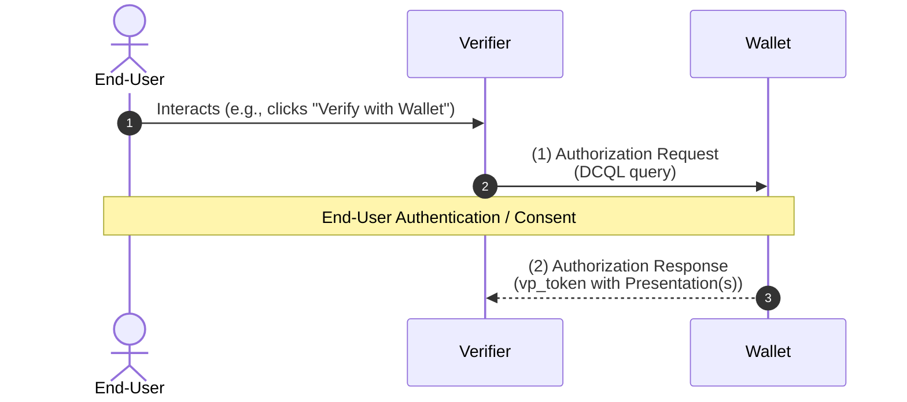
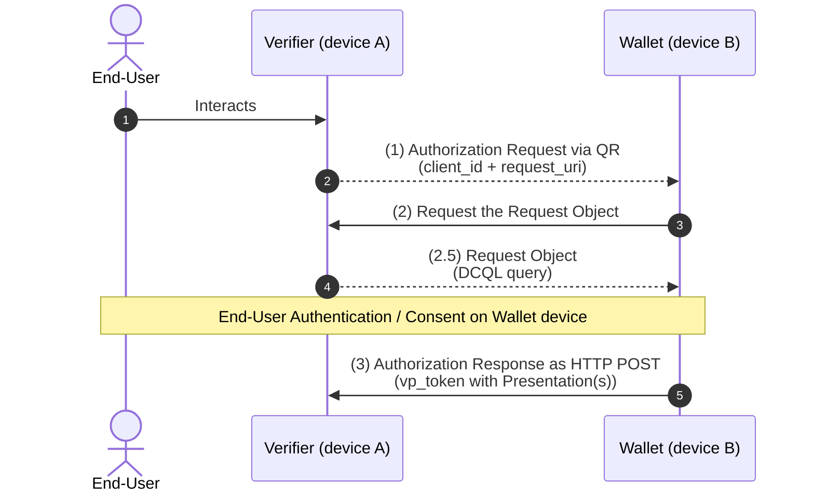
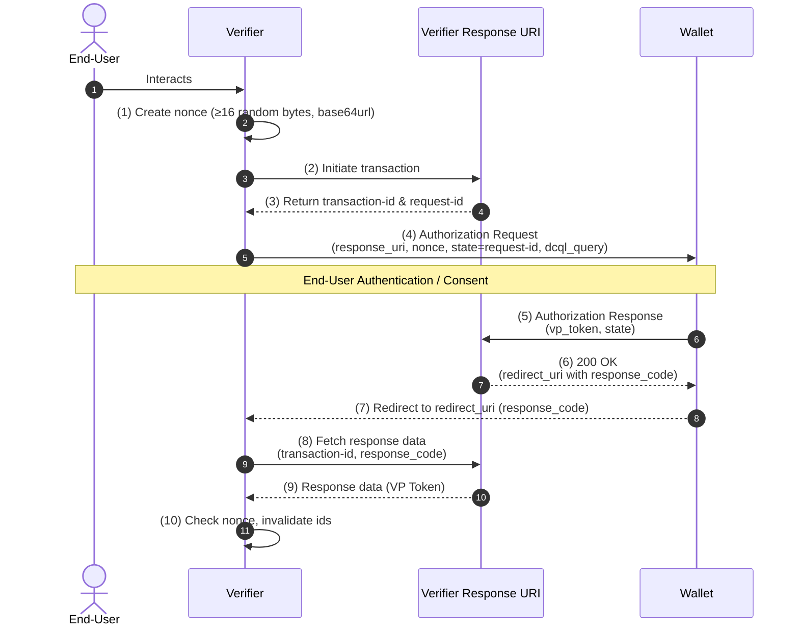

Source URL: https://raw.githubusercontent.com/forkimenjeckayang/Documentations/oid4vp/OID4VP/final-1.0.md
Title: OID4VP Final Version 1.0

# OID4VP Final Version 1.0

## 1. Introduction (Simplified)

OpenID for Verifiable Presentations (OID4VP) defines how to request and deliver **Credential Presentations** using an OAuth 2.0-based flow.

### What it supports

- It is format-agnostic: Credentials and Presentations can use multiple formats, including:
  - W3C Verifiable Credentials Data Model (VC Data Model)
  - ISO mdoc (ISO/IEC 18013-5)
  - IETF SD-JWT VC

### Why OAuth 2.0 is the base

- OID4VP is built on OAuth 2.0 because OAuth already provides secure, widely implemented protocol rails.
- This allows implementers to support, through one interface:
  - credential presentation, and
  - traditional OAuth access token issuance for API access based on credentials in a wallet.

### Relationship with OpenID Connect and SIOPv2

- Existing OpenID Connect deployments can extend their systems with OID4VP to carry Credential Presentations.
- OID4VP can be combined with SIOPv2 when OpenID-specific features are needed, such as issuing Self-Issued ID Tokens.

### Use with Digital Credentials API (DC API)

- The spec also defines how OID4VP works with the W3C Digital Credentials API.
- Requirements for this integration are in **Appendix A**.
- Appendix A is designed to be self-contained: implementers focused only on OID4VP over DC API can follow Appendix A and ignore other sections unless Appendix A explicitly points to them.

## 1.3 Requirements Notation and Conventions

Normative keywords are interpreted using **BCP 14**:

- RFC2119
- RFC8174

These keywords have their normative force only when written in all capitals:

- **MUST**
- **MUST NOT**
- **REQUIRED**
- **SHALL**
- **SHALL NOT**
- **SHOULD**
- **SHOULD NOT**
- **RECOMMENDED**
- **NOT RECOMMENDED**
- **MAY**
- **OPTIONAL**

Implementation reference:

- Treat lowercase uses of these words as ordinary English, not protocol requirements.
- Preserve the difference between mandatory behavior (`MUST`, `REQUIRED`, `SHALL`), prohibited behavior (`MUST NOT`, `SHALL NOT`), recommendations (`SHOULD`, `RECOMMENDED`), and optional behavior (`MAY`, `OPTIONAL`) when converting this document into tasks.

## 2. Terminology (Simplified)

### Reused terms from other specs

This spec reuses terminology from:

- OAuth 2.0 (RFC6749): e.g., Access Token, Authorization Request, Authorization Response, Client, Client Authentication, Client Identifier, Grant Type, Response Type, Token Request, Token Response.
- OpenID Connect Core: End-User, Entity.
- RFC9101: Request Object, Request URI.
- RFC7519: JWT.
- RFC7515: JSON Web Signature (JWS), JOSE Header, and Base64url encoding.
- RFC7516: JWE.
- OAuth 2.0 Multiple Response Type Encoding Practices: Response Mode.

If a term conflicts with another spec, the definition in this OID4VP spec takes precedence.

**Base64url-encoded** means URL-safe base64 encoding without padding, as defined in RFC7515 Section 2.

### Core OID4VP terms

- **Biometrics-based Holder Binding**: Holder proves possession using biometric traits (for example face/fingerprint). Example: mobile driving license (ISO 18013-5) with holder portrait.
- **Claims-based Holder Binding**: Holder proves possession via claims (such as name and DOB), often by presenting another credential. Supports long-term and cross-device use because it does not rely on one device key.
- **Credential**: One or more claims about a subject issued by a Credential Issuer. In this spec, usually a Verifiable Credential. (Different meaning than "Credential" in OpenID Connect Core.)
- **Credential Format Identifier**: Identifier of a specific credential format in OID4VP, including format-specific parameters.
- **Credential Issuer (Issuer)**: Entity that issues credentials.
- **Cryptographic Holder Binding**: Holder proves control of the private key tied to credential issuance/presentation (mechanism depends on format).
- **Digital Credentials API (DC API)**: W3C Digital Credentials API on web platforms and equivalent native APIs (e.g., Android Credential Manager).
- **Holder**: Entity that receives credentials and controls them for presentation to verifiers.
- **Holder Binding / Key Binding**: Any method for the holder to prove legitimate possession of a credential.
- **Issuer-Holder-Verifier Model**: Claims are issued as credentials separately from later presentation; one issued credential can be reused multiple times.
- **Origin**: Platform-asserted identifier of calling website/app.
  - Web origin = scheme + host + port (default port omitted), e.g., `https://verify.example.com`.
  - Native app origin can be a linked web origin or a platform-specific URI, for example a package/key-hash style app origin.
- **Presentation**: Data derived from a credential and shown to a verifier. Usually a Verifiable Presentation with Holder Binding, but can be a Presentation without Holder Binding where the spec allows it.
- **VP Token**: Artifact returned in authorization response containing one or more presentations (structure defined later in the spec).
- **Verifier**: Entity that requests, receives, and validates presentations. In OAuth terms, this is a specific type of Client.
- **Verifiable Credential (VC)**: Issuer-signed credential whose authenticity is cryptographically verifiable (format-agnostic; includes VCDM, mdoc, SD-JWT VC, etc.).
- **Verifiable Presentation (VP)**: Presentation that includes cryptographic proof of holder binding (also format-agnostic; includes VCDM, mdoc, SD-JWT VC, etc.).
- **Wallet**: Holder-controlled entity for receiving, storing, managing, and presenting credentials and keys. Can be local, self-hosted remote, or third-party remote.

## 3. Overview (Simplified)

OID4VP defines how a Verifier requests and receives Credential Presentations.

### Transport models

- **OAuth-style baseline**: HTTPS messages + redirects (aligned with OAuth 2.0).
- **DC API model**: OpenID4VP messages can also be exchanged through the Digital Credentials API instead of HTTPS redirects.

### Main protocol extension

- OID4VP introduces a new response type: **`vp_token`**.
- With `vp_token`, the Verifier receives a **VP Token** container holding one or more:
  - Verifiable Presentations (with holder binding), and/or
  - Presentations (possibly without holder binding, where allowed).
- So the primary output of this interaction is presentation data, not an OAuth access token.

### Credential format support

- The framework is format-agnostic and supports credential formats used in the Issuer-Holder-Verifier model, including VCDM, mdoc, and SD-JWT VC.
- A single transaction can include credentials/presentations from multiple formats.
- Main spec examples use W3C VC; additional format examples are in Appendix B.

### Device and response-delivery flexibility

- Supports same-device and cross-device flows (Verifier and Holder may interact on different devices from where credentials are stored).
- Supports sending responses by:
  - redirect, or
  - HTTP POST.  
    HTTP POST is useful for cross-device delivery and for large responses that may exceed URL length limits.

### Interoperability note (important)

- OID4VP is a framework and requires **profiles** for interoperability.
- A profile should define at least:
  - which optional features are used/required (for example response encryption),
  - allowed parameter values (for example credential format identifiers),
  - and optionally extra extensions.

## 3.1 Same Device Flow (Simplified)

This flow is for the case where:

- the End-User interacts with the Verifier on a device, and
- the Wallet is on **that same device**.

The baseline exchange uses HTTP redirects between Verifier and Wallet.

If response mode is `fragment`, the returned presentations are carried in the **fragment** of the redirect URI.

> Note: The diagram is simplified and does not show every optional feature in the specification.



### Step (1): Authorization Request (Verifier → Wallet)

- The Verifier sends an Authorization Request containing a **DCQL** query (Section 6).
- DCQL expresses what the Verifier needs, for example:
  - credential type(s),
  - accepted format(s),
  - and specific claims (including selective-disclosure needs).
- The Wallet evaluates available credentials against this request.
- The Wallet authenticates the End-User and collects consent for what will be presented.

### Step (2): Authorization Response (Wallet → Verifier)

- The Wallet prepares the Presentation(s) for the credentials the End-User approved.
- The Wallet returns an Authorization Response to the Verifier.
- The resulting Presentations are delivered in the **`vp_token`** parameter.

## 3.2 Cross Device Flow (Simplified)

This flow is for the case where:

- the End-User interacts with the Verifier on **device A**, and
- the Wallet is on **device B**.

### Core pattern

- The Verifier typically encodes the initial request as a **QR code**.
- The Wallet scans the QR code.
- The final Authorization Response is sent directly to the Verifier using **HTTP POST**.

This flow uses:

- response type **`vp_token`**, and
- response mode **`direct_post`**.

### Why `request_uri` is used

- To keep the QR code small, the initial Authorization Request only carries minimal data — Client Identifier and `request_uri` (per [RFC9101]).
- The Wallet then retrieves the full Request Object from that URI.
- This also supports signed and optionally encrypted Request Objects without bloating the QR payload.

> Note: The diagram is simplified and shows neither all parameters nor all optional features.
>
> Note: `request_uri` usage (per [RFC9101]) is **independent** of other extension choices and can also be used in same-device flows.



### Step (1): Initial Authorization Request (Verifier → Wallet)

- The Verifier sends an Authorization Request pointing to a `request_uri` where the full Request Object can be obtained.

### Step (2): Wallet fetches Request Object (Wallet → Verifier)

- The Wallet sends an HTTP GET (or POST, per Section 5.10) to the `request_uri`.

### Step (2.5): Request Object returned (Verifier → Wallet)

- The Verifier returns the Request Object with Authorization Request parameters.
- The Request Object includes a **DCQL** query describing the requested credential requirements (types, formats, specific claims, selective-disclosure needs).
- The Wallet checks available credentials, authenticates the End-User, and gathers consent.

### Step (3): Authorization Response via direct POST (Wallet → Verifier)

- The Wallet prepares Presentations for credentials approved by the End-User.
- The Wallet sends the Authorization Response to the Verifier via **HTTP POST**.
- The Presentations are carried in **`vp_token`**.

## 4. Scope (Simplified)

OID4VP extends OAuth 2.0 with new capabilities for credential presentation.

### Main additions in scope

- **DCQL (Digital Credentials Query Language)**: a new query language for flexible presentation requests (details in Section 6).
- **`dcql_query` request parameter**: new Authorization Request parameter carrying a JSON-encoded DCQL query (details in Section 5).
- **`vp_token` response parameter**: new parameter to return presentations (with or without holder binding), in Authorization or Token Response depending on response type (details in Section 8).
- **New response types**:
  - `vp_token`
  - `vp_token id_token`  
    These request credential presentations in the Authorization Response, optionally alongside a Self-Issued ID Token (SIOPv2).
- **New response mode `direct_post`**: supports cross-device delivery and large responses that may not fit in redirect URLs (details in Section 8.2).
- **`format` parameter usage across protocol**: enables format-specific customization for different credential ecosystems (examples include VC Data Model, mdoc, SD-JWT VC in Appendix B).
- **Client Identifier Prefix concept**: allows deployments to use mechanisms outside RFC6749 scope to obtain and validate Verifier metadata.
- **OID4VP over Digital Credentials API mechanism**: specified in Appendix A.
- **Composability with other flows**: credential presentation can be combined with:
  - End-User authentication via SIOPv2, and
  - OAuth 2.0 Access Token issuance.

## 5. Authorization Request (Simplified)

OID4VP Authorization Requests follow OAuth 2.0 (RFC6749), with RFC9700 recommendations where applicable.

### Request Object / JAR behavior

- Verifier MAY send the Authorization Request as a JAR Request Object (by value or by reference), per RFC9101.
- Verifier **MUST** set Request Object JOSE header `typ` to `oauth-authz-req+jwt`.
- Wallet **MUST NOT** process a Request Object if `typ` is missing or has another value.

### `client_id` vs `iss` in Request Object

- `client_id` is required by this spec.
- `iss` MAY still appear for compatibility with existing JAR implementations.
- If `iss` is present, Wallet **MUST ignore** it.

### Capability exchange hook via `request_uri_method=post`

- This spec adds a mechanism so Wallet can share technical capabilities to help Verifier tailor requests.
- Verifier can set `request_uri_method=post` (with `request_uri`) to signal Wallet may POST capabilities to the request URI endpoint (details in Section 5.10).
- Wallets that do not support this feature MAY continue with normal JAR behavior.

### Credential request expression

- Verifier expresses requested credential requirements using `dcql_query`.
- Wallet implementations **MUST** evaluate DCQL and select candidate credentials using Section 6.4 evaluation rules.

### Client Identifier Prefix and metadata handling

- Verifier uses a Client Identifier Prefix in `client_id` to tell Wallet how to interpret client identity and related data.
- This enables deployment-specific metadata validation/lookup mechanisms beyond RFC6749.
- Depending on prefix rules, Verifier may need signed requests and/or extra parameters that Wallet must process.
- Verifier can send `client_metadata` JSON to communicate metadata values.

### Unknown parameters behavior

- Extra parameters MAY be defined (per RFC6749 extensibility).
- Wallet **MUST ignore** unknown parameters, **except** `transaction_data`.
- Wallets that do not support `transaction_data` **MUST reject** requests containing it.

## 5.1 New Parameters (Simplified)

### `dcql_query`

- JSON object containing a DCQL query (Section 6).
- Exactly one of the following must be used:
  - `dcql_query`, or
  - `scope` representing a DCQL query.
- They **MUST NOT** both be present in the same Authorization Request.
- In `application/x-www-form-urlencoded` requests, object parameters are transmitted as JSON-serialized strings.

### `client_metadata` (OPTIONAL)

- UTF-8 JSON object with Verifier metadata.
- Supported metadata fields:
  - `jwks` (OPTIONAL): JWK Set (RFC7591) with public keys for purposes such as response encryption key agreement or VP generation needs.
    - May contain ephemeral request-specific keys.
    - Keys here **MUST NOT** be used to verify signatures of signed Authorization Requests.
    - Each JWK **MUST** include a unique `kid` within the request context.
  - `encrypted_response_enc_values_supported` (OPTIONAL): non-empty list of JWE `enc` algorithms for response encryption.
    - If response mode requires encrypted responses (e.g., `dc_api.jwt`, `direct_post.jwt`), this parameter **MUST** be present unless default `A128GCM` is the only value used.
    - Otherwise it **SHOULD** be absent.
  - `vp_formats_supported` (REQUIRED when not otherwise available): as defined in Section 11.1.
- If Wallet has authoritative client data from other trusted sources (for example federation statements), that authoritative data takes precedence over `client_metadata`.
- Other metadata keys **MUST** be ignored unless a profile explicitly allows them in `client_metadata`.

### `request_uri_method` (OPTIONAL)

- String controlling how Wallet fetches `request_uri`.
- Valid values (case-sensitive): `get`, `post`.
  - `get`: Wallet **MUST** fetch Request Object using HTTP GET (RFC9101 behavior).
  - `post`: supporting Wallet **MUST** use HTTP POST as defined in Section 5.10.
- If missing, Wallet **MUST** process `request_uri` per RFC9101 default behavior.
- Wallets without POST support will use GET.
- `request_uri_method` **MUST NOT** be present if `request_uri` is absent.
- If Verifier sets `request_uri_method=post` and has no other way to share capabilities, it **SHOULD** include `client_metadata` so Wallet can send only relevant `wallet_metadata` in the Request URI POST flow.

### `transaction_data` (OPTIONAL)

- Non-empty array of strings.
- Each string is a base64url-encoded JSON object representing typed transaction details to be authorized by End-User (Section 8.4).
- Wallet **MUST** return error if any transaction item:
  - has an unrecognized `type`, or
  - does not conform to that type's definition.
- Common fields for each decoded transaction object:
  - `type` (REQUIRED): transaction data type identifier.
    - Specific type values are out of scope here.
    - Collision-resistant type naming is RECOMMENDED.
  - `credential_ids` (REQUIRED): non-empty array of DCQL credential query IDs that may authorize this transaction.
    - If multiple IDs are listed, Wallet **MUST** use only one referenced credential for transaction authorization.
- Type-specific documents define what credentials can authorize a given transaction type.
- How issuers express credential authorization capability is out of scope.

Non-normative decoded example:

```json
{
  "type": "example_type",
  "credential_ids": ["id_card_credential"]
}
```

### `verifier_info` (OPTIONAL)

- Non-empty array of attestations about the Verifier relevant to credential request evaluation.
- Intended uses: support authorization decisions, wallet policy enforcement, and richer consent UX.
- Each entry contains:
  - `format` (REQUIRED): format identifier defining attestation encoding/processing rules (collision-resistant values are recommended).
  - `data` (REQUIRED): object or string containing attestation content (e.g., JWT); schema is format-specific.
  - `credential_ids` (OPTIONAL): non-empty array of DCQL credential query IDs this attestation applies to; if omitted, applies to all requested credentials.
- Wallet decides whether to use `verifier_info` based on trust frameworks, issuer/ecosystem policies, and profile rules.
- If Wallet uses it, Wallet **MUST** validate signatures and verify binding.
- See Section 5.11 for more details.

Non-normative example:

```json
{
  "format": "jwt",
  "data": "eyJhbGciOiJFUzI1...EF0RBtvPClL71TWHlIQ",
  "credential_ids": ["id_card"]
}
```

## 5.2 Existing Parameters (Simplified)

OID4VP reuses standard Authorization Request parameters, with additional rules:

### `nonce`

- **REQUIRED**.
- Used to securely bind returned Verifiable Presentation(s) to this specific transaction.
- Verifier **MUST**:
  - generate a fresh, cryptographically random nonce with sufficient entropy for each Authorization Request,
  - store it with the current session,
  - send it in the Authorization Request.
- Allowed characters are ASCII URL-safe only:
  - uppercase/lowercase letters,
  - digits,
  - `-`, `.`, `_`, `~`.
- See Section 14.1 for details.

### `scope`

- **OPTIONAL** (RFC6749).
- Wallet MAY support requesting presentations via predefined scope values.
- See Section 5.5 for profile behavior/details.

### `response_mode`

- **REQUIRED**.
- Defined by OAuth response-mode specs, with OID4VP-specific usage:
  - can request HTTPS push-style response delivery via `direct_post` (Section 8.2),
  - can request encrypted responses (Section 8.3).

### `client_id`

- **REQUIRED**.
- Uses RFC6749 semantics plus OID4VP requirements for Client Identifier Prefixes (Section 5.9).
- Client Identifier may be issued/defined by parties other than Wallet.
- Uniqueness is considered in combination of:
  - Client Identifier Prefix + Client Identifier.

### `state`

- **REQUIRED** only under conditions in Section 5.3; otherwise **OPTIONAL**.
- If used, value characters are limited to ASCII URL-safe set:
  - uppercase/lowercase letters,
  - digits,
  - `-`, `.`, `_`, `~`.

## 5.3 Requesting Presentations Without Holder Binding Proofs (Simplified)

OID4VP mainly targets Verifiable Presentations with cryptographic holder binding.
Still, it also supports requests for presentations **without** cryptographic holder binding proof.

### When this is used

- Low-security credentials that do not support holder binding (example: cinema ticket).
- Credentials bound by biometrics.
- Credentials bound by claims (example: diploma).
- Cases where credential supports holder binding, but Verifier chooses not to require it.

### Security consequence

- If Verifier accepts presentations without holder binding proof, it accepts replay risk.
- Additional security considerations are in Section 14.1.

### How to request it

- Verifier uses DCQL parameter **`require_cryptographic_holder_binding`** (see Section 6 and Appendix B).

### Request-response binding requirements in this case

In normal holder-binding flows, `nonce` helps bind request and response and protects against replay in the holder-binding proof.
When no cryptographic holder-binding proof is requested, `nonce` is not returned in response for that purpose, so request/response correlation must rely on `state`.

If at least one presentation without holder binding is requested, Verifier **MUST** (unless DC API is used):

- include `state` in the Authorization Request (RFC6749 Section 4.1.1),
- ensure `state` is a cryptographically strong pseudo-random value with at least 128 bits entropy,
- generate a fresh `state` for each Authorization Request,
- store `state` in Verifier session state,
- verify the same `state` value is returned in Authorization Response.

Exception:

- When using Digital Credentials API, internal platform mechanisms maintain request/response binding.

Additional note:

- For `direct_post` response mode, also apply Section 14.3 considerations.

## 5.4 Examples (Simplified)

The Verifier MAY send an Authorization Request in **three** ways:

1. **URL with encoded parameters** (no JAR).
2. **Request Object by value** (JAR `request` parameter, per [RFC9101]).
3. **Request Object by reference** (JAR `request_uri` parameter, per [RFC9101]) — optionally with `request_uri_method=post` for capability negotiation.

All examples below are **non-normative**.

### Example 1 — URL with encoded parameters

Note that `client_id` carries the `redirect_uri` Client Identifier Prefix:

```http
GET /authorize?
  response_type=vp_token
  &client_id=redirect_uri%3Ahttps%3A%2F%2Fclient.example.org%2Fcb
  &redirect_uri=https%3A%2F%2Fclient.example.org%2Fcb
  &dcql_query=...
  &transaction_data=...
  &nonce=n-0S6_WzA2Mj HTTP/1.1
```

### Example 2 — Request Object passed by value

The Authorization Request URL carries a signed, base64url-encoded Request Object in the `request` parameter:

```http
GET /authorize?
  client_id=redirect_uri%3Ahttps%3A%2F%2Fclient.example.org%2Fcb
  &request=eyJrd...
```

Decoded Request Object payload (signed with RS256 in this example):

```json
{
  "iss": "redirect_uri:https://client.example.org/cb",
  "aud": "https://self-issued.me/v2",
  "response_type": "vp_token",
  "client_id": "redirect_uri:https://client.example.org/cb",
  "redirect_uri": "https://client.example.org/cb",
  "dcql_query": {
    "credentials": [
      {
        "id": "some_identity_credential",
        "format": "dc+sd-jwt",
        "meta": {
          "vct_values": ["https://credentials.example.com/identity_credential"]
        },
        "claims": [{ "path": ["last_name"] }, { "path": ["first_name"] }]
      }
    ]
  },
  "nonce": "n-0S6_WzA2Mj"
}
```

### Example 3 — Request Object passed by reference (with `request_uri_method=post`)

The Authorization Request only carries `client_id`, `request_uri`, and `request_uri_method`:

```http
GET /authorize?
  client_id=x509_san_dns%3Aclient.example.org
  &request_uri=https%3A%2F%2Fclient.example.org%2Frequest%2Fvapof4ql2i7m41m68uep
  &request_uri_method=post HTTP/1.1
```

To retrieve the actual Request Object, the Wallet sends an HTTP POST to `request_uri` carrying its own capabilities so the Verifier can tailor the Request Object:

```http
POST /request/vapof4ql2i7m41m68uep HTTP/1.1
Host: client.example.org
Content-Type: application/x-www-form-urlencoded

wallet_metadata=%7B%22vp_formats_supported%22%3A%7B%22dc%2Bsd-jwt%22%3A%7B%22sd-jwt_alg_values%22%3A%5B%22ES256%22%5D%2C%22kb-jwt_alg_values%22%3A%5B%22ES256%22%5D%7D%7D%7D&wallet_nonce=qPmxiNFCR3QTm19POc8u
```

Decoded Wallet POST body (URL-decoded):

```json
{
  "wallet_metadata": {
    "vp_formats_supported": {
      "dc+sd-jwt": {
        "sd-jwt_alg_values": ["ES256"],
        "kb-jwt_alg_values": ["ES256"]
      }
    }
  },
  "wallet_nonce": "qPmxiNFCR3QTm19POc8u"
}
```

> See **Section 5.10** for full rules on the Request URI POST flow.

## 5.5 Using `scope` to Request Presentations (Simplified)

Wallets MAY support presentation requests via OAuth 2.0 `scope` values.

### Core rule

- Each scope value used for this purpose **MUST** map to (be an alias of) a well-defined DCQL query.

### Multiple scopes and identifier uniqueness

- If multiple scope values are used together, DCQL queries behind those scopes may be combined.
- Therefore, credential identifiers and claim identifiers in those mapped DCQL queries **MUST** be unique across the combined set.
- Goal: avoid ID collisions and allow Verifier to unambiguously identify requested credentials in responses.

### What this spec does not define

- Exact scope values and their mapping to DCQL are out of scope.
- Implementations/ecosystems can define mappings through:
  - separate normative/profile specifications, or
  - machine-readable wallet metadata that maps scope → equivalent DCQL query.

### Recommendation

- Use **collision-resistant** scope values (e.g., reverse-domain-name style).

### Non-normative example — scope-based Authorization Request

The scope value `com.example.healthCardCredential_presentation` is an alias for a DCQL query known to both parties. No `dcql_query` parameter is needed in the request:

```http
GET /authorize?
  response_type=vp_token
  &client_id=https%3A%2F%2Fclient.example.org%2Fcb
  &redirect_uri=https%3A%2F%2Fclient.example.org%2Fcb
  &scope=com.example.healthCardCredential_presentation
  &nonce=n-0S6_WzA2Mj HTTP/1.1
```

## 5.6 Response Type `vp_token` (Simplified)

OID4VP defines response type **`vp_token`**.

### Required behavior

- If Authorization Request has `response_type=vp_token`, a successful response **MUST** include `vp_token`.
- In successful response to this grant, Wallet **SHOULD NOT** return:
  - OAuth Authorization Code,
  - Access Token,
  - Access Token Type.

### Response mode behavior

- Default response mode for `vp_token` is **`fragment`**.
- So by default, Authorization Response parameters are returned in redirect URI fragment.
- `vp_token` can also be used with other response modes defined by OAuth response-mode specs.
- Both success and error responses **SHOULD** use:
  - the supplied response mode, or
  - default mode if none is supplied.

See Section 8 for response details tied to `response_type`.

## 5.7 Passing Authorization Request Across Devices (Simplified)

When request is shown on one device and Wallet/credentials are on another device, Authorization Request can be transferred via QR code.

Recommendation:

- Use `request_uri` together with response mode `direct_post`.
- Reason: full Authorization Requests can be too large to fit directly in a QR payload.

## 5.8 `aud` of a Request Object (Simplified)

If Verifier sends a Request Object (RFC9101), `aud` depends on discovery mode:

- With Dynamic Discovery: `aud` **MUST** equal Wallet issuer (`iss`) value.
- With Static Discovery metadata: `aud` **MUST** be `"https://self-issued.me/v2"`.

Note:

- `"https://self-issued.me/v2"` is a symbolic value and can be used even when OID4VP is used without SIOPv2.

## 5.9 Client Identifier Prefix and Verifier Metadata Management (Simplified)

OID4VP introduces **Client Identifier Prefix** to define how Wallet interprets `client_id` and associated metadata for:

- client identification,
- client authentication,
- client authorization.

### Purpose

- Enables deployment-specific mechanisms for obtaining/validating Verifier metadata beyond RFC6749.
- Name uses "Client" terminology because Verifier acts as OAuth Client in this protocol.

### How it is conveyed

- Prefix MAY be included in `client_id` value by Verifier.
- If no prefix is provided, fallback/default behavior remains pre-registered client style per RFC6749.

### Effects of a prefix

- Specific prefix rules may require:
  - signed Authorization Requests for authentication, and/or
  - additional parameters that Wallet must process.

## 5.9.1 Syntax (Simplified)

Client Identifier Prefix syntax is:

`<client_id_prefix>:<orig_client_id>`

- `<client_id_prefix>` = prefix defining interpretation/auth rules.
- `<orig_client_id>` = client identifier within that prefix namespace.

### Parsing and interpretation rules

- Wallet **MUST** inspect `client_id` for a `:` character.
- If `:` exists and text before it is a recognized/supported prefix, Wallet **MUST** process `client_id` under that prefix's rules.
- Prefix is the substring before the **first** `:`.
- Implementations should not assume the whole value is a valid URI just because `:` exists.
- Parsing must follow the rules defined for the selected prefix type (Section 5.9.3).

### Example behavior

- `client_id=verifier_attestation:example-client`
  - Prefix: `verifier_attestation`
  - Client identifier in that namespace: `example-client`
- The **full** string (`verifier_attestation:example-client`) is used as client identifier throughout OAuth flow, including as audience/intended receiver where applicable.

### Operational note

- Verifier should know which Client Identifier Prefixes a Wallet supports before sending request, so it can choose a supported prefix.

### Metadata note

- Depending on prefix rules, Verifier can include `client_metadata` JSON with name/value pairs.

## 5.9.2 Fallback (Simplified)

### No prefix present

- If `client_id` has no `:` character, Wallet **MUST** treat it as a pre-registered client (RFC6749 default model).
- So client must be known to Wallet before request.
- Verifier metadata is obtained via RFC7591 mechanisms or out-of-band means.

Example intent:

- `client_id=example-client` -> interpreted as pre-registered client.

### Unknown prefix-like value

- If `:` is present but text before it is not a recognized/supported prefix:
  - Wallet may treat it as pre-registered client, or
  - Wallet may reject the request.

### Naming constraint for pre-registered clients

- Pre-registered client IDs **MUST NOT** begin with a supported Client Identifier Prefix followed immediately by `:`.

## 5.9.3 Defined Client Identifier Prefixes (Simplified)

This spec defines these prefixes and processing rules.

Important DC API note:

- In OpenID4VP over DC API (Appendix A), Wallet may decide whether to enforce Request Object signature validation according to a prefix's normal rules, based on trust framework/policies/profile choices.

### `redirect_uri`

- Meaning: value after the prefix **is** the Verifier's Redirect URI (or Response URI for `direct_post`).
- Verifier **MAY** omit the explicit `redirect_uri` parameter (or `response_uri` in `direct_post`) because it is already encoded in `client_id`.
- All Verifier metadata **MUST** be provided via the `client_metadata` parameter.
- Requests using this prefix **cannot be signed in a trustable way** — there is no method for the Wallet to obtain a trusted key for verification. Deployments requiring signed requests cannot use this prefix.
- Example Client Identifier: `redirect_uri:https://client.example.org/cb`.

#### Non-normative example — unsigned request with `redirect_uri` prefix

(Line breaks in `client_metadata` for readability.)

```http
HTTP/1.1 302 Found
Location: https://wallet.example.org/universal-link?
  response_type=vp_token
  &client_id=redirect_uri%3Ahttps%3A%2F%2Fclient.example.org%2Fcb
  &redirect_uri=https%3A%2F%2Fclient.example.org%2Fcb
  &dcql_query=...
  &nonce=n-0S6_WzA2Mj
  &client_metadata=%7B%22vp_formats_supported%22%3A%7B%22dc%2Bsd-jwt%22%3A%7B%22sd-jwt_alg_values%22%3A%5B%22ES256%22%5D%2C%22kb-jwt_alg_values%22%3A%5B%22ES256%22%5D%7D%7D%7D
```

Decoded `client_metadata`:

```json
{
  "vp_formats_supported": {
    "dc+sd-jwt": {
      "sd-jwt_alg_values": ["ES256"],
      "kb-jwt_alg_values": ["ES256"]
    }
  }
}
```

### `openid_federation`

- Meaning: value after prefix is OpenID Federation Entity Identifier.
- Wallet **MUST** apply OpenID Federation processing rules.
- Request MAY include `trust_chain`.
- Example Client Identifier: `openid_federation:https://federation-verifier.example.com`.
- Final Verifier metadata comes from trust chain after policy application.
- `client_metadata`, if present, **MUST** be ignored with this prefix.

### `decentralized_identifier`

- Meaning: value after the prefix is a Decentralized Identifier per [DID-Core].
- Request **MUST** be signed with a private key associated with the DID.
- Wallet **MUST** obtain the verification key from the DID Document `verificationMethod` property.
- Since a DID Document may include multiple keys, the JOSE header `kid` **MUST** identify the specific key used to sign the request.
- Wallet **MUST** resolve the DID using DID Resolution defined by the DID method.
- All Verifier metadata other than the public key **MUST** come from `client_metadata`.
- Example Client Identifier: `decentralized_identifier:did:example:123`.

#### Non-normative example — signed Request Object with `decentralized_identifier` prefix

JOSE header:

```json
{
  "typ": "oauth-authz-req+jwt",
  "alg": "RS256",
  "kid": "did:example:123#1"
}
```

JWT payload:

```json
{
  "client_id": "decentralized_identifier:did:example:123",
  "response_type": "vp_token",
  "redirect_uri": "https://client.example.org/callback",
  "nonce": "n-0S6_WzA2Mj",
  "dcql_query": { "...": "..." },
  "client_metadata": {
    "vp_formats_supported": {
      "dc+sd-jwt": {
        "sd-jwt_alg_values": ["ES256", "ES384"],
        "kb-jwt_alg_values": ["ES256", "ES384"]
      }
    }
  }
}
```

### `verifier_attestation`

- Verifier authenticates using attestation JWT bound to a public key (Section 12).
- Value after prefix **MUST** equal `sub` claim in Verifier Attestation JWT.
- Request **MUST** be signed by private key corresponding to key in attestation JWT `cnf`.
- Verifier attestation JWT **MUST** be included in Request Object JOSE header `jwt`.
- Wallet **MUST** validate attestation JWT signature.
- Attestation JWT `iss` **MUST** identify a trusted attestation issuer; if trust cannot be established, Wallet **MUST** reject.
- If attestation includes `redirect_uris`, Wallet **MUST** require exact match of request `redirect_uri` with one listed value.
- Verifier metadata other than public key **MUST** come from `client_metadata`.
- Example Client Identifier: `verifier_attestation:verifier.example`.

### `x509_san_dns`

- Value after prefix **MUST** be DNS name.
- That DNS name **MUST** match a `dNSName` SAN in leaf certificate sent with request.
- Request **MUST** be signed with private key matching leaf cert public key.
- Certificate chain is supplied via JOSE header `x5c`.
- Wallet **MUST** validate request signature and X.509 trust chain.
- Verifier metadata other than public key **MUST** come from `client_metadata`.
- Unless using DC API:
  - if Wallet trusts authenticated client identifier (e.g., trusted list), it may allow flexible `redirect_uri`;
  - otherwise FQDN of `redirect_uri` **MUST** match DNS name in client ID (without prefix).
- Example Client Identifier: `x509_san_dns:client.example.org`.

### `x509_hash`

- Value after prefix **MUST** be hash of leaf certificate sent with request.
- Request **MUST** be signed with private key matching leaf cert public key.
- Certificate chain is supplied in JOSE header `x5c`.
- `x509_hash` value = base64url-encoded SHA-256 hash of DER-encoded leaf certificate.
- Wallet **MUST** validate request signature and X.509 trust chain.
- Verifier metadata other than public key **MUST** come from `client_metadata`.
- Example Client Identifier: `x509_hash:Uvo3HtuIxuhC92rShpgqcT3YXwrqRxWEviRiA0OZszk`.

### `origin` (reserved)

- Defined in Appendix A.2.
- Wallet **MUST NOT** accept this prefix in requests.
- In OpenID4VP over DC API, presentation audience is always `origin:<origin-value>` (example: `origin:https://verifier.example.com/`).

### Key management requirement

- Prefixes `openid_federation`, `decentralized_identifier`, `verifier_attestation`, `x509_san_dns`, and `x509_hash` require Verifier capability to securely store private keys.
- This can affect native-app architectures, since such apps are often public clients.

### Extensibility

- Other specs may define additional prefixes.
- Collision-resistant prefix names are RECOMMENDED.

## 5.10 Request URI Method `post` (Simplified)

This section defines how Wallet calls the Verifier's Request URI endpoint when `request_uri_method=post` is used.

### HTTP requirements

- Request **MUST** use HTTP `POST`.
- Scheme **MUST** be `https`.
- `Content-Type` **MUST** be `application/x-www-form-urlencoded`.
- `Accept` header **MUST** be `application/oauth-authz-req+jwt`.
- Body names/values **MUST** be UTF-8 encoded.

### Defined request parameters to Request URI endpoint

- `wallet_metadata` (OPTIONAL):
  - string containing JSON object with wallet metadata parameters (Section 10).
- `wallet_nonce` (OPTIONAL):
  - value used to mitigate replay of Authorization Request.
  - when present, Verifier **MUST** copy/use this value as `wallet_nonce` in signed Authorization Request Object.
  - value can be a fresh, high-entropy, cryptographically random value (base64url is suitable).

### Capability signaling guidance

- If Wallet requires encrypted Request Object, it **SHOULD** provide encryption public keys via `jwks` in `wallet_metadata`.
- If Wallet requires encrypted Authorization Response, it **SHOULD** provide supported encryption algorithms using:
  - `authorization_encryption_alg_values_supported`
  - `authorization_encryption_enc_values_supported`
- If current Client Identifier Prefix allows signed Request Objects, Wallet **SHOULD** include supported request signing algorithms via:
  - `request_object_signing_alg_values_supported`
- If prefix does **not** allow signed Request Objects, Wallet **MUST NOT** include `request_object_signing_alg_values_supported`.

### Extensibility/robustness

- Additional parameters may be used.
- Verifier **MUST** ignore unknown parameters.

#### Non-normative example — Wallet → Verifier Request URI POST

```http
POST /request HTTP/1.1
Host: client.example.org
Content-Type: application/x-www-form-urlencoded
Accept: application/oauth-authz-req+jwt

wallet_metadata=%7B%22vp_formats_supported%22%3A%7B%22dc%2Bsd-jwt%22%3A%7B%22sd-jwt_alg_values%22%3A%5B%22ES256%22%5D%2C%22kb-jwt_alg_values%22%3A%5B%22ES256%22%5D%7D%7D%7D&wallet_nonce=qPmxiNFCR3QTm19POc8u
```

Decoded body (URL-decoded):

```json
{
  "wallet_metadata": {
    "vp_formats_supported": {
      "dc+sd-jwt": {
        "sd-jwt_alg_values": ["ES256"],
        "kb-jwt_alg_values": ["ES256"]
      }
    }
  },
  "wallet_nonce": "qPmxiNFCR3QTm19POc8u"
}
```

## 5.10.1 Request URI Response (Simplified)

### Response format requirements

- Verifier response from Request URI endpoint **MUST** be HTTP with:
  - `Content-Type: application/oauth-authz-req+jwt`
  - body containing signed (optionally encrypted) Request Object per RFC9101.
- Returned Request Object **MUST** satisfy Section 5 requirements.

### Wallet processing requirements

- Wallet **MUST** process Request Object per RFC9101.
- If Wallet sent `wallet_nonce` in POST request:
  - Request Object **MUST** contain matching `wallet_nonce` claim.
  - If missing or mismatched, Wallet **MUST** terminate processing.

### Parameter source and consistency rules

- Wallet **MUST** extract Authorization Request parameters from the Request Object.
- Wallet **MUST only** use parameters from that Request Object, even if same names were in outer Authorization Request query.
- `client_id` in outer Authorization Request parameter and `client_id` claim in Request Object **MUST** be identical (including prefix).
- If any of these checks fail, Wallet **MUST** terminate processing.

### Final validation

- After successful extraction/checks, Wallet validates request under OAuth 2.0 (RFC6749).

#### Non-normative example — decoded Request Object payload (echoing `wallet_nonce`)

```json
{
  "client_id": "x509_san_dns:client.example.org",
  "response_uri": "https://client.example.org/post",
  "response_type": "vp_token",
  "response_mode": "direct_post",
  "dcql_query": { "...": "..." },
  "nonce": "n-0S6_WzA2Mj",
  "wallet_nonce": "qPmxiNFCR3QTm19POc8u",
  "state": "eyJhb...6-sVA"
}
```

Notice that `wallet_nonce` matches the value the Wallet sent in the POST in Section 5.10. Verifier **MUST** echo this exact value; Wallet **MUST** reject a Request Object that does not contain it.

## 5.10.2 Request URI Error Response (Simplified)

- If Verifier returns any HTTP error response from Request URI endpoint, Wallet **MUST** terminate the process.

## 5.11 Verifier Info (Simplified)

`verifier_info` allows Verifier to include extra attested context/metadata in Authorization Request, typically backed by trusted third parties.

### Purpose

- Supports wallet policy decisions.
- Helps eligibility/authorization checks.
- Improves End-User consent UX with richer context.

### Structure and semantics

- Each Verifier Info object includes:
  - a type/format identifier,
  - associated data,
  - optional references to credential identifiers.
- Exact attestation semantics are profile/ecosystem-defined.

### Typical examples

- Registration certificate proving verifier is officially registered to request certain credentials.
- Signed policy statement (usage, retention, access rights, etc.).
- Domain-role confirmation (for example, regulated payment service provider status).

### Processing expectations

- `verifier_info` is optional.
- Wallet MAY use it for decisions or user messaging.
- Wallet SHOULD ignore unsupported/unrecognized Verifier Info types.

## 5.11.1 Proof of Possession (Simplified)

This specification supports two PoP models for verifier attestations:

### 1) Claim-bound attestations

- Attestation itself is not verifier-signed but is bound to verifier by claims.
- Binding mechanism depends on attestation type definition.
- Example: in JWT-based attestation, `sub` can reference certificate distinguished name used to sign request.
- Binding may also include `client_id`.

### 2) Key-bound attestations

- Verifier signs a proof-of-possession object using key contained in or related to attestation.
- To bind proof to current request, signature object should include request `nonce` and `client_id`.
- Attestation and its PoP must be carried together in attachment.

### Wallet validation rule

- If profile defines PoP validation requirements, Wallet **MUST** validate accordingly.
- Wallet must ignore or reject attachments that fail required validation.

## 5.12 Implementation Checklist for Sections 4-5

Use this checklist when implementing or reviewing OID4VP Authorization Request handling.

### Request construction by Verifier

- Choose exactly one credential request mechanism:
  - `dcql_query`, or
  - `scope` value that aliases a well-defined DCQL query.
- Always include `nonce` with fresh cryptographically random entropy and URL-safe ASCII characters only.
- Include `response_mode`; use `direct_post` for cross-device or large responses.
- For QR/cross-device requests, prefer `request_uri` plus `response_mode=direct_post` to keep QR payload small.
- If using JAR, set JOSE header `typ` to `oauth-authz-req+jwt`.
- If using `request_uri_method=post`, include `request_uri`; include `client_metadata` when Wallet needs Verifier capability data to tailor wallet capability disclosure.

### Request processing by Wallet

- Reject Request Objects missing `typ=oauth-authz-req+jwt`.
- Ignore `iss` in Request Object if present; use `client_id` as the required Client Identifier.
- Evaluate DCQL according to Section 6.4 to select candidate credentials.
- Ignore unrecognized request parameters except `transaction_data`.
- Reject unsupported or malformed `transaction_data` rather than silently ignoring it.
- If any requested Presentation lacks cryptographic holder binding and DC API is not used, require and validate `state` as a fresh high-entropy request/response binding value.

### Metadata and client identity

- Interpret `client_id` using the Client Identifier Prefix before the first colon when the prefix is recognized and supported.
- If no colon is present, treat the Client Identifier as a pre-registered OAuth client.
- If a colon is present but the prefix is unsupported, either treat as pre-registered or reject, according to local policy.
- Authoritative metadata obtained from federation, trust chains, registration, or out-of-band sources overrides `client_metadata`.
- `client_metadata.jwks` keys can be used for response encryption or VP generation needs, but not to verify signed Authorization Requests.

### Request URI POST flow

- Wallet POST to `request_uri` must use HTTPS, `application/x-www-form-urlencoded`, UTF-8 body encoding, and `Accept: application/oauth-authz-req+jwt`.
- If Wallet sends `wallet_nonce`, Verifier must echo it in the signed Request Object as `wallet_nonce`.
- Wallet must use only parameters from the returned Request Object, not duplicated outer query parameters.
- Outer `client_id` and Request Object `client_id` must match exactly, including prefix.
- Any HTTP error from the Request URI endpoint terminates processing.

## 6. Digital Credentials Query Language (DCQL) (Simplified)

DCQL is a JSON query language used by Verifier to request credential presentations that match specific requirements.

- Verifier can express constraints on:
  - which credentials are requested, and
  - which claim combinations are acceptable.
- Wallet evaluates query against held credentials and returns matching presentations.

### DCQL top-level object

A valid DCQL query is a JSON object with:

- `credentials` (**REQUIRED**): non-empty array of Credential Queries (Section 6.1).
- `credential_sets` (OPTIONAL): non-empty array of Credential Set Queries (Section 6.2) adding constraints on combinations of requested credentials to return.

Extensibility rule:

- Future extensions may add properties at top-level or deeper levels.
- Implementations **MUST ignore** unknown properties.

## 6.1 Credential Query (Simplified)

A Credential Query requests presentation of one or more matching credentials.

Each object in `credentials` includes:

- `id` (**REQUIRED**):

  - identifier used in response and in `credential_sets` references.
  - non-empty string using only alphanumeric, `_`, `-`.
  - must be unique within Authorization Request (`id` must not repeat).

- `format` (**REQUIRED**):

  - requested credential format identifier (defined in Appendix B).

- `multiple` (OPTIONAL):

  - boolean allowing multiple credentials for this query.
  - default is `false`.

- `meta` (**REQUIRED**):

  - object with format-specific constraints over credential metadata/validity.
  - if empty, no specific metadata/validity constraints are imposed.

- `trusted_authorities` (OPTIONAL):

  - non-empty array of Trusted Authorities Query objects (Section 6.1.1).
  - each returned credential **SHOULD** match at least one listed trusted-authority condition, if this parameter is present.
  - verifier still must independently validate trust of received issuer; this field mainly supports data minimization.

- `require_cryptographic_holder_binding` (OPTIONAL):

  - boolean, default `true`.
  - `true`: cryptographic holder binding proof required.
  - `false`: verifier accepts credential without cryptographic holder binding proof.

- `claims` (OPTIONAL):

  - non-empty array of claim query objects (Section 6.3).
  - verifier **MUST NOT** point to same claim more than once in one query.
  - wallet **SHOULD** ignore duplicate claim queries.

- `claim_sets` (OPTIONAL):
  - non-empty array of arrays of identifiers referencing elements in `claims`.
  - defines requested combinations of claims (selection rules in Section 6.4.1).

Additional note:

- Multiple Credential Queries in one request may target presentation of the same underlying credential.

## 6.1.1 Trusted Authorities Query (Simplified)

Trusted Authorities Query helps identify acceptable issuer authority/trust-framework context.

- A credential matches this query if it matches at least one provided value in one provided type (matching rules depend on type).
- Direct issuer matching can sometimes also be done via claim-value matching (e.g., `iss` in SD-JWT) where trusted_authorities mechanisms are not applicable, but this may be less reliable due to value-matching constraints.

Each `trusted_authorities` entry includes:

- `type` (**REQUIRED**): trusted-authority query type identifier.
- `values` (**REQUIRED**): non-empty array of type-specific strings used for matching issuer/trust framework/federation context.

Privacy note:

- Different trusted-authority types may have different privacy implications (see Section 15.10).

### 6.1.1.1 Type `aki` (Authority Key Identifier)

- `type`: `"aki"`.
- Each value is base64url-encoded KeyIdentifier of X.509 AuthorityKeyIdentifier (RFC5280 4.2.1.1).
- Raw bytes must match AuthorityKeyIdentifier in some certificate in credential's certificate chain.
- Chain may have one certificate or more, and credential may include full or partial chain.

Non-normative example:

```json
{
  "type": "aki",
  "values": ["s9tIpPmhxdiuNkHMEWNpYim8S8Y"]
}
```

### 6.1.1.2 Type `etsi_tl` (ETSI Trusted List)

- `type`: `"etsi_tl"`.
- Each value is identifier/URL of ETSI Trusted List (ETSI TS 119 612).
- Matching credential trust chain must contain at least one certificate matching entries in that trusted list (or its cascading referenced lists).

Non-normative example:

```json
{
  "type": "etsi_tl",
  "values": ["https://lotl.example.com"]
}
```

### 6.1.1.3 Type `openid_federation`

- `type`: `"openid_federation"`.
- Each value is OpenID Federation Entity Identifier.
- Matching requires a valid constructible trust path that includes that entity identifier (commonly a trust anchor).

Non-normative example:

```json
{
  "type": "openid_federation",
  "values": ["https://trustanchor.example.com"]
}
```

## 6.2 Credential Set Query (Simplified)

A Credential Set Query describes one use case at Verifier and the credential combinations that can satisfy it.

Each entry in `credential_sets` includes:

- `options` (**REQUIRED**):

  - non-empty array;
  - each element is a non-empty array of identifiers referencing entries in `credentials`;
  - each such inner array represents one acceptable credential combination.

- `required` (OPTIONAL):
  - boolean indicating whether this credential set is mandatory for satisfying the use case;
  - default is `true`.

UX recommendation:

- Before sending the request, Verifier **SHOULD** communicate to End-User the purpose/context/reason for the query.

## 6.3 Claims Query (Simplified)

Each entry in `claims` includes:

- `id`:

  - **REQUIRED** if `claim_sets` exists in same Credential Query;
  - OPTIONAL otherwise.
  - when used: non-empty string with alphanumeric, `_`, `-` only.
  - within one `claims` array, same `id` **MUST NOT** repeat.

- `path` (**REQUIRED**):

  - non-empty array representing claim path pointer into credential (Section 7).

- `values` (OPTIONAL):
  - non-empty array of allowed literal values (string/integer/boolean).
  - if present, Wallet **SHOULD** return claim only when both type and value exactly match at least one listed value.
  - processing details are in Section 6.4.1.

ISO mdoc value-matching note:

- If matching ISO mdoc credentials and Wallet supports value matching, matching must use JSON form of the CBOR value.
- Conversion should follow RFC8949 Section 6.1 guidance.
- If conversion behavior is unclear, behavior is out of scope.

## 6.4 Selecting Claims and Credentials (Simplified)

This section defines claim/credential selection logic.

### Privacy and selective disclosure baseline

- For selectively disclosable formats, rules are designed to minimize data disclosure.
- Wallet **MUST NOT** send selectively disclosable claims not selected by these rules.
- A presentation may contain additional claims if:
  - same credential is selected with additional claims in another Credential Query in same request, or
  - those additional claims are not selectively disclosable.

## 6.4.1 Selecting Claims (Simplified)

Rules for `claims` and `claim_sets`:

1. If `claims` is absent:

   - Verifier requests no selectively disclosable claims.
   - Wallet **MUST** return only mandatory-to-present claims for the format (e.g., SD-JWT + Key Binding JWT pieces for SD-JWT VC).

2. If `claims` present and `claim_sets` absent:

   - Verifier requests all claims listed in `claims`.

3. If both `claims` and `claim_sets` present:

   - Verifier requests one combination from `claim_sets`.
   - Order in `claim_sets` expresses Verifier preference.
   - Wallet **SHOULD** return first satisfiable option.
   - If Wallet cannot satisfy any option, Wallet **MUST NOT** return any claims.

4. `claim_sets` **MUST NOT** be present if `claims` is absent.

### Value-restriction behavior

- If a claim query includes `values` restriction and value does not match, Wallet **SHOULD NOT** return that claim (treat as if absent).
- In some implementations this may not be possible (e.g., value unavailable before consent/routing boundaries).
- Final behavior can depend on Wallet and/or End-User choices.
- Therefore Verifier **MUST** treat `values` restrictions as privacy best-effort only, not as a security control.

### Purpose of `claim_sets`

- Expresses alternative claim combinations that can satisfy request for one credential.
- Ordering signals Verifier preference (first = most preferred).
- Verifiers **SHOULD** order options by least disclosure principles (e.g., `age_over_18` before `birth_date`).
- `claim_sets` is not intended as End-User choice UI model (see Section 6.4.3).
- Wallet is recommended to return first satisfiable option, but may deviate for valid reasons (e.g., poor verifier ordering or wallet UX/operational needs).

### Failure to satisfy requested claims

- If Wallet cannot deliver all required claims per these rules, it **MUST NOT** return that credential.

### Non-selective-disclosure formats

- For formats without selective disclosure, absence of both `claims` and `claim_sets` means request for full credential (all claims mandatory by format).

## 6.4.2 Selecting Credentials (Simplified)

Rules for credential selection using `credentials` and `credential_sets`:

- If `credential_sets` is absent:

  - Verifier requests presentations for **all** Credential Queries in `credentials`.

- If `credential_sets` is present:

  - Wallet must satisfy **all** Credential Set Queries where `required=true` or omitted.
  - Wallet may additionally satisfy optional sets (`required=false`).
  - To satisfy one Credential Set Query, Wallet **MUST** return a credential combination matching one of its `options`.

- Any credential that does not satisfy constraints in its corresponding Credential Query **MUST NOT** be returned (treat as unavailable).

- If Wallet cannot satisfy all non-optional credential requirements, it **MUST NOT** return any credentials.

## 6.4.3 User Interface Considerations (Simplified)

- The specification defines request/selection mechanics, not wallet UI behavior.
- It does not mandate how End-User choice is presented.
- In practice, if multiple `options` sets can satisfy request, Wallet is typically expected to let End-User choose which credential combination to present.

## 7. Claims Path Pointer (Simplified)

A claims path pointer identifies one or more claims inside a credential.

- It **MUST** be a non-empty array of:
  - strings,
  - `null`,
  - non-negative integers.
- Processing a pointer means applying it to a credential and obtaining referenced claim(s).

## 7.1 Semantics for JSON-based Credentials (Simplified)

When applied to JSON credentials:

- String component -> select object property by key.
- `null` component -> select all elements of current array(s).
- Non-negative integer -> select array element at that index.

Path building intuition:

- append string for object field selection,
- append integer for specific array index,
- append `null` for all array elements.

## 7.1.1 Processing (Simplified)

Processing is left-to-right:

1. Start with credential root (top-level JSON object).
2. For each path component:
   - string:
     - current selected elements must be objects, else error;
     - select matching key in each selected object;
     - if key missing in one selected object, remove that element from selection.
   - `null`:
     - current selected elements must be arrays, else error;
     - select all array elements from each selected array.
   - non-negative integer:
     - current selected elements must be arrays, else error;
     - select indexed element from each array;
     - if index missing in one array, remove that array from selection.
   - anything else -> error.
3. If selection becomes empty at any point -> error.
4. Result is final selected JSON element set.

## 7.2 Semantics for ISO mdoc-based Credentials (Simplified)

For ISO mdoc, claims path pointer is exactly two strings:

1. namespace
2. data element identifier

## 7.2.1 Processing (Simplified)

- If pointer does not have exactly two string components -> error.
- Select namespace from first component; if missing -> error.
- Select data element from second component; if missing -> error.
- Result is selected data element value as CBOR data item.

## 7.3 Claims Path Pointer Example (Simplified)

Non-normative example of a JSON-based Credential:

```json
{
  "name": "Arthur Dent",
  "address": {
    "street_address": "42 Market Street",
    "locality": "Milliways",
    "postal_code": "12345"
  },
  "degrees": [
    { "type": "Bachelor of Science", "university": "University of Betelgeuse" },
    { "type": "Master of Science", "university": "University of Betelgeuse" }
  ],
  "nationalities": ["British", "Betelgeusian"]
}
```

Examples of claims path pointers and the claims they select against the credential above:

| Pointer                         | Selected claim(s)                                                                             |
| ------------------------------- | --------------------------------------------------------------------------------------------- |
| `["name"]`                      | The `name` claim → `"Arthur Dent"`.                                                           |
| `["address"]`                   | The full `address` object (with all sub-claims).                                              |
| `["address", "street_address"]` | The nested claim → `"42 Market Street"`.                                                      |
| `["degrees", null, "type"]`     | All `type` values in the `degrees` array → `"Bachelor of Science"` and `"Master of Science"`. |
| `["nationalities", 1]`          | The second nationality (0-indexed) → `"Betelgeusian"`.                                        |

## 7.4 DCQL Example (Simplified)

Non-normative example intent:

- request one `dc+sd-jwt` credential,
- constrain type via `meta.vct_values`,
- request claims `last_name`, `first_name`, and `address.street_address`.

```json
{
  "credentials": [
    {
      "id": "my_credential",
      "format": "dc+sd-jwt",
      "meta": {
        "vct_values": ["https://credentials.example.com/identity_credential"]
      },
      "claims": [{ "path": ["last_name"] }, { "path": ["first_name"] }, { "path": ["address", "street_address"] }]
    }
  ]
}
```

More complex examples are in Appendix D.

## 8. Response (Simplified)

A VP Token is returned only if the related Authorization Request included:

- `dcql_query`, or
- `scope` representing a DCQL query.

Where VP Token appears depends on `response_type`:

- `vp_token` -> VP Token in **Authorization Response**
- `vp_token id_token` (+ `scope` includes `openid`) -> VP Token + Self-Issued ID Token in **Authorization Response**
- `code` -> VP Token in **Token Response**

Behavior for other response type combinations is unspecified.

| `response_type`     | VP Token location                                                                     |
| ------------------- | ------------------------------------------------------------------------------------- |
| `vp_token`          | Authorization Response                                                                |
| `vp_token id_token` | Authorization Response, alongside Self-Issued ID Token when `scope` includes `openid` |
| `code`              | Token Response                                                                        |

## 8.1 Response Parameters (Simplified)

When VP Token is returned, response includes:

- `vp_token` (**REQUIRED**):
  - JSON object where:
    - each key = DCQL Credential Query `id`,
    - each value = array of one or more matching presentations.
  - If query `multiple` is omitted or `false`, array **MUST** contain exactly one presentation.
  - For optional Credential Queries with no match, there **MUST NOT** be an entry in `vp_token`.
  - Each presentation value is string or object depending on credential format (Appendix B).

Other parameters (e.g., `code` from [RFC6749], `id_token` from [OpenID.Core], `iss` from [RFC9207]) may also appear as defined in respective specs.

Extensibility rule:

- Additional response parameters may exist.
- Client **MUST** ignore unrecognized parameters.

#### Non-normative example — Authorization Response (302 fragment)

When `response_type=vp_token` and the default `response_mode=fragment` is used, the response is delivered on the redirect URI's fragment:

```http
HTTP/1.1 302 Found
Location: https://client.example.org/cb#
  vp_token=...
```

### 8.1.1 Examples (Simplified)

Non-normative example — `vp_token` with a single Verifiable Presentation in SD-JWT VC format (responding to the DCQL query in Section 7.4):

```json
{
  "my_credential": ["eyJhbGci...QMA"]
}
```

Non-normative example — `vp_token` with multiple Verifiable Presentations (when the Credential Query had `multiple: true`):

```json
{
  "my_credential": ["eyJhbGci...QMA", "eyJhbGci...QMA"]
}
```

> Notice that **every** `vp_token` value is an array, even when only one presentation is returned. The number of presentations in the array is governed by the Credential Query's `multiple` flag.

## 8.2 Response Mode `direct_post` (Simplified)

`direct_post` lets Wallet send Authorization Response to Verifier-controlled endpoint via HTTP POST.

### Why it exists

- Cross-device flows where redirect to verifier frontend is not sufficient.
- Responses too large for URL-based redirect modes (e.g., fragment).
- Enables delivery without requiring Wallet backend.

### Core behavior

- Authorization Response is sent via HTTP POST to verifier endpoint.
- Body **MUST** use `application/x-www-form-urlencoded`.
- Parameters in body **MUST** be UTF-8 encoded.

### `response_uri` request parameter

- **REQUIRED** when `response_mode=direct_post`.
- Wallet **MUST** post Authorization Response to this URL.
- When `response_uri` is present, `redirect_uri` in Authorization Request **MUST NOT** be present.
- If `redirect_uri` is present with `direct_post`, Wallet **MUST** return `invalid_request`.
- `response_uri` value must be one the client would be allowed to use as redirect URI under Section 5.9 rules.

Interpretation note:

- Spec text that refers to Redirect URI also applies to Response URI in `direct_post` context.

State/correlation note:

- Verifier frontend and response endpoint must correlate request/response.
- `state` can be used for this (see Section 13.3).

Unknown-parameter rule:

- Additional request parameters may exist with `direct_post`.
- Wallet **MUST** ignore unrecognized parameters.

#### Non-normative example — Request Object payload with `direct_post`

`client_id` carries the `redirect_uri` Client Identifier Prefix; `response_uri` equals the value after the prefix (Section 5.9.3 rule).

```json
{
  "client_id": "redirect_uri:https://client.example.org/post",
  "response_uri": "https://client.example.org/post",
  "response_type": "vp_token",
  "response_mode": "direct_post",
  "dcql_query": { "...": "..." },
  "nonce": "n-0S6_WzA2Mj",
  "state": "eyJhb...6-sVA"
}
```

#### Non-normative example — outer Authorization Request referencing the Request Object

The Authorization Request displayed to the End-User (link or QR) only carries `client_id` and `request_uri`; the Wallet fetches the full Request Object from `request_uri`.

```text
https://wallet.example.com?
  client_id=https%3A%2F%2Fclient.example.org%2Fcb
  &request_uri=https%3A%2F%2Fclient.example.org%2F567545564
```

#### Non-normative example — Wallet → Verifier success POST (Authorization Response)

```http
POST /post HTTP/1.1
Host: client.example.org
Content-Type: application/x-www-form-urlencoded

vp_token=...&state=eyJhb...6-sVA
```

#### Non-normative example — Wallet → Verifier error POST (Authorization Error Response)

```http
POST /post HTTP/1.1
Host: client.example.org
Content-Type: application/x-www-form-urlencoded

error=invalid_request&error_description=unsupported%20client_id_prefix&state=eyJhb...6-sVA
```

### Verifier endpoint reply back to Wallet

- After processing the success/error POST, the Response URI endpoint **MUST** reply with:
  - HTTP 200,
  - `Content-Type: application/json`,
  - a JSON body.

Defined JSON response parameter:

- `redirect_uri` (OPTIONAL):
  - if present, Wallet **MUST** redirect user agent to it.
  - used to continue flow on wallet device and can help mitigate session fixation risks.
  - may be returned for success or error cases.

Additional JSON response parameters may exist; Wallet **MUST** ignore unknown ones.

### Security requirements for returned `redirect_uri`

- `redirect_uri` **MUST** be an absolute URI per [RFC3986] §4.3.
- Chosen by the Verifier.
- The Verifier **MUST** include a fresh, cryptographically random value in the URL so only the intended receiver can fetch and process the response.
- The random value can be in the path, fragment, or query of the URL.
- **RECOMMENDED**: at least 128 bits of cryptographic randomness. See Section 13.3 for implementation considerations (`response_code`).

#### Non-normative example — Verifier 200 OK with `redirect_uri` (using `response_code`)

```http
HTTP/1.1 200 OK
Content-Type: application/json
Cache-Control: no-store

{
  "redirect_uri": "https://client.example.org/cb#response_code=091535f699ea575c7937fa5f0f454aee"
}
```

If the Verifier JSON reply does not include `redirect_uri`, the Wallet is not required to perform any further steps.

Security note:

- `direct_post` without a follow-up `redirect_uri` can be **less secure** than redirect-based modes (see Section 14.2).

UX note:

- In `direct_post` / `direct_post.jwt`, the Wallet UI may adapt based on the Verifier's callback after submission.

## 8.3 Encrypted Responses (Simplified)

OID4VP allows application-layer encryption of Authorization Responses containing `vp_token` (e.g., for `vp_token` or `vp_token id_token` response types).

Purpose:

- Reduce risk of personal data leakage, especially in front-channel scenarios (e.g., browser).

### Encryption model

- Implementations **MUST** use an unsigned encrypted JWT (JWE-based) per JWT/JWA rules.
- Encrypted payload is a JSON object containing Authorization Response parameters.
- Response payload **MUST** include Section 8.1 response members as top-level JSON fields.

### How Wallet chooses encryption key and algorithms

- Wallet gets Verifier public keys from client metadata (e.g., `client_metadata.jwks`) or other mechanisms allowed by the active Client Identifier Prefix.
- Wallet chooses a suitable key based on JWK properties (e.g., `kty`, `use`, `alg`, etc.).
- In selected JWK, `alg` **MUST** be present.
- JWE header `alg` **MUST** equal chosen JWK `alg`.
- If chosen JWK has `kid`, JWE header **MUST** include same `kid` value.
- JWE `enc` is taken from `encrypted_response_enc_values_supported` in client metadata.
  - If not explicitly set, default `A128GCM` applies.

### Notes

- For ECDH-based JWE algorithms (per [RFC7518] §4.6), `apu` and `apv` feed the KDF and — regardless of algorithm — are always part of the AEAD tag computation, so they remain bound to the encrypted response.
- JOSE encryption options may include HPKE-based approaches per `[I-D.ietf-jose-hpke-encrypt]`.

#### Non-normative example — request asking for an encrypted response (with `client_metadata.jwks`)

The Verifier offers four candidate public keys (P-256 / X25519 / P-384 / X448) and lists supported JWE `enc` values. The Wallet picks the algorithm/key that suits its capabilities.

```json
{
  "response_type": "vp_token",
  "response_mode": "dc_api.jwt",
  "nonce": "xyz123ltcaccescbwc777",
  "dcql_query": {
    "credentials": [
      {
        "id": "my_credential",
        "format": "dc+sd-jwt",
        "meta": {
          "vct_values": ["https://credentials.example.com/identity_credential"]
        },
        "claims": [{ "path": ["last_name"] }, { "path": ["first_name"] }, { "path": ["address", "postal_code"] }]
      }
    ]
  },
  "client_metadata": {
    "jwks": {
      "keys": [
        {
          "kty": "EC",
          "kid": "ac",
          "use": "enc",
          "crv": "P-256",
          "alg": "ECDH-ES",
          "x": "YO4epjifD-KWeq1sL2tNmm36BhXnkJ0He-WqMYrp9Fk",
          "y": "Hekpm0zfK7C-YccH5iBjcIXgf6YdUvNUac_0At55Okk"
        },
        {
          "kty": "OKP",
          "kid": "jc",
          "use": "enc",
          "crv": "X25519",
          "alg": "ECDH-ES",
          "x": "WPX7wnwq10hFNK9aDSyG1QlLswE_CJY14LdhcFUIVVc"
        },
        {
          "kty": "EC",
          "kid": "lc",
          "use": "enc",
          "crv": "P-384",
          "alg": "ECDH-ES",
          "x": "iHytgLNtXjEyYMAIGwfgjINZRmLfObYbmjPhkaPD8OiTkJtRHjegTNdH31Mxg4nV",
          "y": "MizXWSqNB7sSt_SNjg3spvaJnmjB-LpxsPpLUaea33rvINL3Mq-gEaANErRQpbLx"
        },
        {
          "kty": "OKP",
          "kid": "bc",
          "use": "enc",
          "crv": "X448",
          "alg": "ECDH-ES",
          "x": "pK5IRpLlX-8XcsRYWHejpzkfsHoDOmAYuBzAC7aTpewWOw_QFHSa64t9p2kuommI8JQQLohS2AIA"
        }
      ]
    },
    "encrypted_response_enc_values_supported": ["A128GCM", "A128CBC-HS256"]
  }
}
```

#### Non-normative example — encrypted Authorization Response (encrypted to the first key)

(Line breaks added for display purposes only.)

```json
{
  "response": "eyJhbGciOiJFQ0RILUVTIiwiZW5jIjoiQTEyOEdDTSIsImtpZCI6ImFjIiwiZXBrIjp7Imt
    0eSI6IkVDIiwieCI6Im5ubVZwbTNWM2piaGNhZlFhUkJrU1ZOSGx3Wkh3dC05ck9wSnVmeVlJdWsiLCJ5I
    joicjRmakRxd0p5czlxVU9QLV9iM21SNVNaRy0tQ3dPMm1pYzVWU05UWU45ZyIsImNydiI6IlAtMjU2In1
    9..uAYcHRUSSn2X0WPX.yVzlGSYG4qbg0bq18JcUiDRw56yVnbKR8E7S7YlEtzT00RqE3Pw5oTpUG3hdLN
    4taHZ9gC1kwak8JOnJgQ.1wR024_3-qtAlx1oFIUpQQ"
}
```

#### Non-normative example — decryption private key (matches `kid: "ac"` above)

For illustrative purposes only — the `d` parameter is the **private key** scalar that decrypts the response above.

```json
{
  "kty": "EC",
  "kid": "ac",
  "use": "enc",
  "crv": "P-256",
  "alg": "ECDH-ES",
  "x": "YO4epjifD-KWeq1sL2tNmm36BhXnkJ0He-WqMYrp9Fk",
  "y": "Hekpm0zfK7C-YccH5iBjcIXgf6YdUvNUac_0At55Okk",
  "d": "Et-3ce0omz8_TuZ96Df9lp0GAaaDoUnDe6X-CRO7Aww"
}
```

#### Non-normative example — decoded JWE header

```json
{
  "alg": "ECDH-ES",
  "enc": "A128GCM",
  "kid": "ac",
  "epk": {
    "kty": "EC",
    "x": "nnmVpm3V3jbhcafQaRBkSVNHlwZHwt-9rOpJufyYIuk",
    "y": "r4fjDqwJys9qUOP-_b3mR5SZG--CwO2mic5VSNTYN9g",
    "crv": "P-256"
  }
}
```

#### Non-normative example — decrypted JWE payload

```json
{
  "vp_token": { "example_credential_id": ["eyJhb...YMetA"] }
}
```

> Notice that `kid: "ac"` in the JWE header lets the Verifier identify which of its four published keys was used. The `epk` (ephemeral public key) is the Wallet's per-message ECDH public key.

## 8.3.1 Response Mode `direct_post.jwt` (Simplified)

This mode combines:

- `direct_post` transport behavior (Section 8.2), and
- encrypted JWT response payload behavior (Section 8.3).

### Behavior

- Wallet sends Authorization Response via HTTP POST to Verifier endpoint.
- POST body uses `application/x-www-form-urlencoded` with UTF-8 encoding.
- Wallet sends a `response` parameter whose value is the encrypted JWT (per Section 8.3).

### Error fallback

- If the Wallet cannot generate an encrypted response, it **MAY** send an unencrypted error response as defined in Section 8.2.

#### Non-normative example — Wallet → Verifier HTTPS POST (encrypted response)

```http
POST /post HTTP/1.1
Host: client.example.org
Content-Type: application/x-www-form-urlencoded

response=eyJra...9t2LQ
```

#### Non-normative example — decrypted JWE payload (before encryption / base64url encoding)

```json
{
  "vp_token": { "example_jwt_vc": ["eY...QMA"] }
}
```

## 8.4 Transaction Data (Simplified)

Transaction data creates a binding between:

- user identification/authentication (via presented credential), and
- user authorization action (e.g., payment approval, document signing such as QES).

Core idea:

- Transaction data used for authorization is signed with the same user-controlled key used for proof of possession of presented credential.

Wallet requirements:

- If request includes `transaction_data`, Wallet **MUST** include a representation or reference to that data in the relevant credential presentation.
- Exact representation is transaction-data-type specific.
- Credential-format guidance may define recommended handling (e.g., Appendix B).
- If Wallet does not support `transaction_data`, it **MUST** return an error when such request is received.

## 8.5 Error Response (Simplified)

Base error behavior follows RFC6749, with OID4VP clarifications and additions.

### Clarified existing error codes

- `invalid_scope`:

  - requested scope is invalid, unknown, or malformed.

- `invalid_request` (examples):

  - both `dcql_query` and scope-as-DCQL are present;
  - `response_type=vp_token` without `dcql_query` or scope-as-DCQL;
  - unsupported Client Identifier Prefix;
  - `client_id`/prefix mismatch or prefix-rule violations (e.g., required signed request not signed).

- `invalid_client` (examples):

  - `client_metadata` supplied even though Wallet already recognizes client and has associated metadata;
  - pre-registered metadata found via `client_id`, but `client_metadata` still sent.

- `access_denied` (examples):
  - Wallet lacks requested credentials;
  - End-User denied consent;
  - End-User authentication failed.

### Additional OID4VP error codes

- `vp_formats_not_supported`:

  - Wallet supports none of requested credential/presentation formats.

- `invalid_request_uri_method`:

  - `request_uri_method` is neither `get` nor `post` (case-sensitive).

- `invalid_transaction_data`:

  - at least one transaction-data object has issues such as:
    - unknown/unsupported type,
    - unknown fields for known type,
    - wrong field types,
    - invalid field values,
    - missing required fields,
    - non-matching `credential_ids`,
    - referenced credential(s) unavailable in Wallet.

- `wallet_unavailable`:
  - Wallet cannot be invoked/respond (e.g., platform routing cannot launch wallet from claimed HTTPS URI), while another component handles request and returns error to Verifier.

## 8.6 VP Token Validation (Simplified)

Verifier **MUST** validate VP Token as follows:

1. Validate VP Token structure per Section 8.1.
2. For each returned presentation, verify per credential format:
   - integrity and authenticity of presentation/credential,
   - conformance with request criteria (e.g., required claims),
   - cryptographic holder-binding proof unless explicitly not required,
   - holder-binding replay protections (Section 14.1) when VP is expected,
   - trust/policy checks (e.g., framework requirements, revocation checks), if applicable.
3. Validate overall presentation set satisfies request constraints per Section 6.4.

Failure handling:

- If checks for one presentation fail, that presentation **MUST** be discarded.
- If VP Token-level or overall-response checks fail, VP Token **MUST** be rejected.

## 8.7 Implementation Checklist for Sections 6-8

Use this checklist when implementing DCQL parsing, claim selection, response construction, and response validation.

### DCQL parser and validator

- Parse `dcql_query` as a JSON object and require non-empty `credentials`.
- Permit optional non-empty `credential_sets`; ignore unknown properties at any level for forward compatibility.
- Validate every Credential Query `id` as non-empty and limited to alphanumeric, underscore, and hyphen characters.
- Reject or report repeated Credential Query `id` values within the same Authorization Request.
- Require `format` and `meta` in every Credential Query; `meta` may be an empty object.
- Default `multiple` to `false` and `require_cryptographic_holder_binding` to `true`.
- Treat `trusted_authorities` as a data-minimization hint; Verifier still performs final issuer trust validation after receiving the Presentation.
- Validate claim `id` uniqueness within a single `claims` array, and require claim `id` whenever `claim_sets` is present.
- Ensure `claim_sets` is absent when `claims` is absent, and that all `claim_sets` entries reference known claim IDs.
- Treat `values` matching as best-effort privacy filtering only; Verifier must not rely on it for security decisions.

### Claim and credential selection

- If `claims` is absent, disclose only format-mandatory claims for selective-disclosure formats.
- If `claims` is present without `claim_sets`, select all listed claims.
- If both `claims` and `claim_sets` are present, choose one satisfiable claim-set option, preferably the first satisfiable option.
- Do not return a credential when all required selected claims cannot be delivered.
- If `credential_sets` is absent, attempt to return presentations for all Credential Queries.
- If `credential_sets` is present, satisfy every set where `required` is true or omitted; optional sets may be satisfied when possible.
- Never return credentials that do not match their Credential Query constraints.
- If any non-optional credential requirement cannot be satisfied, return no credentials and use the appropriate error flow.

### Claims Path Pointer

- JSON credentials: process path components left-to-right from the credential root; strings select object keys, `null` selects all array elements, non-negative integers select array indexes.
- JSON pointer processing errors when a selected element has the wrong container type, a component is invalid, or the selection becomes empty.
- ISO mdoc credentials: require exactly two string components: namespace and data element identifier; missing namespace or data element is an error.

### VP Token response construction

- Return a VP Token only for requests using `dcql_query` or a `scope` value representing a DCQL query.
- Build `vp_token` as a JSON object keyed by DCQL Credential Query `id`.
- Always make each `vp_token` value an array of presentations, even when only one presentation is returned.
- If `multiple` is omitted or false, include exactly one Presentation for that Credential Query.
- Omit entries for optional Credential Queries that produced no matching credential.
- Place VP Token according to `response_type`: Authorization Response for `vp_token` and `vp_token id_token`, Token Response for `code`.

### `direct_post` and encrypted responses

- For `response_mode=direct_post`, require `response_uri` and reject requests that also include `redirect_uri`.
- POST success or error responses as UTF-8 `application/x-www-form-urlencoded` to `response_uri`.
- Response URI endpoint must return HTTP 200 with `Content-Type: application/json` and a JSON object after successful processing.
- If the JSON response includes `redirect_uri`, Wallet must redirect the user agent there; Verifier should include fresh random state in that URI.
- For encrypted responses, use an unsigned encrypted JWT whose payload contains the Section 8.1 response parameters as top-level JSON members.
- Select encryption keys from trusted Verifier metadata; chosen JWK must include `alg`, and JWE `alg` must match it.
- If chosen JWK includes `kid`, include the same `kid` in the JWE header.
- For `direct_post.jwt`, send the encrypted JWT in the form parameter `response`; if encryption cannot be generated, Wallet may send an unencrypted error response.

### Verifier validation

- Validate VP Token shape before credential-format validation.
- Validate each Presentation integrity, authenticity, request conformance, holder binding when required, replay protection, and trust-policy requirements.
- Discard individual Presentations that fail individual checks.
- Reject the full VP Token when token-level or overall request-satisfaction checks fail.

## 9. Wallet Invocation (Simplified)

Verifier can invoke Wallet using:

- custom URL scheme as `authorization_endpoint` (e.g., `openid4vp://`, see Section 13.1.2),
- URL-based `authorization_endpoint` (including domain-bound universal/app links).

For cross-device flows:

- either mechanism may be presented as QR code for user scanning (with Wallet app or camera app).

Alternative invocation:

- Wallet can also be invoked from web/native apps via Digital Credentials API (Appendix A).
- DC API can improve privacy, security, and UX, especially when user has multiple wallets.

## 10. Wallet Metadata (Authorization Server Metadata) (Simplified)

OID4VP defines metadata so Verifier can discover Wallet capabilities, especially:

- supported credential formats,
- proof types,
- cryptographic algorithms for exchange.

## 10.1 Additional Wallet Metadata Parameters (Simplified)

New metadata parameters are defined following RFC8414.

### `vp_formats_supported`

- **REQUIRED**.
- Object where:
  - key = Credential Format Identifier,
  - value = format-specific supported parameters.
- Concrete format values are defined in Appendix B.
- Deployments may extend formats if Issuer/Holder/Verifier ecosystems all understand them.

Example intent:

```json
"vp_formats_supported": {
  "jwt_vc_json": {
    "alg_values": ["ES256K", "ES384"]
  }
}
```

### `client_id_prefixes_supported`

- OPTIONAL, non-empty array of supported Client Identifier Prefix strings.
- Pre-registered values defined by this spec include:
  - `pre-registered` (no prefix behavior),
  - `redirect_uri`,
  - `openid_federation`,
  - `verifier_attestation`,
  - `decentralized_identifier`,
  - `x509_san_dns`,
  - `x509_hash`.
- If omitted, default is `pre-registered`.
- Profiles/extensions may define additional values.

Non-normative example:

```json
{
  "client_id_prefixes_supported": ["pre-registered", "redirect_uri", "x509_san_dns"]
}
```

### Extensibility rule

- Additional wallet metadata parameters may be used per RFC8414.
- Verifier **MUST** ignore unrecognized parameters.

## 10.2 Obtaining Wallet Metadata (Simplified)

Verifier has multiple ways to obtain Wallet metadata:

- **Dynamic retrieval**:

  - e.g., via RFC8414 discovery or other out-of-band mechanisms.

- **Static/pre-obtained metadata**:
  - Verifier may use metadata collected/configured ahead of time.
  - See Section 13.1.2 for example context.

## 11. Verifier Metadata (Client Metadata) (Simplified)

Verifier metadata is conveyed using Client Metadata model from RFC7591 Section 2.

Purpose:

- lets Wallet determine verifier-supported:
  - credential formats,
  - proof types,
  - cryptographic algorithms used in exchange.

## 11.1 Additional Verifier Metadata Parameters (Simplified)

OID4VP defines the following verifier-side client metadata parameter:

### `vp_formats_supported`

- **REQUIRED**.
- Object where:
  - key = Credential Format Identifier,
  - value = format-specific parameters supported by Verifier.
- Concrete allowed format details are in Appendix B.
- Ecosystems can extend formats if Issuer/Holder/Verifier all understand them.

### Extensibility rule

- Additional verifier metadata parameters may be defined per RFC7591.
- Wallet **MUST** ignore unrecognized parameters.

## 12. Verifier Attestation JWT (Simplified)

Verifier Attestation JWT is a dedicated JWT mechanism for Wallet to authenticate Verifier in a secure, flexible way.

- Attestation is issued by a party trusted by Wallet for verifier authentication/authorization.
- Trust establishment model is out of scope.
- Verifier is bound to a public key and **MUST** present:
  - Verifier Attestation JWT, and
  - proof of possession of corresponding private key.
- With `verifier_attestation` Client Identifier Prefix, signed authorization request with that key serves as proof of possession.

### Required / defined claims

- `iss` (**REQUIRED**):

  - identifies attestation issuer.
  - may be used to locate issuer public key.
  - trust model/key retrieval details are out of scope.

- `sub` (**REQUIRED**):

  - **MUST** equal `client_id` of client making credential request.

- `iat` (OPTIONAL):

  - issued-at time (RFC7519 numeric date).

- `exp` (**REQUIRED**):

  - expiration time (RFC7519 numeric date).
  - Wallet **MUST** reject expired attestation (allowing clock skew).

- `nbf` (OPTIONAL):

  - not-before time.

- `cnf` (**REQUIRED**):
  - confirmation claim per RFC7800.
  - **MUST** contain a JWK as defined in RFC7800 Section 3.2.
  - identifies public key for which Verifier must prove possession of matching private key.
  - supports long-lived verifier attestations while mitigating replay/impersonation risks.

Additional claims may be used per RFC7519; Wallet **MUST** ignore unknown claims.

### Media type and JOSE `typ`

- A compliant Verifier Attestation JWT uses media type:
  - `application/verifier-attestation+jwt` (Appendix E.6.1).
- Verifier Attestation JWT **MUST** set JOSE header `typ` to:
  - `verifier-attestation+jwt`.

### Conveying attestation in JOSE header

- The Verifier Attestation JWT **MAY** be carried in the JOSE header of a signed JWS object.
- This spec defines a JOSE header parameter:
  - `jwt`: **MUST** contain a JWT.
- In this OID4VP context, that JWT **MUST** have `typ=verifier-attestation+jwt`.

#### Non-normative example — Verifier Attestation JWT

JOSE header (note `typ=verifier-attestation+jwt`):

```json
{
  "typ": "verifier-attestation+jwt",
  "alg": "ES256",
  "kid": "attestation-issuer-key-1"
}
```

JWT payload:

```json
{
  "iss": "https://attestation-issuer.example.com",
  "sub": "verifier_attestation:verifier.example",
  "iat": 1716566400,
  "exp": 1719158400,
  "cnf": {
    "jwk": {
      "kty": "EC",
      "crv": "P-256",
      "x": "f83OJ3D2xF1Bg8vub9tLe1gHMzV76e8Tus9uPHvRVEU",
      "y": "x_FEzRu9DRBkZbuMc1LzFafnBd_X2nKthSBMu-1f0Js"
    }
  },
  "redirect_uris": ["https://verifier.example/cb"]
}
```

#### Non-normative example — Request Object header carrying the attestation

The Verifier's signed Authorization Request Object includes the attestation JWT in the `jwt` JOSE header. The Request Object **MUST** be signed with the private key whose public counterpart is in the attestation's `cnf` (proof of possession).

```json
{
  "typ": "oauth-authz-req+jwt",
  "alg": "ES256",
  "kid": "verifier-key-1",
  "jwt": "eyJ0eXAiOiJ2ZXJpZmllci1hdHRlc3RhdGlvbitqd3QiLC...full-attestation-JWT..."
}
```

> Notice that `sub` carries the **full** Client Identifier including the `verifier_attestation:` prefix — the Wallet uses the entire string as the audience throughout the OAuth flow (see Section 5.9.1).

## 13. Implementation Considerations (Simplified)

## 13.1 Static Configuration Values of Wallets (Simplified)

This section points to profiles that define static wallet configuration and gives one example set for environments where dynamic discovery is not possible.

### 13.1.1 Profiles defining static config

Examples listed by the spec:

- OpenID4VC High Assurance Interoperability Profile 1.0
- JWT VC Presentation Profile

### 13.1.2 Example static config bound to `openid4vp://`

Non-normative example of a set of static configuration values bound to the `openid4vp://` custom URL scheme as the Authorization Endpoint, supporting `vp_token` as a Response Type:

```json
{
  "authorization_endpoint": "openid4vp:",
  "response_types_supported": ["vp_token"],
  "vp_formats_supported": {
    "dc+sd-jwt": {
      "sd-jwt_alg_values": ["ES256"],
      "kb-jwt_alg_values": ["ES256"]
    },
    "mso_mdoc": {}
  },
  "request_object_signing_alg_values_supported": ["ES256"]
}
```

Use case:

- The Verifier can rely on this style of preconfigured metadata when dynamic Wallet discovery is unavailable.
- The Verifier targets the Wallet by linking to `openid4vp://...` and assumes the listed capabilities.

## 13.2 Nested Presentations (Simplified)

- OID4VP does **not** support presenting a Presentation nested inside another Presentation.

## 13.3 Response Mode `direct_post` Reference Design (Simplified)

The internal architecture between the Verifier Frontend and the Verifier Response URI is **implementation-specific** — it does **not** affect the Verifier ↔ Wallet interface. This section gives one secure reference pattern that fulfills the Security Considerations in Section 14.

### Core idea — four distinct high-entropy values

| Value            | Purpose                                                                                       | Carried where                                                        |
| ---------------- | --------------------------------------------------------------------------------------------- | -------------------------------------------------------------------- |
| `nonce`          | Binds the VP / credential proof to this Verifier session.                                     | Authorization Request `nonce` parameter.                             |
| `request-id`     | Binds the Wallet's callback to the initiated Authorization Request.                           | OAuth `state`.                                                       |
| `transaction-id` | Backend handle proving the Verifier Frontend is authorized to fetch the stored response data. | Verifier session (server-side).                                      |
| `response_code`  | One-time bridge from the Wallet redirect back to the Frontend retrieval call.                 | `redirect_uri` returned by Response URI, then forwarded to Frontend. |

### Reference flow



### Step-by-step

1. The Verifier produces a `nonce` value by generating **at least 16** fresh, cryptographically random bytes with sufficient entropy, associates it with the session, and base64url-encodes it.
2. The Verifier initiates a new transaction at its Response URI.
3. The Response URI sets up the transaction and responds with two fresh, cryptographically random values: `transaction-id` (used to ensure only the Verifier can later fetch the response) and `request-id` (used to identify which response belongs to which request).
4. The Verifier sends the Authorization Request to the Wallet with `response_uri`, the `nonce` from step (1), `state=request-id`, and `dcql_query`.
5. After authenticating the End-User and getting consent, the Wallet sends the Authorization Response (`vp_token`, `state`) to the `response_uri`.
6. The Response URI checks that `state` is a known `request-id`. If so, it stores the Authorization Response data linked to the corresponding `transaction-id`, creates a fresh `response_code`, links it to that response data, and returns a `redirect_uri` containing the `response_code` to the Wallet.
   > Note: If the Verifier's Response URI does **not** return a `redirect_uri`, processing at the Wallet stops here. The Verifier is then expected to fetch the Authorization Response without waiting for a redirect (see step 8).
7. The Wallet sends the User Agent to the `redirect_uri`. The Verifier Frontend extracts the `response_code` from it.
8. The Verifier sends `response_code` together with the session's `transaction-id` to the Response URI:
   - The Response URI uses `transaction-id` to look up the matching Authorization Response data, which **implicitly** validates the `transaction-id` associated with the Verifier's session.
   - If an Authorization Response is found, the Response URI checks that `response_code` was the one associated with this Authorization Response in step (6).
     > Note: If no `redirect_uri` was returned in step (6), the Verifier will **periodically poll** the Response URI with `transaction-id` until the response is available.
9. The Response URI returns the VP Token to the Verifier for further processing.
10. The Verifier checks that the `nonce` echoed back inside the Credential(s) in the VP Token from step (9) matches the `nonce` from the session, then consumes the VP Token and **invalidates** `transaction-id`, `request-id`, and `nonce`.

### Security outcomes of this design

- **Separates browser-facing and backend-facing secrets** — the Frontend never sees the secrets the Response URI uses for lookup, and the Wallet never sees `transaction-id`.
- **Prevents unauthorized response retrieval** — only the Verifier session that initiated the transaction can fetch the result, because only it knows `transaction-id`.
- **Reduces session-fixation / mix-up risk** — every value is single-use; `state=request-id` binds Wallet callback to the original request; `response_code` binds the redirect back to the response data.
- **Single-use lifecycle** — `transaction-id`, `request-id`, and `nonce` are invalidated immediately after consumption, so a captured transcript cannot be replayed.

## 13.4 Pre-Final Specifications (Simplified)

OID4VP currently references some dependencies still in draft versions, including:

- OpenID Federation 1.0 draft-43
- SIOPv2 draft-13
- SD-JWT draft-22
- SD-JWT VC draft-09
- JOSE Fully-Specified Algorithms draft-13

Implementation guidance:

- If referenced specs evolve, implementations should continue using the explicitly referenced versions above unless updated by:
  - an OID4VP profile, or
  - a newer OID4VP specification version.

## 14. Security Considerations (Simplified)

## 14.1 Preventing Replay of Verifiable Presentations (Simplified)

Replay threat:

- An attacker may try to reuse/inject previously obtained presentation material in another authorization flow to impersonate a user.

Holder binding is the primary defense mechanism.

### 14.1.1 Presentations without Holder Binding Proofs

- Presentations without holder binding (Section 5.3) do not provide replay protection by design.
- Verifier accepting them accepts risk that:
  - credential might have been acquired via third-party relay/misuse,
  - presenter might not be credential subject.
- Depending on use case and external controls, this risk may be acceptable.

### 14.1.2 Verifiable Presentations

For Verifiable Presentations, the replay controls in this section are **mandatory**.

#### Required binding model

- The cryptographic proof of possession in a Verifiable Presentation **MUST** be bound by the Wallet to:
  - the **intended audience** — the Verifier's Client Identifier (`client_id`), and
  - the **specific transaction** — the `nonce` parameter from the Authorization Request (Section 5.2).
- The Verifier **MUST** verify both bindings.

#### Required Wallet behavior

- The Wallet **MUST** link every Verifiable Presentation it returns in the VP Token to the `client_id` and `nonce` of the corresponding Authorization Request.

#### Required Verifier behavior

- The Verifier **MUST** validate every individual Verifiable Presentation in the Authorization Response.
- The Verifier **MUST** confirm each VP is linked to the `client_id` and `nonce` it used for that request.
- If any Verifiable Presentation in the response does not contain the correct `nonce` value, the response **MUST** be rejected.

#### Why both are needed

- **`client_id` binding** lets the Verifier detect a Verifiable Presentation that was originally created for a different Verifier — i.e., a misdirected presentation.
- **`nonce` binding** detects injection of a previously-captured Verifiable Presentation into the current flow — especially important in front-channel returns.

#### Format-specific representation differences

How the binding appears depends on the VP format / proof scheme:

- Some formats carry the values as explicit JWT claims (e.g., `aud`, `nonce`).
- Others fold them into the cryptographic proof input (e.g., LD proofs use `domain` for audience and `challenge` for the nonce).

The Verifier requested a specific format, so it knows which binding-validation rules to apply.

#### Non-normative example — JWT VP payload (`jwt_vc_json`)

`aud` carries the Verifier's `client_id`; `nonce` echoes the request `nonce`.

```json
{
  "iss": "did:example:ebfeb1f712ebc6f1c276e12ec21",
  "jti": "urn:uuid:3978344f-8596-4c3a-a978-8fcaba3903c5",
  "aud": "s6BhdRkqt3",
  "nonce": "343s$FSFDa-",
  "nbf": 1541493724,
  "iat": 1541493724,
  "exp": 1573029723,
  "vp": {
    "@context": ["https://www.w3.org/2018/credentials/v1", "https://www.w3.org/2018/credentials/examples/v1"],
    "type": ["VerifiablePresentation"],
    "verifiableCredential": [""]
  }
}
```

#### Non-normative example — Linked-Data VP proof (`ldp_vc`)

`proof.domain` carries the Verifier's `client_id` (note the **full prefixed identifier**), and `proof.challenge` echoes the request `nonce`. Final 1.0 uses the modern **`DataIntegrityProof` / `cryptosuite: ecdsa-rdfc-2019`** style.

```json
{
  "@context": ["..."],
  "type": "VerifiablePresentation",
  "verifiableCredential": ["..."],
  "proof": {
    "type": "DataIntegrityProof",
    "cryptosuite": "ecdsa-rdfc-2019",
    "created": "2018-09-14T21:19:10Z",
    "proofPurpose": "authentication",
    "verificationMethod": "did:example:ebfeb1f712ebc6f1c276e12ec21#keys-1",
    "challenge": "343s$FSFDa-",
    "domain": "x509_san_dns:client.example.org",
    "proofValue": "z2iAR...3oj9Q8"
  }
}
```

> Note: `domain` is the **full prefixed Client Identifier** (`x509_san_dns:client.example.org` in this example). Per Section 14.8, the Wallet always uses the full prefixed identifier — including in proof bindings.

## 14.2 Session Fixation (Simplified)

Threat model:

- The attacker starts a flow using a Verifier on a device they control, captures the Authorization Request, and relays it to the **victim's** device. The attacker then periodically tries to "complete" the process on their own Verifier — which causes their Verifier to try to fetch and verify the Authorization Response that the victim's Wallet is producing.

### Impact by Response Mode

- **`fragment` mode**: inherently safe. The Wallet always sends the VP Token to the redirect endpoint **on the same device** where it resides. So while the attacker can extract a valid Authorization Request and trick the victim into running it, there is usually **no way** for the attacker to get hold of the resulting VP Token.
- **`direct_post` mode**: vulnerable, because the response is sent **out-of-band** from the Wallet to the Verifier's Response URI — independently of the device that initiated the request.

### Required mitigation with `direct_post` + `redirect_uri`

When using `direct_post` together with a follow-up `redirect_uri`:

- The Verifier's Response URI **MUST** include a fresh secret (`response_code`) in the `redirect_uri` it returns to the Wallet.
- The Verifier's Response URI **MUST** require the Frontend to present that matching `response_code` when fetching the Authorization Response data.
- This stops session-fixation attacks **as long as** the attacker cannot get hold of the `response_code`.

### Scope limitations of this mitigation

This protection technique is **not applicable** in some scenarios:

- **Cross-device flows** — the browser used by the Wallet does not have the original Verifier-Frontend session.
- **Same-device with different browsers** — if the Wallet uses a different browser than the one that initiated the request (e.g., a device with multiple installed browsers), the original session is also not available.

> **Appendix A (OpenID4VP over Digital Credentials API)** provides an alternative Wallet invocation method using web/app platform APIs that **avoids many of these issues** — the platform itself routes the request and response through the same context.

See Section 13.3 for the full reference design that implements these controls.

### If `direct_post` is used without redirect-based protection

- The Verifier lacks session context to detect session-fixation attempts reliably.
- It is **RECOMMENDED** that Verifiers implement additional hardening mechanisms.
- For attack analysis and mitigations, see [I-D.ietf-oauth-cross-device-security].

## 14.3 Response Mode `direct_post` (Simplified)

### 14.3.1 Validation of the Response URI

- The Wallet **MUST** ensure that data in the Authorization Response cannot leak through Response URIs.
- When using **pre-registered** Response URIs, the Wallet **MUST** comply with redirect-URI validation best practices in [RFC9700].
- The Wallet **MAY** also rely on a **Client Identifier Prefix** combined with Client Authentication and integrity-protected requests to establish trust in the Response URI provided by a given Verifier.

### 14.3.2 Protection of the Response URI endpoint

- The Verifier **SHOULD** protect its Response URI from inadvertent requests by checking that the received `state` parameter corresponds to a recent Authorization Request.

### 14.3.3 Protection of the Authorization Response data

- The Verifier's Response URI typically exposes an **internal interface** to other Verifier components for fetching the stored Authorization Response data. An attacker could try to abuse this interface to steal valid Presentations containing PII.
- Implementations **MUST** include security controls that prevent unauthorized access to this internal interface.
- Implementation options that fulfill this requirement:
  - **Authentication between the Verifier's components.**
  - **Two cryptographically random values**:
    - one for Wallet ↔ Verifier state management (e.g., `state` / `request-id`),
    - another to ensure only a legitimate Verifier component can fetch the stored response data (e.g., `transaction-id` / `response_code` — see Section 13.3).

## 14.4 End-User Authentication using Credentials (Simplified)

When a Client (Verifier) authenticates an End-User using a claim in a Credential, that claim **MUST**:

- be **stable** for the End-User,
- be **locally unique** within the Credential Issuer's namespace, and
- **never be reassigned** within the Credential Issuer to another End-User.

The claim **MUST** also be used **together with the Credential Issuer identifier** to ensure global uniqueness and to prevent attacks where an attacker obtains the same claim value from a different Credential Issuer and impersonates the legitimate End-User.

## 14.5 Encrypting an Unsigned Response (Simplified)

Because an encrypted Authorization Response has **no additional integrity protection**, an attacker may be able to:

- alter Authorization Response parameters,
- generate a new encrypted Authorization Response for the Verifier (encryption uses the Verifier's public key, which is likely widely known when not ephemeral to the request/response), and
- inject a **new** VP Token.

However, the contents of the **VP Token itself** remain integrity-protected by the cryptographic proofs on the VPs and Credentials inside it. Tampering with the VP Token contents is therefore detectable by the Verifier during VP Token validation. For the binding checks that detect such tampering, see Section 14.1.

## 14.6 TLS Requirements (Simplified)

- Implementations **MUST** follow [BCP195].
- Whenever TLS is used, a TLS server-certificate check **MUST** be performed per [RFC6125].

## 14.7 Implementation Correctness and Conformance Testing (Simplified)

To achieve the full security benefits, it is important that the implementation of this specification — and its underlying specifications — is **both complete and correct**.

The OpenID Foundation provides conformance tools:

- [OID4VP conformance testing](https://openid.net/certification/conformance-testing-for-openid-for-verifiable-presentations/)

## 14.8 Always Use the Full Client Identifier (Simplified)

Confusing Verifiers using a Client Identifier Prefix with those using none can lead to attacks. Therefore:

- Wallets **MUST always** use the **full Client Identifier**, including the prefix if provided, within the context of the Wallet and in its responses to identify the Client.
- This applies in particular wherever the Client Identifier is used in [RFC6749] **and** in the Presentation returned to the Verifier (e.g., in `aud` / `domain` proof bindings — see Section 14.1).

## 14.9 Security Checks on Returned Credentials and Presentations (Simplified)

While the Verifier can specify various constraints at both the claim level and the Credential level (Section 6.4), it **MUST NOT** rely on the Wallet to enforce those constraints. The Wallet is **not controlled by the Verifier** — the Verifier **MUST** perform its own security checks on the returned Credentials and Presentations.

## 15. Privacy Considerations (Simplified)

Many privacy properties depend on credential format/proof type.
This section focuses on protocol-level and cross-cutting privacy risks (wallet behavior, verifier behavior, ecosystem trust patterns).

Wallet providers and Verifiers should apply these controls to reduce:

- data leakage,
- user tracking,
- linkage/fingerprinting harms.

## 15.1 User Consent (Simplified)

- Wallets **SHOULD** obtain explicit informed End-User consent before releasing any credential/presentation or returning an error.
- Wallet transaction history/data **SHOULD NOT** be accessible to anyone except End-User unless consent or other legal basis exists.

## 15.2 Privacy Notice (Simplified)

- Wallets **SHOULD** make privacy notices easily available to End-User.

## 15.3 Purpose Legitimacy (Simplified)

- Verifier **SHOULD** ensure purpose for requested data is specific and communicated before collection.
- If Wallet indicates Verifier may be requesting unauthorized/excessive data, Wallet **SHOULD** warn End-User or may stop processing.

## 15.4 Selective Disclosure (Simplified)

- Selective disclosure supports data minimization by sharing only needed claims.
- DCQL enables this by allowing claim-level request definitions.
- Some credential formats implement selective disclosure using salted-hash-style designs.

### 15.4.1 DCQL Value Matching (Simplified)

Value matching can leak information even from match/non-match behavior.
Wallets **MUST** take precautions against value leakage, including:

- making responses indistinguishable between:
  - user non-consent, and
  - value mismatch outcomes;
- preventing repeated/silent probing by requiring End-User interaction before any response, including mismatch cases.

Important:

- Error responses themselves can leak processing outcomes and must be handled carefully.

### 15.4.2 Strictly Necessary Claims (Simplified)

- Verifiers **SHOULD** request only minimal required claims/credentials for stated purpose.

## 15.5 Verifier-to-Verifier Unlinkable Presentations (Simplified)

Even with selective disclosure, presentations can remain linkable (e.g., issuer signatures, key bindings, repeated credential instances).

Wallet anti-linking strategies include:

- one-time use credential instances (discard after presentation),
- limited-use policies (e.g., present same instance only to same verifier).

Batch issuance and one-time presentation patterns can improve unlinkability properties (as discussed in referenced SD-JWT guidance/OpenID4VCI context).

## 15.6 No Fingerprinting of End-User (Simplified)

- Verifier **SHOULD NOT** fingerprint End-User via wallet metadata/interaction details.
- Wallet **SHOULD** implement anti-fingerprinting controls when fetching Request Objects.
- Wallet **SHOULD** limit side-channel disclosure via Response URI interactions (e.g., user-agent details).

## 15.7 Information Security (Simplified)

- Wallet providers and Verifiers **SHOULD** apply operational/technical/governance controls for confidentiality, integrity, lifecycle protection of PII.
- Controls should address unauthorized access, modification, disclosure, loss, and destruction risks.

## 15.8 Wallet-to-Verifier Communication (Simplified)

- Wallets **SHOULD** send minimal information and avoid extra HTTP fingerprinting headers (e.g., library/version identifiers) when calling `request_uri` / `response_uri`.
- Wallets **MUST NOT** include PII in HTTP requests unless:
  - explicitly required for flow, and
  - authorized by End-User.

### 15.8.1 Establishing Trust in Request URI (Simplified)

- In trust frameworks, Wallets **SHOULD** validate Request URI is properly associated with Client Identifier and authorized for request.
- Untrusted/unrecognized Request URI endpoints **SHOULD** be rejected or require End-User confirmation.

### 15.8.2 Authorization Requests with Request URI (Simplified)

- If trust framework allows Wallet to verify Request URI ownership for client:
  - Wallet is **RECOMMENDED** to validate verifier authenticity/authorization and Request URI linkage.
  - If linkage cannot be established, Wallet **MUST** refuse request.

## 15.9 Error Responses (Simplified)

- Error responses **SHOULD** avoid sensitive/context-rich details that could reveal End-User data.

### 15.9.1 `wallet_unavailable` error (Simplified)

- If a non-wallet component is invoked and returns `wallet_unavailable`, End-User **SHOULD** be informed and consent before returning that error to Verifier.

### 15.9.2 Digital Credentials API Error Responses (Simplified)

Returning **any** OpenID4VP protocol error — regardless of content — can reveal additional information about the End-User's underlying Credentials or Wallet in a way that is **unique to the Digital Credentials API**: reaching the Wallet can be dependent on whether the Wallet can satisfy the request. For example, platform implementations could only allow Wallets to be selected that satisfy the request — so a Wallet returning a protocol-level error means the End-User has **a Credential that satisfies the request**.

This is in contrast to other engagement methods (URL scheme, QR), where the Wallet receives the request **before** learning whether it can be fulfilled, and what's revealed depends on each Wallet's processing.

#### How information leakage scales with request narrowness

The narrower a request is, the more information is revealed:

| Request shape                            | What an error response reveals                                                                |
| ---------------------------------------- | --------------------------------------------------------------------------------------------- |
| Broad — fulfilled by many document types | End-User has a Credential from a large set of documents.                                      |
| Single document type                     | End-User is in possession of that specific Credential type (sensitivity depends on the type). |
| Single trusted authority                 | End-User has a Credential from that particular authority — other attributes may be inferred.  |
| With **value matching** (Section 6.4.1)  | The specific value of a claim/attribute is revealed.                                          |

Wallet implementations need to balance the value of error detection (for ecosystem maintenance and scaling) against the information that is revealed.

#### Implementation guidance

- Wallet **SHOULD NOT** return any OpenID4VP protocol errors **without End-User interaction** with the platform or the Wallet. When handling errors, implementations can opt to **cancel the flow** (platform-specific) rather than return a protocol-specific error — this makes the result indistinguishable from other platform aborts and prevents information from being revealed.
- Wallet **SHOULD NOT** return any OpenID4VP protocol errors **before obtaining End-User consent** when processing a request containing:
  - **value matching** (to avoid revealing values of claims without consent), or
  - **issuer selection** (to avoid revealing that the End-User has a Credential from a particular authority).
- Requiring End-User consent before any error is returned also protects against undetected, repeated requests probing the Wallet.

## 15.10 Establishing Trust in Issuers (Simplified)

Trusted-authority mechanisms can be:

- self-contained (no online lookup needed), or
- online-resolution-based (fetch additional data).

Privacy implication:

- online resolution can leak usage patterns and potentially identify End-User behavior.

Guidance:

- Wallets **SHOULD NOT** fetch URLs from verifier request when URLs are unfamiliar/untrusted.
- Privacy is improved if such URLs are treated as identifiers, not fetched automatically.
- Ecosystems using trusted-authority mechanisms **SHOULD** align mechanism privacy properties with ecosystem privacy goals.

## 15.11 Implementation Checklist for Sections 9-15

Use this checklist when implementing wallet invocation, metadata discovery, verifier attestation, implementation reference flows, and security/privacy controls.

### Wallet invocation and metadata

- Support Wallet invocation through configured `authorization_endpoint` values: custom schemes such as `openid4vp:` and URL-based universal/app links.
- For cross-device flows, allow invocation data to be rendered as a QR code, but prefer `request_uri` patterns when payloads are large.
- Treat DC API invocation as a separate transport with stronger platform-mediated origin, privacy, and UX properties.
- Verifier must obtain Wallet metadata either dynamically or from preconfigured/static metadata before assuming supported response types, formats, algorithms, or Client Identifier Prefixes.
- Wallet metadata `vp_formats_supported` is required and maps Credential Format Identifier to format-specific supported parameters.
- Wallet metadata `client_id_prefixes_supported` defaults to `pre-registered` when omitted.
- Verifier metadata `vp_formats_supported` is required so Wallet can determine Verifier-supported formats/proof/algorithm parameters.
- Unknown wallet metadata must be ignored by Verifier; unknown verifier metadata must be ignored by Wallet.

### Verifier Attestation JWT

- Treat Verifier Attestation JWT as verifier authentication/authorization material issued by a Wallet-trusted party.
- Require `iss`, `sub`, `exp`, and `cnf`; reject expired attestations subject to allowed clock skew.
- Require `sub` to equal the full `client_id` of the verifier making the request.
- Require `cnf.jwk` and verify proof of possession of the corresponding private key, commonly through the signed Authorization Request for `verifier_attestation` prefix.
- Require attestation JOSE `typ=verifier-attestation+jwt` and media type `application/verifier-attestation+jwt` for compliant attestations.
- When the attestation is carried in a Request Object JOSE header, use the `jwt` header parameter and require that embedded JWT to use `typ=verifier-attestation+jwt`.

### `direct_post` reference design

- Generate a fresh high-entropy `nonce` for each Authorization Request and bind it to the Verifier session.
- Use distinct high-entropy values for `request-id`/`state`, `transaction-id`, and `response_code`; do not reuse them across flows.
- Store Authorization Response data server-side at the Response URI and require the Verifier Frontend to present both session-bound lookup data and returned `response_code` before releasing it.
- If the Response URI returns no `redirect_uri`, design the Verifier Frontend to poll or otherwise fetch by `transaction-id` without relying on a Wallet redirect.
- After the VP Token is consumed, invalidate `transaction-id`, `request-id`, `response_code`, and `nonce`.
- Do not support nested Presentations inside another Presentation.

### Replay and response security

- For every Verifiable Presentation, Wallet must bind the proof to the full Verifier `client_id` and request `nonce`.
- Verifier must validate audience/client binding and nonce binding for every returned Verifiable Presentation.
- Reject the full response if any required Verifiable Presentation has the wrong or missing nonce binding.
- Use the full prefixed Client Identifier everywhere, including VP audience/domain proof fields, to avoid prefix confusion attacks.
- If accepting Presentations without holder binding, document the replay and subject-misbinding risk and use external controls appropriate to the use case.
- For `direct_post`, validate `response_uri` using registered redirect URI best practices or prefix-based authenticated request rules.
- Protect the Response URI internal retrieval interface with component authentication and/or independent cryptographically random lookup secrets.
- Do not rely on Wallet-side DCQL enforcement for security; Verifier must independently validate returned Credentials and Presentations.
- Follow BCP195 for TLS and perform TLS server certificate checks per RFC6125 whenever TLS is used.

### End-user authentication with credential claims

- Only use credential claims as End-User identifiers when the claim is stable, locally unique at the Issuer, and never reassigned.
- Combine the claim value with the Credential Issuer identifier before treating it as globally unique.

### Privacy controls

- Wallet should obtain explicit informed End-User consent before releasing credentials/presentations or returning protocol errors that may reveal information.
- Verifier should state a specific purpose before collecting data; Wallet should warn or stop if requested data appears unauthorized or excessive.
- Verifier should request only strictly necessary claims and credentials.
- Wallet must prevent DCQL `values` matching from becoming a silent oracle; mismatches, non-consent, and other outcomes should be hard to distinguish and should require End-User interaction before any response.
- Wallet and Verifier should minimize fingerprinting: avoid unnecessary headers, software/version identifiers, and wallet metadata leakage in `request_uri` and `response_uri` calls.
- Wallet must not send PII in HTTP requests to Verifier unless explicitly required and authorized by the End-User.
- In trust frameworks, Wallet should validate that `request_uri` belongs to or is authorized for the Client Identifier; if required linkage cannot be established, refuse the request.
- For DC API, prefer canceling/aborting over returning protocol-specific errors when an error would reveal credential possession, issuer selection, or value-matching outcomes before consent.
- Treat unfamiliar/untrusted URLs in trusted-authority mechanisms as identifiers rather than fetching them automatically, unless ecosystem rules and privacy analysis allow resolution.

## Appendix A. OpenID4VP over the Digital Credentials API (Simplified)

This appendix defines how OpenID4VP is used over the **Digital Credentials API (DC API)**.

The name **DC API** covers:

- the W3C **Digital Credentials API** [W3C.Digital_Credentials_API] on the Web Platform, **and**
- equivalent native App Platform APIs (e.g., **Credential Manager** on Android).

The DC API itself is **protocol-agnostic** — it can carry any Credential exchange protocol. Working with the user agent and OS, it routes the verifier request (and the **authenticated Origin** of the Verifier) to the End-User's chosen Wallet, gated by End-User confirmation.

OpenID4VP over the DC API keeps the DC API's transport semantics while letting Verifiers also leverage advanced OID4VP security features (signed requests, encrypted responses, etc.) when needed.

### Why use DC API for OID4VP?

| Benefit                     | What it means                                                                                                                                                                             |
| --------------------------- | ----------------------------------------------------------------------------------------------------------------------------------------------------------------------------------------- |
| **Privacy**                 | The OS only invokes a Wallet after the End-User confirms the request based on contextual info about the Credential Request and the requestor. Stronger guarantee than custom URL schemes. |
| **UX**                      | The session continues in the **original browser tab** (or app) when the request is fulfilled or aborted — no broken back-button journeys.                                                 |
| **Cross-device transports** | The OS handles secure transports (e.g., FIDO CTAP 2.2 hybrid transport) with **proximity checks**.                                                                                        |
| **Phishing resistance**     | The Wallet receives the Verifier's **Origin** as authenticated by the user agent — a stronger trust signal than the request's `client_id` alone.                                          |

## A.1 Protocol (Simplified)

DC API exchange protocol identifier format:

`openid4vp-v<version>-<request-type>`

Purpose:

- explicit version + request type selection (no implicit parameter inference needed).

For this specification version:

- `<version>` **MUST** be `1`.
- `<request-type>` values:
  - unsigned requests -> `unsigned`
  - signed requests -> `signed`
  - multi-signed requests -> `multisigned`

Defined protocol values:

- `openid4vp-v1-unsigned`
- `openid4vp-v1-signed`
- `openid4vp-v1-multisigned`

## A.2 Request (Simplified)

The Verifier **MAY** send an OpenID4VP request (Section 5 model) via the DC API.

#### Non-normative example — unsigned OpenID4VP request over DC API

This is the simplest case (no advanced OID4VP security features). The request is the value passed to the DC API.

```json
{
  "response_type": "vp_token",
  "response_mode": "dc_api",
  "nonce": "n-0S6_WzA2Mj",
  "client_metadata": { "...": "..." },
  "dcql_query": { "...": "..." }
}
```

#### Supported parameters over DC API

The following Authorization Request parameters from [RFC6749] and Section 5 are supported with OpenID4VP over the DC API:

- `client_id`
- `response_type`
- `response_mode`
- `nonce`
- `client_metadata`
- `request`
- `transaction_data`
- `dcql_query`
- `verifier_info`
- Parameters defined by a specific Client Identifier Prefix (e.g., `trust_chain` for `openid_federation`) are also supported.

### Unsigned vs signed request differences

Unsigned requests (Appendix A.3.1):

- `client_id` **MUST** be omitted.
- If `client_id` appears anyway, Wallet **MUST** ignore it.

Signed requests (Appendix A.3.2):

- `client_id` **MUST** be present (used by Wallet to apply prefix/client authentication/metadata logic).

### `response_mode` for DC API

- Use `dc_api` when response is not encrypted.
- Use `dc_api.jwt` when response is encrypted (Section 8.3 model).
  - In `dc_api.jwt`, Wallet returns `response` containing encrypted JWT wrapping Authorization Response.

### `expected_origins` parameter (new for DC API)

- `expected_origins`:
  - **REQUIRED** for signed requests (Appendix A.3.2) over DC API.
  - non-empty array of verifier Origin strings.
  - Wallet **MUST** compare platform-provided Origin against this list to detect replay/malicious verifier re-use.
  - If no match, Wallet **MUST** return error (SHOULD use `invalid_request`).
- Not for unsigned requests:
  - if present in unsigned requests, Wallet **MUST** ignore it.

### Extensibility and unknown parameters

- Additional request parameters may be used.
- Wallet **MUST** ignore unrecognized parameters.
- Example implication: since `state` is not defined for DC API flow, Verifier cannot assume it appears in response.

Transport details of request + origin from platform to Wallet are platform-specific and out of scope.

## A.3 Signed and Unsigned Requests (Simplified)

Any request compliant with this appendix can be used over DC API.
Depending on verifier identification/authentication method, request may be unsigned or signed.

## A.3.1 Unsigned Request (Simplified)

- Verifier may send OpenID4VP request parameters directly as members in API `request` member.

## A.3.2 Signed Request (Simplified)

- Verifier may send signed request when verifier identification/authentication is required.
- Signed requests let Wallet authenticate verifier using trust frameworks beyond browser Web PKI.
- Web origin can still be used as additional security signal.
- External trust framework may map client identifiers to allowed web origins.

Signed Request Object may include all A.2 parameters **except** `request`.

Serialization guidance:

- Verifier **SHOULD** use JWS Compact Serialization.
- Verifier **MAY** use JWS JSON Serialization for multi-framework / multi-client-id scenarios.

## A.3.2.1 JWS Compact Serialization (Simplified)

Use when the Verifier can work with **one** trust framework / client identity context (i.e., the Verifier already knows which trust framework the Wallet supports).

- All request parameters are in the Request Object payload.
- The JWS compact token is passed as the value of the `request` claim in the DC API call.
- Supports a **single** effective client identity / signature context for the request.

#### Non-normative example — DC API call with `request` claim

```json
{ "request": "eyJhbGciOiJF..." }
```

#### Non-normative example — decoded payload of the signed Request Object

```json
{
  "expected_origins": ["https://origin1.example.com", "https://origin2.example.com"],
  "client_id": "x509_san_dns:rp.example.com",
  "client_metadata": {
    "jwks": {
      "keys": [
        {
          "kty": "EC",
          "crv": "P-256",
          "x": "MKBCTNIcKUSDii11ySs3526iDZ8AiTo7Tu6KPAqv7D4",
          "y": "4Etl6SRW2YiLUrN5vfvVHuhp7x8PxltmWWlbbM4IFyM",
          "use": "enc",
          "kid": "1"
        }
      ]
    }
  },
  "response_type": "vp_token",
  "response_mode": "dc_api",
  "nonce": "n-0S6_WzA2Mj",
  "dcql_query": { "...": "..." }
}
```

> Notice that `expected_origins` lists the Verifier Origins the Wallet must match against the platform-asserted Origin (per A.2 rules), and the `client_metadata.jwks` key (here `kid: "1"`) would be used by the Wallet to encrypt a `dc_api.jwt` response.

## A.3.2.2 JWS JSON Serialization (Simplified)

Use when the Verifier needs **multiple** client identities / signatures over the same request — e.g., when requesting Credentials governed by **different trust frameworks** that each require Verifier authentication in their own context, or to attach different attestations per client identity.

Placement rules:

- The following parameters, when used, **MUST** appear **only in each signature's protected header** (Section 7.2.1 of [RFC7515]):
  - `client_id`,
  - `verifier_info`,
  - any parameters specific to a Client Identifier Prefix (e.g., `trust_chain` JWS header parameter for `openid_federation`).
- **All other** request parameters **MUST** appear in the JWS `payload`.
- Each `signatures` entry contains the header parameters and signature specific to one Client Identifier context.
- Signature computation follows [RFC7515] §5.1 rules.

#### Non-normative example — JWS JSON Serialized request

```json
{
  "payload": "eyAiaXNzIjogImh0dHBzOi8...NzY4Mzc4MzYiIF0gfQ",
  "signatures": [
    {
      "protected": "eyJhbGciOiAiRVMyNT..MiLCJraWQiOiAiMSJ9XX19fQ",
      "signature": "PFwem0Ajp2Sag...T2z784h8TQqgTR9tXcif0jw"
    },
    {
      "protected": "eyJhbGciOiAiRVMyNTY...tpZCI6ICIxIn1dfX19",
      "signature": "irgtXbJGwE2wN4Lc...2TvUodsE0vaC-NXpB9G39cMXZ9A"
    }
  ]
}
```

#### Non-normative example — decoded protected header (one of the signatures)

The `client_id` and the `x5c` certificate chain are **per-signature** — each signature can authenticate the Verifier under a different Client Identifier and trust framework.

```json
{
  "alg": "ES256",
  "x5c": ["MIICOjCCAeG...djzH7lA==", "MIICLTCCAdS...koAmhWVKe"],
  "client_id": "x509_san_dns:rp.example.com"
}
```

#### Non-normative example — decoded payload (shared across signatures)

```json
{
  "expected_origins": ["https://origin1.example.com", "https://origin2.example.com"],
  "response_type": "vp_token",
  "response_mode": "dc_api",
  "nonce": "n-0S6_WzA2Mj",
  "dcql_query": { "...": "..." },
  "client_metadata": {
    "jwks": {
      "keys": [
        {
          "kty": "EC",
          "crv": "P-256",
          "x": "MKBCTNIcKUSDii11ySs3526iDZ8AiTo7Tu6KPAqv7D4",
          "y": "4Etl6SRW2YiLUrN5vfvVHuhp7x8PxltmWWlbbM4IFyM",
          "use": "enc",
          "kid": "1"
        }
      ]
    }
  }
}
```

> Notice that `client_id` is **not** in the payload here — it lives in each signature's protected header. The Wallet picks the signature whose Client Identifier and trust framework it can verify.

## A.4 Response (Simplified)

Each DC API request results in:

- a response returned via DC API, or
- a canceled flow.

When response is returned:

- it is provided through DigitalCredential `data` object with OpenID4VP response parameters.

### Error responses over DC API

Protocol error responses are returned as an object inside the `data` property. The object has a single `error` property whose value is the error response code (Section 8.5).

Important notes:

- A protocol error generated by the Wallet still results in a **fulfilled** promise on the DC API call — i.e., it is **not** a transport-level failure that rejects the promise.
- Privacy implications specific to returning errors over DC API are addressed in Section 15.9.2.

#### Non-normative example — error data object

```json
{
  "error": "invalid_request"
}
```

### Audience binding in DC API mode

- Security properties normally tied to `client_id` are achieved by origin binding.
- Audience in response (e.g., `aud` in key-binding JWT) **MUST** be verifier origin with `origin:` prefix.
  - example: `origin:https://verifier.example.com/`
- This rule applies even for signed requests.
- Therefore, in DC API mode, `client_id` is **not** used as response audience.

## A.5 Security Considerations (Simplified)

The following main-spec security considerations also apply to OpenID4VP over DC API:

- replay prevention (Section 14.1), with DC API-specific difference:
  - bind response to verifier **origin** (not client identifier).
- end-user authentication using credentials (Section 14.4).
- encrypting unsigned response considerations (Section 14.5).
- TLS requirements (Section 14.6).
- always use full client identifier for signed requests (Section 14.8).
- verifier security checks on returned credentials/presentations (Section 14.9).
- DCQL value-matching security/privacy handling (Section 15.4.1).

## A.6 Privacy Considerations (Simplified)

The following main-spec privacy considerations also apply to OpenID4VP over DC API:

- selective disclosure considerations (Section 15.4).
- privacy implications of issuer-trust establishment mechanisms (Section 15.10).

## Appendix B. Credential Format-Specific Parameters and Rules (Simplified)

OID4VP is credential-format agnostic.
This appendix defines format-specific parameters/rules for selected known formats.
Other specs/profiles can define format-specific rules for additional credential formats.

## B.1 W3C Verifiable Credentials (Simplified)

This subsection covers W3C VC / VP behaviors for credentials compliant with VC Data Model.

Holder-binding rule:

- If `require_cryptographic_holder_binding=true` in Credential Query:
  - Wallet **MUST** return a Verifiable Presentation of a Verifiable Credential.
- Otherwise:
  - Wallet returns Verifiable Credential without holder-binding proof.

## B.1.1 `meta` parameters in Credential Query (Simplified)

W3C VC-specific `meta` parameter:

- `type_values` (**REQUIRED**):
  - Non-empty array of string arrays.
  - Each inner array defines one acceptable set of **fully expanded VC `type` IRIs** (after applying `@context`).
  - For one inner array to match, **all** its listed types **MUST** be present in the credential's `type` (order irrelevant; extra credential types allowed).
  - Multiple inner arrays represent **alternatives** (OR across arrays).

Type expansion behavior:

- Type values are interpreted **after** applying `@context` expansion (JSON-LD semantics).
- If a type is not defined by any `@context`, it remains unchanged (a relative IRI is then considered the fully expanded type, since `@context` would not alter it).
- JSON-LD processing **MAY** be skipped if the implementation can produce equivalent fully expanded results by other means.

#### Non-normative example — `type_values` inside a DCQL query

This `type_values` accepts **any of three alternatives**: (1) a `BachelorDegree` `AlumniCredential`, (2) a generic `UniversityDegreeCredential`, or (3) a fully-relative `IdentityCredential`.

```json
{
  "type_values": [["https://www.w3.org/2018/credentials#VerifiableCredential", "https://example.org/examples#AlumniCredential", "https://example.org/examples#BachelorDegree"], ["https://www.w3.org/2018/credentials#VerifiableCredential", "https://example.org/examples#UniversityDegreeCredential"], ["IdentityCredential"]]
}
```

#### Non-normative examples — VCs that match the `type_values` above

A `UniversityDegreeCredential` (matches the **second** inner array after `@context` expansion):

```json
{
  "@context": ["https://www.w3.org/2018/credentials/v1", "https://www.w3.org/2018/credentials/examples/v1"],
  "type": ["VerifiableCredential", "UniversityDegreeCredential"]
}
```

A `BachelorDegree` `AlumniCredential` (matches the **first** inner array — note both required types are present, in any order):

```json
{
  "@context": ["https://www.w3.org/2018/credentials/v1", "https://www.w3.org/2018/credentials/examples/v1"],
  "type": ["VerifiableCredential", "BachelorDegree", "AlumniCredential"]
}
```

A bare `IdentityCredential` (matches the **third** inner array — `IdentityCredential` is **not** defined by any `@context`, so it stays as a relative IRI and matches as-is):

```json
{
  "@context": ["https://www.w3.org/2018/credentials/v1"],
  "type": ["VerifiableCredential", "IdentityCredential"]
}
```

## B.1.2 Claims Matching (Simplified)

For W3C VC format:

- Claim paths in query are evaluated against the **Verifiable Credential root**, not Verifiable Presentation wrapper.

## B.1.3 Formats and Examples (Simplified)

### B.1.3.1 VC signed as a JWT, not using JSON-LD

This variant illustrates a W3C VC compliant with [VC_DATA] that is signed using JWS and **does not** use JSON-LD.

#### B.1.3.1.1 Format Identifier and Cipher Suites

- Credential Format Identifier: **`jwt_vc_json`** (used for both the W3C VC and the corresponding W3C VP).
- Cipher suites should use algorithm names from the IANA JOSE Algorithms Registry.

#### B.1.3.1.2 Example Credential

Non-normative example of the payload of a JWT-based W3C Verifiable Credential used throughout this section:

```json
{
  "iss": "https://example.gov/issuers/565049",
  "nbf": 1262304000,
  "jti": "http://example.gov/credentials/3732",
  "sub": "did:example:ebfeb1f712ebc6f1c276e12ec21",
  "vc": {
    "@context": ["https://www.w3.org/2018/credentials/v1", "https://www.w3.org/2018/credentials/examples/v1"],
    "type": ["VerifiableCredential", "IDCredential"],
    "credentialSubject": {
      "given_name": "Max",
      "family_name": "Mustermann",
      "birthdate": "1998-01-11",
      "address": {
        "street_address": "Sandanger 25",
        "locality": "Musterstadt",
        "postal_code": "123456",
        "country": "DE"
      }
    }
  }
}
```

#### B.1.3.1.3 Metadata

The `vp_formats_supported` parameter (Verifier or Wallet metadata) **MUST** have the Credential Format Identifier as a key, and its value **MUST** be an object containing:

- `alg_values` (OPTIONAL): non-empty array of cryptographic algorithm identifiers supported for a JWT-secured W3C VC or VP. If present, the `alg` JOSE header (per [RFC7515]) of the presented VC/VP **MUST** match one of the listed values.

Non-normative example — `client_metadata` value in a request to present a W3C VP:

```json
{
  "vp_formats_supported": {
    "jwt_vc_json": {
      "alg_values": ["ES256", "ES384"]
    }
  }
}
```

#### B.1.3.1.4 Presentation Request

The Verifier conveys credential requirements in the `dcql_query` parameter.

Non-normative example — `dcql_query` requesting an `IDCredential` and the holder's first/last name:

```json
{
  "credentials": [
    {
      "id": "example_jwt_vc",
      "format": "jwt_vc_json",
      "meta": {
        "type_values": [["IDCredential"]]
      },
      "claims": [{ "path": ["credentialSubject", "family_name"] }, { "path": ["credentialSubject", "given_name"] }]
    }
  ]
}
```

#### B.1.3.1.5 Presentation Response

For the returned Verifiable Presentation:

- The `nonce` claim **MUST** equal the `nonce` from the Authorization Request.
- The `aud` claim **MUST** equal the **Client Identifier** — **except** for requests over the DC API, where it **MUST** be the **Origin prefixed with `origin:`** (per Appendix A.4).

Non-normative example — `vp_token` provided in the response (shortened):

```json
{
  "example_jwt_vc": ["eY...QMA"]
}
```

Non-normative example — decoded VP payload (note the **full prefixed Client Identifier** in `aud`):

```json
{
  "iss": "did:example:ebfeb1f712ebc6f1c276e12ec21",
  "jti": "urn:uuid:3978344f-8596-4c3a-a978-8fcaba3903c5",
  "aud": "x509_san_dns:client.example.org",
  "nbf": 1541493724,
  "iat": 1541493724,
  "exp": 1573029723,
  "nonce": "n-0S6_WzA2Mj",
  "vp": {
    "@context": ["https://www.w3.org/2018/credentials/v1"],
    "type": ["VerifiablePresentation"],
    "verifiableCredential": ["eyJhb...ssw5c"]
  }
}
```

### B.1.3.2 LDP VCs

This variant illustrates a W3C VC compliant with [VC_DATA] that is secured using Data Integrity and uses JSON-LD.

#### B.1.3.2.1 Format Identifier and Cipher Suites

- Credential Format Identifier: **`ldp_vc`**.
- Used to request a W3C Verifiable Credential compliant with [VC_DATA], or a Verifiable Presentation of such a Credential.
- Cipher suites should use Data Integrity-compatible securing mechanisms defined in Verifiable Credential Extensions.

#### B.1.3.2.2 Example Credential

Non-normative example of a Data Integrity-secured W3C Verifiable Credential:

```json
{
  "@context": ["https://www.w3.org/2018/credentials/v1", "https://www.w3.org/2018/credentials/examples/v1", "https://w3id.org/security/data-integrity/v2"],
  "id": "https://example.com/credentials/1872",
  "type": ["VerifiableCredential", "IDCredential"],
  "issuer": {
    "id": "did:example:issuer"
  },
  "issuanceDate": "2025-03-19T00:00:00Z",
  "credentialSubject": {
    "given_name": "Max",
    "family_name": "Mustermann",
    "birthdate": "1998-01-11",
    "address": {
      "street_address": "Sandanger 25",
      "locality": "Musterstadt",
      "postal_code": "123456",
      "country": "DE"
    }
  },
  "proof": {
    "type": "DataIntegrityProof",
    "cryptosuite": "eddsa-rdfc-2022",
    "created": "2025-03-19T15:30:15Z",
    "proofValue": "z5C5b...EtszK",
    "proofPurpose": "assertionMethod",
    "verificationMethod": "did:example:issuer#keys-1"
  }
}
```

#### B.1.3.2.3 Metadata

The `vp_formats_supported` parameter (Verifier or Wallet metadata) **MUST** have `ldp_vc` as a key, and its value **MUST** be an object containing these optional format-specific parameters:

- `proof_type_values` (OPTIONAL):
  - non-empty array of proof type identifiers supported for a Data Integrity-secured W3C VC or VP;
  - if present, the presented VC/VP proof `type` **MUST** match one of the listed values.
- `cryptosuite_values` (OPTIONAL):
  - non-empty array of cryptosuite identifiers supported with the listed proof types;
  - useful when a proof type supports multiple cryptosuites;
  - if present, the presented VC/VP proof `cryptosuite` **MUST** match one of the listed values.

Non-normative example — `client_metadata` value for requesting a Data Integrity-secured W3C VP:

```json
{
  "vp_formats_supported": {
    "ldp_vc": {
      "proof_type_values": ["DataIntegrityProof", "Ed25519Signature2020"],
      "cryptosuite_values": ["ecdsa-rdfc-2019", "ecdsa-sd-2023", "ecdsa-jcs-2019", "bbs-2023"]
    }
  }
}
```

#### B.1.3.2.4 Presentation Request

The Verifier conveys credential requirements in `dcql_query`.

Non-normative example — request an `IDCredential` and selected subject/address claims:

```json
{
  "credentials": [
    {
      "id": "example_ldp_vc",
      "format": "ldp_vc",
      "meta": {
        "type_values": [["IDCredential"]]
      },
      "claims": [{ "path": ["credentialSubject", "family_name"] }, { "path": ["credentialSubject", "given_name"] }, { "path": ["credentialSubject", "birthdate"] }, { "path": ["credentialSubject", "address", "street_address"] }, { "path": ["credentialSubject", "address", "locality"] }, { "path": ["credentialSubject", "address", "postal_code"] }, { "path": ["credentialSubject", "address", "country"] }]
    }
  ]
}
```

#### B.1.3.2.5 Presentation Response

For the returned Verifiable Presentation proof:

- `challenge` **MUST** equal the `nonce` from the Authorization Request.
- `domain` **MUST** equal the Client Identifier, except for requests over the DC API where it **MUST** be the Origin prefixed with `origin:` (Appendix A.4).

Non-normative example — `vp_token` presentation object:

```json
{
  "@context": ["https://www.w3.org/2018/credentials/v1", "https://w3id.org/security/data-integrity/v2"],
  "type": ["VerifiablePresentation"],
  "verifiableCredential": [
    {
      "@context": ["https://www.w3.org/2018/credentials/v1", "https://www.w3.org/2018/credentials/examples/v1", "https://w3id.org/security/data-integrity/v2"],
      "id": "https://example.com/credentials/1872",
      "type": ["VerifiableCredential", "IDCredential"],
      "issuer": { "id": "did:example:issuer" },
      "issuanceDate": "2025-03-19T00:00:00Z",
      "credentialSubject": {
        "given_name": "Max",
        "family_name": "Mustermann",
        "birthdate": "1998-01-11",
        "address": {
          "street_address": "Sandanger 25",
          "locality": "Musterstadt",
          "postal_code": "123456",
          "country": "DE"
        }
      },
      "proof": {
        "type": "DataIntegrityProof",
        "cryptosuite": "eddsa-rdfc-2022",
        "created": "2025-03-19T15:30:15Z",
        "proofValue": "z5C5b...EtszK",
        "proofPurpose": "assertionMethod",
        "verificationMethod": "did:example:issuer#keys-1"
      }
    }
  ],
  "id": "ebc6f1c2",
  "holder": "did:example:holder",
  "proof": {
    "type": "DataIntegrityProof",
    "cryptosuite": "eddsa-rdfc-2022",
    "created": "2025-04-04T10:12:15Z",
    "challenge": "n-0S6_WzA2Mj",
    "domain": "x509_san_dns:client.example.org",
    "proofValue": "z5s8c...AD3a9d",
    "proofPurpose": "authentication",
    "verificationMethod": "did:example:holder#key-1"
  }
}
```

## B.2 Mobile Documents / mdoc (ISO/IEC 18013 and 23220 series) (Simplified)

ISO mdoc format originates from ISO/IEC 18013-5 (mDL) and is reusable for other document types, with shared core structures across 18013-5 and 23220 profiles.

- Core structures are CBOR-encoded and protected with COSE_Sign1.
- Credential Format Identifier for mdoc is:
  - `mso_mdoc`

## B.2.1 Transaction Data (Simplified)

Recommendations:

- each transaction-data type should define the mdoc data element triplet to carry processed transaction data:
  - NameSpace,
  - DataElementIdentifier,
  - DataElementValue
- and should define processing rules (including hashing, output structure as needed).

If document type supports transaction data protected via mdoc authentication (DeviceSigned):

- supported transaction-data types are document-type specific,
- issuers authorize relevant data elements via KeyAuthorizations.

Wallet rule:

- if request includes transaction-data type whose required data element is unauthorized, Wallet **MUST** reject request as unsupported transaction data type.

## B.2.2 Metadata (Simplified)

For metadata (`vp_formats_supported`) with key `mso_mdoc`, value can include:

- `issuerauth_alg_values` (OPTIONAL, non-empty):

  - accepted issuer-auth algorithms.
  - credential satisfies this requirement if either:
    1. value matches `alg` in IssuerAuth COSE header, or
    2. value is fully-specified algorithm identifier and matches combination of COSE alg + signing-key curve.

- `deviceauth_alg_values` (OPTIONAL, non-empty):
  - accepted device-auth algorithms.
  - credential satisfies if either:
    1. value matches `alg` in DeviceSignature or DeviceMac COSE header, or
    2. value is fully-specified identifier matching DeviceSignature alg+curve combination, or
    3. DeviceMac uses HMAC 256/256 and device key curve maps to one of defined private-use identifiers:
       `-65537` .. `-65545` (P-256, P-384, P-521, X25519, X448, brainpool variants).

| Algorithm value | Meaning                                      |
| --------------- | -------------------------------------------- |
| `-65537`        | HMAC 256/256 using ECDH with Curve P-256     |
| `-65538`        | HMAC 256/256 using ECDH with Curve P-384     |
| `-65539`        | HMAC 256/256 using ECDH with Curve P-521     |
| `-65540`        | HMAC 256/256 using ECDH with X25519          |
| `-65541`        | HMAC 256/256 using ECDH with X448            |
| `-65542`        | HMAC 256/256 using ECDH with brainpoolP256r1 |
| `-65543`        | HMAC 256/256 using ECDH with brainpoolP320r1 |
| `-65544`        | HMAC 256/256 using ECDH with brainpoolP384r1 |
| `-65545`        | HMAC 256/256 using ECDH with brainpoolP512r1 |

Examples:

```json
{
  "deviceauth_alg_values": [-65537]
}
```

```json
{
  "deviceauth_alg_values": [-65537, -9]
}
```

Non-normative mdoc metadata example:

```json
{
  "vp_formats_supported": {
    "mso_mdoc": {
      "issuerauth_alg_values": [-9, -50],
      "deviceauth_alg_values": [-9, -50]
    }
  }
}
```

Note:

- Those negative values are private-use identifiers in this spec context and may later be superseded by IANA registration.

## B.2.3 `meta` parameter in Credential Query (Simplified)

mdoc-specific `meta` field:

- `doctype_value` (**REQUIRED**):
  - string with allowed `doctype` for requested credential,
  - must be valid doctype identifier per ISO 18013-5 rules.

## B.2.4 Claims Query parameter (Simplified)

mdoc-specific claims-query field:

- `intent_to_retain` (OPTIONAL boolean):
  - equivalent to ISO 18013-5 IntentToRetain semantics.

## B.2.5 Presentation Response (Simplified)

VP Token entry value contains:

- base64url-encoded mdoc `DeviceResponse` CBOR structure.

High-level:

- DeviceResponse includes signature/MAC over SessionTranscript,
- SessionTranscript includes OpenID4VP-specific handover structure.

## B.2.6 Handover and SessionTranscript Definitions (Simplified)

### B.2.6.1 Invocation via Redirects

When invoked via redirects, SessionTranscript (ISO 18013-5 base structure) is used with required overrides:

- `DeviceEngagementBytes` **MUST** be `null`.
- `EReaderKeyBytes` **MUST** be `null`.
- `Handover` **MUST** be `OpenID4VPHandover`.

`OpenID4VPHandover` structure:

- element 1: fixed string `"OpenID4VPHandover"` (**MUST**),
- element 2: byte string SHA-256 hash of CBOR bytes of `OpenID4VPHandoverInfo` (**MUST**).

`OpenID4VPHandoverInfo` elements:

1. `client_id` (including prefix when present) (**MUST**),
2. `nonce` (**MUST**),
3. JWK thumbprint bytes (**MUST** be thumbprint of encryption key if response encrypted, else `null`),
4. `redirect_uri` or `response_uri` depending on response mode (**MUST**).

Parameter source rule:

- unless specified otherwise, values above come from:
  - Authorization Request query params for unsigned requests, or
  - signed Request Object for signed requests.

### B.2.6.2 Invocation via Digital Credentials API

When invoked via DC API, SessionTranscript is used with:

- `DeviceEngagementBytes` **MUST** be `null`.
- `EReaderKeyBytes` **MUST** be `null`.
- `Handover` **MUST** be `OpenID4VPDCAPIHandover`.

`OpenID4VPDCAPIHandover` structure:

- element 1: fixed string `"OpenID4VPDCAPIHandover"` (**MUST**),
- element 2: byte string SHA-256 hash of CBOR bytes of `OpenID4VPDCAPIHandoverInfo` (**MUST**).

`OpenID4VPDCAPIHandoverInfo` elements:

1. request `origin` string (**MUST**, and **MUST NOT** be prefixed with `origin:`),
2. `nonce` (**MUST**),
3. JWK thumbprint bytes:
   - for `dc_api.jwt`: **MUST** be thumbprint of verifier encryption key,
   - for `dc_api`: **MUST** be `null`.

Security rationale:

- For unsigned requests, including JWK thumbprint in SessionTranscript helps verifier detect third-party re-encryption attempts; it does not prevent the attack but makes it detectable.

All hex/CBOR/JWK data structures shown in this section are non-normative examples.

## B.3 IETF SD-JWT VC (Simplified)

This section defines presenting credentials compliant with SD-JWT VC using OID4VP.

Holder-binding behavior:

- If `require_cryptographic_holder_binding=true`:
  - Wallet **MUST** return SD-JWT with Key Binding JWT (SD-JWT+KB).
  - SD-JWTs lacking holder-binding support (no `cnf`) cannot be returned.
- If `require_cryptographic_holder_binding=false`:
  - Wallet **MAY** return SD-JWT without KB-JWT.

## B.3.1 Format Identifier (Simplified)

- Credential Format Identifier: **`dc+sd-jwt`**

## B.3.2 Example Credential (Simplified)

Non-normative example — **unsecured** SD-JWT VC payload used throughout this section:

```json
{
  "vct": "https://credentials.example.com/identity_credential",
  "given_name": "John",
  "family_name": "Doe",
  "birthdate": "1940-01-01"
}
```

Non-normative example — the **SD-JWT form** of the same VC, with selectively disclosable claims represented as digests in `_sd` and including the Holder's binding key in `cnf.jwk`:

```json
{
  "_sd": ["3oUCnaKt7wqDKuyh-LgQozzfhgb8gO5Ni-RCWsWW2vA", "8z8z9X9jUtb99gjejCwFAGz4aqlHf-sCqQ6eM_qmpUQ", "Cxq4872UXXngGULT_kl8fdwVFkyK6AJfPZLy7L5_0kI", "TGf4oLbgwd5JQaHyKVQZU9UdGE0w5rtDsrZzfUaomLo", "jsu9yVulwQQlhFlM_3JlzMaSFzglhQG0DpfayQwLUK4", "sFcViHN-JG3eTUyBmU4fkwusy5I1SLBhe1jNvKxP5xM", "tiTngp9_jhC389UP8_k67MXqoSfiHq3iK6o9un4we_Y", "xsKkGJXD1-e3I9zj0YyKNv-lU5YqhsEAF9NhOr8xga4"],
  "iss": "https://example.com/issuer",
  "iat": 1683000000,
  "exp": 1883000000,
  "vct": "https://credentials.example.com/identity_credential",
  "_sd_alg": "sha-256",
  "cnf": {
    "jwk": {
      "kty": "EC",
      "crv": "P-256",
      "x": "TCAER19Zvu3OHF4j4W4vfSVoHIP1ILilDls7vCeGemc",
      "y": "ZxjiWWbZMQGHVWKVQ4hbSIirsVfuecCE6t4jT9F2HZQ"
    }
  }
}
```

#### Disclosures

The Wallet sends, alongside the SD-JWT, the disclosures for the claims it wants to reveal. Each disclosure has three parts: a **salt**, a **claim name**, and a **claim value** — and its **SHA-256 hash** matches one of the digests in the `_sd` array.

| Claim         | SHA-256 hash                                  | Disclosure (base64url)                                                    | Decoded contents                                        |
| ------------- | --------------------------------------------- | ------------------------------------------------------------------------- | ------------------------------------------------------- |
| `given_name`  | `jsu9yVulwQQlhFlM_3JlzMaSFzglhQG0DpfayQwLUK4` | `WyIyR0xDNDJzS1F2ZUNmR2ZyeU5STjl3IiwgImdpdmVuX25hbWUiLCAiSm9obiJd`        | `["2GLC42sKQveCfGfryNRN9w", "given_name", "John"]`      |
| `family_name` | `TGf4oLbgwd5JQaHyKVQZU9UdGE0w5rtDsrZzfUaomLo` | `WyJlbHVWNU9nM2dTTklJOEVZbnN4QV9BIiwgImZhbWlseV9uYW1lIiwgIkRvZSJd`        | `["eluV5Og3gSNII8EYnsxA_A", "family_name", "Doe"]`      |
| `birthdate`   | `tiTngp9_jhC389UP8_k67MXqoSfiHq3iK6o9un4we_Y` | `WyI2SWo3dE0tYTVpVlBHYm9TNXRtdlZBIiwgImJpcnRoZGF0ZSIsICIxOTQwLTAxLTAxIl0` | `["6Ij7tM-a5iVPGboS5tmvVA", "birthdate", "1940-01-01"]` |

> The Verifier reconstructs the disclosed claims by re-hashing each disclosure and matching against the `_sd` array. Claims whose disclosures are **not** sent stay hidden — this is how SD-JWT achieves selective disclosure.

## B.3.3 Transaction Data (Simplified)

Recommendations:

- each transaction-data type should define top-level claim for KB-JWT carrying processed transaction data,
- and define processing rules (hashing and expected structure if needed).

Normative rule:

- transaction-data mechanism requires cryptographic holder binding.
- Wallets **MUST** reject requests including transaction data where `require_cryptographic_holder_binding=false`.

### B.3.3.1 Profile for transaction data hashing (Simplified)

Request-side additional field:

- `transaction_data_hashes_alg` (OPTIONAL):
  - non-empty array of hash algorithm identifiers.
  - one must be used to compute response hashes.
  - if absent, default is `sha-256`.
  - implementations **MUST** support `sha-256`.

Response-side KB-JWT fields:

- `transaction_data_hashes`:
  - non-empty array of base64url hashes.
  - each hash computed over original `transaction_data` string as received (no base64url decode before hashing).
  - if request specified `transaction_data_hashes_alg`, selected hash function **MUST** be one of those values.
  - otherwise hash function **MUST** be `sha-256`.
- `transaction_data_hashes_alg`:
  - **REQUIRED** when this parameter was present in request.
  - indicates hash algorithm used for `transaction_data_hashes`.

## B.3.4 Metadata (Simplified)

For metadata object `vp_formats_supported["dc+sd-jwt"]`:

- `sd-jwt_alg_values` (OPTIONAL, non-empty):
  - **Fully-specified** algorithm identifiers (per [I-D.ietf-jose-fully-specified-algorithms]) supported for an **Issuer-signed JWT** of an SD-JWT.
- `kb-jwt_alg_values` (OPTIONAL, non-empty):
  - **Fully-specified** algorithm identifiers supported for a **Key Binding JWT** (KB-JWT).

Non-normative example — `client_metadata` value in a request to present an SD-JWT VC:

```json
{
  "vp_formats_supported": {
    "dc+sd-jwt": {
      "sd-jwt_alg_values": ["ES256", "ES384"],
      "kb-jwt_alg_values": ["ES256", "ES384"]
    }
  }
}
```

## B.3.5 `meta` parameter in Credential Query (Simplified)

SD-JWT VC-specific `meta` field:

- `vct_values` (**REQUIRED**):
  - non-empty array of allowed credential type identifiers (`vct` values).
  - values must be valid SD-JWT VC type identifiers.
  - Wallet may return credentials inheriting from specified types per SD-JWT VC inheritance rules.

## B.3.6 Presentation Response (Simplified)

A non-normative DCQL query using the SD-JWT VC format is shown in Section 7.4. The corresponding response is shown in Section 8.1.1. Additional examples are in Appendix D.

Binding requirements in the **Key Binding JWT (KB-JWT)**:

- The `nonce` claim **MUST** equal the `nonce` from the Authorization Request.
- The `aud` claim **MUST** equal the Client Identifier — **except** for requests over the DC API, where it **MUST** be the **Origin prefixed with `origin:`** (per Appendix A.4).

Non-normative example — unsecured KB-JWT payload (binding to the request, with optional `transaction_data_hashes`):

```json
{
  "nonce": "n-0S6_WzA2Mj",
  "aud": "x509_san_dns:client.example.org",
  "iat": 1709838604,
  "sd_hash": "Dy-RYwZfaaoC3inJbLslgPvMp09bH-clYP_3qbRqtW4",
  "transaction_data_hashes": ["fOBUSQvo46yQO-wRwXBcGqvnbKIueISEL961_Sjd4do"]
}
```

> The `sd_hash` is the SHA-256 hash of the entire SD-JWT presentation (issuer JWT + selected disclosures) — this binds the KB-JWT to the **specific selectively-disclosed view** the Holder is sending. The `transaction_data_hashes` array is only present when the Authorization Request included `transaction_data` (per B.3.3).

## B.3.7 SD-JWT VCLD (Simplified)

SD-JWT VCLD extends SD-JWT VC to carry Linked Data (JSON-LD) models while keeping selective disclosure flow.

When this spec says SD-JWT VC, SD-JWT VCLD may also be used.

### B.3.7.1 Format rules (Simplified)

SD-JWT VCLD must satisfy all SD-JWT VC requirements plus:

Use JWT/SD-JWT registered claims for key semantics:

- `vct` -> credential type,
- `exp`/`nbf` -> validity window,
- `iss` -> issuer,
- `status` -> status lookup information.

Additional claim:

- `ld` (OPTIONAL):
  - compact JSON-LD object carrying linked-data business content.

### B.3.7.2 Processing model (Simplified)

Suggested two-step processing:

1. **SD-JWT VC security processing**:

   - verify signatures, validity, status, schema/type metadata where applicable, trust-framework issuer authorization checks.

2. **Business logic processing**:
   - if `ld` exists, use it as business object;
   - otherwise use entire SD-JWT VC as business object;
   - apply use-case-specific validation (e.g., additional schema/SHACL checks).

Security assumption:

- business logic stage assumes security-critical checks already completed in stage 1.

### B.3.7.3 Examples (Simplified)

Non-normative examples show:

- unsecured SD-JWT VCLD payload with `vct` + `ld`,
- transformed SD-JWT payload with selective disclosure in `ld.credentialSubject._sd`,
- issuer/time claims, `_sd_alg`, and `cnf.jwk`.

Issuer note:

- issuer decides which claims are selectively disclosable.

## B.4 Implementation Checklist for Appendix A-B

Use this checklist when implementing DC API transport and credential-format-specific behavior.

### DC API transport

- Use exchange protocol values exactly as defined:
  - `openid4vp-v1-unsigned`
  - `openid4vp-v1-signed`
  - `openid4vp-v1-multisigned`
- For unsigned DC API requests, omit `client_id`; Wallet must ignore it if present.
- For signed DC API requests, require `client_id` and `expected_origins`.
- Compare platform-provided Origin with `expected_origins`; return an error, preferably `invalid_request`, if no Origin matches.
- Use `response_mode=dc_api` for unencrypted DC API responses and `response_mode=dc_api.jwt` for encrypted responses.
- In DC API responses, bind the audience to `origin:<origin>`, not `client_id`, even for signed requests.
- Treat DC API protocol errors as response data objects with a single `error` property; remember that this still fulfills the DC API promise.

### W3C VC formats

- For `jwt_vc_json`, validate `meta.type_values` against fully expanded credential `type` values and enforce `alg_values` when supplied.
- For `jwt_vc_json` presentations, require VP `nonce` to equal request `nonce` and `aud` to equal full Client Identifier, or `origin:<origin>` for DC API.
- For `ldp_vc`, validate `proof_type_values` and `cryptosuite_values` when supplied.
- For `ldp_vc` presentations, require proof `challenge` to equal request `nonce` and proof `domain` to equal full Client Identifier, or `origin:<origin>` for DC API.
- For W3C VC claim paths, evaluate paths from the Verifiable Credential root, not from the Verifiable Presentation wrapper.

### mdoc format

- Use `mso_mdoc` as the Credential Format Identifier.
- Require `meta.doctype_value` and validate it as an ISO mdoc doctype identifier.
- Encode VP Token values as base64url-encoded DeviceResponse CBOR structures.
- For redirect invocation SessionTranscript, set `DeviceEngagementBytes=null`, `EReaderKeyBytes=null`, and use `OpenID4VPHandover`.
- For DC API invocation SessionTranscript, set `DeviceEngagementBytes=null`, `EReaderKeyBytes=null`, and use `OpenID4VPDCAPIHandover`.
- Include JWK thumbprint bytes in the handover info only when the response is encrypted; otherwise use `null`.
- For DC API handover info, use the raw Origin string without the `origin:` prefix.

### SD-JWT VC formats

- Use `dc+sd-jwt` as the Credential Format Identifier.
- Require `meta.vct_values` and apply SD-JWT VC type/inheritance rules.
- If holder binding is required, return SD-JWT+KB and reject credentials without `cnf`.
- If transaction data is present, require cryptographic holder binding; reject requests setting `require_cryptographic_holder_binding=false`.
- Compute `transaction_data_hashes` over the original base64url transaction-data string as received, not over decoded JSON.
- For KB-JWT, require `nonce` to equal request `nonce`, `aud` to equal full Client Identifier or `origin:<origin>` for DC API, and `sd_hash` to bind the KB-JWT to the exact SD-JWT presentation.
- For SD-JWT VCLD, run SD-JWT VC security processing first, then apply JSON-LD/business validation to `ld` or the full SD-JWT VC object.

## Appendix D. Examples for DCQL Queries (Simplified)

This appendix provides non-normative DCQL patterns illustrating common request designs. All examples below are **non-normative**.

### D.1 — Single mdoc credential with selected claims

Requests one mdoc credential of doctype `org.iso.7367.1.mVRC` with `vehicle_holder` (from the `org.iso.7367.1` namespace) and `first_name` (from the `org.iso.18013.5.1` namespace):

```json
{
  "credentials": [
    {
      "id": "my_credential",
      "format": "mso_mdoc",
      "meta": {
        "doctype_value": "org.iso.7367.1.mVRC"
      },
      "claims": [{ "path": ["org.iso.7367.1", "vehicle_holder"] }, { "path": ["org.iso.18013.5.1", "first_name"] }]
    }
  ]
}
```

### D.2 — Multiple mandatory credentials (PID + mdoc)

Requests **both** an SD-JWT VC PID **and** an mdoc — no `credential_sets`, so all requested Credential Queries must be satisfied (per Section 6.4.2):

```json
{
  "credentials": [
    {
      "id": "pid",
      "format": "dc+sd-jwt",
      "meta": {
        "vct_values": ["https://credentials.example.com/identity_credential"]
      },
      "claims": [{ "path": ["given_name"] }, { "path": ["family_name"] }, { "path": ["address", "street_address"] }]
    },
    {
      "id": "mdl",
      "format": "mso_mdoc",
      "meta": {
        "doctype_value": "org.iso.7367.1.mVRC"
      },
      "claims": [{ "path": ["org.iso.7367.1", "vehicle_holder"] }, { "path": ["org.iso.18013.5.1", "first_name"] }]
    }
  ]
}
```

### D.3 — Complex query with alternative `credential_sets` and an optional set

The Wallet must deliver **either** the `pid` Credential, **or** the `other_pid` Credential, **or** `pid_reduced_cred_1` together with `pid_reduced_cred_2`. The `nice_to_have` Credential is optional (`required: false`):

```json
{
  "credentials": [
    {
      "id": "pid",
      "format": "dc+sd-jwt",
      "meta": {
        "vct_values": ["https://credentials.example.com/identity_credential"]
      },
      "claims": [{ "path": ["given_name"] }, { "path": ["family_name"] }, { "path": ["address", "street_address"] }]
    },
    {
      "id": "other_pid",
      "format": "dc+sd-jwt",
      "meta": {
        "vct_values": ["https://othercredentials.example/pid"]
      },
      "claims": [{ "path": ["given_name"] }, { "path": ["family_name"] }, { "path": ["address", "street_address"] }]
    },
    {
      "id": "pid_reduced_cred_1",
      "format": "dc+sd-jwt",
      "meta": {
        "vct_values": ["https://credentials.example.com/reduced_identity_credential"]
      },
      "claims": [{ "path": ["family_name"] }, { "path": ["given_name"] }]
    },
    {
      "id": "pid_reduced_cred_2",
      "format": "dc+sd-jwt",
      "meta": {
        "vct_values": ["https://cred.example/residence_credential"]
      },
      "claims": [{ "path": ["postal_code"] }, { "path": ["locality"] }, { "path": ["region"] }]
    },
    {
      "id": "nice_to_have",
      "format": "dc+sd-jwt",
      "meta": {
        "vct_values": ["https://company.example/company_rewards"]
      },
      "claims": [{ "path": ["rewards_number"] }]
    }
  ],
  "credential_sets": [
    {
      "options": [["pid"], ["other_pid"], ["pid_reduced_cred_1", "pid_reduced_cred_2"]]
    },
    {
      "required": false,
      "options": [["nice_to_have"]]
    }
  ]
}
```

> Read the first `credential_sets` entry as: "give me **one of** these three options". Read the second as: "if you have it, also include `nice_to_have`."

### D.4 — Substitutable credentials by document type (mDL or photoid)

The Verifier needs an **ID** and (optionally) an **address**. Either logical requirement can be satisfied by an **mDL** (`org.iso.18013.5.1.mDL`) **or** a **photoid** (`org.iso.23220.photoid.1`):

```json
{
  "credentials": [
    {
      "id": "mdl-id",
      "format": "mso_mdoc",
      "meta": { "doctype_value": "org.iso.18013.5.1.mDL" },
      "claims": [
        { "id": "given_name", "path": ["org.iso.18013.5.1", "given_name"] },
        { "id": "family_name", "path": ["org.iso.18013.5.1", "family_name"] },
        { "id": "portrait", "path": ["org.iso.18013.5.1", "portrait"] }
      ]
    },
    {
      "id": "mdl-address",
      "format": "mso_mdoc",
      "meta": { "doctype_value": "org.iso.18013.5.1.mDL" },
      "claims": [
        { "id": "resident_address", "path": ["org.iso.18013.5.1", "resident_address"] },
        { "id": "resident_country", "path": ["org.iso.18013.5.1", "resident_country"] }
      ]
    },
    {
      "id": "photo_card-id",
      "format": "mso_mdoc",
      "meta": { "doctype_value": "org.iso.23220.photoid.1" },
      "claims": [
        { "id": "given_name", "path": ["org.iso.18013.5.1", "given_name"] },
        { "id": "family_name", "path": ["org.iso.18013.5.1", "family_name"] },
        { "id": "portrait", "path": ["org.iso.18013.5.1", "portrait"] }
      ]
    },
    {
      "id": "photo_card-address",
      "format": "mso_mdoc",
      "meta": { "doctype_value": "org.iso.23220.photoid.1" },
      "claims": [
        { "id": "resident_address", "path": ["org.iso.18013.5.1", "resident_address"] },
        { "id": "resident_country", "path": ["org.iso.18013.5.1", "resident_country"] }
      ]
    }
  ],
  "credential_sets": [
    {
      "options": [["mdl-id"], ["photo_card-id"]]
    },
    {
      "required": false,
      "options": [["mdl-address"], ["photo_card-address"]]
    }
  ]
}
```

> Notice that `mdl-id` and `photo_card-id` declare the **same claim IDs** (`given_name`, `family_name`, `portrait`). This is allowed because each is in its own Credential Query — and it's intentional, so the Verifier sees the **same response shape** regardless of which document type the Wallet picked.

### D.5 — Mandatory claims with fallback `claim_sets`

The Verifier wants:

- the mandatory claims **`last_name`** and **`date_of_birth`**, **and**
- **either** `postal_code`, **or** (if that's not available) **both** `locality` **and** `region`.

The `claim_sets` array expresses preference: the **first** combination is preferred, the **second** is the fallback:

```json
{
  "credentials": [
    {
      "id": "pid",
      "format": "dc+sd-jwt",
      "meta": {
        "vct_values": ["https://credentials.example.com/identity_credential"]
      },
      "claims": [
        { "id": "a", "path": ["last_name"] },
        { "id": "b", "path": ["postal_code"] },
        { "id": "c", "path": ["locality"] },
        { "id": "d", "path": ["region"] },
        { "id": "e", "path": ["date_of_birth"] }
      ],
      "claim_sets": [
        ["a", "c", "d", "e"],
        ["a", "b", "e"]
      ]
    }
  ]
}
```

> Wait — why is the first combination `a, c, d, e` (locality+region) and not `a, b, e` (postal_code)? In Final 1.0, the **first** option is the Verifier's preference. Here the Verifier **prefers** locality+region (perhaps for ecosystem reasons) and accepts postal_code as the fallback. Verifiers should order options by their **least-information-disclosure** preference (Section 6.4.1).

### D.6 — Value-constrained claim matching

The Verifier wants a Credential where `last_name` is **exactly** `Doe` **and** `postal_code` is **exactly** `90210` or `90211`:

```json
{
  "credentials": [
    {
      "id": "my_credential",
      "format": "dc+sd-jwt",
      "meta": {
        "vct_values": ["https://credentials.example.com/identity_credential"]
      },
      "claims": [
        {
          "path": ["last_name"],
          "values": ["Doe"]
        },
        { "path": ["first_name"] },
        { "path": ["address", "street_address"] },
        {
          "path": ["postal_code"],
          "values": ["90210", "90211"]
        }
      ]
    }
  ]
}
```

> **Important**: Per Section 6.4.1, value matching is a **privacy best-effort** mechanism — the Wallet may not always be able to enforce it (e.g., if it routes the request before seeing claim values). Verifiers **MUST NOT** rely on `values` constraints as a security control — always validate the returned claim values against your business rules.

> Note: Appendix C is intentionally omitted in this reference. The next appendix covered here is Appendix D.

## Appendix E. IANA Considerations (Simplified)

This appendix lists protocol registrations introduced by OID4VP in IANA registries. These are primarily useful for implementers maintaining protocol constants, validation tables, metadata schemas, and conformance tests.

Change controller for OpenID4VP-specific registrations:

- OpenID Foundation Digital Credentials Protocols Working Group
- `openid-specs-digital-credentials-protocols@lists.openid.net`

## E.1 OAuth Authorization Endpoint Response Types Registry (Simplified)

OID4VP registers these `response_type` values in the IANA OAuth Authorization Endpoint Response Types registry:

| Response Type Name  | Specification reference |
| ------------------- | ----------------------- |
| `vp_token`          | Section 8               |
| `vp_token id_token` | Section 8               |

Implementation note:

- Treat `vp_token id_token` as a distinct registered response type value, not as two unrelated response types accidentally concatenated.

## E.2 OAuth Parameters Registry (Simplified)

OID4VP registers these OAuth parameters:

| Name                 | Parameter Usage Location               | Reference    |
| -------------------- | -------------------------------------- | ------------ |
| `dcql_query`         | authorization request                  | Section 5.1  |
| `client_metadata`    | authorization request                  | Section 5.1  |
| `request_uri_method` | authorization request                  | Section 5.1  |
| `transaction_data`   | authorization request                  | Section 5.1  |
| `wallet_nonce`       | authorization request, token response  | Section 5.10 |
| `response_uri`       | authorization request                  | Section 8.2  |
| `vp_token`           | authorization response, token response | Section 8.1  |
| `verifier_info`      | authorization request                  | Section 5.1  |
| `expected_origins`   | authorization request                  | Appendix A.2 |

Implementation note:

- `wallet_nonce` is notable because its registered usage includes **token response**, even though the Request URI POST flow uses it around Authorization Request retrieval.
- `expected_origins` is DC API-specific and required for signed DC API requests.

## E.3 OAuth Extensions Error Registry (Simplified)

OID4VP registers these OAuth extension errors:

| Name                         | Usage Location                         | Protocol Extension                  | Reference   |
| ---------------------------- | -------------------------------------- | ----------------------------------- | ----------- |
| `vp_formats_not_supported`   | authorization endpoint, token endpoint | OpenID for Verifiable Presentations | Section 8.5 |
| `invalid_request_uri_method` | authorization endpoint                 | OpenID for Verifiable Presentations | Section 8.5 |
| `wallet_unavailable`         | authorization endpoint, token endpoint | OpenID for Verifiable Presentations | Section 8.5 |

Implementation note:

- Do not invent separate non-standard error names for these cases; use the registered names so verifiers, wallets, and tests can interoperate.

## E.4 OAuth Authorization Server Metadata Registry (Simplified)

OID4VP registers this authorization server metadata parameter:

| Metadata Name          | Description                                                                                              | Reference  |
| ---------------------- | -------------------------------------------------------------------------------------------------------- | ---------- |
| `vp_formats_supported` | Object containing name/value pairs where the name identifies a Credential format supported by the Wallet | Section 10 |

Implementation note:

- This is the **Wallet metadata** side of `vp_formats_supported`.

## E.5 OAuth Dynamic Client Registration Metadata Registry (Simplified)

OID4VP registers these client metadata parameters:

| Client Metadata Name                      | Description                                                                                                | Reference    |
| ----------------------------------------- | ---------------------------------------------------------------------------------------------------------- | ------------ |
| `encrypted_response_enc_values_supported` | Non-empty array of JWE `enc` algorithms usable as content-encryption algorithms for encrypted responses    | Section 5.1  |
| `vp_formats_supported`                    | Object containing name/value pairs where the name identifies a Credential format supported by the Verifier | Section 11.1 |

Implementation note:

- This is the **Verifier metadata** side of `vp_formats_supported`.
- Keep Wallet metadata and Verifier metadata validation separate even though the parameter name is shared.

## E.6 Media Types Registry (Simplified)

OID4VP registers this media type:

### E.6.1 `application/verifier-attestation+jwt`

The media type for a Verifier Attestation JWT is:

`application/verifier-attestation+jwt`

Registration details:

| Field                                    | Value                                                                |
| ---------------------------------------- | -------------------------------------------------------------------- |
| Type name                                | `application`                                                        |
| Subtype name                             | `verifier-attestation+jwt`                                           |
| Required parameters                      | n/a                                                                  |
| Optional parameters                      | n/a                                                                  |
| Encoding considerations                  | Uses JWS Compact Serialization as defined in RFC7515                 |
| Security considerations                  | See Security Considerations in RFC7519                               |
| Interoperability considerations          | n/a                                                                  |
| Published specification                  | Section 12                                                           |
| Applications that use this media type    | Applications that issue, present, or verify Verifier attestation VCs |
| Magic number(s)                          | n/a                                                                  |
| File extension(s)                        | n/a                                                                  |
| Macintosh file type code(s)              | n/a                                                                  |
| Person and email for further information | TBD                                                                  |
| Intended usage                           | COMMON                                                               |
| Restrictions on usage                    | none                                                                 |
| Author                                   | Oliver Terbu, `oliver.terbu@mattr.global`                            |
| Change controller                        | OpenID Foundation Digital Credentials Protocols Working Group        |

Implementation note:

- Verifier Attestation JWTs also need JOSE header `typ=verifier-attestation+jwt` per Section 12.

## E.7 JSON Web Signature and Encryption Header Parameters Registry (Simplified)

OID4VP registers or references these JWS header parameters:

| Header Parameter Name | Description                                                              | Usage Location | Change Controller                                  | Specification reference |
| --------------------- | ------------------------------------------------------------------------ | -------------- | -------------------------------------------------- | ----------------------- |
| `jwt`                 | Header contains a JWT; processing rules may depend on embedded JWT `typ` | JWS            | OpenID Foundation Digital Credentials Protocols WG | Section 12              |
| `client_id`           | Header contains an OAuth Client Identifier                               | JWS            | IETF                                               | RFC6749                 |

Implementation note:

- In OID4VP, the `jwt` JOSE header is used to carry a Verifier Attestation JWT in a signed Request Object.
- In JWS JSON Serialization for DC API multi-signed requests, `client_id` may appear in each protected signature header.

## E.8 Uniform Resource Identifier (URI) Schemes Registry (Simplified)

OID4VP registers this URI scheme:

| Field                  | Value                                                         |
| ---------------------- | ------------------------------------------------------------- |
| URI Scheme             | `openid4vp`                                                   |
| Description            | Custom scheme used for Wallet invocation                      |
| Status                 | Provisional                                                   |
| Well-Known URI Support | `-`                                                           |
| Change Controller      | OpenID Foundation Digital Credentials Protocols Working Group |
| Reference              | Section 13.1.2                                                |

Implementation note:

- The registered scheme is `openid4vp`; example authorization endpoint strings may appear as `openid4vp:` or URL values depending on invocation style.

## E.9 JSON Web Token Claims Registration (Simplified)

OID4VP registers this JWT claim:

| Claim Name | Claim Description              | Reference      |
| ---------- | ------------------------------ | -------------- |
| `ld`       | JSON-LD object in compact form | Appendix B.3.7 |

Implementation note:

- `ld` is used by SD-JWT VCLD to carry compact JSON-LD content while retaining SD-JWT VC processing semantics.

## E.10 Implementation Checklist for Appendix D-E

Use this checklist when implementing example coverage and protocol constant registries.

### Appendix D examples

- Keep Appendix C intentionally omitted; do not renumber Appendix D examples to C.
- Use Appendix D examples as test fixtures for:
  - single mdoc request,
  - multiple mandatory credentials,
  - alternative credential sets,
  - optional credential sets,
  - shared claim IDs across different Credential Queries,
  - claim-set preference ordering,
  - value-constrained matching.
- Validate that code treats absence of `credential_sets` as "all Credential Queries are required."
- Validate that `claim_sets` order is interpreted as Verifier preference and that value constraints are not treated as security guarantees.

### Appendix E constants

- Define constants for registered response types: `vp_token`, `vp_token id_token`.
- Define constants for registered request/response parameters listed in E.2.
- Define constants for registered error codes listed in E.3.
- Keep Wallet metadata and Verifier metadata schemas separate, even where parameter names overlap.
- Register/validate `application/verifier-attestation+jwt` and JOSE `typ=verifier-attestation+jwt` together.
- Support JOSE header `jwt` for Verifier Attestation JWT carriage.
- Use `openid4vp` as the custom URI scheme identifier.
- Support JWT claim `ld` for SD-JWT VCLD content.
