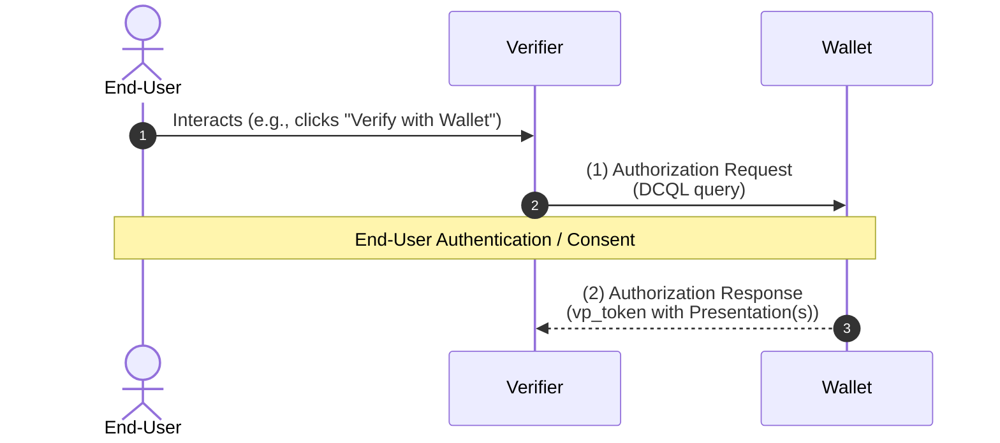
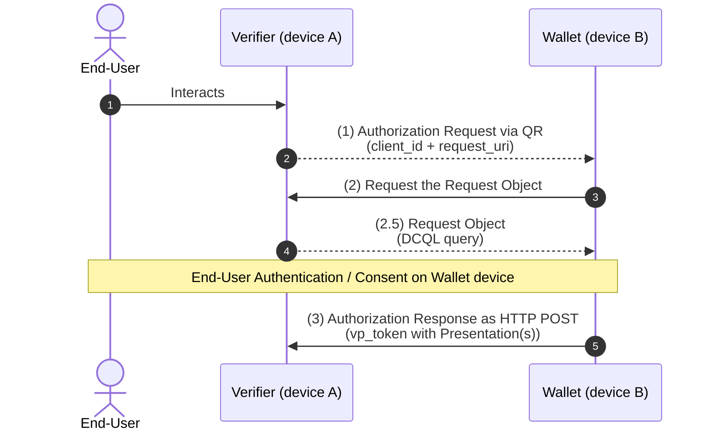
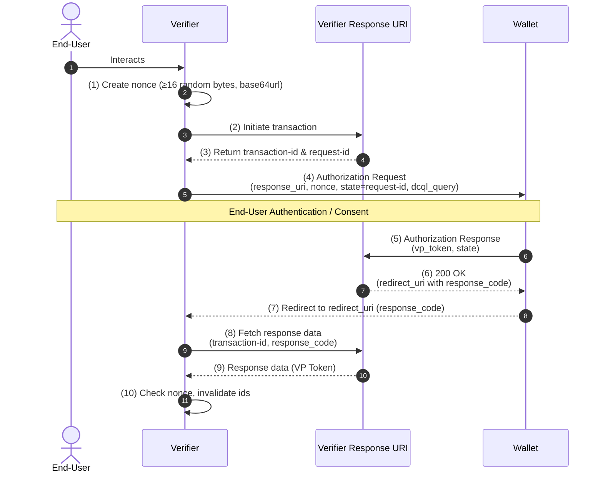

Source URL: https://raw.githubusercontent.com/forkimenjeckayang/Documentations/oid4vp/OID4VP/final-1.0.md
Title: OID4VP Final Version 1.0

# OID4VP Final Version 1.0

## 1. Introduction

OpenID for Verifiable Presentations (OID4VP) defines a mechanism on top of OAuth 2.0 [RFC6749] for requesting and delivering **Presentations of Credentials**. Credentials and Presentations can be of any format, including — but not limited to — W3C Verifiable Credentials Data Model (VC Data Model), ISO mdoc (ISO/IEC 18013-5), and IETF SD-JWT VC.

OAuth 2.0 was chosen as the base protocol because it provides proven, widely deployed security rails for authorization. Building credential presentation on top of OAuth lets implementers support — in a single protocol interface — both Credential Presentation and the issuance of OAuth 2.0 Access Tokens for API access. Existing OpenID Connect deployments can extend their systems with OID4VP to add Credential Presentation without rebuilding their authorization infrastructure.

OID4VP can also be combined with **SIOPv2** for cases where OpenID Connect features are needed (such as issuance of Self-Issued ID Tokens).

Additionally, this specification defines how to use OpenID4VP over the **W3C Digital Credentials API (DC API)**. All requirements for that integration are contained in **Appendix A**, which is self-contained: implementers focused only on OID4VP over the DC API can read Appendix A exclusively and ignore the rest of the specification, except where Appendix A explicitly references other sections.

### What it supports

- It is format-agnostic: Credentials and Presentations can use multiple formats, including:
  - W3C Verifiable Credentials Data Model (VC Data Model)
  - ISO mdoc (ISO/IEC 18013-5)
  - IETF SD-JWT VC

### Why OAuth 2.0 is the base

- OID4VP is built on OAuth 2.0 because OAuth already provides secure, widely implemented protocol rails.
- This allows implementers to support, through one interface:
  - credential presentation, and
  - traditional OAuth access token issuance for API access based on credentials in a wallet.

### Relationship with OpenID Connect and SIOPv2

- Existing OpenID Connect deployments can extend their systems with OID4VP to carry Credential Presentations.
- OID4VP can be combined with SIOPv2 when OpenID-specific features are needed, such as issuing Self-Issued ID Tokens.

### Use with Digital Credentials API (DC API)

- The spec also defines how OID4VP works with the W3C Digital Credentials API.
- Requirements for this integration are in **Appendix A**.
- Appendix A is designed to be self-contained: implementers focused only on OID4VP over DC API can follow Appendix A and ignore other sections unless Appendix A explicitly points to them.

## 1.3 Requirements Notation and Conventions

Normative keywords are interpreted using **BCP 14**:

- RFC2119
- RFC8174

These keywords have their normative force only when written in all capitals:

- **MUST**
- **MUST NOT**
- **REQUIRED**
- **SHALL**
- **SHALL NOT**
- **SHOULD**
- **SHOULD NOT**
- **RECOMMENDED**
- **NOT RECOMMENDED**
- **MAY**
- **OPTIONAL**

Implementation reference:

- Treat lowercase uses of these words as ordinary English, not protocol requirements.
- Preserve the difference between mandatory behavior (`MUST`, `REQUIRED`, `SHALL`), prohibited behavior (`MUST NOT`, `SHALL NOT`), recommendations (`SHOULD`, `RECOMMENDED`), and optional behavior (`MAY`, `OPTIONAL`) when converting this document into tasks.

## 2. Terminology

This specification reuses standard OAuth 2.0 and OpenID Connect terminology where applicable. Terms from other specifications are used as defined in those specifications unless this specification explicitly overrides the definition.

**Base64url-encoded** means URL-safe base64 encoding without padding, as defined in RFC7515 Section 2.

This spec reuses terminology from:

- OAuth 2.0 (RFC6749): e.g., Access Token, Authorization Request, Authorization Response, Client, Client Authentication, Client Identifier, Grant Type, Response Type, Token Request, Token Response.
- OpenID Connect Core: End-User, Entity.
- RFC9101: Request Object, Request URI.
- RFC7519: JWT.
- RFC7515: JSON Web Signature (JWS), JOSE Header, and Base64url encoding.
- RFC7516: JWE.
- OAuth 2.0 Multiple Response Type Encoding Practices: Response Mode.

If a term conflicts with another spec, the definition in this OID4VP spec takes precedence.

**Base64url-encoded** means URL-safe base64 encoding without padding, as defined in RFC7515 Section 2.

### Core OID4VP terms

- **Biometrics-based Holder Binding**: The Holder proves legitimate possession of a Credential by demonstrating a biometric trait (e.g., fingerprint or face). Example: a mobile driving licence (ISO 18013-5) contains a portrait of the Holder. Biometric verification is performed by the presentation reader, not by the Wallet.

- **Claims-based Holder Binding**: The Holder proves legitimate possession by presenting claims (e.g., name and date of birth) — often via another Credential. Because it does not depend on device key material, it supports long-term and cross-device use. Example: a diploma credential verified by matching claimed identity attributes.

- **Credential**: One or more claims about a subject made by a Credential Issuer. In this specification, Credentials are usually Verifiable Credentials. **Note:** the meaning of "Credential" here differs from its meaning in OpenID Connect Core.

- **Credential Format Identifier**: A string identifier for a specific Credential Format within OID4VP. It implies the use of format-specific parameters at all relevant protocol extension points.

- **Credential Issuer (Issuer)**: An entity that issues Credentials.

- **Cryptographic Holder Binding**: The Holder proves legitimate possession by demonstrating control of the same private key used at Credential issuance and presentation. The mechanism depends on the Credential Format — for example, in `jwt_vc_json`, the Credential contains a public key or reference to a public key that must match the Holder's private key.

- **Digital Credentials API (DC API)**: The W3C Digital Credentials API [W3C.Digital_Credentials_API] on the web platform and equivalent native APIs on app platforms (e.g., Android Credential Manager). Provides a platform-mediated channel for Wallet invocation and credential exchange.

- **Holder**: An entity that receives Credentials and controls them, presenting them to Verifiers as Presentations.

- **Holder Binding / Key Binding**: Any method by which the Holder proves legitimate possession of a Credential.

- **Issuer-Holder-Verifier Model**: A claims exchange model where Credentials are issued independently from being presented. An issued Credential may be used in many presentation sessions with different Verifiers.

- **Origin**: A platform-asserted identifier for the calling website or native application. A **web origin** is the combination of scheme, host, and port (with the default port omitted): e.g., `https://verify.example.com`. A **native app origin** may be the linked web origin or a platform-specific URI (e.g., `platform:pkg-key-hash:...` on some platforms).

- **Presentation**: Data derived from a Credential and presented to a specific Verifier. In this specification, Presentations are usually Verifiable Presentations with Holder Binding, but may also be Presentations without Holder Binding (Section 5.3).

- **VP Token**: An artifact returned as a response to an Authorization Request containing one or more Presentations. Structure defined in Section 8.1.

- **Verifier**: An entity that requests, receives, and validates Presentations. The Verifier is a specific type of OAuth 2.0 Client — analogous to a Relying Party (RP) in OpenID Connect.

- **Verifiable Credential (VC)**: An Issuer-signed Credential whose authenticity can be cryptographically verified. Format-agnostic — includes VCDM, mdoc, SD-JWT VC, etc.

- **Verifiable Presentation (VP)**: A Presentation that includes a cryptographic proof of Holder Binding. Format-agnostic — includes VCDM, mdoc, SD-JWT VC, etc.

- **Wallet**: An entity used by the Holder to receive, store, present, and manage Credentials and key material. There is no single deployment model: Credentials and keys may be stored locally, in a remote self-hosted service, or in a remote third-party service.

## 3. Overview

OID4VP defines a mechanism to request and present Credentials. The protocol has two transport models:

1. **OAuth-style baseline**: HTTPS messages and redirects as defined in OAuth 2.0.
2. **DC API model**: OID4VP messages are sent and received through the Digital Credentials API instead of HTTPS redirects.

### Primary Extension: `vp_token`

The main protocol addition is the new response type **`vp_token`**, which allows a Verifier to request and receive Verifiable Presentations and Presentations in a **VP Token** container. A VP Token contains one or more Verifiable Presentations and/or Presentations, potentially in different Credential formats.

Consequently, the result of an OID4VP interaction is one or more Presentations (not an OAuth Access Token). The Verifier receives signed Credential data rather than permission to call an API.

OID4VP is **format-agnostic**: it supports any Credential format used in the Issuer-Holder-Verifier Model, including VCDM, mdoc, and SD-JWT VC. Credentials of multiple formats can be presented in the same transaction. The main spec uses W3C VC examples; Appendix B gives examples for other formats.

### Response Delivery Flexibility

Responses can be returned via:
- **Redirect** — the default, suitable for same-device flows.
- **HTTP POST** (`direct_post`) — for cross-device flows or when the response is too large for a redirect URL.

### Profiling Requirement

OID4VP is a **framework** and requires **profiling** to achieve interoperability. A profile must define:
- which optional features are mandatory (e.g., response encryption),
- which parameter values are permitted (e.g., Credential Format Identifiers), and
- any extensions for new capabilities.

## 3.1 Same-Device Flow

In this flow, the End-User interacts with the Verifier on the **same device** where the Wallet is installed. The exchange uses HTTP redirects between the Verifier and the Wallet. When `response_mode=fragment` (the default for `vp_token`), the returned Presentations are carried in the **fragment** of the redirect URI.

> **Note:** The diagram is simplified and does not illustrate every optional feature.



### Step (1): Authorization Request (Verifier → Wallet)

- The Verifier sends an Authorization Request containing a **DCQL** query (Section 6).
- DCQL expresses what the Verifier needs, for example:
  - credential type(s),
  - accepted format(s),
  - and specific claims (including selective-disclosure needs).
- The Wallet evaluates available credentials against this request.
- The Wallet authenticates the End-User and collects consent for what will be presented.

### Step (2): Authorization Response (Wallet → Verifier)

- The Wallet prepares the Presentation(s) for the credentials the End-User approved.
- The Wallet returns an Authorization Response to the Verifier.
- The resulting Presentations are delivered in the **`vp_token`** parameter.

## 3.2 Cross-Device Flow

In this flow, the End-User interacts with the Verifier on **device A** while the Wallet is on **device B** (e.g., a desktop browser + mobile Wallet). The flow uses `response_type=vp_token` and `response_mode=direct_post`.

### Why `request_uri` is Used in Cross-Device Flows

To keep the QR code small and to allow the Request Object to be signed (and optionally encrypted), the Authorization Request displayed in the QR code contains only the Client Identifier and a `request_uri` pointing to the full Request Object. The Wallet fetches the full Request Object via HTTP GET (or POST, if `request_uri_method=post` is used).

> **Note:** `request_uri` (per RFC9101) is **independent** of other extension choices and can also be used in same-device flows.

> **Note:** The diagram is simplified.



### Step (1): Initial Authorization Request (Verifier → Wallet)

- The Verifier sends an Authorization Request pointing to a `request_uri` where the full Request Object can be obtained.

### Step (2): Wallet fetches Request Object (Wallet → Verifier)

- The Wallet sends an HTTP GET (or POST, per Section 5.10) to the `request_uri`.

### Step (2.5): Request Object returned (Verifier → Wallet)

- The Verifier returns the Request Object with Authorization Request parameters.
- The Request Object includes a **DCQL** query describing the requested credential requirements (types, formats, specific claims, selective-disclosure needs).
- The Wallet checks available credentials, authenticates the End-User, and gathers consent.

### Step (3): Authorization Response via direct POST (Wallet → Verifier)

- The Wallet prepares Presentations for credentials approved by the End-User.
- The Wallet sends the Authorization Response to the Verifier via **HTTP POST**.
- The Presentations are carried in **`vp_token`**.

## 4. Scope

OID4VP extends OAuth 2.0 with the following new capabilities for Credential Presentation:

- **DCQL (Digital Credentials Query Language)**: A new JSON query language enabling Verifiers to request specific Credentials, formats, and claim combinations in a flexible, interoperable way (Section 6).
- **`dcql_query` Authorization Request parameter**: Carries the JSON-encoded DCQL query in the Authorization Request (Section 5).
- **`vp_token` response parameter**: Returns Presentations — with or without Holder Binding — in the Authorization or Token Response, depending on `response_type` (Section 8).
- **New response types**: `vp_token` (Presentations only) and `vp_token id_token` (Presentations alongside a Self-Issued ID Token from SIOPv2).
- **New response mode `direct_post`**: Sends the Authorization Response via HTTPS POST to a Verifier-controlled endpoint, supporting cross-device flows and large responses that would not fit in a redirect URL (Section 8.2).
- **Client Identifier Prefix concept**: Enables deployments to use mechanisms beyond RFC6749 scope (e.g., X.509 certificates, DIDs, federation) to obtain and validate Verifier metadata (Section 5.9).
- **OID4VP over Digital Credentials API**: Defined in Appendix A.
- **Composability**: Credential Presentation can be combined with End-User authentication (SIOPv2) and OAuth 2.0 Access Token issuance in a single protocol interaction.

## 5. Authorization Request

The Authorization Request follows the definition in OAuth 2.0 [RFC6749], taking into account the recommendations of [RFC9700] where applicable.

### Request Objects (JAR)

The Verifier **MAY** send the Authorization Request as a **JAR Request Object** (by value or by reference), as defined in [RFC9101]. Request Objects **MUST** have a JOSE header `typ` of `oauth-authz-req+jwt`. The Wallet **MUST NOT** process a Request Object where `typ` is absent or has any other value.

The `client_id` claim is required by this specification. For backward compatibility with existing JAR implementations, the `iss` claim **MAY** appear in the Request Object — but if it does, the Wallet **MUST** ignore it.

### Capability Negotiation via `request_uri_method=post`

This specification introduces a mechanism for the Wallet to share its technical capabilities with the Verifier before the Verifier generates the full Request Object. The Verifier signals this feature by setting `request_uri_method=post` in the Authorization Request. A supporting Wallet **MAY** then POST its capabilities (as `wallet_metadata`) to the `request_uri` endpoint, enabling the Verifier to tailor the Request Object accordingly. Wallets that do not support this feature simply perform a GET to the `request_uri` as usual.

### Credential Request Expression

The Verifier articulates the requirements for the requested Credential(s) using the `dcql_query` parameter. Wallet implementations **MUST** process the DCQL query and select candidate Credential(s) using the evaluation process described in Section 6.4.

### Client Identifier Prefix

The Verifier communicates a **Client Identifier Prefix** in the `client_id` parameter to indicate how the Wallet should interpret the Client Identifier and associated metadata. This enables deployment-specific mechanisms (e.g., X.509, DID, federation) beyond the scope of [RFC6749]. Depending on the prefix, the Verifier may be required to sign the Authorization Request and/or provide additional parameters for the Wallet to process. The Verifier can communicate its metadata using the `client_metadata` parameter.

### Unrecognized Parameters

Additional request parameters **MAY** be defined per RFC6749 extensibility rules. The Wallet **MUST** ignore any unrecognized parameters, **except** `transaction_data` — Wallets that do not support `transaction_data` **MUST** reject requests that contain it.

## 5.1 New Parameters (Simplified)

### `dcql_query`

- JSON object containing a DCQL query (Section 6).
- Exactly one of the following must be used:
  - `dcql_query`, or
  - `scope` representing a DCQL query.
- They **MUST NOT** both be present in the same Authorization Request.
- In `application/x-www-form-urlencoded` requests, object parameters are transmitted as JSON-serialized strings.

### `client_metadata` (OPTIONAL)

- UTF-8 JSON object with Verifier metadata.
- Supported metadata fields:
  - `jwks` (OPTIONAL): JWK Set (RFC7591) with public keys for purposes such as response encryption key agreement or VP generation needs.
    - May contain ephemeral request-specific keys.
    - Keys here **MUST NOT** be used to verify signatures of signed Authorization Requests.
    - Each JWK **MUST** include a unique `kid` within the request context.
  - `encrypted_response_enc_values_supported` (OPTIONAL): non-empty list of JWE `enc` algorithms for response encryption.
    - If response mode requires encrypted responses (e.g., `dc_api.jwt`, `direct_post.jwt`), this parameter **MUST** be present unless default `A128GCM` is the only value used.
    - Otherwise it **SHOULD** be absent.
  - `vp_formats_supported` (REQUIRED when not otherwise available): as defined in Section 11.1.
- If Wallet has authoritative client data from other trusted sources (for example federation statements), that authoritative data takes precedence over `client_metadata`.
- Other metadata keys **MUST** be ignored unless a profile explicitly allows them in `client_metadata`.

### `request_uri_method` (OPTIONAL)

- String controlling how Wallet fetches `request_uri`.
- Valid values (case-sensitive): `get`, `post`.
  - `get`: Wallet **MUST** fetch Request Object using HTTP GET (RFC9101 behavior).
  - `post`: supporting Wallet **MUST** use HTTP POST as defined in Section 5.10.
- If missing, Wallet **MUST** process `request_uri` per RFC9101 default behavior.
- Wallets without POST support will use GET.
- `request_uri_method` **MUST NOT** be present if `request_uri` is absent.
- If Verifier sets `request_uri_method=post` and has no other way to share capabilities, it **SHOULD** include `client_metadata` so Wallet can send only relevant `wallet_metadata` in the Request URI POST flow.

### `transaction_data` (OPTIONAL)

- Non-empty array of strings.
- Each string is a base64url-encoded JSON object representing typed transaction details to be authorized by End-User (Section 8.4).
- Wallet **MUST** return error if any transaction item:
  - has an unrecognized `type`, or
  - does not conform to that type's definition.
- Common fields for each decoded transaction object:
  - `type` (REQUIRED): transaction data type identifier.
    - Specific type values are out of scope here.
    - Collision-resistant type naming is RECOMMENDED.
  - `credential_ids` (REQUIRED): non-empty array of DCQL credential query IDs that may authorize this transaction.
    - If multiple IDs are listed, Wallet **MUST** use only one referenced credential for transaction authorization.
- Type-specific documents define what credentials can authorize a given transaction type.
- How issuers express credential authorization capability is out of scope.

Non-normative decoded example:

```json
{
  "type": "example_type",
  "credential_ids": ["id_card_credential"]
}
```

### `verifier_info` (OPTIONAL)

- Non-empty array of attestations about the Verifier relevant to credential request evaluation.
- Intended uses: support authorization decisions, wallet policy enforcement, and richer consent UX.
- Each entry contains:
  - `format` (REQUIRED): format identifier defining attestation encoding/processing rules (collision-resistant values are recommended).
  - `data` (REQUIRED): object or string containing attestation content (e.g., JWT); schema is format-specific.
  - `credential_ids` (OPTIONAL): non-empty array of DCQL credential query IDs this attestation applies to; if omitted, applies to all requested credentials.
- Wallet decides whether to use `verifier_info` based on trust frameworks, issuer/ecosystem policies, and profile rules.
- If Wallet uses it, Wallet **MUST** validate signatures and verify binding.
- See Section 5.11 for more details.

Non-normative example:

```json
{
  "format": "jwt",
  "data": "eyJhbGciOiJFUzI1...EF0RBtvPClL71TWHlIQ",
  "credential_ids": ["id_card"]
}
```

## 5.2 Existing Parameters (Simplified)

OID4VP reuses standard Authorization Request parameters, with additional rules:

### `nonce`

- **REQUIRED**.
- Used to securely bind returned Verifiable Presentation(s) to this specific transaction.
- Verifier **MUST**:
  - generate a fresh, cryptographically random nonce with sufficient entropy for each Authorization Request,
  - store it with the current session,
  - send it in the Authorization Request.
- Allowed characters are ASCII URL-safe only:
  - uppercase/lowercase letters,
  - digits,
  - `-`, `.`, `_`, `~`.
- See Section 14.1 for details.

### `scope`

- **OPTIONAL** (RFC6749).
- Wallet MAY support requesting presentations via predefined scope values.
- See Section 5.5 for profile behavior/details.

### `response_mode`

- **REQUIRED**.
- Defined by OAuth response-mode specs, with OID4VP-specific usage:
  - can request HTTPS push-style response delivery via `direct_post` (Section 8.2),
  - can request encrypted responses (Section 8.3).

### `client_id`

- **REQUIRED**.
- Uses RFC6749 semantics plus OID4VP requirements for Client Identifier Prefixes (Section 5.9).
- Client Identifier may be issued/defined by parties other than Wallet.
- Uniqueness is considered in combination of:
  - Client Identifier Prefix + Client Identifier.

### `state`

- **REQUIRED** only under conditions in Section 5.3; otherwise **OPTIONAL**.
- If used, value characters are limited to ASCII URL-safe set:
  - uppercase/lowercase letters,
  - digits,
  - `-`, `.`, `_`, `~`.

## 5.3 Requesting Presentations Without Holder Binding Proofs

The primary use case of this specification is to request Verifiable Presentations — Presentations with a cryptographic Holder Binding proof. However, there are legitimate cases where the Verifier wants Credentials without such a proof:

- Low-security Credentials that do not support Holder Binding (e.g., a cinema ticket or coupon).
- Credentials whose binding is biometric rather than cryptographic.
- Credentials bound to claims (e.g., a diploma), where the Holder proves possession by asserting matching identity claims.
- Credentials that support Holder Binding, but where the Verifier does not require it for the specific use case.

A Verifier that accepts a Presentation without a Holder Binding proof **accepts replay risk** — the presented Credential may have been obtained from a legitimate Holder and replayed by an attacker. See Section 14.1 for security considerations.

To request a Credential without a Holder Binding proof, the Verifier sets `require_cryptographic_holder_binding=false` in the DCQL Credential Query (Section 6 and Appendix B).

### Maintaining Request-Response Binding Without Holder Binding

In normal flows, the `nonce` is embedded in the Holder Binding proof, cryptographically linking the presentation to the specific request. When no Holder Binding proof is returned, this link is absent. To maintain correlation between request and response, the Verifier **MUST** (unless the Digital Credentials API is used):

- Include a `state` parameter in the Authorization Request (per RFC6749 §4.1.1).
- Ensure `state` is a cryptographically strong pseudo-random value with **at least 128 bits of entropy**.
- Generate a fresh `state` value for each Authorization Request.
- Store `state` in the Verifier's session.
- Verify that the same `state` value is returned in the Authorization Response.

The Digital Credentials API uses internal platform mechanisms to maintain request/response binding, so `state` is not required in that context. For `direct_post` response mode, also see Section 14.3.

## 5.4 Examples (Simplified)

The Verifier MAY send an Authorization Request in **three** ways:

1. **URL with encoded parameters** (no JAR).
2. **Request Object by value** (JAR `request` parameter, per [RFC9101]).
3. **Request Object by reference** (JAR `request_uri` parameter, per [RFC9101]) — optionally with `request_uri_method=post` for capability negotiation.

All examples below are **non-normative**.

### Example 1 — URL with encoded parameters

Note that `client_id` carries the `redirect_uri` Client Identifier Prefix:

```http
GET /authorize?
  response_type=vp_token
  &client_id=redirect_uri%3Ahttps%3A%2F%2Fclient.example.org%2Fcb
  &redirect_uri=https%3A%2F%2Fclient.example.org%2Fcb
  &dcql_query=...
  &transaction_data=...
  &nonce=n-0S6_WzA2Mj HTTP/1.1
```

### Example 2 — Request Object passed by value

The Authorization Request URL carries a signed, base64url-encoded Request Object in the `request` parameter:

```http
GET /authorize?
  client_id=redirect_uri%3Ahttps%3A%2F%2Fclient.example.org%2Fcb
  &request=eyJrd...
```

Decoded Request Object payload (signed with RS256 in this example):

```json
{
  "iss": "redirect_uri:https://client.example.org/cb",
  "aud": "https://self-issued.me/v2",
  "response_type": "vp_token",
  "client_id": "redirect_uri:https://client.example.org/cb",
  "redirect_uri": "https://client.example.org/cb",
  "dcql_query": {
    "credentials": [
      {
        "id": "some_identity_credential",
        "format": "dc+sd-jwt",
        "meta": {
          "vct_values": ["https://credentials.example.com/identity_credential"]
        },
        "claims": [{ "path": ["last_name"] }, { "path": ["first_name"] }]
      }
    ]
  },
  "nonce": "n-0S6_WzA2Mj"
}
```

### Example 3 — Request Object passed by reference (with `request_uri_method=post`)

The Authorization Request only carries `client_id`, `request_uri`, and `request_uri_method`:

```http
GET /authorize?
  client_id=x509_san_dns%3Aclient.example.org
  &request_uri=https%3A%2F%2Fclient.example.org%2Frequest%2Fvapof4ql2i7m41m68uep
  &request_uri_method=post HTTP/1.1
```

To retrieve the actual Request Object, the Wallet sends an HTTP POST to `request_uri` carrying its own capabilities so the Verifier can tailor the Request Object:

```http
POST /request/vapof4ql2i7m41m68uep HTTP/1.1
Host: client.example.org
Content-Type: application/x-www-form-urlencoded

wallet_metadata=%7B%22vp_formats_supported%22%3A%7B%22dc%2Bsd-jwt%22%3A%7B%22sd-jwt_alg_values%22%3A%5B%22ES256%22%5D%2C%22kb-jwt_alg_values%22%3A%5B%22ES256%22%5D%7D%7D%7D&wallet_nonce=qPmxiNFCR3QTm19POc8u
```

Decoded Wallet POST body (URL-decoded):

```json
{
  "wallet_metadata": {
    "vp_formats_supported": {
      "dc+sd-jwt": {
        "sd-jwt_alg_values": ["ES256"],
        "kb-jwt_alg_values": ["ES256"]
      }
    }
  },
  "wallet_nonce": "qPmxiNFCR3QTm19POc8u"
}
```

> See **Section 5.10** for full rules on the Request URI POST flow.

## 5.5 Using `scope` to Request Presentations

Wallets **MAY** support requesting Presentations via OAuth 2.0 `scope` values as an alternative to an explicit `dcql_query`. Each such scope value **MUST** be an alias for a well-defined DCQL query.

When multiple scope values are used together, the DCQL queries they map to are effectively combined. Therefore, the Credential identifiers (Section 6.1) and claim identifiers (Section 6.3) within the combined DCQL queries **MUST** be unique across all scope-mapped queries — to avoid identifier collisions and allow the Verifier to unambiguously identify requested Credentials in the response.

The specific scope values and their DCQL mappings are out of scope for this specification. Ecosystems may define them through profile specifications or via machine-readable Wallet metadata. Collision-resistant scope values are **RECOMMENDED** (e.g., using a reverse-domain prefix).

**Example — scope-based Authorization Request:**

The scope value `com.example.healthCardCredential_presentation` is a pre-agreed alias for a DCQL query. No explicit `dcql_query` parameter is needed:

```http
GET /authorize?
  response_type=vp_token
  &client_id=https%3A%2F%2Fclient.example.org%2Fcb
  &redirect_uri=https%3A%2F%2Fclient.example.org%2Fcb
  &scope=com.example.healthCardCredential_presentation
  &nonce=n-0S6_WzA2Mj HTTP/1.1
```

## 5.6 Response Type `vp_token`

This specification defines the Response Type **`vp_token`**. When used in an Authorization Request, a successful Authorization Response **MUST** include a `vp_token` parameter containing the Verifiable Presentation(s). The Wallet **SHOULD NOT** return an OAuth Authorization Code, Access Token, or Access Token Type alongside `vp_token` in a successful response.

The **default response mode** for `vp_token` is `fragment` — Authorization Response parameters are encoded in the URI fragment when redirecting back to the Verifier. `vp_token` can also be used with other response modes (e.g., `direct_post`). Both successful and error responses **SHOULD** use the supplied response mode, or the default if none is specified.

See Section 8 for how `response_type` determines exactly where and how the VP Token is returned.

## 5.7 Passing Authorization Requests Across Devices

When the Authorization Request is displayed on one device and the Wallet/Credentials are on another device, the request is typically transferred via **QR code**. Using `request_uri` in combination with `response_mode=direct_post` is **RECOMMENDED** for this scenario: the QR code only encodes the `client_id` and `request_uri`, keeping the payload small and allowing the full Request Object to be signed and optionally encrypted.

## 5.8 `aud` of a Request Object

When the Verifier sends a JAR Request Object [RFC9101], the value of the `aud` claim depends on the discovery mechanism used:

- **Dynamic Discovery**: `aud` **MUST** equal the Wallet's `iss` (issuer) value.
- **Static Discovery metadata**: `aud` **MUST** be `"https://self-issued.me/v2"`.

> **Note:** `"https://self-issued.me/v2"` is a symbolic string used as an `aud` value even when SIOPv2 is not in use.

## 5.9 Client Identifier Prefix and Verifier Metadata Management

OID4VP introduces the concept of a **Client Identifier Prefix** — a string that dictates how the Wallet should interpret the `client_id` value and the associated metadata in the process of Client identification, authentication, and authorization.

The purpose is to enable deployments to use mechanisms beyond the scope of RFC6749 — such as X.509 certificates, Decentralized Identifiers, or OpenID Federation — for obtaining and validating Verifier metadata. The term "Client Identifier Prefix" is used because the Verifier acts as an OAuth 2.0 Client in this protocol.

The Verifier **MAY** include a Client Identifier Prefix in `client_id`. If no prefix is provided, the fallback is pre-registered client behavior as in RFC6749. A specific prefix may require the Verifier to sign the Authorization Request and/or pass additional parameters that the Wallet must process.

## 5.9.1 Syntax (Simplified)

Client Identifier Prefix syntax is:

`<client_id_prefix>:<orig_client_id>`

- `<client_id_prefix>` = prefix defining interpretation/auth rules.
- `<orig_client_id>` = client identifier within that prefix namespace.

### Parsing and interpretation rules

- Wallet **MUST** inspect `client_id` for a `:` character.
- If `:` exists and text before it is a recognized/supported prefix, Wallet **MUST** process `client_id` under that prefix's rules.
- Prefix is the substring before the **first** `:`.
- Implementations should not assume the whole value is a valid URI just because `:` exists.
- Parsing must follow the rules defined for the selected prefix type (Section 5.9.3).

### Example behavior

- `client_id=verifier_attestation:example-client`
  - Prefix: `verifier_attestation`
  - Client identifier in that namespace: `example-client`
- The **full** string (`verifier_attestation:example-client`) is used as client identifier throughout OAuth flow, including as audience/intended receiver where applicable.

### Operational note

- Verifier should know which Client Identifier Prefixes a Wallet supports before sending request, so it can choose a supported prefix.

### Metadata note

- Depending on prefix rules, Verifier can include `client_metadata` JSON with name/value pairs.

## 5.9.2 Fallback (Simplified)

### No prefix present

- If `client_id` has no `:` character, Wallet **MUST** treat it as a pre-registered client (RFC6749 default model).
- So client must be known to Wallet before request.
- Verifier metadata is obtained via RFC7591 mechanisms or out-of-band means.

Example intent:

- `client_id=example-client` -> interpreted as pre-registered client.

### Unknown prefix-like value

- If `:` is present but text before it is not a recognized/supported prefix:
  - Wallet may treat it as pre-registered client, or
  - Wallet may reject the request.

### Naming constraint for pre-registered clients

- Pre-registered client IDs **MUST NOT** begin with a supported Client Identifier Prefix followed immediately by `:`.

## 5.9.3 Defined Client Identifier Prefixes (Simplified)

This spec defines these prefixes and processing rules.

Important DC API note:

- In OpenID4VP over DC API (Appendix A), Wallet may decide whether to enforce Request Object signature validation according to a prefix's normal rules, based on trust framework/policies/profile choices.

### `redirect_uri`

- Meaning: value after the prefix **is** the Verifier's Redirect URI (or Response URI for `direct_post`).
- Verifier **MAY** omit the explicit `redirect_uri` parameter (or `response_uri` in `direct_post`) because it is already encoded in `client_id`.
- All Verifier metadata **MUST** be provided via the `client_metadata` parameter.
- Requests using this prefix **cannot be signed in a trustable way** — there is no method for the Wallet to obtain a trusted key for verification. Deployments requiring signed requests cannot use this prefix.
- Example Client Identifier: `redirect_uri:https://client.example.org/cb`.

#### Non-normative example — unsigned request with `redirect_uri` prefix

(Line breaks in `client_metadata` for readability.)

```http
HTTP/1.1 302 Found
Location: https://wallet.example.org/universal-link?
  response_type=vp_token
  &client_id=redirect_uri%3Ahttps%3A%2F%2Fclient.example.org%2Fcb
  &redirect_uri=https%3A%2F%2Fclient.example.org%2Fcb
  &dcql_query=...
  &nonce=n-0S6_WzA2Mj
  &client_metadata=%7B%22vp_formats_supported%22%3A%7B%22dc%2Bsd-jwt%22%3A%7B%22sd-jwt_alg_values%22%3A%5B%22ES256%22%5D%2C%22kb-jwt_alg_values%22%3A%5B%22ES256%22%5D%7D%7D%7D
```

Decoded `client_metadata`:

```json
{
  "vp_formats_supported": {
    "dc+sd-jwt": {
      "sd-jwt_alg_values": ["ES256"],
      "kb-jwt_alg_values": ["ES256"]
    }
  }
}
```

### `openid_federation`

- Meaning: value after prefix is OpenID Federation Entity Identifier.
- Wallet **MUST** apply OpenID Federation processing rules.
- Request MAY include `trust_chain`.
- Example Client Identifier: `openid_federation:https://federation-verifier.example.com`.
- Final Verifier metadata comes from trust chain after policy application.
- `client_metadata`, if present, **MUST** be ignored with this prefix.

### `decentralized_identifier`

- Meaning: value after the prefix is a Decentralized Identifier per [DID-Core].
- Request **MUST** be signed with a private key associated with the DID.
- Wallet **MUST** obtain the verification key from the DID Document `verificationMethod` property.
- Since a DID Document may include multiple keys, the JOSE header `kid` **MUST** identify the specific key used to sign the request.
- Wallet **MUST** resolve the DID using DID Resolution defined by the DID method.
- All Verifier metadata other than the public key **MUST** come from `client_metadata`.
- Example Client Identifier: `decentralized_identifier:did:example:123`.

#### Non-normative example — signed Request Object with `decentralized_identifier` prefix

JOSE header:

```json
{
  "typ": "oauth-authz-req+jwt",
  "alg": "RS256",
  "kid": "did:example:123#1"
}
```

JWT payload:

```json
{
  "client_id": "decentralized_identifier:did:example:123",
  "response_type": "vp_token",
  "redirect_uri": "https://client.example.org/callback",
  "nonce": "n-0S6_WzA2Mj",
  "dcql_query": { "...": "..." },
  "client_metadata": {
    "vp_formats_supported": {
      "dc+sd-jwt": {
        "sd-jwt_alg_values": ["ES256", "ES384"],
        "kb-jwt_alg_values": ["ES256", "ES384"]
      }
    }
  }
}
```

### `verifier_attestation`

- Verifier authenticates using attestation JWT bound to a public key (Section 12).
- Value after prefix **MUST** equal `sub` claim in Verifier Attestation JWT.
- Request **MUST** be signed by private key corresponding to key in attestation JWT `cnf`.
- Verifier attestation JWT **MUST** be included in Request Object JOSE header `jwt`.
- Wallet **MUST** validate attestation JWT signature.
- Attestation JWT `iss` **MUST** identify a trusted attestation issuer; if trust cannot be established, Wallet **MUST** reject.
- If attestation includes `redirect_uris`, Wallet **MUST** require exact match of request `redirect_uri` with one listed value.
- Verifier metadata other than public key **MUST** come from `client_metadata`.
- Example Client Identifier: `verifier_attestation:verifier.example`.

### `x509_san_dns`

- Value after prefix **MUST** be DNS name.
- That DNS name **MUST** match a `dNSName` SAN in leaf certificate sent with request.
- Request **MUST** be signed with private key matching leaf cert public key.
- Certificate chain is supplied via JOSE header `x5c`.
- Wallet **MUST** validate request signature and X.509 trust chain.
- Verifier metadata other than public key **MUST** come from `client_metadata`.
- Unless using DC API:
  - if Wallet trusts authenticated client identifier (e.g., trusted list), it may allow flexible `redirect_uri`;
  - otherwise FQDN of `redirect_uri` **MUST** match DNS name in client ID (without prefix).
- Example Client Identifier: `x509_san_dns:client.example.org`.

### `x509_hash`

- Value after prefix **MUST** be hash of leaf certificate sent with request.
- Request **MUST** be signed with private key matching leaf cert public key.
- Certificate chain is supplied in JOSE header `x5c`.
- `x509_hash` value = base64url-encoded SHA-256 hash of DER-encoded leaf certificate.
- Wallet **MUST** validate request signature and X.509 trust chain.
- Verifier metadata other than public key **MUST** come from `client_metadata`.
- Example Client Identifier: `x509_hash:Uvo3HtuIxuhC92rShpgqcT3YXwrqRxWEviRiA0OZszk`.

### `origin` (reserved)

- Defined in Appendix A.2.
- Wallet **MUST NOT** accept this prefix in requests.
- In OpenID4VP over DC API, presentation audience is always `origin:<origin-value>` (example: `origin:https://verifier.example.com/`).

### Key management requirement

- Prefixes `openid_federation`, `decentralized_identifier`, `verifier_attestation`, `x509_san_dns`, and `x509_hash` require Verifier capability to securely store private keys.
- This can affect native-app architectures, since such apps are often public clients.

### Extensibility

- Other specs may define additional prefixes.
- Collision-resistant prefix names are RECOMMENDED.

## 5.10 Request URI Method `post` (Simplified)

This section defines how Wallet calls the Verifier's Request URI endpoint when `request_uri_method=post` is used.

### HTTP requirements

- Request **MUST** use HTTP `POST`.
- Scheme **MUST** be `https`.
- `Content-Type` **MUST** be `application/x-www-form-urlencoded`.
- `Accept` header **MUST** be `application/oauth-authz-req+jwt`.
- Body names/values **MUST** be UTF-8 encoded.

### Defined request parameters to Request URI endpoint

- `wallet_metadata` (OPTIONAL):
  - string containing JSON object with wallet metadata parameters (Section 10).
- `wallet_nonce` (OPTIONAL):
  - value used to mitigate replay of Authorization Request.
  - when present, Verifier **MUST** copy/use this value as `wallet_nonce` in signed Authorization Request Object.
  - value can be a fresh, high-entropy, cryptographically random value (base64url is suitable).

### Capability signaling guidance

- If Wallet requires encrypted Request Object, it **SHOULD** provide encryption public keys via `jwks` in `wallet_metadata`.
- If Wallet requires encrypted Authorization Response, it **SHOULD** provide supported encryption algorithms using:
  - `authorization_encryption_alg_values_supported`
  - `authorization_encryption_enc_values_supported`
- If current Client Identifier Prefix allows signed Request Objects, Wallet **SHOULD** include supported request signing algorithms via:
  - `request_object_signing_alg_values_supported`
- If prefix does **not** allow signed Request Objects, Wallet **MUST NOT** include `request_object_signing_alg_values_supported`.

### Extensibility/robustness

- Additional parameters may be used.
- Verifier **MUST** ignore unknown parameters.

#### Non-normative example — Wallet → Verifier Request URI POST

```http
POST /request HTTP/1.1
Host: client.example.org
Content-Type: application/x-www-form-urlencoded
Accept: application/oauth-authz-req+jwt

wallet_metadata=%7B%22vp_formats_supported%22%3A%7B%22dc%2Bsd-jwt%22%3A%7B%22sd-jwt_alg_values%22%3A%5B%22ES256%22%5D%2C%22kb-jwt_alg_values%22%3A%5B%22ES256%22%5D%7D%7D%7D&wallet_nonce=qPmxiNFCR3QTm19POc8u
```

Decoded body (URL-decoded):

```json
{
  "wallet_metadata": {
    "vp_formats_supported": {
      "dc+sd-jwt": {
        "sd-jwt_alg_values": ["ES256"],
        "kb-jwt_alg_values": ["ES256"]
      }
    }
  },
  "wallet_nonce": "qPmxiNFCR3QTm19POc8u"
}
```

## 5.10.1 Request URI Response (Simplified)

### Response format requirements

- Verifier response from Request URI endpoint **MUST** be HTTP with:
  - `Content-Type: application/oauth-authz-req+jwt`
  - body containing signed (optionally encrypted) Request Object per RFC9101.
- Returned Request Object **MUST** satisfy Section 5 requirements.

### Wallet processing requirements

- Wallet **MUST** process Request Object per RFC9101.
- If Wallet sent `wallet_nonce` in POST request:
  - Request Object **MUST** contain matching `wallet_nonce` claim.
  - If missing or mismatched, Wallet **MUST** terminate processing.

### Parameter source and consistency rules

- Wallet **MUST** extract Authorization Request parameters from the Request Object.
- Wallet **MUST only** use parameters from that Request Object, even if same names were in outer Authorization Request query.
- `client_id` in outer Authorization Request parameter and `client_id` claim in Request Object **MUST** be identical (including prefix).
- If any of these checks fail, Wallet **MUST** terminate processing.

### Final validation

- After successful extraction/checks, Wallet validates request under OAuth 2.0 (RFC6749).

#### Non-normative example — decoded Request Object payload (echoing `wallet_nonce`)

```json
{
  "client_id": "x509_san_dns:client.example.org",
  "response_uri": "https://client.example.org/post",
  "response_type": "vp_token",
  "response_mode": "direct_post",
  "dcql_query": { "...": "..." },
  "nonce": "n-0S6_WzA2Mj",
  "wallet_nonce": "qPmxiNFCR3QTm19POc8u",
  "state": "eyJhb...6-sVA"
}
```

Notice that `wallet_nonce` matches the value the Wallet sent in the POST in Section 5.10. Verifier **MUST** echo this exact value; Wallet **MUST** reject a Request Object that does not contain it.

## 5.10.2 Request URI Error Response (Simplified)

- If Verifier returns any HTTP error response from Request URI endpoint, Wallet **MUST** terminate the process.

## 5.11 Verifier Info (Simplified)

`verifier_info` allows Verifier to include extra attested context/metadata in Authorization Request, typically backed by trusted third parties.

### Purpose

- Supports wallet policy decisions.
- Helps eligibility/authorization checks.
- Improves End-User consent UX with richer context.

### Structure and semantics

- Each Verifier Info object includes:
  - a type/format identifier,
  - associated data,
  - optional references to credential identifiers.
- Exact attestation semantics are profile/ecosystem-defined.

### Typical examples

- Registration certificate proving verifier is officially registered to request certain credentials.
- Signed policy statement (usage, retention, access rights, etc.).
- Domain-role confirmation (for example, regulated payment service provider status).

### Processing expectations

- `verifier_info` is optional.
- Wallet MAY use it for decisions or user messaging.
- Wallet SHOULD ignore unsupported/unrecognized Verifier Info types.

## 5.11.1 Proof of Possession (Simplified)

This specification supports two PoP models for verifier attestations:

### 1) Claim-bound attestations

- Attestation itself is not verifier-signed but is bound to verifier by claims.
- Binding mechanism depends on attestation type definition.
- Example: in JWT-based attestation, `sub` can reference certificate distinguished name used to sign request.
- Binding may also include `client_id`.

### 2) Key-bound attestations

- Verifier signs a proof-of-possession object using key contained in or related to attestation.
- To bind proof to current request, signature object should include request `nonce` and `client_id`.
- Attestation and its PoP must be carried together in attachment.

### Wallet validation rule

- If profile defines PoP validation requirements, Wallet **MUST** validate accordingly.
- Wallet must ignore or reject attachments that fail required validation.

## 5.12 Implementation Checklist for Sections 4-5

Use this checklist when implementing or reviewing OID4VP Authorization Request handling.

### Request construction by Verifier

- Choose exactly one credential request mechanism:
  - `dcql_query`, or
  - `scope` value that aliases a well-defined DCQL query.
- Always include `nonce` with fresh cryptographically random entropy and URL-safe ASCII characters only.
- Include `response_mode`; use `direct_post` for cross-device or large responses.
- For QR/cross-device requests, prefer `request_uri` plus `response_mode=direct_post` to keep QR payload small.
- If using JAR, set JOSE header `typ` to `oauth-authz-req+jwt`.
- If using `request_uri_method=post`, include `request_uri`; include `client_metadata` when Wallet needs Verifier capability data to tailor wallet capability disclosure.

### Request processing by Wallet

- Reject Request Objects missing `typ=oauth-authz-req+jwt`.
- Ignore `iss` in Request Object if present; use `client_id` as the required Client Identifier.
- Evaluate DCQL according to Section 6.4 to select candidate credentials.
- Ignore unrecognized request parameters except `transaction_data`.
- Reject unsupported or malformed `transaction_data` rather than silently ignoring it.
- If any requested Presentation lacks cryptographic holder binding and DC API is not used, require and validate `state` as a fresh high-entropy request/response binding value.

### Metadata and client identity

- Interpret `client_id` using the Client Identifier Prefix before the first colon when the prefix is recognized and supported.
- If no colon is present, treat the Client Identifier as a pre-registered OAuth client.
- If a colon is present but the prefix is unsupported, either treat as pre-registered or reject, according to local policy.
- Authoritative metadata obtained from federation, trust chains, registration, or out-of-band sources overrides `client_metadata`.
- `client_metadata.jwks` keys can be used for response encryption or VP generation needs, but not to verify signed Authorization Requests.

### Request URI POST flow

- Wallet POST to `request_uri` must use HTTPS, `application/x-www-form-urlencoded`, UTF-8 body encoding, and `Accept: application/oauth-authz-req+jwt`.
- If Wallet sends `wallet_nonce`, Verifier must echo it in the signed Request Object as `wallet_nonce`.
- Wallet must use only parameters from the returned Request Object, not duplicated outer query parameters.
- Outer `client_id` and Request Object `client_id` must match exactly, including prefix.
- Any HTTP error from the Request URI endpoint terminates processing.

## 6. Digital Credentials Query Language (DCQL)

DCQL is a JSON query language that the Verifier uses to express which Credentials it is requesting, in what formats, with which claims, and under which trust-framework conditions. The Wallet evaluates the DCQL query against the Credentials it holds and returns matching Presentations.

DCQL is designed to support **selective disclosure**: a Wallet should only reveal the minimum claims required to satisfy the query, and must never send selectively disclosable claims that the query did not request.

### DCQL Top-Level Object

A valid DCQL query is a JSON object with the following top-level members:

- `credentials` (**REQUIRED**): Non-empty array of **Credential Queries** (Section 6.1). Each element requests one or more matching Credentials of a specific format.
- `credential_sets` (OPTIONAL): Non-empty array of **Credential Set Queries** (Section 6.2). When present, these constrain which combinations of the requested Credentials the Wallet must return to satisfy the overall request.

Implementations **MUST** ignore unknown properties at any level of the DCQL object, for forward compatibility with future extensions.

## 6.1 Credential Query

Each object in the `credentials` array is a **Credential Query** — a request for one or more Credentials of a specific format and type, with optional constraints on which claims to return and which issuers to accept.

| Field | Req | Meaning |
|---|---|---|
| `id` | REQUIRED | Non-empty string identifier, unique within the Authorization Request. Characters: alphanumeric, `_`, `-`. Used to match Presentations in the response and as a reference target in `credential_sets`. |
| `format` | REQUIRED | Credential Format Identifier (Appendix B). |
| `multiple` | OPTIONAL | Boolean. If `true`, the Wallet **MAY** return multiple Presentations for this query. Default: `false`. |
| `meta` | REQUIRED | Format-specific metadata/validity constraints (e.g., `vct_values` for SD-JWT VC). An empty object means no additional constraints. |
| `trusted_authorities` | OPTIONAL | Non-empty array of Trusted Authority conditions (Section 6.1.1). If present, each returned Credential **SHOULD** satisfy at least one listed condition. The Verifier must still independently validate the actual Issuer trust — this field primarily supports data minimization (Wallet only presents Credentials from trusted authorities). |
| `require_cryptographic_holder_binding` | OPTIONAL | Boolean. Default: `true`. If `false`, the Verifier accepts Credentials without a cryptographic Holder Binding proof. See Section 5.3. |
| `claims` | OPTIONAL | Non-empty array of claim queries (Section 6.3). The Verifier **MUST NOT** reference the same claim path more than once per query. |
| `claim_sets` | OPTIONAL | Non-empty array of arrays of claim `id` references. Defines which combinations of claims from `claims` may satisfy the request (Section 6.4.1). |

Multiple Credential Queries in one Authorization Request **MAY** target the same underlying Credential — for example, when the same Credential is acceptable in different formats.

## 6.1.1 Trusted Authorities Query

The `trusted_authorities` array lets the Verifier express which trust framework contexts or issuer authorities it accepts. A Credential matches the query if it satisfies at least one value in at least one of the listed trusted-authority entries.

> **Note:** Direct issuer matching can sometimes be done via `values`-based claim matching (e.g., matching the `iss` claim in an SD-JWT VC), but `trusted_authorities` provides a more robust mechanism. Different types may have different **privacy implications** — see Section 15.10.

Each `trusted_authorities` entry has:

| Field | Req | Meaning |
|---|---|---|
| `type` | REQUIRED | A string identifying the type of trusted-authority matching (e.g., `aki`, `etsi_tl`, `openid_federation`). |
| `values` | REQUIRED | Non-empty array of type-specific string values for matching. |

### 6.1.1.1 Type `aki` (Authority Key Identifier)

- `type`: `"aki"`.
- Each value is base64url-encoded KeyIdentifier of X.509 AuthorityKeyIdentifier (RFC5280 4.2.1.1).
- Raw bytes must match AuthorityKeyIdentifier in some certificate in credential's certificate chain.
- Chain may have one certificate or more, and credential may include full or partial chain.

Non-normative example:

```json
{
  "type": "aki",
  "values": ["s9tIpPmhxdiuNkHMEWNpYim8S8Y"]
}
```

### 6.1.1.2 Type `etsi_tl` (ETSI Trusted List)

- `type`: `"etsi_tl"`.
- Each value is identifier/URL of ETSI Trusted List (ETSI TS 119 612).
- Matching credential trust chain must contain at least one certificate matching entries in that trusted list (or its cascading referenced lists).

Non-normative example:

```json
{
  "type": "etsi_tl",
  "values": ["https://lotl.example.com"]
}
```

### 6.1.1.3 Type `openid_federation`

- `type`: `"openid_federation"`.
- Each value is OpenID Federation Entity Identifier.
- Matching requires a valid constructible trust path that includes that entity identifier (commonly a trust anchor).

Non-normative example:

```json
{
  "type": "openid_federation",
  "values": ["https://trustanchor.example.com"]
}
```

## 6.2 Credential Set Query

A **Credential Set Query** describes a single use case the Verifier wants to satisfy, and lists the combinations of Credentials from the `credentials` array that would satisfy it.

This is useful when the Verifier can accept one of several alternative Credential combinations for the same purpose — for example, either a national ID card **or** a passport. The `options` array lists each acceptable alternative.

| Field | Req | Meaning |
|---|---|---|
| `options` | REQUIRED | Non-empty array of alternatives. Each alternative is a non-empty array of Credential Query `id` values. Each inner array represents one acceptable combination of Credentials. |
| `required` | OPTIONAL | Boolean. If `true` or omitted, this use case **MUST** be satisfied for the request to succeed. If `false`, it is optional and the Wallet **MAY** satisfy it if possible. Default: `true`. |

Before sending a request that includes `credential_sets`, the Verifier **SHOULD** communicate the context or reason for each use case to the End-User.

## 6.3 Claims Query

Each entry in the `claims` array is a **Claims Query** — a request for a specific claim (or group of claims) within a Credential, identified by a Claims Path Pointer (Section 7).

| Field | Req | Meaning |
|---|---|---|
| `id` | REQUIRED if `claim_sets` exists | Non-empty identifier for this claim entry. Characters: alphanumeric, `_`, `-`. Must be unique within the `claims` array. Used to reference this entry from `claim_sets`. |
| `path` | REQUIRED | Non-empty array representing a Claims Path Pointer (Section 7) identifying the claim(s) within the Credential. |
| `values` | OPTIONAL | Non-empty array of acceptable literal values (string, integer, or boolean). If present, the Wallet **SHOULD** only return the claim if its value exactly matches at least one listed value. This is a **privacy-filtering hint**, not a security control — see Section 6.4.1. |

**ISO mdoc note:** When value matching is performed against an ISO mdoc Credential, the CBOR value must be converted to its JSON representation per RFC8949 §6.1 for comparison. If the CBOR-to-JSON conversion behavior is unclear, the behavior of value matching is out of scope for this specification.

## 6.4 Selecting Claims and Credentials (Simplified)

This section defines claim/credential selection logic.

### Privacy and selective disclosure baseline

- For selectively disclosable formats, rules are designed to minimize data disclosure.
- Wallet **MUST NOT** send selectively disclosable claims not selected by these rules.
- A presentation may contain additional claims if:
  - same credential is selected with additional claims in another Credential Query in same request, or
  - those additional claims are not selectively disclosable.

## 6.4.1 Selecting Claims (Simplified)

Rules for `claims` and `claim_sets`:

1. If `claims` is absent:

   - Verifier requests no selectively disclosable claims.
   - Wallet **MUST** return only mandatory-to-present claims for the format (e.g., SD-JWT + Key Binding JWT pieces for SD-JWT VC).

2. If `claims` present and `claim_sets` absent:

   - Verifier requests all claims listed in `claims`.

3. If both `claims` and `claim_sets` present:

   - Verifier requests one combination from `claim_sets`.
   - Order in `claim_sets` expresses Verifier preference.
   - Wallet **SHOULD** return first satisfiable option.
   - If Wallet cannot satisfy any option, Wallet **MUST NOT** return any claims.

4. `claim_sets` **MUST NOT** be present if `claims` is absent.

### Value-restriction behavior

- If a claim query includes `values` restriction and value does not match, Wallet **SHOULD NOT** return that claim (treat as if absent).
- In some implementations this may not be possible (e.g., value unavailable before consent/routing boundaries).
- Final behavior can depend on Wallet and/or End-User choices.
- Therefore Verifier **MUST** treat `values` restrictions as privacy best-effort only, not as a security control.

### Purpose of `claim_sets`

- Expresses alternative claim combinations that can satisfy request for one credential.
- Ordering signals Verifier preference (first = most preferred).
- Verifiers **SHOULD** order options by least disclosure principles (e.g., `age_over_18` before `birth_date`).
- `claim_sets` is not intended as End-User choice UI model (see Section 6.4.3).
- Wallet is recommended to return first satisfiable option, but may deviate for valid reasons (e.g., poor verifier ordering or wallet UX/operational needs).

### Failure to satisfy requested claims

- If Wallet cannot deliver all required claims per these rules, it **MUST NOT** return that credential.

### Non-selective-disclosure formats

- For formats without selective disclosure, absence of both `claims` and `claim_sets` means request for full credential (all claims mandatory by format).

## 6.4.2 Selecting Credentials (Simplified)

Rules for credential selection using `credentials` and `credential_sets`:

- If `credential_sets` is absent:

  - Verifier requests presentations for **all** Credential Queries in `credentials`.

- If `credential_sets` is present:

  - Wallet must satisfy **all** Credential Set Queries where `required=true` or omitted.
  - Wallet may additionally satisfy optional sets (`required=false`).
  - To satisfy one Credential Set Query, Wallet **MUST** return a credential combination matching one of its `options`.

- Any credential that does not satisfy constraints in its corresponding Credential Query **MUST NOT** be returned (treat as unavailable).

- If Wallet cannot satisfy all non-optional credential requirements, it **MUST NOT** return any credentials.

## 6.4.3 User Interface Considerations (Simplified)

- The specification defines request/selection mechanics, not wallet UI behavior.
- It does not mandate how End-User choice is presented.
- In practice, if multiple `options` sets can satisfy request, Wallet is typically expected to let End-User choose which credential combination to present.

## 7. Claims Path Pointer

A **Claims Path Pointer** is a JSON array that navigates the structure of a Credential to identify one or more specific claims. It works similarly to a simplified JSON Pointer but also supports arrays.

A Claims Path Pointer **MUST** be a non-empty array of:
- **Strings** — select an object property by key
- **`null`** — select all elements of the current array
- **Non-negative integers** — select a specific element of an array by zero-based index

Processing a Claims Path Pointer means traversing the Credential data structure according to the path, resulting in a set of selected claim values.

## 7.1 Semantics for JSON-based Credentials

Path pointers are applied left-to-right starting from the Credential root.

**Processing rules:**

1. Start with the top-level JSON object as the current selection.
2. For each path component, in order:
   - **String**: Current selection must consist of objects. Select the value at the named key in each object. If the key is absent in a selected object, remove that object from the selection.
   - **`null`**: Current selection must consist of arrays. Select all elements of each array.
   - **Non-negative integer**: Current selection must consist of arrays. Select the element at that index. If the index is out of bounds for a selected array, remove that array from the selection.
   - **Anything else**: Abort — error.
3. If the selection becomes empty at any point: Abort — error.
4. The remaining selection is the result.

## 7.2 Semantics for ISO mdoc-based Credentials

For ISO mdoc, Claims Path Pointers always have **exactly two** string components:
1. The **namespace** identifier
2. The **data element identifier** within that namespace

Processing: Select the namespace from the first component (error if absent), then select the data element from the second component (error if absent). The result is the data element value as a CBOR data item.

## 7.3 Claims Path Pointer Example (Simplified)

Non-normative example of a JSON-based Credential:

```json
{
  "name": "Arthur Dent",
  "address": {
    "street_address": "42 Market Street",
    "locality": "Milliways",
    "postal_code": "12345"
  },
  "degrees": [
    { "type": "Bachelor of Science", "university": "University of Betelgeuse" },
    { "type": "Master of Science", "university": "University of Betelgeuse" }
  ],
  "nationalities": ["British", "Betelgeusian"]
}
```

Examples of claims path pointers and the claims they select against the credential above:

| Pointer                         | Selected claim(s)                                                                             |
| ------------------------------- | --------------------------------------------------------------------------------------------- |
| `["name"]`                      | The `name` claim → `"Arthur Dent"`.                                                           |
| `["address"]`                   | The full `address` object (with all sub-claims).                                              |
| `["address", "street_address"]` | The nested claim → `"42 Market Street"`.                                                      |
| `["degrees", null, "type"]`     | All `type` values in the `degrees` array → `"Bachelor of Science"` and `"Master of Science"`. |
| `["nationalities", 1]`          | The second nationality (0-indexed) → `"Betelgeusian"`.                                        |

## 7.4 DCQL Example (Simplified)

Non-normative example intent:

- request one `dc+sd-jwt` credential,
- constrain type via `meta.vct_values`,
- request claims `last_name`, `first_name`, and `address.street_address`.

```json
{
  "credentials": [
    {
      "id": "my_credential",
      "format": "dc+sd-jwt",
      "meta": {
        "vct_values": ["https://credentials.example.com/identity_credential"]
      },
      "claims": [{ "path": ["last_name"] }, { "path": ["first_name"] }, { "path": ["address", "street_address"] }]
    }
  ]
}
```

More complex examples are in Appendix D.

## 8. Response

A VP Token is returned in the response **only** when the Authorization Request contained a `dcql_query` or a `scope` value representing a DCQL query. Where the VP Token appears depends on `response_type`:

| `response_type` | VP Token location |
|---|---|
| `vp_token` | Authorization Response |
| `vp_token id_token` | Authorization Response, alongside a Self-Issued ID Token when `scope` includes `openid` |
| `code` | Token Response |

Behavior for other `response_type` combinations is unspecified by this specification.

## 8.1 Response Parameters

The `vp_token` parameter is a JSON object where:
- Each **key** is the `id` of a DCQL Credential Query (Section 6.1).
- Each **value** is a **non-empty array** of Presentations matching that query.

> **Important:** `vp_token` values are **always arrays**, even when only one Presentation is returned. This consistent structure allows Verifiers to process responses uniformly regardless of the `multiple` flag.

Specific rules:
- If `multiple` is `false` or omitted for a query, the array **MUST** contain exactly one Presentation.
- If a Credential Query is optional (`required=false` in a Credential Set Query) and no matching Credential was found, there **MUST NOT** be an entry for that query's `id` in `vp_token`.
- Each Presentation value is a string or object depending on the Credential format (Appendix B).

Other parameters may appear in the response (e.g., `code`, `id_token`, `iss` from their respective specifications). Unrecognized parameters **MUST** be ignored by the Client.

**Example — Authorization Response via fragment:**

```http
HTTP/1.1 302 Found
Location: https://client.example.org/cb#vp_token=...
```

### 8.1.1 `vp_token` Examples

Single Presentation returned for query `my_credential` (responds to the DCQL query in Section 7.4):

```json
{ "my_credential": ["eyJhbGci...QMA"] }
```

Multiple Presentations returned when the Credential Query had `multiple: true`:

```json
{ "my_credential": ["eyJhbGci...QMA", "eyJhbGci...QMA"] }
```

## 8.2 Response Mode `direct_post` (Simplified)

`direct_post` lets Wallet send Authorization Response to Verifier-controlled endpoint via HTTP POST.

### Why it exists

- Cross-device flows where redirect to verifier frontend is not sufficient.
- Responses too large for URL-based redirect modes (e.g., fragment).
- Enables delivery without requiring Wallet backend.

### Core behavior

- Authorization Response is sent via HTTP POST to verifier endpoint.
- Body **MUST** use `application/x-www-form-urlencoded`.
- Parameters in body **MUST** be UTF-8 encoded.

### `response_uri` request parameter

- **REQUIRED** when `response_mode=direct_post`.
- Wallet **MUST** post Authorization Response to this URL.
- When `response_uri` is present, `redirect_uri` in Authorization Request **MUST NOT** be present.
- If `redirect_uri` is present with `direct_post`, Wallet **MUST** return `invalid_request`.
- `response_uri` value must be one the client would be allowed to use as redirect URI under Section 5.9 rules.

Interpretation note:

- Spec text that refers to Redirect URI also applies to Response URI in `direct_post` context.

State/correlation note:

- Verifier frontend and response endpoint must correlate request/response.
- `state` can be used for this (see Section 13.3).

Unknown-parameter rule:

- Additional request parameters may exist with `direct_post`.
- Wallet **MUST** ignore unrecognized parameters.

#### Non-normative example — Request Object payload with `direct_post`

`client_id` carries the `redirect_uri` Client Identifier Prefix; `response_uri` equals the value after the prefix (Section 5.9.3 rule).

```json
{
  "client_id": "redirect_uri:https://client.example.org/post",
  "response_uri": "https://client.example.org/post",
  "response_type": "vp_token",
  "response_mode": "direct_post",
  "dcql_query": { "...": "..." },
  "nonce": "n-0S6_WzA2Mj",
  "state": "eyJhb...6-sVA"
}
```

#### Non-normative example — outer Authorization Request referencing the Request Object

The Authorization Request displayed to the End-User (link or QR) only carries `client_id` and `request_uri`; the Wallet fetches the full Request Object from `request_uri`.

```text
https://wallet.example.com?
  client_id=https%3A%2F%2Fclient.example.org%2Fcb
  &request_uri=https%3A%2F%2Fclient.example.org%2F567545564
```

#### Non-normative example — Wallet → Verifier success POST (Authorization Response)

```http
POST /post HTTP/1.1
Host: client.example.org
Content-Type: application/x-www-form-urlencoded

vp_token=...&state=eyJhb...6-sVA
```

#### Non-normative example — Wallet → Verifier error POST (Authorization Error Response)

```http
POST /post HTTP/1.1
Host: client.example.org
Content-Type: application/x-www-form-urlencoded

error=invalid_request&error_description=unsupported%20client_id_prefix&state=eyJhb...6-sVA
```

### Verifier endpoint reply back to Wallet

- After processing the success/error POST, the Response URI endpoint **MUST** reply with:
  - HTTP 200,
  - `Content-Type: application/json`,
  - a JSON body.

Defined JSON response parameter:

- `redirect_uri` (OPTIONAL):
  - if present, Wallet **MUST** redirect user agent to it.
  - used to continue flow on wallet device and can help mitigate session fixation risks.
  - may be returned for success or error cases.

Additional JSON response parameters may exist; Wallet **MUST** ignore unknown ones.

### Security requirements for returned `redirect_uri`

- `redirect_uri` **MUST** be an absolute URI per [RFC3986] §4.3.
- Chosen by the Verifier.
- The Verifier **MUST** include a fresh, cryptographically random value in the URL so only the intended receiver can fetch and process the response.
- The random value can be in the path, fragment, or query of the URL.
- **RECOMMENDED**: at least 128 bits of cryptographic randomness. See Section 13.3 for implementation considerations (`response_code`).

#### Non-normative example — Verifier 200 OK with `redirect_uri` (using `response_code`)

```http
HTTP/1.1 200 OK
Content-Type: application/json
Cache-Control: no-store

{
  "redirect_uri": "https://client.example.org/cb#response_code=091535f699ea575c7937fa5f0f454aee"
}
```

If the Verifier JSON reply does not include `redirect_uri`, the Wallet is not required to perform any further steps.

Security note:

- `direct_post` without a follow-up `redirect_uri` can be **less secure** than redirect-based modes (see Section 14.2).

UX note:

- In `direct_post` / `direct_post.jwt`, the Wallet UI may adapt based on the Verifier's callback after submission.

## 8.3 Encrypted Responses (Simplified)

OID4VP allows application-layer encryption of Authorization Responses containing `vp_token` (e.g., for `vp_token` or `vp_token id_token` response types).

Purpose:

- Reduce risk of personal data leakage, especially in front-channel scenarios (e.g., browser).

### Encryption model

- Implementations **MUST** use an unsigned encrypted JWT (JWE-based) per JWT/JWA rules.
- Encrypted payload is a JSON object containing Authorization Response parameters.
- Response payload **MUST** include Section 8.1 response members as top-level JSON fields.

### How Wallet chooses encryption key and algorithms

- Wallet gets Verifier public keys from client metadata (e.g., `client_metadata.jwks`) or other mechanisms allowed by the active Client Identifier Prefix.
- Wallet chooses a suitable key based on JWK properties (e.g., `kty`, `use`, `alg`, etc.).
- In selected JWK, `alg` **MUST** be present.
- JWE header `alg` **MUST** equal chosen JWK `alg`.
- If chosen JWK has `kid`, JWE header **MUST** include same `kid` value.
- JWE `enc` is taken from `encrypted_response_enc_values_supported` in client metadata.
  - If not explicitly set, default `A128GCM` applies.

### Notes

- For ECDH-based JWE algorithms (per [RFC7518] §4.6), `apu` and `apv` feed the KDF and — regardless of algorithm — are always part of the AEAD tag computation, so they remain bound to the encrypted response.
- JOSE encryption options may include HPKE-based approaches per `[I-D.ietf-jose-hpke-encrypt]`.

#### Non-normative example — request asking for an encrypted response (with `client_metadata.jwks`)

The Verifier offers four candidate public keys (P-256 / X25519 / P-384 / X448) and lists supported JWE `enc` values. The Wallet picks the algorithm/key that suits its capabilities.

```json
{
  "response_type": "vp_token",
  "response_mode": "dc_api.jwt",
  "nonce": "xyz123ltcaccescbwc777",
  "dcql_query": {
    "credentials": [
      {
        "id": "my_credential",
        "format": "dc+sd-jwt",
        "meta": {
          "vct_values": ["https://credentials.example.com/identity_credential"]
        },
        "claims": [{ "path": ["last_name"] }, { "path": ["first_name"] }, { "path": ["address", "postal_code"] }]
      }
    ]
  },
  "client_metadata": {
    "jwks": {
      "keys": [
        {
          "kty": "EC",
          "kid": "ac",
          "use": "enc",
          "crv": "P-256",
          "alg": "ECDH-ES",
          "x": "YO4epjifD-KWeq1sL2tNmm36BhXnkJ0He-WqMYrp9Fk",
          "y": "Hekpm0zfK7C-YccH5iBjcIXgf6YdUvNUac_0At55Okk"
        },
        {
          "kty": "OKP",
          "kid": "jc",
          "use": "enc",
          "crv": "X25519",
          "alg": "ECDH-ES",
          "x": "WPX7wnwq10hFNK9aDSyG1QlLswE_CJY14LdhcFUIVVc"
        },
        {
          "kty": "EC",
          "kid": "lc",
          "use": "enc",
          "crv": "P-384",
          "alg": "ECDH-ES",
          "x": "iHytgLNtXjEyYMAIGwfgjINZRmLfObYbmjPhkaPD8OiTkJtRHjegTNdH31Mxg4nV",
          "y": "MizXWSqNB7sSt_SNjg3spvaJnmjB-LpxsPpLUaea33rvINL3Mq-gEaANErRQpbLx"
        },
        {
          "kty": "OKP",
          "kid": "bc",
          "use": "enc",
          "crv": "X448",
          "alg": "ECDH-ES",
          "x": "pK5IRpLlX-8XcsRYWHejpzkfsHoDOmAYuBzAC7aTpewWOw_QFHSa64t9p2kuommI8JQQLohS2AIA"
        }
      ]
    },
    "encrypted_response_enc_values_supported": ["A128GCM", "A128CBC-HS256"]
  }
}
```

#### Non-normative example — encrypted Authorization Response (encrypted to the first key)

(Line breaks added for display purposes only.)

```json
{
  "response": "eyJhbGciOiJFQ0RILUVTIiwiZW5jIjoiQTEyOEdDTSIsImtpZCI6ImFjIiwiZXBrIjp7Imt
    0eSI6IkVDIiwieCI6Im5ubVZwbTNWM2piaGNhZlFhUkJrU1ZOSGx3Wkh3dC05ck9wSnVmeVlJdWsiLCJ5I
    joicjRmakRxd0p5czlxVU9QLV9iM21SNVNaRy0tQ3dPMm1pYzVWU05UWU45ZyIsImNydiI6IlAtMjU2In1
    9..uAYcHRUSSn2X0WPX.yVzlGSYG4qbg0bq18JcUiDRw56yVnbKR8E7S7YlEtzT00RqE3Pw5oTpUG3hdLN
    4taHZ9gC1kwak8JOnJgQ.1wR024_3-qtAlx1oFIUpQQ"
}
```

#### Non-normative example — decryption private key (matches `kid: "ac"` above)

For illustrative purposes only — the `d` parameter is the **private key** scalar that decrypts the response above.

```json
{
  "kty": "EC",
  "kid": "ac",
  "use": "enc",
  "crv": "P-256",
  "alg": "ECDH-ES",
  "x": "YO4epjifD-KWeq1sL2tNmm36BhXnkJ0He-WqMYrp9Fk",
  "y": "Hekpm0zfK7C-YccH5iBjcIXgf6YdUvNUac_0At55Okk",
  "d": "Et-3ce0omz8_TuZ96Df9lp0GAaaDoUnDe6X-CRO7Aww"
}
```

#### Non-normative example — decoded JWE header

```json
{
  "alg": "ECDH-ES",
  "enc": "A128GCM",
  "kid": "ac",
  "epk": {
    "kty": "EC",
    "x": "nnmVpm3V3jbhcafQaRBkSVNHlwZHwt-9rOpJufyYIuk",
    "y": "r4fjDqwJys9qUOP-_b3mR5SZG--CwO2mic5VSNTYN9g",
    "crv": "P-256"
  }
}
```

#### Non-normative example — decrypted JWE payload

```json
{
  "vp_token": { "example_credential_id": ["eyJhb...YMetA"] }
}
```

> Notice that `kid: "ac"` in the JWE header lets the Verifier identify which of its four published keys was used. The `epk` (ephemeral public key) is the Wallet's per-message ECDH public key.

## 8.3.1 Response Mode `direct_post.jwt` (Simplified)

This mode combines:

- `direct_post` transport behavior (Section 8.2), and
- encrypted JWT response payload behavior (Section 8.3).

### Behavior

- Wallet sends Authorization Response via HTTP POST to Verifier endpoint.
- POST body uses `application/x-www-form-urlencoded` with UTF-8 encoding.
- Wallet sends a `response` parameter whose value is the encrypted JWT (per Section 8.3).

### Error fallback

- If the Wallet cannot generate an encrypted response, it **MAY** send an unencrypted error response as defined in Section 8.2.

#### Non-normative example — Wallet → Verifier HTTPS POST (encrypted response)

```http
POST /post HTTP/1.1
Host: client.example.org
Content-Type: application/x-www-form-urlencoded

response=eyJra...9t2LQ
```

#### Non-normative example — decrypted JWE payload (before encryption / base64url encoding)

```json
{
  "vp_token": { "example_jwt_vc": ["eY...QMA"] }
}
```

## 8.4 Transaction Data

**Transaction data** creates a cryptographic binding between:
- **User identification/authentication** — via the presented Credential's Holder Binding proof, and
- **A specific user authorization action** — e.g., approving a payment, signing a document (Qualified Electronic Signature), or confirming a contract.

The key insight: the transaction data is signed using the same Holder-controlled key used for proof of possession of the presented Credential. This makes it impossible for a relying party to redirect a presentation for one transaction toward authorizing a different transaction.

If the Authorization Request includes `transaction_data`, the Wallet **MUST** include a representation of or reference to that data in the relevant Credential presentation. The exact representation is transaction-data-type specific and may be specified in Credential Format guidance (e.g., Appendix B). If the Wallet does not support `transaction_data`, it **MUST** return an error when such a request is received.

## 8.5 Error Response (Simplified)

Base error behavior follows RFC6749, with OID4VP clarifications and additions.

### Clarified existing error codes

- `invalid_scope`:

  - requested scope is invalid, unknown, or malformed.

- `invalid_request` (examples):

  - both `dcql_query` and scope-as-DCQL are present;
  - `response_type=vp_token` without `dcql_query` or scope-as-DCQL;
  - unsupported Client Identifier Prefix;
  - `client_id`/prefix mismatch or prefix-rule violations (e.g., required signed request not signed).

- `invalid_client` (examples):

  - `client_metadata` supplied even though Wallet already recognizes client and has associated metadata;
  - pre-registered metadata found via `client_id`, but `client_metadata` still sent.

- `access_denied` (examples):
  - Wallet lacks requested credentials;
  - End-User denied consent;
  - End-User authentication failed.

### Additional OID4VP error codes

- `vp_formats_not_supported`:

  - Wallet supports none of requested credential/presentation formats.

- `invalid_request_uri_method`:

  - `request_uri_method` is neither `get` nor `post` (case-sensitive).

- `invalid_transaction_data`:

  - at least one transaction-data object has issues such as:
    - unknown/unsupported type,
    - unknown fields for known type,
    - wrong field types,
    - invalid field values,
    - missing required fields,
    - non-matching `credential_ids`,
    - referenced credential(s) unavailable in Wallet.

- `wallet_unavailable`:
  - Wallet cannot be invoked/respond (e.g., platform routing cannot launch wallet from claimed HTTPS URI), while another component handles request and returns error to Verifier.

## 8.6 VP Token Validation (Simplified)

Verifier **MUST** validate VP Token as follows:

1. Validate VP Token structure per Section 8.1.
2. For each returned presentation, verify per credential format:
   - integrity and authenticity of presentation/credential,
   - conformance with request criteria (e.g., required claims),
   - cryptographic holder-binding proof unless explicitly not required,
   - holder-binding replay protections (Section 14.1) when VP is expected,
   - trust/policy checks (e.g., framework requirements, revocation checks), if applicable.
3. Validate overall presentation set satisfies request constraints per Section 6.4.

Failure handling:

- If checks for one presentation fail, that presentation **MUST** be discarded.
- If VP Token-level or overall-response checks fail, VP Token **MUST** be rejected.

## 8.7 Implementation Checklist for Sections 6-8

Use this checklist when implementing DCQL parsing, claim selection, response construction, and response validation.

### DCQL parser and validator

- Parse `dcql_query` as a JSON object and require non-empty `credentials`.
- Permit optional non-empty `credential_sets`; ignore unknown properties at any level for forward compatibility.
- Validate every Credential Query `id` as non-empty and limited to alphanumeric, underscore, and hyphen characters.
- Reject or report repeated Credential Query `id` values within the same Authorization Request.
- Require `format` and `meta` in every Credential Query; `meta` may be an empty object.
- Default `multiple` to `false` and `require_cryptographic_holder_binding` to `true`.
- Treat `trusted_authorities` as a data-minimization hint; Verifier still performs final issuer trust validation after receiving the Presentation.
- Validate claim `id` uniqueness within a single `claims` array, and require claim `id` whenever `claim_sets` is present.
- Ensure `claim_sets` is absent when `claims` is absent, and that all `claim_sets` entries reference known claim IDs.
- Treat `values` matching as best-effort privacy filtering only; Verifier must not rely on it for security decisions.

### Claim and credential selection

- If `claims` is absent, disclose only format-mandatory claims for selective-disclosure formats.
- If `claims` is present without `claim_sets`, select all listed claims.
- If both `claims` and `claim_sets` are present, choose one satisfiable claim-set option, preferably the first satisfiable option.
- Do not return a credential when all required selected claims cannot be delivered.
- If `credential_sets` is absent, attempt to return presentations for all Credential Queries.
- If `credential_sets` is present, satisfy every set where `required` is true or omitted; optional sets may be satisfied when possible.
- Never return credentials that do not match their Credential Query constraints.
- If any non-optional credential requirement cannot be satisfied, return no credentials and use the appropriate error flow.

### Claims Path Pointer

- JSON credentials: process path components left-to-right from the credential root; strings select object keys, `null` selects all array elements, non-negative integers select array indexes.
- JSON pointer processing errors when a selected element has the wrong container type, a component is invalid, or the selection becomes empty.
- ISO mdoc credentials: require exactly two string components: namespace and data element identifier; missing namespace or data element is an error.

### VP Token response construction

- Return a VP Token only for requests using `dcql_query` or a `scope` value representing a DCQL query.
- Build `vp_token` as a JSON object keyed by DCQL Credential Query `id`.
- Always make each `vp_token` value an array of presentations, even when only one presentation is returned.
- If `multiple` is omitted or false, include exactly one Presentation for that Credential Query.
- Omit entries for optional Credential Queries that produced no matching credential.
- Place VP Token according to `response_type`: Authorization Response for `vp_token` and `vp_token id_token`, Token Response for `code`.

### `direct_post` and encrypted responses

- For `response_mode=direct_post`, require `response_uri` and reject requests that also include `redirect_uri`.
- POST success or error responses as UTF-8 `application/x-www-form-urlencoded` to `response_uri`.
- Response URI endpoint must return HTTP 200 with `Content-Type: application/json` and a JSON object after successful processing.
- If the JSON response includes `redirect_uri`, Wallet must redirect the user agent there; Verifier should include fresh random state in that URI.
- For encrypted responses, use an unsigned encrypted JWT whose payload contains the Section 8.1 response parameters as top-level JSON members.
- Select encryption keys from trusted Verifier metadata; chosen JWK must include `alg`, and JWE `alg` must match it.
- If chosen JWK includes `kid`, include the same `kid` in the JWE header.
- For `direct_post.jwt`, send the encrypted JWT in the form parameter `response`; if encryption cannot be generated, Wallet may send an unencrypted error response.

### Verifier validation

- Validate VP Token shape before credential-format validation.
- Validate each Presentation integrity, authenticity, request conformance, holder binding when required, replay protection, and trust-policy requirements.
- Discard individual Presentations that fail individual checks.
- Reject the full VP Token when token-level or overall request-satisfaction checks fail.

## 9. Wallet Invocation

The Verifier can invoke the Wallet using two URL-based mechanisms:

1. **Custom URL scheme** (e.g., `openid4vp://`) as the `authorization_endpoint` — see Section 13.1.2 for static discovery context.
2. **Universal/app links** (`https://`) — domain-bound app links that the OS routes to the Wallet app.

For cross-device flows, either mechanism may be encoded in a **QR code** for the user to scan with a Wallet app or camera.

An alternative invocation mechanism is the **Digital Credentials API (Appendix A)**, which enables Wallets to be invoked from web or native applications via a platform-mediated API. The DC API can improve **privacy** (the Verifier never directly contacts the Wallet), **security** (the platform enforces origin binding), and **UX** (the platform can present a unified Credential selection dialog when the user has multiple Wallets installed).

## 10. Wallet Metadata (Authorization Server Metadata)

This specification defines how the Verifier can determine the Credential formats, proof types, and algorithms supported by the Wallet for use in a protocol exchange. OID4VP Wallet metadata extends the Authorization Server Metadata format defined in [RFC8414].

## 10.1 Additional Wallet Metadata Parameters

The following new metadata parameters are defined by this specification and follow [RFC8414].

### `vp_formats_supported`

**REQUIRED.** An object containing name/value pairs where the name is a Credential Format Identifier and the value defines format-specific parameters the Wallet supports. For specific values, see Appendix B. Deployments may extend the supported formats, provided the Issuer, Holder, and Verifier all understand the new format.

**Example:**

```json
"vp_formats_supported": {
  "jwt_vc_json": {
    "alg_values": ["ES256K", "ES384"]
  }
}
```

### `client_id_prefixes_supported`

**OPTIONAL.** A non-empty array of strings listing the Client Identifier Prefix values the Wallet supports. This allows a Verifier to know in advance which `client_id` prefix styles are acceptable before sending an Authorization Request.

Values pre-registered by this specification:

| Value | Meaning |
|---|---|
| `pre-registered` | No prefix — classic OAuth pre-registered client behavior. |
| `redirect_uri` | Client Identifier is the redirect URI. |
| `openid_federation` | OpenID Federation Entity Identifier. |
| `verifier_attestation` | Attestation JWT bound to a key. |
| `decentralized_identifier` | DID. |
| `x509_san_dns` | DNS name from X.509 SAN. |
| `x509_hash` | Hash of X.509 leaf certificate. |

If omitted, the default value is `pre-registered`. Profiles and extensions may define additional values.

```json
{
  "client_id_prefixes_supported": ["pre-registered", "redirect_uri", "x509_san_dns"]
}
```

Additional Wallet metadata parameters **MAY** be defined and used per [RFC8414]. The Verifier **MUST** ignore any unrecognized parameters.

## 10.2 Obtaining Wallet Metadata

A Verifier using this specification has two main ways to obtain the Wallet's metadata:

- **Dynamic retrieval** — using [RFC8414] Authorization Server Metadata discovery, or another out-of-band mechanism.
- **Static / pre-configured metadata** — a static set configured in advance. See Section 13.1.2 for an example of pre-configured static values bound to the `openid4vp://` scheme.

## 11. Verifier Metadata (Client Metadata)

To convey Verifier metadata, this specification uses the Client Metadata format defined in Section 2 of [RFC7591]. This metadata lets the Wallet determine which Credential formats, proof types, and algorithms the Verifier supports — information the Wallet needs to generate a compatible Presentation.

## 11.1 Additional Verifier Metadata Parameters

The following new Client Metadata parameter is defined by this specification:

### `vp_formats_supported`

**REQUIRED.** An object containing name/value pairs where the name is a Credential Format Identifier and the value defines format-specific parameters the Verifier supports. For specific values, see Appendix B. Deployments may extend the supported formats, provided all parties understand the new format.

Additional Verifier metadata parameters **MAY** be defined and used per [RFC7591]. The Wallet **MUST** ignore any unrecognized parameters.

## 12. Verifier Attestation JWT

The **Verifier Attestation JWT** is a JWT specifically designed to let a Wallet authenticate a Verifier in a secure and flexible way. It is issued to the Verifier by a party that Wallets trust for the purpose of Verifier authentication and authorization. How that trust is established between Wallet and the attestation issuer is out of scope of this specification.

Every Verifier using the `verifier_attestation` Client Identifier Prefix is bound to a public key. The Verifier **MUST** always present a Verifier Attestation JWT along with a proof of possession for the corresponding private key. For the `verifier_attestation` prefix, the signed Authorization Request itself serves as that proof of possession.

> **Why this exists:** Rather than requiring a Wallet to maintain a list of all known Verifiers (which is impractical at scale), the Verifier Attestation JWT delegates Verifier authentication to a trusted attestation issuer. The `cnf` key binding ensures an attacker cannot replay a captured attestation to impersonate the legitimate Verifier — only the holder of the matching private key can produce a valid signed request.

### Required Claims

A Verifier Attestation JWT **MUST** contain the following claims:

| Claim | Req | Description |
|---|---|---|
| `iss` | REQUIRED | Identifies the issuer of the attestation. **MAY** be used to retrieve the issuer's public key for validating the attestation signature. Trust establishment and key retrieval are out of scope. |
| `sub` | REQUIRED | **MUST** equal the `client_id` of the Verifier making the Credential request (including the full prefix). |
| `iat` | OPTIONAL | Issued-at time, as a numeric date per [RFC7519]. |
| `exp` | REQUIRED | Expiration time, as a numeric date per [RFC7519]. The Wallet **MUST** reject any Verifier Attestation JWT with an expiration time that has passed, subject to allowable clock skew. |
| `nbf` | OPTIONAL | Not-before time — the JWT **MUST NOT** be accepted before this time. |
| `cnf` | REQUIRED | Confirmation method per [RFC7800]. **MUST** contain a JWK as defined in RFC7800 Section 3.2. This identifies the public key whose corresponding private key the Verifier must prove possession of. This binding allows the Verifier to hold a long-lived attestation without an adversary being able to impersonate it by replaying a captured token. |

Additional claims **MAY** be defined and used per [RFC7519]. The Wallet **MUST** ignore any unrecognized claims.

### Media Type and JOSE Header

Verifier Attestation JWTs compliant with this specification **MUST** use the media type `application/verifier-attestation+jwt` as defined in Appendix E.6.1. The Verifier Attestation JWT **MUST** set the JOSE header `typ` to `verifier-attestation+jwt`.

### Carrying the Attestation in a JWS Header

The Verifier Attestation JWT **MAY** be conveyed in the JOSE header of a JWS signed object (e.g., the signed Authorization Request Object). This specification defines the following JOSE header parameter for this purpose:

- **`jwt`**: This JOSE header **MUST** contain a JWT. In the context of this specification, that embedded JWT **MUST** set its `typ` JOSE header to `verifier-attestation+jwt`.

#### Non-normative example — Verifier Attestation JWT

JOSE header (note `typ=verifier-attestation+jwt`):

```json
{
  "typ": "verifier-attestation+jwt",
  "alg": "ES256",
  "kid": "attestation-issuer-key-1"
}
```

JWT payload:

```json
{
  "iss": "https://attestation-issuer.example.com",
  "sub": "verifier_attestation:verifier.example",
  "iat": 1716566400,
  "exp": 1719158400,
  "cnf": {
    "jwk": {
      "kty": "EC",
      "crv": "P-256",
      "x": "f83OJ3D2xF1Bg8vub9tLe1gHMzV76e8Tus9uPHvRVEU",
      "y": "x_FEzRu9DRBkZbuMc1LzFafnBd_X2nKthSBMu-1f0Js"
    }
  },
  "redirect_uris": ["https://verifier.example/cb"]
}
```

#### Non-normative example — Request Object header carrying the attestation

The Verifier's signed Authorization Request Object includes the attestation JWT in the `jwt` JOSE header. The Request Object **MUST** be signed with the private key whose public counterpart is in the attestation's `cnf` (proof of possession).

```json
{
  "typ": "oauth-authz-req+jwt",
  "alg": "ES256",
  "kid": "verifier-key-1",
  "jwt": "eyJ0eXAiOiJ2ZXJpZmllci1hdHRlc3RhdGlvbitqd3QiLC...full-attestation-JWT..."
}
```

> Notice that `sub` carries the **full** Client Identifier including the `verifier_attestation:` prefix — the Wallet uses the entire string as the audience throughout the OAuth flow (see Section 5.9.1).

## 13. Implementation Considerations

## 13.1 Static Configuration Values of Wallets

This section addresses the case where a Verifier cannot perform dynamic Wallet discovery (e.g., RFC8414). In such cases, the Verifier may rely on a pre-defined set of static Wallet configuration values, typically defined by a profile of this specification.

### 13.1.1 Profiles Defining Static Configuration Values

The following profiles define static configuration values for Wallets:

- **OpenID4VC High Assurance Interoperability Profile 1.0**
- **JWT VC Presentation Profile**

### 13.1.2 Static Configuration Bound to `openid4vp://`

The following is a non-normative example of a set of static configuration values that can be used with the `vp_token` Response Type, bound to the custom URL scheme `openid4vp://` as the Authorization Endpoint. A Verifier targeting a Wallet via `openid4vp://` may assume the listed capabilities without performing dynamic discovery.

```json
{
  "authorization_endpoint": "openid4vp:",
  "response_types_supported": ["vp_token"],
  "vp_formats_supported": {
    "dc+sd-jwt": {
      "sd-jwt_alg_values": ["ES256"],
      "kb-jwt_alg_values": ["ES256"]
    },
    "mso_mdoc": {}
  },
  "request_object_signing_alg_values_supported": ["ES256"]
}
```

## 13.2 Nested Presentations

This specification does **not** support the presentation of a Verifiable Presentation nested inside another Verifiable Presentation.

## 13.3 Response Mode `direct_post` Reference Design (Simplified)

The internal architecture between the Verifier Frontend and the Verifier Response URI is **implementation-specific** — it does **not** affect the Verifier ↔ Wallet interface. This section gives one secure reference pattern that fulfills the Security Considerations in Section 14.

### Core idea — four distinct high-entropy values

| Value            | Purpose                                                                                       | Carried where                                                        |
| ---------------- | --------------------------------------------------------------------------------------------- | -------------------------------------------------------------------- |
| `nonce`          | Binds the VP / credential proof to this Verifier session.                                     | Authorization Request `nonce` parameter.                             |
| `request-id`     | Binds the Wallet's callback to the initiated Authorization Request.                           | OAuth `state`.                                                       |
| `transaction-id` | Backend handle proving the Verifier Frontend is authorized to fetch the stored response data. | Verifier session (server-side).                                      |
| `response_code`  | One-time bridge from the Wallet redirect back to the Frontend retrieval call.                 | `redirect_uri` returned by Response URI, then forwarded to Frontend. |

### Reference flow



### Step-by-step

1. The Verifier produces a `nonce` value by generating **at least 16** fresh, cryptographically random bytes with sufficient entropy, associates it with the session, and base64url-encodes it.
2. The Verifier initiates a new transaction at its Response URI.
3. The Response URI sets up the transaction and responds with two fresh, cryptographically random values: `transaction-id` (used to ensure only the Verifier can later fetch the response) and `request-id` (used to identify which response belongs to which request).
4. The Verifier sends the Authorization Request to the Wallet with `response_uri`, the `nonce` from step (1), `state=request-id`, and `dcql_query`.
5. After authenticating the End-User and getting consent, the Wallet sends the Authorization Response (`vp_token`, `state`) to the `response_uri`.
6. The Response URI checks that `state` is a known `request-id`. If so, it stores the Authorization Response data linked to the corresponding `transaction-id`, creates a fresh `response_code`, links it to that response data, and returns a `redirect_uri` containing the `response_code` to the Wallet.
   > Note: If the Verifier's Response URI does **not** return a `redirect_uri`, processing at the Wallet stops here. The Verifier is then expected to fetch the Authorization Response without waiting for a redirect (see step 8).
7. The Wallet sends the User Agent to the `redirect_uri`. The Verifier Frontend extracts the `response_code` from it.
8. The Verifier sends `response_code` together with the session's `transaction-id` to the Response URI:
   - The Response URI uses `transaction-id` to look up the matching Authorization Response data, which **implicitly** validates the `transaction-id` associated with the Verifier's session.
   - If an Authorization Response is found, the Response URI checks that `response_code` was the one associated with this Authorization Response in step (6).
     > Note: If no `redirect_uri` was returned in step (6), the Verifier will **periodically poll** the Response URI with `transaction-id` until the response is available.
9. The Response URI returns the VP Token to the Verifier for further processing.
10. The Verifier checks that the `nonce` echoed back inside the Credential(s) in the VP Token from step (9) matches the `nonce` from the session, then consumes the VP Token and **invalidates** `transaction-id`, `request-id`, and `nonce`.

### Security outcomes of this design

- **Separates browser-facing and backend-facing secrets** — the Frontend never sees the secrets the Response URI uses for lookup, and the Wallet never sees `transaction-id`.
- **Prevents unauthorized response retrieval** — only the Verifier session that initiated the transaction can fetch the result, because only it knows `transaction-id`.
- **Reduces session-fixation / mix-up risk** — every value is single-use; `state=request-id` binds Wallet callback to the original request; `response_code` binds the redirect back to the response data.
- **Single-use lifecycle** — `transaction-id`, `request-id`, and `nonce` are invalidated immediately after consumption, so a captured transcript cannot be replayed.

## 13.4 Pre-Final Specifications

Implementers should be aware that this specification references several dependencies that are not yet final. Those specifications are:

| Specification | Version referenced |
|---|---|
| OpenID Federation 1.0 | draft-43 |
| SIOPv2 | draft-13 |
| SD-JWT | draft-22 |
| SD-JWT VC | draft-09 |
| JOSE Fully-Specified Algorithms | draft-13 |

While breaking changes to these referenced specifications are not expected, should they occur, OID4VP implementations **SHOULD** continue to use the specifically referenced versions listed above, rather than final versions, unless updated by a profile or a newer version of this specification.

## 14. Security Considerations

## 14.1 Preventing Replay of Verifiable Presentations

An attacker could inject Verifiable Presentations obtained from a previous Authorization Response into a new Authorization Response, thereby impersonating the End-User who originally produced those Presentations. **Holder Binding** is the primary mechanism to prevent such replay attacks.

### 14.1.1 Presentations Without Holder Binding Proofs

By definition, Presentations without Holder Binding (see Section 5.3) do not provide protection against replay. A Verifier that accepts such Presentations accepts the risk that:

- the Holder may have obtained the Credential from a third party (e.g., by acting as a Verifier themselves), and
- the Holder may not be the subject of the Credential.

Depending on the use case, the risk assessment of the Verifier, and the availability of external validation measures, this risk may be acceptable.

### 14.1.2 Verifiable Presentations

For Verifiable Presentations, the replay controls in this section are **mandatory**.

#### Required binding model

- The cryptographic proof of possession in a Verifiable Presentation **MUST** be bound by the Wallet to:
  - the **intended audience** — the Verifier's Client Identifier (`client_id`), and
  - the **specific transaction** — the `nonce` parameter from the Authorization Request (Section 5.2).
- The Verifier **MUST** verify both bindings.

#### Required Wallet behavior

- The Wallet **MUST** link every Verifiable Presentation it returns in the VP Token to the `client_id` and `nonce` of the corresponding Authorization Request.

#### Required Verifier behavior

- The Verifier **MUST** validate every individual Verifiable Presentation in the Authorization Response.
- The Verifier **MUST** confirm each VP is linked to the `client_id` and `nonce` it used for that request.
- If any Verifiable Presentation in the response does not contain the correct `nonce` value, the response **MUST** be rejected.

#### Why both are needed

- **`client_id` binding** lets the Verifier detect a Verifiable Presentation that was originally created for a different Verifier — i.e., a misdirected presentation.
- **`nonce` binding** detects injection of a previously-captured Verifiable Presentation into the current flow — especially important in front-channel returns.

#### Format-specific representation differences

How the binding appears depends on the VP format / proof scheme:

- Some formats carry the values as explicit JWT claims (e.g., `aud`, `nonce`).
- Others fold them into the cryptographic proof input (e.g., LD proofs use `domain` for audience and `challenge` for the nonce).

The Verifier requested a specific format, so it knows which binding-validation rules to apply.

#### Non-normative example — JWT VP payload (`jwt_vc_json`)

`aud` carries the Verifier's `client_id`; `nonce` echoes the request `nonce`.

```json
{
  "iss": "did:example:ebfeb1f712ebc6f1c276e12ec21",
  "jti": "urn:uuid:3978344f-8596-4c3a-a978-8fcaba3903c5",
  "aud": "s6BhdRkqt3",
  "nonce": "343s$FSFDa-",
  "nbf": 1541493724,
  "iat": 1541493724,
  "exp": 1573029723,
  "vp": {
    "@context": ["https://www.w3.org/2018/credentials/v1", "https://www.w3.org/2018/credentials/examples/v1"],
    "type": ["VerifiablePresentation"],
    "verifiableCredential": [""]
  }
}
```

#### Non-normative example — Linked-Data VP proof (`ldp_vc`)

`proof.domain` carries the Verifier's `client_id` (note the **full prefixed identifier**), and `proof.challenge` echoes the request `nonce`. Final 1.0 uses the modern **`DataIntegrityProof` / `cryptosuite: ecdsa-rdfc-2019`** style.

```json
{
  "@context": ["..."],
  "type": "VerifiablePresentation",
  "verifiableCredential": ["..."],
  "proof": {
    "type": "DataIntegrityProof",
    "cryptosuite": "ecdsa-rdfc-2019",
    "created": "2018-09-14T21:19:10Z",
    "proofPurpose": "authentication",
    "verificationMethod": "did:example:ebfeb1f712ebc6f1c276e12ec21#keys-1",
    "challenge": "343s$FSFDa-",
    "domain": "x509_san_dns:client.example.org",
    "proofValue": "z2iAR...3oj9Q8"
  }
}
```

> Note: `domain` is the **full prefixed Client Identifier** (`x509_san_dns:client.example.org` in this example). Per Section 14.8, the Wallet always uses the full prefixed identifier — including in proof bindings.

## 14.2 Session Fixation

In a session fixation attack, an attacker initiates a flow using a Verifier on a device they control, captures the Authorization Request, and relays it to the device of a victim. The attacker then periodically tries to conclude the process on their Verifier — causing their Verifier to try to fetch and verify the Authorization Response that the victim's Wallet is producing, thereby gaining access to the victim's credentials.

### Impact by Response Mode

- **`fragment` mode** is inherently safe against this attack. The Wallet always sends the VP Token to the redirect endpoint on the **same device** where it resides. An attacker can extract and relay the Authorization Request, but there is typically no way for the attacker to intercept the resulting VP Token.

- **`direct_post` mode** is vulnerable, because the Authorization Response is sent out-of-band from the Wallet directly to the Verifier's Response URI — independently of the device that initiated the request.

### Mitigation for `direct_post` Flows with a `redirect_uri`

When using `direct_post` in combination with a follow-up `redirect_uri`, the Verifier can detect and stop session fixation:

- The Verifier's Response URI **MUST** include a fresh, cryptographically random value (`response_code`) in the `redirect_uri` it returns to the Wallet.
- The Verifier's Response URI **MUST** require the Verifier Frontend to present that `response_code` when fetching the Authorization Response data.

This stops session fixation attacks as long as the attacker cannot obtain the `response_code`. See Section 13.3 for the full reference design.

### Limitations of this Mitigation

This protection technique is **not applicable** in:

- **Cross-device flows** — the browser on the Wallet device does not share a session with the Verifier Frontend on the initiating device.
- **Same-device flows with a different browser** — if the Wallet opens a different browser than the one that initiated the flow (possible on devices with multiple browsers installed), the original session is not available.

> **Appendix A** describes OpenID4VP over the Digital Credentials API, which uses platform-level routing to avoid many of these session fixation issues by keeping the request and response in the same platform context.

### `direct_post` Without `redirect_uri` Protection

When `direct_post` is used without a follow-up `redirect_uri`, there is no session context for the Verifier to detect session fixation attempts. It is **RECOMMENDED** that Verifiers implement additional hardening mechanisms in this case. For a detailed analysis of possible attacks and mitigations, see [I-D.ietf-oauth-cross-device-security].

## 14.3 Response Mode `direct_post`

### 14.3.1 Validation of the Response URI

The Wallet **MUST** ensure that Authorization Response data cannot leak through the Response URI. When using pre-registered Response URIs, the Wallet **MUST** comply with the redirect URI validation best practices in [RFC9700]. The Wallet **MAY** also rely on a Client Identifier Prefix (Section 5.9) in conjunction with Client Authentication and request integrity protection to establish trust in the Response URI provided by a particular Verifier.

### 14.3.2 Protection of the Response URI Endpoint

The Verifier **SHOULD** protect its Response URI from inadvertent or malicious requests by verifying that the received `state` parameter corresponds to a recently issued Authorization Request that has not yet been consumed.

### 14.3.3 Protection of the Authorization Response Data

The Verifier's Response URI exposes an internal interface to other Verifier components (e.g., the Verifier Frontend) for fetching stored Authorization Response data. An attacker who can reach this interface could obtain valid Presentations containing personally identifiable information.

Implementations of this specification **MUST** have security mechanisms in place to prevent unauthorized access to this internal interface. Acceptable approaches include:

- **Authentication between Verifier components** — internal calls to the Response URI's data retrieval interface require component-level authentication.
- **Two independent cryptographically random values** — one to manage Wallet ↔ Verifier correlation (e.g., `state` / `request-id`), and a second to ensure that only the legitimate Verifier Frontend can retrieve the stored response data (e.g., `transaction-id` paired with `response_code`, as described in Section 13.3).

## 14.4 End-User Authentication Using Credentials

Clients intending to authenticate an End-User using a claim in a Credential **MUST** ensure that the claim meets all of the following requirements:

- It is **stable** for the End-User — it does not change over time.
- It is **locally unique** within the Credential Issuer — no two End-Users at the same Issuer share the same value.
- It is **never reassigned** — the value is never given to a different End-User.

Such a claim **MUST** also be used **in combination with the Credential Issuer identifier** to form a globally unique identity key. This prevents an attacker from obtaining the same claim value from a different Credential Issuer and using it to impersonate the legitimate End-User.

## 14.5 Encrypting an Unsigned Response

Because an encrypted Authorization Response has no additional integrity protection beyond the encryption envelope, an attacker who knows the Verifier's public key (which is likely widely known when not ephemeral to the exchange) may be able to:

- alter Authorization Response parameters outside the VP Token, and
- generate a new validly-encrypted Authorization Response for the Verifier containing a modified or injected VP Token.

However, the contents of the VP Token itself are integrity-protected by the cryptographic proofs on the Credentials and Presentations inside it. Any tampering with the VP Token contents is detectable by the Verifier during validation (Section 14.1).

## 14.6 TLS Requirements

Implementations **MUST** follow [BCP195]. Whenever TLS is used, a TLS server certificate check **MUST** be performed per [RFC6125].

## 14.7 Incomplete or Incorrect Implementations and Conformance Testing

To achieve the full security benefits of this specification, implementations must be **both complete and correct** — including the underlying specifications. Incomplete or incorrect implementations can undermine security even when individual protocol elements are correctly defined.

The OpenID Foundation provides conformance testing tools to confirm that an implementation is correct and conformant:

- [OID4VP Conformance Testing](https://openid.net/certification/conformance-testing-for-openid-for-verifiable-presentations/)

## 14.8 Always Use the Full Client Identifier

Confusing Verifiers that use a Client Identifier Prefix with those that do not can lead to security attacks. To prevent such confusion:

Wallets **MUST** always use the **full Client Identifier** — including the prefix, if present — when identifying the Client within the Wallet's context and in its responses. This applies in particular to places where the Client Identifier is referenced in [RFC6749], and to the Presentation proofs returned to the Verifier (e.g., the `aud` claim in JWT VPs and the `domain` field in LD proofs — see Section 14.1).

## 14.9 Security Checks on Returned Credentials and Presentations

While the Verifier can specify constraints on claims and Credentials using DCQL (Section 6.4), the Verifier **MUST NOT** rely on the Wallet to enforce those constraints. The Wallet is not under the Verifier's control, and a malicious or non-compliant Wallet might not respect the query. The Verifier **MUST** independently validate all returned Credentials and Presentations against its own security policy.

## 15. Privacy Considerations

Many privacy considerations are specific to the Credential format and associated proof type used in a particular Presentation. This section focuses on privacy considerations specific to the **presentation protocol** itself, while also addressing cross-cutting concerns related to Credential formats, Wallet behavior, and Verifier practices.

Wallet providers and Verifiers should take these considerations into account to mitigate risks of data leakage, user tracking, and other privacy harms.

## 15.1 User Consent

Wallets **SHOULD** obtain explicit, informed consent from the End-User before releasing any Verifiable Credential or Presentation to a Verifier — or before returning an error response that could reveal information about the End-User's Credentials.

Transaction history and personal data held within the Wallet **SHOULD NOT** be accessible to anyone other than the End-User, unless the End-User has given consent or there is another legal basis to do so.

## 15.2 Privacy Notice

Wallets **SHOULD** make their privacy notices readily available to the End-User.

## 15.3 Purpose Legitimacy

The Verifier **SHOULD** ensure that the purpose for collecting requested information is sufficiently specific and is communicated to the End-User before data is collected — for example, by displaying the purpose in the presentation request shown to the Wallet or End-User.

If the Wallet has indications that the Verifier is requesting data it is not entitled to, the Wallet **SHOULD** warn the End-User or potentially stop processing the request.

## 15.4 Selective Disclosure

Selective disclosure is a data minimization technique that allows sharing only specific claims from a Credential without revealing all claims it contains. DCQL facilitates selective disclosure by allowing the Verifier to specify exactly which claims it needs — enabling the Wallet to disclose only the relevant subset. Some Credential formats support selective disclosure using a salted-hash approach (e.g., SD-JWT).

### 15.4.1 DCQL Value Matching

When a DCQL query includes a `values` restriction, the Wallet's match/no-match evaluation can itself leak information about the claim value — even before any Credential is disclosed. For example, if the Wallet only fails to respond when a value does not match, the Verifier learns that the End-User's claim value is not in the expected set.

Wallets **MUST** take precautions against leaking claim values during value-matching processing. This **SHOULD** include:

- **Indistinguishable outcomes**: a Verifier, from the response (or lack thereof), **MUST NOT** be able to distinguish between the case where the End-User did not consent to releasing the Credential and the case where the claim value did not match.
- **Interaction-gated responses**: all requests — including those where the Wallet cannot respond due to a value mismatch — **SHOULD** require some form of End-User interaction before any response (including an error) is sent.

> **Note:** Returning an error response can also leak information about processing outcomes. Error responses must be treated with the same care as successful disclosures.

### 15.4.2 Strictly Necessary Claims

Verifiers **SHOULD** use DCQL queries that request only the minimal set of claims and Credentials needed to fulfill the stated purposes.

## 15.5 Verifier-to-Verifier Unlinkable Presentations

Even when using selective disclosure to limit claim exposure, Presentations may still be linkable across sessions or across Verifiers. For example, with SD-JWT and mdoc Credentials, the Issuer's signature and the public key the Credential is bound to are the same in every Presentation — giving any Verifier a stable fingerprint to link Presentations from the same Credential instance.

Wallet strategies to limit cross-Verifier linkability include:

- **One-time use**: use each Credential instance for only one Presentation, then discard it.
- **Limited use policy**: allow a Credential instance to be presented only to the same Verifier, preventing cross-Verifier linking.

Batch issuance (supported by [OpenID4VCI]) combined with single-use presentation is one important technique for achieving meaningful unlinkability. Further discussion is in Section 10.1 of [I-D.ietf-oauth-selective-disclosure-jwt].

## 15.6 No Fingerprinting of the End-User

A Verifier **SHOULD NOT** attempt to fingerprint the End-User based on metadata available in the interaction with the Wallet (e.g., Wallet software version, supported formats, or response timing).

A Wallet **SHOULD** implement measures that prevent fingerprinting of the End-User when resolving the Request Object URI — for example, by not sending unnecessary HTTP headers that reveal Wallet software or version.

A Wallet **SHOULD** also implement measures that limit unintended disclosure through the Response URI — for example, avoiding Wallet-identifying information in the HTTP User-Agent header.

## 15.7 Information Security

Both Wallet providers and Verifiers **SHOULD** apply suitable security controls at the operational, functional, and strategic level to ensure the integrity, confidentiality, and proper handling of personally identifiable information (PII) throughout its full lifecycle — including protections against unauthorized access, destruction, modification, disclosure, and loss.

## 15.8 Wallet-to-Verifier Communication

Wallets **SHOULD** send only the minimum necessary information when communicating with Verifiers. In particular, Wallets **SHOULD** avoid sending additional HTTP headers that identify the Wallet software or its version (e.g., HTTP library identifiers or version strings) when fetching `request_uri` or posting to `response_uri` — to reduce the risk of fingerprinting and End-User tracking.

Wallets **MUST NOT** include any personally identifiable information (PII) in HTTP requests to Verifiers unless it is explicitly required for the protocol flow and has been authorized by the End-User.

### 15.8.1 Establishing Trust in the Request URI

Wallets operating within a trust framework **SHOULD** validate that the Request URI is properly associated with the Client Identifier and is authorized for the request before fetching it.

Untrusted or unrecognized Request URI endpoints **SHOULD** be rejected or should require explicit End-User confirmation before the Wallet proceeds.

### 15.8.2 Authorization Requests with Request URI

If the Wallet is operating within a trust framework that allows the Wallet to determine whether a Request URI belongs to a particular Client Identifier, the Wallet is **RECOMMENDED** to validate the Verifier's authenticity and authorization (as indicated by the Client Identifier) and that the Request URI corresponds to this Verifier. If that linkage cannot be established, the Wallet **MUST** refuse the request.

## 15.9 Error Responses

Error responses **SHOULD** avoid including sensitive or detailed contextual information that could be used to infer the End-User's data or Credential holdings.

### 15.9.1 `wallet_unavailable` Authorization Error Response

In the event that a component other than the Wallet is invoked and returns a `wallet_unavailable` Authorization Error Response to the Verifier, the End-User **SHOULD** be informed and give consent before that error response is returned.

### 15.9.2 Digital Credentials API Error Responses

Returning any OpenID4VP protocol error — regardless of content — can reveal additional information about the End-User's underlying Credentials or Wallet in a way that is **unique to the Digital Credentials API**. This is because the platform may only invoke Wallets that are capable of satisfying the request. As a result, a protocol-level error response from a Wallet signals that the End-User possesses Credentials that match the request — even if the ultimate error is unrelated to that.

This differs from other invocation methods (e.g., custom URL scheme, QR code), where the Wallet receives the request before learning whether it can be fulfilled, and what is revealed depends on how each Wallet processes the request.

**How information leakage scales with request narrowness:**

| Request shape | What an error response can reveal |
|---|---|
| Broad (many document types accepted) | End-User has a Credential from a large set of documents. |
| Single document type | End-User is in possession of that specific Credential type. Sensitivity depends on the Credential. |
| Single trusted authority | End-User has a Credential from that particular authority — additional attributes may be inferred. |
| With value matching (Section 6.4.1) | The specific value of a matched claim/attribute is revealed. |

Wallet implementations must balance the benefit of error detection for ecosystem health against the information that error responses reveal.

**Implementation guidance:**

- A Wallet **SHOULD NOT** return any OpenID4VP protocol error without End-User interaction with the platform or the Wallet. When handling errors, implementations **MAY** choose to cancel the flow (in a platform-specific way) rather than return a protocol-specific error — this makes the outcome indistinguishable from other platform cancellations and prevents information from being revealed.
- A Wallet **SHOULD NOT** return any OpenID4VP protocol error before obtaining End-User consent when processing a request that contains:
  - **value matching** — to avoid revealing claim values without consent, or
  - **issuer selection constraints** — to avoid revealing that the End-User has a Credential from a particular authority.
- Gating error responses on End-User consent also protects against undetected, repeated requests used to probe the Wallet silently.

## 15.10 Establishing Trust in Issuers

This specification introduces an extension point that allows a Verifier to express expected Issuers or trust frameworks that certify Issuers (Section 6.1.1). The privacy implications of these trust mechanisms vary significantly.

In general, two types of mechanisms can be distinguished:

- **Self-contained mechanisms** — the Wallet and Verifier already have all the information needed to determine whether a Credential satisfies the request. No external lookup is needed.
- **Online-resolution mechanisms** — additional data must be fetched before the match can be determined. These mechanisms can leak information about individual End-Users to external parties.

Situations where the Wallet must fetch data before it can generate a matching Presentation may expose information about individual End-Users to third-party resolvers — even before any consent has been given.

Wallets **SHOULD NOT** access URLs included in a request from the Verifier if those URLs are unfamiliar or hosted by untrusted third parties. Privacy risks can be reduced if such URLs are treated purely as identifiers and not actually retrieved by the Wallet upon receiving the request.

Ecosystems intending to use trusted-authority mechanisms **SHOULD** ensure that the privacy characteristics of their chosen mechanisms align with the overall privacy goals of the ecosystem.

## 15.11 Implementation Checklist for Sections 9-15

Use this checklist when implementing wallet invocation, metadata discovery, verifier attestation, implementation reference flows, and security/privacy controls.

### Wallet invocation and metadata

- Support Wallet invocation through configured `authorization_endpoint` values: custom schemes such as `openid4vp:` and URL-based universal/app links.
- For cross-device flows, allow invocation data to be rendered as a QR code, but prefer `request_uri` patterns when payloads are large.
- Treat DC API invocation as a separate transport with stronger platform-mediated origin, privacy, and UX properties.
- Verifier must obtain Wallet metadata either dynamically or from preconfigured/static metadata before assuming supported response types, formats, algorithms, or Client Identifier Prefixes.
- Wallet metadata `vp_formats_supported` is required and maps Credential Format Identifier to format-specific supported parameters.
- Wallet metadata `client_id_prefixes_supported` defaults to `pre-registered` when omitted.
- Verifier metadata `vp_formats_supported` is required so Wallet can determine Verifier-supported formats/proof/algorithm parameters.
- Unknown wallet metadata must be ignored by Verifier; unknown verifier metadata must be ignored by Wallet.

### Verifier Attestation JWT

- Treat Verifier Attestation JWT as verifier authentication/authorization material issued by a Wallet-trusted party.
- Require `iss`, `sub`, `exp`, and `cnf`; reject expired attestations subject to allowed clock skew.
- Require `sub` to equal the full `client_id` of the verifier making the request.
- Require `cnf.jwk` and verify proof of possession of the corresponding private key, commonly through the signed Authorization Request for `verifier_attestation` prefix.
- Require attestation JOSE `typ=verifier-attestation+jwt` and media type `application/verifier-attestation+jwt` for compliant attestations.
- When the attestation is carried in a Request Object JOSE header, use the `jwt` header parameter and require that embedded JWT to use `typ=verifier-attestation+jwt`.

### `direct_post` reference design

- Generate a fresh high-entropy `nonce` for each Authorization Request and bind it to the Verifier session.
- Use distinct high-entropy values for `request-id`/`state`, `transaction-id`, and `response_code`; do not reuse them across flows.
- Store Authorization Response data server-side at the Response URI and require the Verifier Frontend to present both session-bound lookup data and returned `response_code` before releasing it.
- If the Response URI returns no `redirect_uri`, design the Verifier Frontend to poll or otherwise fetch by `transaction-id` without relying on a Wallet redirect.
- After the VP Token is consumed, invalidate `transaction-id`, `request-id`, `response_code`, and `nonce`.
- Do not support nested Presentations inside another Presentation.

### Replay and response security

- For every Verifiable Presentation, Wallet must bind the proof to the full Verifier `client_id` and request `nonce`.
- Verifier must validate audience/client binding and nonce binding for every returned Verifiable Presentation.
- Reject the full response if any required Verifiable Presentation has the wrong or missing nonce binding.
- Use the full prefixed Client Identifier everywhere, including VP audience/domain proof fields, to avoid prefix confusion attacks.
- If accepting Presentations without holder binding, document the replay and subject-misbinding risk and use external controls appropriate to the use case.
- For `direct_post`, validate `response_uri` using registered redirect URI best practices or prefix-based authenticated request rules.
- Protect the Response URI internal retrieval interface with component authentication and/or independent cryptographically random lookup secrets.
- Do not rely on Wallet-side DCQL enforcement for security; Verifier must independently validate returned Credentials and Presentations.
- Follow BCP195 for TLS and perform TLS server certificate checks per RFC6125 whenever TLS is used.

### End-user authentication with credential claims

- Only use credential claims as End-User identifiers when the claim is stable, locally unique at the Issuer, and never reassigned.
- Combine the claim value with the Credential Issuer identifier before treating it as globally unique.

### Privacy controls

- Wallet should obtain explicit informed End-User consent before releasing credentials/presentations or returning protocol errors that may reveal information.
- Verifier should state a specific purpose before collecting data; Wallet should warn or stop if requested data appears unauthorized or excessive.
- Verifier should request only strictly necessary claims and credentials.
- Wallet must prevent DCQL `values` matching from becoming a silent oracle; mismatches, non-consent, and other outcomes should be hard to distinguish and should require End-User interaction before any response.
- Wallet and Verifier should minimize fingerprinting: avoid unnecessary headers, software/version identifiers, and wallet metadata leakage in `request_uri` and `response_uri` calls.
- Wallet must not send PII in HTTP requests to Verifier unless explicitly required and authorized by the End-User.
- In trust frameworks, Wallet should validate that `request_uri` belongs to or is authorized for the Client Identifier; if required linkage cannot be established, refuse the request.
- For DC API, prefer canceling/aborting over returning protocol-specific errors when an error would reveal credential possession, issuer selection, or value-matching outcomes before consent.
- Treat unfamiliar/untrusted URLs in trusted-authority mechanisms as identifiers rather than fetching them automatically, unless ecosystem rules and privacy analysis allow resolution.

## Appendix A. OpenID4VP over the Digital Credentials API

This appendix defines how OpenID4VP is used over the **Digital Credentials API (DC API)**.

The name **DC API** encompasses the W3C Digital Credentials API [W3C.Digital_Credentials_API] on the Web Platform as well as equivalent native App Platform APIs in operating systems (such as Credential Manager on Android). The DC API allows websites and native apps acting as Verifiers to request the presentation of Credentials. The API is protocol-agnostic and can be used with different Credential exchange protocols. Working with other layers such as the app platform and OS, and gated by End-User permission, the DC API sends the request data along with the **authenticated Origin** of the Verifier to the End-User's chosen Wallet.

OpenID4VP over the DC API leverages the DC API's transport semantics while also allowing Verifiers to use the advanced security features of OpenID4VP (such as signed requests and encrypted responses) when needed. It also defines which OpenID4VP request parameters may be used with the DC API.

**Why use the DC API for OpenID4VP?**

| Benefit | What it means |
|---|---|
| **Privacy** | The platform only invokes a Wallet after the End-User confirms the request, based on contextual information about the Credential Request and the Verifier. This provides a stronger privacy guarantee than invoking Wallets via custom URL schemes. |
| **User experience** | The session continues in the original browser tab (or app) when the request has been fulfilled or aborted — no broken back-button journeys. |
| **Cross-device transports** | The OS handles secure transports (e.g., FIDO CTAP 2.2 hybrid transport) with proximity checks. |
| **Phishing resistance** | The Wallet is provided with information about the Verifier's Origin as authenticated by the user agent — a stronger trust signal than the request's `client_id` alone. |

## A.1 Protocol

To use OpenID4VP with the DC API, the exchange protocol identifier has the following format:

```
openid4vp-v<version>-<request-type>
```

The `<version>` field is a numeric value and `<request-type>` explicitly specifies the type of request. This approach eliminates the need for Wallets to perform implicit parameter matching to accurately identify the protocol version and the expected request and response parameters.

The value `1` **MUST** be used for `<version>` to indicate compatibility with this version of the specification. For `<request-type>`:

- Unsigned requests (Appendix A.3.1) **MUST** use `unsigned`.
- Signed requests using JWS Compact Serialization (Appendix A.3.2.1) **MUST** use `signed`.
- Multi-signed requests using JWS JSON Serialization (Appendix A.3.2.2) **MUST** use `multisigned`.

The following exchange protocol values are defined by this specification:

| Protocol value | Request type |
|---|---|
| `openid4vp-v1-unsigned` | Unsigned request |
| `openid4vp-v1-signed` | Signed request (JWS Compact Serialization) |
| `openid4vp-v1-multisigned` | Multi-signed request (JWS JSON Serialization) |

## A.2 Request

The Verifier **MAY** send a request as defined in Section 5 to the DC API.

The following is a non-normative example of an unsigned OpenID4VP request (without advanced OpenID4VP security features):

```json
{
  "response_type": "vp_token",
  "response_mode": "dc_api",
  "nonce": "n-0S6_WzA2Mj",
  "client_metadata": { "...": "..." },
  "dcql_query": { "...": "..." }
}
```

Out of the Authorization Request parameters defined in [RFC6749] and Section 5, the following are supported with OpenID4VP over the DC API: `client_id`, `response_type`, `response_mode`, `nonce`, `client_metadata`, `request`, `transaction_data`, `dcql_query`, and `verifier_info`. Parameters defined by a specific Client Identifier Prefix (such as the `trust_chain` parameter for the `openid_federation` prefix) are also supported.

**`client_id` behavior varies by request type:**

- In **unsigned** requests (Appendix A.3.1): `client_id` **MUST** be omitted. The Wallet **MUST** ignore any `client_id` parameter present in an unsigned request.
- In **signed** requests (Appendix A.3.2): `client_id` **MUST** be present, as it communicates to the Wallet which Client Identifier Prefix and Client Identifier to use when authenticating the client.

**`response_mode` values for DC API:**

- `dc_api` — use when the response is not encrypted.
- `dc_api.jwt` — use when the response is encrypted as defined in Section 8.3. In this mode, the Wallet includes a `response` parameter containing an encrypted JWT that encapsulates the Authorization Response.

**New parameter introduced for DC API — `expected_origins`:**

**REQUIRED** when signed requests (Appendix A.3.2) are used with the DC API. This is a non-empty array of strings, each representing an Origin of the Verifier making the request. The Wallet **MUST** compare values in this parameter against the platform-authenticated Origin to detect replay of the request by a malicious Verifier. If the Origin does not match any entry in `expected_origins`, the Wallet **MUST** return an error; this error **SHOULD** be `invalid_request`. This parameter is not intended for use in unsigned requests — a Wallet **MUST** ignore it if it appears in an unsigned request.

The transport of the request and the Origin to the Wallet is platform-specific and is out of scope of this specification. Additional request parameters **MAY** be defined and used. The Wallet **MUST** ignore any unrecognized parameters. For example, since the `state` parameter is not defined for the DC API, the Verifier cannot expect it to be included in the response.

## A.3 Signed and Unsigned Requests

Any OpenID4VP request compliant with this section can be used with the DC API. Depending on the mechanism used to identify and authenticate the Verifier, the request can be signed or unsigned.

## A.3.1 Unsigned Request

The Verifier **MAY** send all OpenID4VP request parameters as members in the `request` member passed to the DC API. Unsigned requests are appropriate when Verifier identification and authentication beyond the browser's Web Origin are not required.

## A.3.2 Signed Request

The Verifier **MAY** send a signed request when identification and authentication of the Verifier is required. Signed requests allow the Wallet to authenticate the Verifier using one or more trust frameworks in addition to the Web PKI utilized by the browser. An example of such a trust framework is the Verifier (RP) management infrastructure set up under the eIDAS regulation in the European Union — in such cases, the Wallet can no longer rely solely on the web Origin of the Verifier, though the web Origin **MAY** still be used to strengthen security. The external trust framework can, for example, map the Client Identifier to registered web Origins.

The signed Request Object **MAY** contain all the parameters listed in Appendix A.2, **except** `request`.

Verifiers **SHOULD** format signed requests using JWS Compact Serialization, but **MAY** use JWS JSON Serialization ([RFC7515]) to cater for the multi-trust-framework use cases described below.

## A.3.2.1 JWS Compact Serialization

When JWS Compact Serialization is used, the Verifier conveys a single trust framework — the Verifier knows which trust framework the Wallet supports. All request parameters are encoded in a Request Object, and the resulting JWS compact token is used as the value of the `request` claim in the DC API call. This serialization supports a single effective Client Identifier and signature context for the request.

#### Non-normative example — DC API call with `request` claim

```json
{ "request": "eyJhbGciOiJF..." }
```

#### Non-normative example — decoded payload of the signed Request Object

```json
{
  "expected_origins": ["https://origin1.example.com", "https://origin2.example.com"],
  "client_id": "x509_san_dns:rp.example.com",
  "client_metadata": {
    "jwks": {
      "keys": [
        {
          "kty": "EC",
          "crv": "P-256",
          "x": "MKBCTNIcKUSDii11ySs3526iDZ8AiTo7Tu6KPAqv7D4",
          "y": "4Etl6SRW2YiLUrN5vfvVHuhp7x8PxltmWWlbbM4IFyM",
          "use": "enc",
          "kid": "1"
        }
      ]
    }
  },
  "response_type": "vp_token",
  "response_mode": "dc_api",
  "nonce": "n-0S6_WzA2Mj",
  "dcql_query": { "...": "..." }
}
```

> Notice that `expected_origins` lists the Verifier Origins the Wallet must match against the platform-asserted Origin (per A.2 rules), and the `client_metadata.jwks` key (here `kid: "1"`) would be used by the Wallet to encrypt a `dc_api.jwt` response.

## A.3.2.2 JWS JSON Serialization

JWS JSON Serialization ([RFC7515]) allows the Verifier to use **multiple** Client Identifiers and corresponding key material to protect the same request. This serves use cases where the Verifier requests Credentials belonging to different trust frameworks and therefore needs to authenticate in the context of each of those trust frameworks. It also allows the Verifier to attach different attestations for each Client Identifier.

The following request parameters, **when used**, **MUST** appear only in the `protected` header of the respective signature object in the `signatures` array (Section 7.2.1 of [RFC7515]):

- `client_id`
- `verifier_info`
- Parameters specific to a Client Identifier Prefix (e.g., the `trust_chain` JWS header parameter for the `openid_federation` prefix)

All other request parameters **MUST** appear in the `payload` element of the JWS object. Each entry in the `signatures` array contains the parameters and signature specific to a particular Client Identifier. The signature is calculated as specified in Section 5.1 of [RFC7515].

#### Non-normative example — JWS JSON Serialized request

```json
{
  "payload": "eyAiaXNzIjogImh0dHBzOi8...NzY4Mzc4MzYiIF0gfQ",
  "signatures": [
    {
      "protected": "eyJhbGciOiAiRVMyNT..MiLCJraWQiOiAiMSJ9XX19fQ",
      "signature": "PFwem0Ajp2Sag...T2z784h8TQqgTR9tXcif0jw"
    },
    {
      "protected": "eyJhbGciOiAiRVMyNTY...tpZCI6ICIxIn1dfX19",
      "signature": "irgtXbJGwE2wN4Lc...2TvUodsE0vaC-NXpB9G39cMXZ9A"
    }
  ]
}
```

#### Non-normative example — decoded protected header (one of the signatures)

The `client_id` and the `x5c` certificate chain are **per-signature** — each signature can authenticate the Verifier under a different Client Identifier and trust framework.

```json
{
  "alg": "ES256",
  "x5c": ["MIICOjCCAeG...djzH7lA==", "MIICLTCCAdS...koAmhWVKe"],
  "client_id": "x509_san_dns:rp.example.com"
}
```

#### Non-normative example — decoded payload (shared across signatures)

```json
{
  "expected_origins": ["https://origin1.example.com", "https://origin2.example.com"],
  "response_type": "vp_token",
  "response_mode": "dc_api",
  "nonce": "n-0S6_WzA2Mj",
  "dcql_query": { "...": "..." },
  "client_metadata": {
    "jwks": {
      "keys": [
        {
          "kty": "EC",
          "crv": "P-256",
          "x": "MKBCTNIcKUSDii11ySs3526iDZ8AiTo7Tu6KPAqv7D4",
          "y": "4Etl6SRW2YiLUrN5vfvVHuhp7x8PxltmWWlbbM4IFyM",
          "use": "enc",
          "kid": "1"
        }
      ]
    }
  }
}
```

> Notice that `client_id` is **not** in the payload here — it lives in each signature's protected header. The Wallet picks the signature whose Client Identifier and trust framework it can verify.

## A.4 Response

Every OpenID4VP request over the DC API results in either a response being provided through the DC API, or a canceled flow. If a response is provided, it is an instance of the `DigitalCredential` interface as defined in [W3C.Digital_Credentials_API], with the OpenID4VP Response parameters represented as an object within the `data` property.

Protocol error responses are also returned as an object within the `data` property. This object has a single `error` property whose value is the error response code as defined in Section 8.5. Note that a protocol error generated by the Wallet still results in a **fulfilled** promise for the DC API call — it is not a transport-level failure.

> Privacy considerations specific to returning error responses over the DC API are in Section 15.9.2.

The following is a non-normative example of a `data` object containing an error:

```json
{
  "error": "invalid_request"
}
```

**Audience binding in DC API mode:**

The security properties that are normally provided by the Client Identifier are achieved by binding the response to the Verifier's Origin. The audience for the response — for example, the `aud` value in a Key Binding JWT — **MUST** be the Origin prefixed with `origin:`, for example: `origin:https://verifier.example.com/`. This rule applies even for signed requests. Therefore, when using OpenID4VP over the DC API, the Client Identifier is **not** used as the audience for the response.

## A.5 Security Considerations

The following security considerations from the main specification also apply to OpenID4VP over the DC API:

- **Preventing Replay of Verifiable Presentations** (Section 14.1) — with the DC API-specific difference that the response is bound to the Verifier's **Origin** rather than the Client Identifier.
- **End-User Authentication using Credentials** (Section 14.4).
- **Encrypting an Unsigned Response** (Section 14.5).
- **TLS Requirements** (Section 14.6).
- **Always Use the Full Client Identifier** (Section 14.8) — applies to signed requests.
- **Security Checks on the Returned Credentials and Presentations** (Section 14.9).
- **DCQL Value Matching** (Section 15.4.1).

## A.6 Privacy Considerations

The following privacy considerations from the main specification also apply to OpenID4VP over the DC API:

- **Selective Disclosure** (Section 15.4).
- **Privacy implications of mechanisms to establish trust in Issuers** (Section 15.10).

## Appendix B. Credential Format-Specific Parameters and Rules

OpenID4VP is Credential Format agnostic — it is designed to allow applications to request and receive Presentations in any Credential Format. This appendix defines format-specific parameters and rules for several commonly used Credential Formats. For formats not mentioned in this specification, other specifications or deployments can define their own format-specific parameters.

## B.1 W3C Verifiable Credentials

This section defines the Credential Format-specific parameters and rules for W3C Verifiable Credentials compliant with [VC_DATA], and for Verifiable Presentations of such Credentials.

If `require_cryptographic_holder_binding` is set to `true` in the Credential Query, the Wallet **MUST** return a Verifiable Presentation of a Verifiable Credential. Otherwise, a Verifiable Credential without Holder Binding **MUST** be returned.

## B.1.1 Parameters in the `meta` Parameter in Credential Query

The following W3C Verifiable Credentials-specific parameter is defined for the `meta` parameter in a Credential Query (Section 6.1):

### `type_values`

**REQUIRED.** A non-empty array of string arrays. Each inner array defines one acceptable set of fully expanded Credential `type` IRIs (after applying `@context`). For a Credential to match, **all** type values listed in at least one inner array **MUST** be present in the Credential's `type` property — regardless of order or the presence of additional types. Multiple top-level arrays represent alternatives; the Credential matches if it satisfies any one of them.

**Type expansion:** If a type value is not defined in any `@context`, it remains unchanged — a relative IRI is treated as the fully expanded type, since applying the `@context` would not alter it. JSON-LD processing **MAY** be skipped in such cases, or implementations **MAY** use alternative mechanisms that produce equivalent results.

#### Non-normative example — `type_values` inside a DCQL query

This `type_values` accepts **any of three alternatives**: (1) a `BachelorDegree` `AlumniCredential`, (2) a generic `UniversityDegreeCredential`, or (3) a fully-relative `IdentityCredential`.

```json
{
  "type_values": [["https://www.w3.org/2018/credentials#VerifiableCredential", "https://example.org/examples#AlumniCredential", "https://example.org/examples#BachelorDegree"], ["https://www.w3.org/2018/credentials#VerifiableCredential", "https://example.org/examples#UniversityDegreeCredential"], ["IdentityCredential"]]
}
```

#### Non-normative examples — VCs that match the `type_values` above

A `UniversityDegreeCredential` (matches the **second** inner array after `@context` expansion):

```json
{
  "@context": ["https://www.w3.org/2018/credentials/v1", "https://www.w3.org/2018/credentials/examples/v1"],
  "type": ["VerifiableCredential", "UniversityDegreeCredential"]
}
```

A `BachelorDegree` `AlumniCredential` (matches the **first** inner array — note both required types are present, in any order):

```json
{
  "@context": ["https://www.w3.org/2018/credentials/v1", "https://www.w3.org/2018/credentials/examples/v1"],
  "type": ["VerifiableCredential", "BachelorDegree", "AlumniCredential"]
}
```

A bare `IdentityCredential` (matches the **third** inner array — `IdentityCredential` is **not** defined by any `@context`, so it stays as a relative IRI and matches as-is):

```json
{
  "@context": ["https://www.w3.org/2018/credentials/v1"],
  "type": ["VerifiableCredential", "IdentityCredential"]
}
```

## B.1.2 Claims Matching

The `claims_path` parameter in the Credential Query (Section 6.1) is used to specify the claims the Verifier wants to receive in the Presentation. When used in the context of W3C Verifiable Credentials, the `claims_path` parameter always matches on the root of the **Verifiable Credential** itself — not the Verifiable Presentation wrapper.

## B.1.3 Formats and Examples

### B.1.3.1 VC Signed as a JWT, Not Using JSON-LD

This variant illustrates a W3C VC compliant with [VC_DATA] that is signed using JWS and **does not** use JSON-LD.

#### B.1.3.1.1 Format Identifier and Cipher Suites

- Credential Format Identifier: **`jwt_vc_json`** (used for both the W3C VC and the corresponding W3C VP).
- Cipher suites should use algorithm names from the IANA JOSE Algorithms Registry.

#### B.1.3.1.2 Example Credential

Non-normative example of the payload of a JWT-based W3C Verifiable Credential used throughout this section:

```json
{
  "iss": "https://example.gov/issuers/565049",
  "nbf": 1262304000,
  "jti": "http://example.gov/credentials/3732",
  "sub": "did:example:ebfeb1f712ebc6f1c276e12ec21",
  "vc": {
    "@context": ["https://www.w3.org/2018/credentials/v1", "https://www.w3.org/2018/credentials/examples/v1"],
    "type": ["VerifiableCredential", "IDCredential"],
    "credentialSubject": {
      "given_name": "Max",
      "family_name": "Mustermann",
      "birthdate": "1998-01-11",
      "address": {
        "street_address": "Sandanger 25",
        "locality": "Musterstadt",
        "postal_code": "123456",
        "country": "DE"
      }
    }
  }
}
```

#### B.1.3.1.3 Metadata

The `vp_formats_supported` parameter (Verifier or Wallet metadata) **MUST** have the Credential Format Identifier as a key, and its value **MUST** be an object containing:

- `alg_values` (OPTIONAL): non-empty array of cryptographic algorithm identifiers supported for a JWT-secured W3C VC or VP. If present, the `alg` JOSE header (per [RFC7515]) of the presented VC/VP **MUST** match one of the listed values.

Non-normative example — `client_metadata` value in a request to present a W3C VP:

```json
{
  "vp_formats_supported": {
    "jwt_vc_json": {
      "alg_values": ["ES256", "ES384"]
    }
  }
}
```

#### B.1.3.1.4 Presentation Request

The Verifier conveys credential requirements in the `dcql_query` parameter.

Non-normative example — `dcql_query` requesting an `IDCredential` and the holder's first/last name:

```json
{
  "credentials": [
    {
      "id": "example_jwt_vc",
      "format": "jwt_vc_json",
      "meta": {
        "type_values": [["IDCredential"]]
      },
      "claims": [{ "path": ["credentialSubject", "family_name"] }, { "path": ["credentialSubject", "given_name"] }]
    }
  ]
}
```

#### B.1.3.1.5 Presentation Response

For the returned Verifiable Presentation:

- The `nonce` claim **MUST** equal the `nonce` from the Authorization Request.
- The `aud` claim **MUST** equal the **Client Identifier** — **except** for requests over the DC API, where it **MUST** be the **Origin prefixed with `origin:`** (per Appendix A.4).

Non-normative example — `vp_token` provided in the response (shortened):

```json
{
  "example_jwt_vc": ["eY...QMA"]
}
```

Non-normative example — decoded VP payload (note the **full prefixed Client Identifier** in `aud`):

```json
{
  "iss": "did:example:ebfeb1f712ebc6f1c276e12ec21",
  "jti": "urn:uuid:3978344f-8596-4c3a-a978-8fcaba3903c5",
  "aud": "x509_san_dns:client.example.org",
  "nbf": 1541493724,
  "iat": 1541493724,
  "exp": 1573029723,
  "nonce": "n-0S6_WzA2Mj",
  "vp": {
    "@context": ["https://www.w3.org/2018/credentials/v1"],
    "type": ["VerifiablePresentation"],
    "verifiableCredential": ["eyJhb...ssw5c"]
  }
}
```

### B.1.3.2 LDP VCs

This variant illustrates a W3C VC compliant with [VC_DATA] that is secured using Data Integrity and uses JSON-LD.

#### B.1.3.2.1 Format Identifier and Cipher Suites

- Credential Format Identifier: **`ldp_vc`**.
- Used to request a W3C Verifiable Credential compliant with [VC_DATA], or a Verifiable Presentation of such a Credential.
- Cipher suites should use Data Integrity-compatible securing mechanisms defined in Verifiable Credential Extensions.

#### B.1.3.2.2 Example Credential

Non-normative example of a Data Integrity-secured W3C Verifiable Credential:

```json
{
  "@context": ["https://www.w3.org/2018/credentials/v1", "https://www.w3.org/2018/credentials/examples/v1", "https://w3id.org/security/data-integrity/v2"],
  "id": "https://example.com/credentials/1872",
  "type": ["VerifiableCredential", "IDCredential"],
  "issuer": {
    "id": "did:example:issuer"
  },
  "issuanceDate": "2025-03-19T00:00:00Z",
  "credentialSubject": {
    "given_name": "Max",
    "family_name": "Mustermann",
    "birthdate": "1998-01-11",
    "address": {
      "street_address": "Sandanger 25",
      "locality": "Musterstadt",
      "postal_code": "123456",
      "country": "DE"
    }
  },
  "proof": {
    "type": "DataIntegrityProof",
    "cryptosuite": "eddsa-rdfc-2022",
    "created": "2025-03-19T15:30:15Z",
    "proofValue": "z5C5b...EtszK",
    "proofPurpose": "assertionMethod",
    "verificationMethod": "did:example:issuer#keys-1"
  }
}
```

#### B.1.3.2.3 Metadata

The `vp_formats_supported` parameter (Verifier or Wallet metadata) **MUST** have `ldp_vc` as a key, and its value **MUST** be an object containing these optional format-specific parameters:

- `proof_type_values` (OPTIONAL):
  - non-empty array of proof type identifiers supported for a Data Integrity-secured W3C VC or VP;
  - if present, the presented VC/VP proof `type` **MUST** match one of the listed values.
- `cryptosuite_values` (OPTIONAL):
  - non-empty array of cryptosuite identifiers supported with the listed proof types;
  - useful when a proof type supports multiple cryptosuites;
  - if present, the presented VC/VP proof `cryptosuite` **MUST** match one of the listed values.

Non-normative example — `client_metadata` value for requesting a Data Integrity-secured W3C VP:

```json
{
  "vp_formats_supported": {
    "ldp_vc": {
      "proof_type_values": ["DataIntegrityProof", "Ed25519Signature2020"],
      "cryptosuite_values": ["ecdsa-rdfc-2019", "ecdsa-sd-2023", "ecdsa-jcs-2019", "bbs-2023"]
    }
  }
}
```

#### B.1.3.2.4 Presentation Request

The Verifier conveys credential requirements in `dcql_query`.

Non-normative example — request an `IDCredential` and selected subject/address claims:

```json
{
  "credentials": [
    {
      "id": "example_ldp_vc",
      "format": "ldp_vc",
      "meta": {
        "type_values": [["IDCredential"]]
      },
      "claims": [{ "path": ["credentialSubject", "family_name"] }, { "path": ["credentialSubject", "given_name"] }, { "path": ["credentialSubject", "birthdate"] }, { "path": ["credentialSubject", "address", "street_address"] }, { "path": ["credentialSubject", "address", "locality"] }, { "path": ["credentialSubject", "address", "postal_code"] }, { "path": ["credentialSubject", "address", "country"] }]
    }
  ]
}
```

#### B.1.3.2.5 Presentation Response

For the returned Verifiable Presentation proof:

- `challenge` **MUST** equal the `nonce` from the Authorization Request.
- `domain` **MUST** equal the Client Identifier, except for requests over the DC API where it **MUST** be the Origin prefixed with `origin:` (Appendix A.4).

Non-normative example — `vp_token` presentation object:

```json
{
  "@context": ["https://www.w3.org/2018/credentials/v1", "https://w3id.org/security/data-integrity/v2"],
  "type": ["VerifiablePresentation"],
  "verifiableCredential": [
    {
      "@context": ["https://www.w3.org/2018/credentials/v1", "https://www.w3.org/2018/credentials/examples/v1", "https://w3id.org/security/data-integrity/v2"],
      "id": "https://example.com/credentials/1872",
      "type": ["VerifiableCredential", "IDCredential"],
      "issuer": { "id": "did:example:issuer" },
      "issuanceDate": "2025-03-19T00:00:00Z",
      "credentialSubject": {
        "given_name": "Max",
        "family_name": "Mustermann",
        "birthdate": "1998-01-11",
        "address": {
          "street_address": "Sandanger 25",
          "locality": "Musterstadt",
          "postal_code": "123456",
          "country": "DE"
        }
      },
      "proof": {
        "type": "DataIntegrityProof",
        "cryptosuite": "eddsa-rdfc-2022",
        "created": "2025-03-19T15:30:15Z",
        "proofValue": "z5C5b...EtszK",
        "proofPurpose": "assertionMethod",
        "verificationMethod": "did:example:issuer#keys-1"
      }
    }
  ],
  "id": "ebc6f1c2",
  "holder": "did:example:holder",
  "proof": {
    "type": "DataIntegrityProof",
    "cryptosuite": "eddsa-rdfc-2022",
    "created": "2025-04-04T10:12:15Z",
    "challenge": "n-0S6_WzA2Mj",
    "domain": "x509_san_dns:client.example.org",
    "proofValue": "z5s8c...AD3a9d",
    "proofPurpose": "authentication",
    "verificationMethod": "did:example:holder#key-1"
  }
}
```

## B.2 Mobile Documents / mdoc (ISO/IEC 18013 and 23220 Series)

ISO/IEC 18013-5:2021 [ISO.18013-5] defines a mobile driving license (mDL) Credential in the mobile document (mdoc) format. Although ISO/IEC 18013-5:2021 is specific to mDLs, the Credential format can be used with any document type. The ISO/IEC 23220 series extracts components from ISO/IEC 18013-5 that are common across document types to facilitate profiling for additional use cases. The core data structures are shared across ISO/IEC 18013-5, ISO/IEC 23220-2 [ISO.23220-2], and ISO/IEC 23220-4 [ISO.23220-4], and are encoded in CBOR and secured using COSE_Sign1.

The Credential Format Identifier for Credentials in the mdoc format is **`mso_mdoc`**.

## B.2.1 Transaction Data

It is **RECOMMENDED** that each transaction data type defines a data element (NameSpace, DataElementIdentifier, DataElementValue) to be used to return the processed transaction data. It is also **RECOMMENDED** that it specifies the processing rules, including any hash function to be applied and the expected resulting structure.

Some document types support transaction data (Section 8.4) protected using mdoc authentication, as part of the DeviceSigned data structure [ISO.18013-5]. In those cases, the specifications for these document types include which transaction data types are supported, and the Issuer includes the relevant data elements in the KeyAuthorizations. If a Wallet receives a request with a `transaction_data` type whose required data element is not authorized, the Wallet **MUST** reject the request due to an unsupported transaction data type.

## B.2.2 Metadata

The `vp_formats_supported` parameter of the Verifier or Wallet metadata **MUST** have `mso_mdoc` as a key. The value **MUST** be an object containing the following optional name/value pairs:

- **`issuerauth_alg_values`** (OPTIONAL): A non-empty array of cryptographic algorithm identifiers for Issuer authentication. A Credential is considered to satisfy this requirement if either: (1) the value matches the `alg` in the IssuerAuth COSE header, or (2) the value is a fully-specified algorithm per [I-D.ietf-jose-fully-specified-algorithms] and the combination of COSE `alg` and signing key curve matches.

- **`deviceauth_alg_values`** (OPTIONAL): A non-empty array of cryptographic algorithm identifiers for device authentication. A Credential satisfies this requirement if: (1) the value matches the `alg` in the DeviceSignature or DeviceMac COSE header, or (2) the value is a fully-specified algorithm matching the DeviceSignature alg+curve combination, or (3) the DeviceMac uses HMAC 256/256 and the device key curve maps to one of the private-use identifiers defined below.

| Algorithm value | Meaning                                      |
| --------------- | -------------------------------------------- |
| `-65537`        | HMAC 256/256 using ECDH with Curve P-256     |
| `-65538`        | HMAC 256/256 using ECDH with Curve P-384     |
| `-65539`        | HMAC 256/256 using ECDH with Curve P-521     |
| `-65540`        | HMAC 256/256 using ECDH with X25519          |
| `-65541`        | HMAC 256/256 using ECDH with X448            |
| `-65542`        | HMAC 256/256 using ECDH with brainpoolP256r1 |
| `-65543`        | HMAC 256/256 using ECDH with brainpoolP320r1 |
| `-65544`        | HMAC 256/256 using ECDH with brainpoolP384r1 |
| `-65545`        | HMAC 256/256 using ECDH with brainpoolP512r1 |

Examples:

```json
{
  "deviceauth_alg_values": [-65537]
}
```

```json
{
  "deviceauth_alg_values": [-65537, -9]
}
```

Non-normative mdoc metadata example:

```json
{
  "vp_formats_supported": {
    "mso_mdoc": {
      "issuerauth_alg_values": [-9, -50],
      "deviceauth_alg_values": [-9, -50]
    }
  }
}
```

> **Note:** These private-use HMAC algorithm identifiers are defined in this specification only for use in the `deviceauth_alg_values` parameter and may be superseded by a future IANA registration.

## B.2.3 Parameter in the `meta` Parameter in Credential Query

The following ISO mdoc-specific parameter is defined for the `meta` parameter in a Credential Query (Section 6.1):

**`doctype_value`** — **REQUIRED.** A string specifying an allowed value for the `doctype` of the requested Credential. It **MUST** be a valid doctype identifier as defined in [ISO.18013-5].

## B.2.4 Parameter in the Claims Query

The following ISO mdoc-specific parameter is defined for use in a Claims Query (Section 6.3):

**`intent_to_retain`** — **OPTIONAL.** A boolean equivalent to the `IntentToRetain` variable defined in Section 8.3.2.1.2.1 of [ISO.18013-5]. When set to `true`, this indicates that the Verifier intends to retain the data element.

## B.2.5 Presentation Response

An example DCQL query using the mdoc format is shown in Appendix D. The VP Token value for an mdoc credential contains the base64url-encoded `DeviceResponse` CBOR structure as defined in ISO/IEC 18013-5 [ISO.18013-5] or ISO/IEC 23220-4 [ISO.23220-4]. The `DeviceResponse` structure contains a signature or MAC over the `SessionTranscript` CBOR structure, which includes the OpenID4VP-specific Handover CBOR structure.

Non-normative example of the VP Token structure for an mdoc:

```json
{
  "my_credential": ["<base64url-encoded DeviceResponse>"]
}
```

## B.2.6 Handover and SessionTranscript Definitions

### B.2.6.1 Invocation via Redirects

If the presentation request is invoked using redirects, the `SessionTranscript` CBOR structure as defined in Section 9.1.5.1 of [ISO.18013-5] **MUST** be used with the following modifications:

- `DeviceEngagementBytes` **MUST** be `null`.
- `EReaderKeyBytes` **MUST** be `null`.
- `Handover` **MUST** be the `OpenID4VPHandover` CBOR structure defined below.

The `OpenID4VPHandover` structure has two elements:

1. **MUST** be the string `"OpenID4VPHandover"` — a fixed identifier to prevent misinterpretation.
2. **MUST** be a Byte String containing the SHA-256 hash of the CBOR-encoded `OpenID4VPHandoverInfo` bytes.

The `OpenID4VPHandoverInfo` array has four elements:

1. **MUST** be the `client_id` request parameter (including the Client Identifier Prefix, if any).
2. **MUST** be the value of the `nonce` request parameter.
3. If the response is encrypted (e.g., using `direct_post.jwt`): **MUST** be the JWK SHA-256 Thumbprint ([RFC7638]) of the Verifier's encryption public key, encoded as a Byte String. Otherwise: **MUST** be `null`.
4. **MUST** be the `redirect_uri` or `response_uri` request parameter, depending on which is present per the Response Mode.

Unless otherwise specified, the values of `client_id`, `nonce`, `redirect_uri`, and `response_uri` **MUST** be taken from the Authorization Request query parameters for unsigned requests, or from the signed Request Object for signed requests.

### B.2.6.2 Invocation via the Digital Credentials API

If the presentation request is invoked using the Digital Credentials API, the `SessionTranscript` CBOR structure as defined in Section 9.1.5.1 of [ISO.18013-5] **MUST** be used with the following modifications:

- `DeviceEngagementBytes` **MUST** be `null`.
- `EReaderKeyBytes` **MUST** be `null`.
- `Handover` **MUST** be the `OpenID4VPDCAPIHandover` CBOR structure defined below.

The `OpenID4VPDCAPIHandover` structure has two elements:

1. **MUST** be the string `"OpenID4VPDCAPIHandover"` — a fixed identifier to prevent misinterpretation.
2. **MUST** be a Byte String containing the SHA-256 hash of the CBOR-encoded `OpenID4VPDCAPIHandoverInfo` bytes.

The `OpenID4VPDCAPIHandoverInfo` array has three elements:

1. **MUST** be the Origin string of the request as described in Appendix A.2. It **MUST NOT** be prefixed with `origin:`.
2. **MUST** be the value of the `nonce` request parameter.
3. For `dc_api.jwt` responses: **MUST** be the JWK SHA-256 Thumbprint ([RFC7638]) of the Verifier's encryption public key, encoded as a Byte String. For `dc_api` responses: **MUST** be `null`.

> **Security note:** For unsigned requests, including the JWK Thumbprint in the `SessionTranscript` allows the Verifier to detect whether the response was re-encrypted by a third party, potentially leading to leakage of sensitive information. While this does not prevent such an attack, it makes it detectable and helps preserve the confidentiality of the response.

All hex, CBOR, and JWK data structures shown in this section are non-normative examples.

## B.3 IETF SD-JWT VC

This section defines how Credentials complying with [I-D.ietf-oauth-sd-jwt-vc] can be presented to the Verifier using this specification.

If `require_cryptographic_holder_binding` is set to `true` in the Credential Query, the Wallet **MUST** return an SD-JWT [I-D.ietf-oauth-selective-disclosure-jwt] with a Key Binding JWT (SD-JWT+KB) as the Verifiable Presentation. SD-JWTs that do not support Holder Binding (i.e., do not have a `cnf` claim) cannot be returned in this case. If `require_cryptographic_holder_binding` is set to `false`, an SD-JWT without the Key Binding JWT **MAY** be returned.

## B.3.1 Format Identifier

The Credential Format Identifier is **`dc+sd-jwt`**.

## B.3.2 Example Credential

The following is a non-normative example of the unsecured payload of an IETF SD-JWT VC used throughout this section:

```json
{
  "vct": "https://credentials.example.com/identity_credential",
  "given_name": "John",
  "family_name": "Doe",
  "birthdate": "1940-01-01"
}
```

Non-normative example — the **SD-JWT form** of the same VC, with selectively disclosable claims represented as digests in `_sd` and including the Holder's binding key in `cnf.jwk`:

```json
{
  "_sd": ["3oUCnaKt7wqDKuyh-LgQozzfhgb8gO5Ni-RCWsWW2vA", "8z8z9X9jUtb99gjejCwFAGz4aqlHf-sCqQ6eM_qmpUQ", "Cxq4872UXXngGULT_kl8fdwVFkyK6AJfPZLy7L5_0kI", "TGf4oLbgwd5JQaHyKVQZU9UdGE0w5rtDsrZzfUaomLo", "jsu9yVulwQQlhFlM_3JlzMaSFzglhQG0DpfayQwLUK4", "sFcViHN-JG3eTUyBmU4fkwusy5I1SLBhe1jNvKxP5xM", "tiTngp9_jhC389UP8_k67MXqoSfiHq3iK6o9un4we_Y", "xsKkGJXD1-e3I9zj0YyKNv-lU5YqhsEAF9NhOr8xga4"],
  "iss": "https://example.com/issuer",
  "iat": 1683000000,
  "exp": 1883000000,
  "vct": "https://credentials.example.com/identity_credential",
  "_sd_alg": "sha-256",
  "cnf": {
    "jwk": {
      "kty": "EC",
      "crv": "P-256",
      "x": "TCAER19Zvu3OHF4j4W4vfSVoHIP1ILilDls7vCeGemc",
      "y": "ZxjiWWbZMQGHVWKVQ4hbSIirsVfuecCE6t4jT9F2HZQ"
    }
  }
}
```

#### Disclosures

The Wallet sends, alongside the SD-JWT, the disclosures for the claims it wants to reveal. Each disclosure has three parts: a **salt**, a **claim name**, and a **claim value** — and its **SHA-256 hash** matches one of the digests in the `_sd` array.

| Claim         | SHA-256 hash                                  | Disclosure (base64url)                                                    | Decoded contents                                        |
| ------------- | --------------------------------------------- | ------------------------------------------------------------------------- | ------------------------------------------------------- |
| `given_name`  | `jsu9yVulwQQlhFlM_3JlzMaSFzglhQG0DpfayQwLUK4` | `WyIyR0xDNDJzS1F2ZUNmR2ZyeU5STjl3IiwgImdpdmVuX25hbWUiLCAiSm9obiJd`        | `["2GLC42sKQveCfGfryNRN9w", "given_name", "John"]`      |
| `family_name` | `TGf4oLbgwd5JQaHyKVQZU9UdGE0w5rtDsrZzfUaomLo` | `WyJlbHVWNU9nM2dTTklJOEVZbnN4QV9BIiwgImZhbWlseV9uYW1lIiwgIkRvZSJd`        | `["eluV5Og3gSNII8EYnsxA_A", "family_name", "Doe"]`      |
| `birthdate`   | `tiTngp9_jhC389UP8_k67MXqoSfiHq3iK6o9un4we_Y` | `WyI2SWo3dE0tYTVpVlBHYm9TNXRtdlZBIiwgImJpcnRoZGF0ZSIsICIxOTQwLTAxLTAxIl0` | `["6Ij7tM-a5iVPGboS5tmvVA", "birthdate", "1940-01-01"]` |

> The Verifier reconstructs the disclosed claims by re-hashing each disclosure and matching against the `_sd` array. Claims whose disclosures are **not** sent stay hidden — this is how SD-JWT achieves selective disclosure.

## B.3.3 Transaction Data

It is **RECOMMENDED** that each transaction data type defines a top-level claim parameter to be used in the Key Binding JWT to return the processed transaction data. It is also **RECOMMENDED** that it specifies the processing rules, including any hash function to be applied and the expected resulting structure.

The transaction data mechanism requires the use of an SD-JWT VC with Cryptographic Holder Binding. Wallets **MUST** reject requests with transaction data types where `require_cryptographic_holder_binding` is set to `false`.

### B.3.3.1 A Profile of Transaction Data in SD-JWT VC

The following profile may be included in a transaction data type specification:

In the **request**, the `transaction_data` entry may include:

- **`transaction_data_hashes_alg`** (OPTIONAL): A non-empty array of hash algorithm identifiers, one of which **MUST** be used to compute hashes in the `transaction_data_hashes` response parameter. Values **MUST** be from the "Hash Name String" column of the IANA "Named Information Hash Algorithm" registry [IANA.Hash.Algorithms], or as defined in another specification. If absent, the default is `sha-256`. Implementations **MUST** support `sha-256`.

In the **Key Binding JWT response**, the Wallet includes:

- **`transaction_data_hashes`**: A non-empty array of base64url-encoded hashes, one per entry in the `transaction_data` request array. Each hash is computed over the original `transaction_data` string as received (the string is hashed directly — no base64url decoding before hashing). If the request specified `transaction_data_hashes_alg`, the selected hash function **MUST** be one of those values; otherwise it **MUST** be `sha-256`.
- **`transaction_data_hashes_alg`**: **REQUIRED** when `transaction_data_hashes_alg` was present in the request. Indicates the hash algorithm used for `transaction_data_hashes`.

## B.3.4 Metadata

The `vp_formats_supported` parameter of the Verifier or Wallet metadata **MUST** have `dc+sd-jwt` as a key. The value **MUST** be an object containing the following optional parameters:

- **`sd-jwt_alg_values`** (OPTIONAL): A non-empty array of **fully-specified** algorithm identifiers per [I-D.ietf-jose-fully-specified-algorithms] that are supported for the Issuer-signed JWT of an SD-JWT VC.
- **`kb-jwt_alg_values`** (OPTIONAL): A non-empty array of **fully-specified** algorithm identifiers supported for the Key Binding JWT (KB-JWT).

Non-normative example:

```json
{
  "vp_formats_supported": {
    "dc+sd-jwt": {
      "sd-jwt_alg_values": ["ES256", "ES384"],
      "kb-jwt_alg_values": ["ES256", "ES384"]
    }
  }
}
```

## B.3.5 Parameters in the `meta` Parameter in Credential Query

The following SD-JWT VC-specific parameter is defined for the `meta` parameter in a Credential Query (Section 6.1):

**`vct_values`** — **REQUIRED.** A non-empty array of allowed Credential type identifier strings (`vct` values). Values must be valid SD-JWT VC type identifiers. The Wallet may return Credentials with types that inherit from the specified types, per SD-JWT VC type inheritance rules.

## B.3.6 Presentation Response

A non-normative DCQL query using the SD-JWT VC format is shown in Section 7.4. The corresponding response is shown in Section 8.1.1. Additional examples are in Appendix D.

For the **Key Binding JWT (KB-JWT)** in the response:

- The `nonce` claim **MUST** equal the `nonce` from the Authorization Request.
- The `aud` claim **MUST** equal the Client Identifier — **except** for requests over the DC API, where it **MUST** be the **Origin prefixed with `origin:`** (per Appendix A.4).

Non-normative example — unsecured KB-JWT payload (binding to the request, with optional `transaction_data_hashes`):

```json
{
  "nonce": "n-0S6_WzA2Mj",
  "aud": "x509_san_dns:client.example.org",
  "iat": 1709838604,
  "sd_hash": "Dy-RYwZfaaoC3inJbLslgPvMp09bH-clYP_3qbRqtW4",
  "transaction_data_hashes": ["fOBUSQvo46yQO-wRwXBcGqvnbKIueISEL961_Sjd4do"]
}
```

> The `sd_hash` is the SHA-256 hash of the entire SD-JWT presentation (issuer JWT + selected disclosures) — this binds the KB-JWT to the **specific selectively-disclosed view** the Holder is sending. The `transaction_data_hashes` array is only present when the Authorization Request included `transaction_data` (per B.3.3).

## B.3.7 SD-JWT VCLD

SD-JWT VCLD extends SD-JWT VC to carry Linked Data (JSON-LD) models while keeping the selective disclosure flow intact. Wherever this specification refers to SD-JWT VC, SD-JWT VCLD **MAY** also be used.

### B.3.7.1 Format Rules

SD-JWT VCLD **MUST** satisfy all SD-JWT VC requirements, and additionally uses the following JWT/SD-JWT registered claims for key semantics:

- `vct` — Credential type
- `exp` / `nbf` — validity window
- `iss` — Issuer
- `status` — status lookup information

An additional claim is defined:

- **`ld`** (OPTIONAL): A compact JSON-LD object carrying the Linked Data business content.

### B.3.7.2 Processing Model

SD-JWT VCLD processing follows a two-stage model:

1. **SD-JWT VC security processing**: Verify signatures, validity, status, schema/type metadata, and trust-framework Issuer authorization checks where applicable.
2. **Business logic processing**: If `ld` is present, use it as the business object; otherwise use the entire SD-JWT VC as the business object. Apply use-case-specific validation (e.g., additional schema or SHACL checks).

The business logic stage assumes that all security-critical checks have already been completed in stage 1.

### B.3.7.3 Examples

Non-normative examples for SD-JWT VCLD illustrate:

- An unsecured SD-JWT VCLD payload combining standard JWT claims (`vct`, `iss`, `iat`, `exp`) with a JSON-LD object in the `ld` claim.
- The corresponding SD-JWT form showing how claims within `ld.credentialSubject` are made selectively disclosable via the `_sd` mechanism.
- The `cnf.jwk` entry binding the Credential to the Holder's key.

The Issuer decides which claims within `ld` are selectively disclosable.

## B.4 Implementation Checklist for Appendix A-B

Use this checklist when implementing DC API transport and credential-format-specific behavior.

### DC API transport

- Use exchange protocol values exactly as defined:
  - `openid4vp-v1-unsigned`
  - `openid4vp-v1-signed`
  - `openid4vp-v1-multisigned`
- For unsigned DC API requests, omit `client_id`; Wallet must ignore it if present.
- For signed DC API requests, require `client_id` and `expected_origins`.
- Compare platform-provided Origin with `expected_origins`; return an error, preferably `invalid_request`, if no Origin matches.
- Use `response_mode=dc_api` for unencrypted DC API responses and `response_mode=dc_api.jwt` for encrypted responses.
- In DC API responses, bind the audience to `origin:<origin>`, not `client_id`, even for signed requests.
- Treat DC API protocol errors as response data objects with a single `error` property; remember that this still fulfills the DC API promise.

### W3C VC formats

- For `jwt_vc_json`, validate `meta.type_values` against fully expanded credential `type` values and enforce `alg_values` when supplied.
- For `jwt_vc_json` presentations, require VP `nonce` to equal request `nonce` and `aud` to equal full Client Identifier, or `origin:<origin>` for DC API.
- For `ldp_vc`, validate `proof_type_values` and `cryptosuite_values` when supplied.
- For `ldp_vc` presentations, require proof `challenge` to equal request `nonce` and proof `domain` to equal full Client Identifier, or `origin:<origin>` for DC API.
- For W3C VC claim paths, evaluate paths from the Verifiable Credential root, not from the Verifiable Presentation wrapper.

### mdoc format

- Use `mso_mdoc` as the Credential Format Identifier.
- Require `meta.doctype_value` and validate it as an ISO mdoc doctype identifier.
- Encode VP Token values as base64url-encoded DeviceResponse CBOR structures.
- For redirect invocation SessionTranscript, set `DeviceEngagementBytes=null`, `EReaderKeyBytes=null`, and use `OpenID4VPHandover`.
- For DC API invocation SessionTranscript, set `DeviceEngagementBytes=null`, `EReaderKeyBytes=null`, and use `OpenID4VPDCAPIHandover`.
- Include JWK thumbprint bytes in the handover info only when the response is encrypted; otherwise use `null`.
- For DC API handover info, use the raw Origin string without the `origin:` prefix.

### SD-JWT VC formats

- Use `dc+sd-jwt` as the Credential Format Identifier.
- Require `meta.vct_values` and apply SD-JWT VC type/inheritance rules.
- If holder binding is required, return SD-JWT+KB and reject credentials without `cnf`.
- If transaction data is present, require cryptographic holder binding; reject requests setting `require_cryptographic_holder_binding=false`.
- Compute `transaction_data_hashes` over the original base64url transaction-data string as received, not over decoded JSON.
- For KB-JWT, require `nonce` to equal request `nonce`, `aud` to equal full Client Identifier or `origin:<origin>` for DC API, and `sd_hash` to bind the KB-JWT to the exact SD-JWT presentation.
- For SD-JWT VCLD, run SD-JWT VC security processing first, then apply JSON-LD/business validation to `ld` or the full SD-JWT VC object.

## Appendix D. Examples for DCQL Queries (Simplified)

This appendix provides non-normative DCQL patterns illustrating common request designs. All examples below are **non-normative**.

### D.1 — Single mdoc credential with selected claims

Requests one mdoc credential of doctype `org.iso.7367.1.mVRC` with `vehicle_holder` (from the `org.iso.7367.1` namespace) and `first_name` (from the `org.iso.18013.5.1` namespace):

```json
{
  "credentials": [
    {
      "id": "my_credential",
      "format": "mso_mdoc",
      "meta": {
        "doctype_value": "org.iso.7367.1.mVRC"
      },
      "claims": [{ "path": ["org.iso.7367.1", "vehicle_holder"] }, { "path": ["org.iso.18013.5.1", "first_name"] }]
    }
  ]
}
```

### D.2 — Multiple mandatory credentials (PID + mdoc)

Requests **both** an SD-JWT VC PID **and** an mdoc — no `credential_sets`, so all requested Credential Queries must be satisfied (per Section 6.4.2):

```json
{
  "credentials": [
    {
      "id": "pid",
      "format": "dc+sd-jwt",
      "meta": {
        "vct_values": ["https://credentials.example.com/identity_credential"]
      },
      "claims": [{ "path": ["given_name"] }, { "path": ["family_name"] }, { "path": ["address", "street_address"] }]
    },
    {
      "id": "mdl",
      "format": "mso_mdoc",
      "meta": {
        "doctype_value": "org.iso.7367.1.mVRC"
      },
      "claims": [{ "path": ["org.iso.7367.1", "vehicle_holder"] }, { "path": ["org.iso.18013.5.1", "first_name"] }]
    }
  ]
}
```

### D.3 — Complex query with alternative `credential_sets` and an optional set

The Wallet must deliver **either** the `pid` Credential, **or** the `other_pid` Credential, **or** `pid_reduced_cred_1` together with `pid_reduced_cred_2`. The `nice_to_have` Credential is optional (`required: false`):

```json
{
  "credentials": [
    {
      "id": "pid",
      "format": "dc+sd-jwt",
      "meta": {
        "vct_values": ["https://credentials.example.com/identity_credential"]
      },
      "claims": [{ "path": ["given_name"] }, { "path": ["family_name"] }, { "path": ["address", "street_address"] }]
    },
    {
      "id": "other_pid",
      "format": "dc+sd-jwt",
      "meta": {
        "vct_values": ["https://othercredentials.example/pid"]
      },
      "claims": [{ "path": ["given_name"] }, { "path": ["family_name"] }, { "path": ["address", "street_address"] }]
    },
    {
      "id": "pid_reduced_cred_1",
      "format": "dc+sd-jwt",
      "meta": {
        "vct_values": ["https://credentials.example.com/reduced_identity_credential"]
      },
      "claims": [{ "path": ["family_name"] }, { "path": ["given_name"] }]
    },
    {
      "id": "pid_reduced_cred_2",
      "format": "dc+sd-jwt",
      "meta": {
        "vct_values": ["https://cred.example/residence_credential"]
      },
      "claims": [{ "path": ["postal_code"] }, { "path": ["locality"] }, { "path": ["region"] }]
    },
    {
      "id": "nice_to_have",
      "format": "dc+sd-jwt",
      "meta": {
        "vct_values": ["https://company.example/company_rewards"]
      },
      "claims": [{ "path": ["rewards_number"] }]
    }
  ],
  "credential_sets": [
    {
      "options": [["pid"], ["other_pid"], ["pid_reduced_cred_1", "pid_reduced_cred_2"]]
    },
    {
      "required": false,
      "options": [["nice_to_have"]]
    }
  ]
}
```

> Read the first `credential_sets` entry as: "give me **one of** these three options". Read the second as: "if you have it, also include `nice_to_have`."

### D.4 — Substitutable credentials by document type (mDL or photoid)

The Verifier needs an **ID** and (optionally) an **address**. Either logical requirement can be satisfied by an **mDL** (`org.iso.18013.5.1.mDL`) **or** a **photoid** (`org.iso.23220.photoid.1`):

```json
{
  "credentials": [
    {
      "id": "mdl-id",
      "format": "mso_mdoc",
      "meta": { "doctype_value": "org.iso.18013.5.1.mDL" },
      "claims": [
        { "id": "given_name", "path": ["org.iso.18013.5.1", "given_name"] },
        { "id": "family_name", "path": ["org.iso.18013.5.1", "family_name"] },
        { "id": "portrait", "path": ["org.iso.18013.5.1", "portrait"] }
      ]
    },
    {
      "id": "mdl-address",
      "format": "mso_mdoc",
      "meta": { "doctype_value": "org.iso.18013.5.1.mDL" },
      "claims": [
        { "id": "resident_address", "path": ["org.iso.18013.5.1", "resident_address"] },
        { "id": "resident_country", "path": ["org.iso.18013.5.1", "resident_country"] }
      ]
    },
    {
      "id": "photo_card-id",
      "format": "mso_mdoc",
      "meta": { "doctype_value": "org.iso.23220.photoid.1" },
      "claims": [
        { "id": "given_name", "path": ["org.iso.18013.5.1", "given_name"] },
        { "id": "family_name", "path": ["org.iso.18013.5.1", "family_name"] },
        { "id": "portrait", "path": ["org.iso.18013.5.1", "portrait"] }
      ]
    },
    {
      "id": "photo_card-address",
      "format": "mso_mdoc",
      "meta": { "doctype_value": "org.iso.23220.photoid.1" },
      "claims": [
        { "id": "resident_address", "path": ["org.iso.18013.5.1", "resident_address"] },
        { "id": "resident_country", "path": ["org.iso.18013.5.1", "resident_country"] }
      ]
    }
  ],
  "credential_sets": [
    {
      "options": [["mdl-id"], ["photo_card-id"]]
    },
    {
      "required": false,
      "options": [["mdl-address"], ["photo_card-address"]]
    }
  ]
}
```

> Notice that `mdl-id` and `photo_card-id` declare the **same claim IDs** (`given_name`, `family_name`, `portrait`). This is allowed because each is in its own Credential Query — and it's intentional, so the Verifier sees the **same response shape** regardless of which document type the Wallet picked.

### D.5 — Mandatory claims with fallback `claim_sets`

The Verifier wants:

- the mandatory claims **`last_name`** and **`date_of_birth`**, **and**
- **either** `postal_code`, **or** (if that's not available) **both** `locality` **and** `region`.

The `claim_sets` array expresses preference: the **first** combination is preferred, the **second** is the fallback:

```json
{
  "credentials": [
    {
      "id": "pid",
      "format": "dc+sd-jwt",
      "meta": {
        "vct_values": ["https://credentials.example.com/identity_credential"]
      },
      "claims": [
        { "id": "a", "path": ["last_name"] },
        { "id": "b", "path": ["postal_code"] },
        { "id": "c", "path": ["locality"] },
        { "id": "d", "path": ["region"] },
        { "id": "e", "path": ["date_of_birth"] }
      ],
      "claim_sets": [
        ["a", "c", "d", "e"],
        ["a", "b", "e"]
      ]
    }
  ]
}
```

> Wait — why is the first combination `a, c, d, e` (locality+region) and not `a, b, e` (postal_code)? In Final 1.0, the **first** option is the Verifier's preference. Here the Verifier **prefers** locality+region (perhaps for ecosystem reasons) and accepts postal_code as the fallback. Verifiers should order options by their **least-information-disclosure** preference (Section 6.4.1).

### D.6 — Value-constrained claim matching

The Verifier wants a Credential where `last_name` is **exactly** `Doe` **and** `postal_code` is **exactly** `90210` or `90211`:

```json
{
  "credentials": [
    {
      "id": "my_credential",
      "format": "dc+sd-jwt",
      "meta": {
        "vct_values": ["https://credentials.example.com/identity_credential"]
      },
      "claims": [
        {
          "path": ["last_name"],
          "values": ["Doe"]
        },
        { "path": ["first_name"] },
        { "path": ["address", "street_address"] },
        {
          "path": ["postal_code"],
          "values": ["90210", "90211"]
        }
      ]
    }
  ]
}
```

> **Important**: Per Section 6.4.1, value matching is a **privacy best-effort** mechanism — the Wallet may not always be able to enforce it (e.g., if it routes the request before seeing claim values). Verifiers **MUST NOT** rely on `values` constraints as a security control — always validate the returned claim values against your business rules.

> Note: Appendix C is intentionally omitted in this reference. The next appendix covered here is Appendix D.

## Appendix E. IANA Considerations (Simplified)

This appendix lists protocol registrations introduced by OID4VP in IANA registries. These are primarily useful for implementers maintaining protocol constants, validation tables, metadata schemas, and conformance tests.

Change controller for OpenID4VP-specific registrations:

- OpenID Foundation Digital Credentials Protocols Working Group
- `openid-specs-digital-credentials-protocols@lists.openid.net`

## E.1 OAuth Authorization Endpoint Response Types Registry (Simplified)

OID4VP registers these `response_type` values in the IANA OAuth Authorization Endpoint Response Types registry:

| Response Type Name  | Specification reference |
| ------------------- | ----------------------- |
| `vp_token`          | Section 8               |
| `vp_token id_token` | Section 8               |

Implementation note:

- Treat `vp_token id_token` as a distinct registered response type value, not as two unrelated response types accidentally concatenated.

## E.2 OAuth Parameters Registry (Simplified)

OID4VP registers these OAuth parameters:

| Name                 | Parameter Usage Location               | Reference    |
| -------------------- | -------------------------------------- | ------------ |
| `dcql_query`         | authorization request                  | Section 5.1  |
| `client_metadata`    | authorization request                  | Section 5.1  |
| `request_uri_method` | authorization request                  | Section 5.1  |
| `transaction_data`   | authorization request                  | Section 5.1  |
| `wallet_nonce`       | authorization request, token response  | Section 5.10 |
| `response_uri`       | authorization request                  | Section 8.2  |
| `vp_token`           | authorization response, token response | Section 8.1  |
| `verifier_info`      | authorization request                  | Section 5.1  |
| `expected_origins`   | authorization request                  | Appendix A.2 |

Implementation note:

- `wallet_nonce` is notable because its registered usage includes **token response**, even though the Request URI POST flow uses it around Authorization Request retrieval.
- `expected_origins` is DC API-specific and required for signed DC API requests.

## E.3 OAuth Extensions Error Registry (Simplified)

OID4VP registers these OAuth extension errors:

| Name                         | Usage Location                         | Protocol Extension                  | Reference   |
| ---------------------------- | -------------------------------------- | ----------------------------------- | ----------- |
| `vp_formats_not_supported`   | authorization endpoint, token endpoint | OpenID for Verifiable Presentations | Section 8.5 |
| `invalid_request_uri_method` | authorization endpoint                 | OpenID for Verifiable Presentations | Section 8.5 |
| `wallet_unavailable`         | authorization endpoint, token endpoint | OpenID for Verifiable Presentations | Section 8.5 |

Implementation note:

- Do not invent separate non-standard error names for these cases; use the registered names so verifiers, wallets, and tests can interoperate.

## E.4 OAuth Authorization Server Metadata Registry (Simplified)

OID4VP registers this authorization server metadata parameter:

| Metadata Name          | Description                                                                                              | Reference  |
| ---------------------- | -------------------------------------------------------------------------------------------------------- | ---------- |
| `vp_formats_supported` | Object containing name/value pairs where the name identifies a Credential format supported by the Wallet | Section 10 |

Implementation note:

- This is the **Wallet metadata** side of `vp_formats_supported`.

## E.5 OAuth Dynamic Client Registration Metadata Registry (Simplified)

OID4VP registers these client metadata parameters:

| Client Metadata Name                      | Description                                                                                                | Reference    |
| ----------------------------------------- | ---------------------------------------------------------------------------------------------------------- | ------------ |
| `encrypted_response_enc_values_supported` | Non-empty array of JWE `enc` algorithms usable as content-encryption algorithms for encrypted responses    | Section 5.1  |
| `vp_formats_supported`                    | Object containing name/value pairs where the name identifies a Credential format supported by the Verifier | Section 11.1 |

Implementation note:

- This is the **Verifier metadata** side of `vp_formats_supported`.
- Keep Wallet metadata and Verifier metadata validation separate even though the parameter name is shared.

## E.6 Media Types Registry (Simplified)

OID4VP registers this media type:

### E.6.1 `application/verifier-attestation+jwt`

The media type for a Verifier Attestation JWT is:

`application/verifier-attestation+jwt`

Registration details:

| Field                                    | Value                                                                |
| ---------------------------------------- | -------------------------------------------------------------------- |
| Type name                                | `application`                                                        |
| Subtype name                             | `verifier-attestation+jwt`                                           |
| Required parameters                      | n/a                                                                  |
| Optional parameters                      | n/a                                                                  |
| Encoding considerations                  | Uses JWS Compact Serialization as defined in RFC7515                 |
| Security considerations                  | See Security Considerations in RFC7519                               |
| Interoperability considerations          | n/a                                                                  |
| Published specification                  | Section 12                                                           |
| Applications that use this media type    | Applications that issue, present, or verify Verifier attestation VCs |
| Magic number(s)                          | n/a                                                                  |
| File extension(s)                        | n/a                                                                  |
| Macintosh file type code(s)              | n/a                                                                  |
| Person and email for further information | TBD                                                                  |
| Intended usage                           | COMMON                                                               |
| Restrictions on usage                    | none                                                                 |
| Author                                   | Oliver Terbu, `oliver.terbu@mattr.global`                            |
| Change controller                        | OpenID Foundation Digital Credentials Protocols Working Group        |

Implementation note:

- Verifier Attestation JWTs also need JOSE header `typ=verifier-attestation+jwt` per Section 12.

## E.7 JSON Web Signature and Encryption Header Parameters Registry (Simplified)

OID4VP registers or references these JWS header parameters:

| Header Parameter Name | Description                                                              | Usage Location | Change Controller                                  | Specification reference |
| --------------------- | ------------------------------------------------------------------------ | -------------- | -------------------------------------------------- | ----------------------- |
| `jwt`                 | Header contains a JWT; processing rules may depend on embedded JWT `typ` | JWS            | OpenID Foundation Digital Credentials Protocols WG | Section 12              |
| `client_id`           | Header contains an OAuth Client Identifier                               | JWS            | IETF                                               | RFC6749                 |

Implementation note:

- In OID4VP, the `jwt` JOSE header is used to carry a Verifier Attestation JWT in a signed Request Object.
- In JWS JSON Serialization for DC API multi-signed requests, `client_id` may appear in each protected signature header.

## E.8 Uniform Resource Identifier (URI) Schemes Registry (Simplified)

OID4VP registers this URI scheme:

| Field                  | Value                                                         |
| ---------------------- | ------------------------------------------------------------- |
| URI Scheme             | `openid4vp`                                                   |
| Description            | Custom scheme used for Wallet invocation                      |
| Status                 | Provisional                                                   |
| Well-Known URI Support | `-`                                                           |
| Change Controller      | OpenID Foundation Digital Credentials Protocols Working Group |
| Reference              | Section 13.1.2                                                |

Implementation note:

- The registered scheme is `openid4vp`; example authorization endpoint strings may appear as `openid4vp:` or URL values depending on invocation style.

## E.9 JSON Web Token Claims Registration (Simplified)

OID4VP registers this JWT claim:

| Claim Name | Claim Description              | Reference      |
| ---------- | ------------------------------ | -------------- |
| `ld`       | JSON-LD object in compact form | Appendix B.3.7 |

Implementation note:

- `ld` is used by SD-JWT VCLD to carry compact JSON-LD content while retaining SD-JWT VC processing semantics.

## E.10 Implementation Checklist for Appendix D-E

Use this checklist when implementing example coverage and protocol constant registries.

### Appendix D examples

- Keep Appendix C intentionally omitted; do not renumber Appendix D examples to C.
- Use Appendix D examples as test fixtures for:
  - single mdoc request,
  - multiple mandatory credentials,
  - alternative credential sets,
  - optional credential sets,
  - shared claim IDs across different Credential Queries,
  - claim-set preference ordering,
  - value-constrained matching.
- Validate that code treats absence of `credential_sets` as "all Credential Queries are required."
- Validate that `claim_sets` order is interpreted as Verifier preference and that value constraints are not treated as security guarantees.

### Appendix E constants

- Define constants for registered response types: `vp_token`, `vp_token id_token`.
- Define constants for registered request/response parameters listed in E.2.
- Define constants for registered error codes listed in E.3.
- Keep Wallet metadata and Verifier metadata schemas separate, even where parameter names overlap.
- Register/validate `application/verifier-attestation+jwt` and JOSE `typ=verifier-attestation+jwt` together.
- Support JOSE header `jwt` for Verifier Attestation JWT carriage.
- Use `openid4vp` as the custom URI scheme identifier.
- Support JWT claim `ld` for SD-JWT VCLD content.
