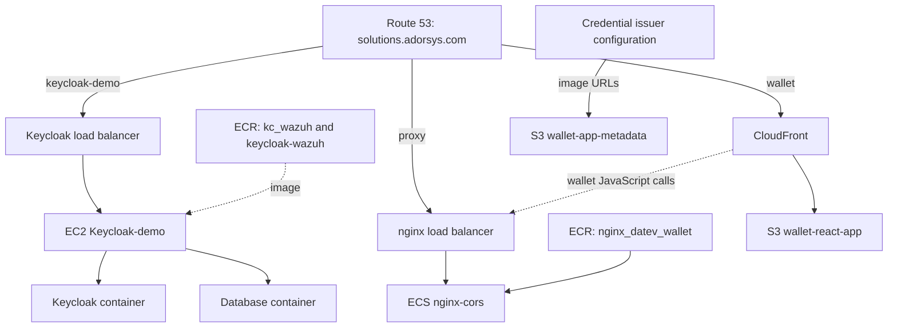
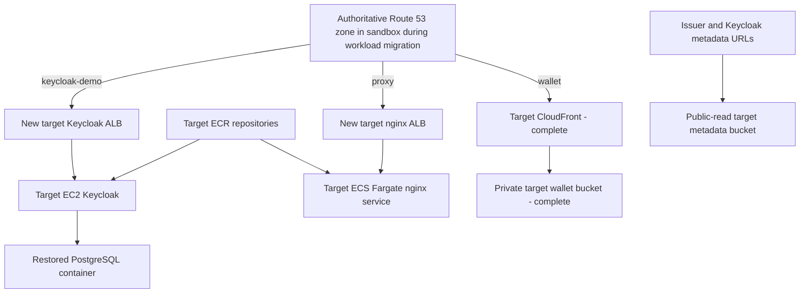

# Migration Plan for the Remaining AWS Sandbox Components

- **Source account:** `917848404243` using profile `sandbox`
- **Target account:** `982081049921` using the default AWS profile
- **Source Region:** `eu-north-1`
- **Target Region:** `eu-central-1`
- **Plan date:** 2026-08-11
- **Status:** Plan only; no AWS resources have been changed

## 1. What This Plan Does

This document explains how to move the remaining application components from the
old sandbox account into the new AWS account.

The target account already has the networking and supporting infrastructure needed
for these workloads. Therefore:

- No new VPC is required.
- No VPC migration is included.
- Use the target account's existing subnets, routing, security conventions, IAM,
  monitoring, and new target load-balancer requirements.
- The implementation team only needs to select the existing target subnet and
  security-group IDs when creating the EC2 and ECS resources.

The migration preserves these public URLs:

- `https://keycloak-demo.solutions.adorsys.com`
- `https://proxy.solutions.adorsys.com`
- `https://wallet.solutions.adorsys.com`

## 2. What Must Be Migrated

| Component | Current source | What is needed in the target account |
|---|---|---|
| Keycloak | EC2 `Keycloak-demo` | Target EC2, Keycloak scripts/containers, database restore |
| Keycloak database | Database container on the EC2 host | Restored database container and persistent encrypted storage |
| Keycloak images | `kc_wazuh` and `keycloak-wazuh` ECR repositories | Target ECR copies; keep both until the active image is confirmed |
| Keycloak HTTPS | ALB and wildcard ACM certificate | Target ALB route/listener and new target ACM certificate |
| nginx CORS proxy | ECS `Datev_Wallet/nginx-cors` | Target ECR image, task definition, service, logs, and ALB route |
| Wallet website | `wallet-react-app` S3 bucket | Target S3 bucket and target CloudFront distribution |
| Wallet metadata | `wallet-app-metadata` S3 bucket | Target S3 bucket, stable URL, and updated issuer references |
| DNS | Route 53 zone in source account | Initially keep zone and point records to target resources |
| Certificates | Source-account ACM certificates | Request new certificates in target account |

The `fifa` EC2 instance and unrelated S3 buckets are not part of this migration.

## 3. How the Components Connect Today



Important connections:

1. The wallet JavaScript calls
   `https://proxy.solutions.adorsys.com/cors`. The proxy hostname should not change.
2. The nginx ECS service pulls `nginx_datev_wallet:latest`.
3. Keycloak and its database are on the same EC2 host.
4. The Keycloak public hostname is part of issuer URLs and redirect configuration.
5. CloudFront hides the wallet bucket name, so the target wallet bucket can have a
   different name.
6. The metadata bucket name is embedded in issuer configuration, so its URLs need
   an explicit update.

## 4. Target Structure Using Existing Infrastructure

Use the target account's existing VPC and subnets. Do not create another VPC and
do not migrate either source load balancer. Load balancers are account-scoped
configurations, so create new dedicated target ALBs.



For nginx, use existing target VPC `vpc-073150aef0868a8af`:

- New internet-facing nginx ALB in the three existing public subnets
- ECS tasks in the three existing private subnets, with no public IP
- A new ALB security group and a separate ECS-task security group
- New target group of type `ip` on container port 8080
- Issued target ACM certificate in `eu-central-1`

The source `corsproxy` ALB stays unchanged until the new nginx service is tested
and `proxy.solutions.adorsys.com` is cut over. It is retained temporarily for
rollback and later retired; it is never copied or migrated.

## 5. Migration Approach in Plain Language

This migration does not require repository workflows. The required resources can
be copied or recreated with the AWS CLI and AWS service-native operations. See the
[workflow-free migration runbook](WORKFLOW-FREE-MIGRATION-RUNBOOK.md) for the exact
manual procedures, commands, validation gates, and rollback rules.

The migration has five main stages:

1. **Prepare and back up:** inspect the Keycloak host, identify the active images,
   and produce a tested database backup.
2. **Create target application resources:** ECR repositories, EC2, ECS service,
   buckets, CloudFront, certificates, and load-balancer routes using existing
   target infrastructure.
3. **Copy and restore:** move container images and S3 objects, then restore the
   Keycloak database.
4. **Test before changing DNS:** use temporary target hostnames to validate every
   component.
5. **Cut over the existing domains:** point the three current public names to the
   target resources, monitor, and retain source resources for rollback.

## 6. Step 1 — Inventory and Back Up Keycloak

This is the first required step because AWS metadata does not show what is running
inside the source EC2 host. The instance has no Systems Manager registration and
no EC2 user data.

On the source host, record:

- Location and Git revision of the deployment scripts
- Docker Compose files and project name
- Running container names and image digests
- Which of `kc_wazuh` or `keycloak-wazuh` is actually used
- Keycloak version
- Database engine and version
- Database name and size
- Docker volumes or host bind-mount paths
- Provider JARs, themes, realm imports, keystores, and certificates
- Systemd units, cron jobs, and startup scripts
- Names of required secrets, without copying values into documentation

Useful non-secret inventory commands include:

```bash
docker ps --format '{{.Names}}\t{{.Image}}\t{{.Ports}}'
docker compose ls
docker volume ls
df -h
```

### Database Backup

The logical database backup is the main migration artifact.

If the container uses PostgreSQL:

1. Stop writes to Keycloak or stop Keycloak briefly.
2. Create a compressed `pg_dump` backup.
3. Record the PostgreSQL version.
4. Generate a checksum for the backup.
5. Restore it into a test database in the target account.
6. Verify realms, clients, users, keys, and row counts.
7. Repeat the backup during the final cutover window.

If another database engine is found, use its transactionally consistent dump and
restore procedure.

### Recovery AMI

Create a baseline EC2 AMI after stopping Keycloak and PostgreSQL cleanly. Share the
AMI privately with the target account, copy it so the target owns it, and encrypt
the target copy.

The AMI is useful for moving Ubuntu, Docker, scripts, systemd units, provider files,
themes, and EBS-backed Docker data. It does not move the VPC, security groups, IAM
role, load balancer, certificate, DNS, ECR repositories, or external secrets. It
can also contain unwanted source credentials and account-specific ARNs.

The safest method uses both artifacts:

- A baseline AMI to prepare and test the target host before cutover
- A rehearsal PostgreSQL dump followed by a final dump after Keycloak writes stop

The final logical PostgreSQL backup is the authoritative Keycloak state transfer.
Do not rely only on a live `--no-reboot` AMI for a running PostgreSQL database.

## 7. Step 2 — Move the ECR Images

Create these repositories in the target account:

- `kc_wazuh`
- `keycloak-wazuh`
- `nginx_datev_wallet`

Configure image scanning and use immutable migration tags.

### Keycloak/Wazuh Images

Until the source host inventory proves which image is active, move the tagged image
from both repositories.

Recommended process:

1. Authenticate Docker to source ECR.
2. Pull each tagged image.
3. Record its source digest.
4. Authenticate Docker to target ECR.
5. Tag it with a fixed migration tag, for example `migration-20260811`.
6. Push it to target ECR.
7. Compare source and target image digests.

If the images can be rebuilt reproducibly from source, rebuilding is better than
copying the old binary image.

### nginx Image

The running source task was verified on 2026-08-12:

- Repository: `nginx_datev_wallet`
- Source tag: `latest`
- Deployed OCI index digest:
  `sha256:2f7482aeaa9a2599e2bf09fcaf32fe3132bb6d2e43c9636349fb9f2dbba9167b`
- Linux/amd64 child digest:
  `sha256:7966b3ab99e0366a1ece8eeaa095fbe8e470085eed6731db96d6aaf2d9faa235`
- Linux/arm64 child digest:
  `sha256:fe5a9c95fc0e45fdfa764390a4f82ec9a876ffcb882a4254bf6f7762632b049d`
- Current task architecture: Linux x86_64

Create `nginx_datev_wallet` in target `eu-central-1`, copy the complete OCI
index with all platforms, and add a fixed tag such as
`migration-20260812`. Do not deploy mutable `latest`. Verify the target digest
before registering the task definition.

Rebuilding nginx from `eudiw-app/nginx` can be done later, after the copied service
is stable in the target account. This keeps application rebuild risk out of the
account migration.

Do not depend on ECR replication for the existing images. AWS ECR replication does
not automatically backfill content that existed before replication was configured.

## 8. Step 3 — Migrate Keycloak EC2 and Its Database

### Create the Target EC2 Instance

Create the target instance using the target account's existing infrastructure:

- Existing target VPC and suitable subnet
- Existing egress and routing
- Target security groups or new application-specific rules within that VPC
- Ubuntu 24.04 x86_64
- Initial size `t3.medium`, matching the source
- Encrypted EBS storage
- IAM instance profile for Systems Manager and required secret access
- IMDSv2 required, hop limit 2
- No public database or administration ports

For the lowest-risk lift-and-shift, launch the target-owned encrypted copy of the
baseline AMI. Before registering it with the load balancer, replace source-account
ECR URIs, ARNs, log destinations, secrets, credentials, and SSH material. Restore
the rehearsal PostgreSQL dump and test the complete startup sequence.

A clean Ubuntu rebuild from version-controlled scripts can follow after migration,
but it is not required for the initial account move.

### Restore the Containers

1. Pull the migrated Keycloak image from target ECR.
2. Recreate the database container with persistent encrypted storage.
3. Restore the logical database dump.
4. Recreate the Keycloak container using the same tested version.
5. Load secrets from the target account's approved secret store.
6. Restore required provider JARs, themes, and keystores.
7. Configure the external hostname as
   `https://keycloak-demo.solutions.adorsys.com`.
8. Start the containers and verify restart persistence.

### Connect Keycloak to the Load Balancer

Create a new dedicated target Keycloak ALB and listener; do not migrate or reuse
the source `keycloak-demo-LB`:

- HTTPS listener using the target ACM certificate
- Host: `keycloak-demo.solutions.adorsys.com`
- Target: the target Keycloak EC2 application port
- Health check: a path that returns HTTP 200

The source health check is currently wrong: `/` redirects with HTTP 302, while the
target group accepts only 200. In the target account either:

- Use a proper Keycloak readiness endpoint, or
- Temporarily accept `200-399` until a dedicated health endpoint is enabled

Test Keycloak through a temporary hostname before changing the production DNS
record.

## 9. Step 4 — Migrate the nginx ECS Service

The source service is stateless, so it can run in both accounts during testing.
Nothing from the source ALB is transferred; the target receives a newly created ALB.

### Verified Source Configuration

| Setting | Live source value |
|---|---|
| Cluster/service | `Datev_Wallet/nginx-cors` |
| Task definition | `cors_proxy:6` |
| Launch | Fargate platform 1.4.0, `awsvpc` |
| Runtime | Linux x86_64 |
| Task size | CPU 1024, memory 3072 MiB |
| Container | `nginx-proxy`, TCP/HTTP port 8080 |
| Environment/secrets | None in the task definition |
| Image | Source `nginx_datev_wallet:latest`, pinned for migration by digest |
| Logs | `/ecs/cors_proxy` in `eu-north-1` |
| Desired/running | 1/1 |
| Deployment | Rolling, min 100%, max 200%, circuit breaker with rollback |
| Target group | `ip`, HTTP port 8080, health `/` = 200 |
| Source ALB | `corsproxy`, HTTPS 443, internet-facing |
| DNS | `proxy.solutions.adorsys.com` aliases to the source ALB |

The source role is over-privileged and is used as both task and execution role.
Do not reproduce that. nginx has no AWS API usage in its task definition.

### Target Resources to Create

The target account currently has no ECS cluster, nginx ECR repository, nginx log
group, or ECS execution role. Create:

1. ECR repository `nginx_datev_wallet` and copy the verified image.
2. Log group `/ecs/cors_proxy` with an agreed retention period.
3. ECS task execution role with `AmazonECSTaskExecutionRolePolicy`. Do not assign
   a task role unless later inspection proves nginx calls AWS APIs.
4. ECS cluster `Datev_Wallet`.
5. Two dedicated security groups in `vpc-073150aef0868a8af`:
   - ALB SG: inbound 443 from the internet; optional port 80 redirect only.
   - Task SG: inbound 8080 only from the ALB SG; outbound 80/443 for proxy targets,
     ECR/log access through NAT, and DNS as provided by the VPC resolver.
6. Target group `nginx-cors-tg`: HTTP 8080, target type `ip`, health path `/`,
   matcher 200.
7. New internet-facing ALB `nginx-cors-alb` in existing public subnets:
   - `subnet-053b37b6b4a517afb` (eu-central-1a)
   - `subnet-003d0ccab3982e90a` (eu-central-1b)
   - `subnet-0f88842f7789cc09a` (eu-central-1c)
8. HTTPS listener 443 using issued certificate
   `arn:aws:acm:eu-central-1:982081049921:certificate/d556613f-db8a-44cb-b4f2-bf360443346a`,
   forwarding to `nginx-cors-tg`. Optionally create HTTP 80 only to redirect to
   HTTPS.
9. Clean target task definition based on `cors_proxy:6`, but using the target
   execution-role ARN, target ECR digest/fixed tag, and target log Region.
10. ECS service `nginx-cors`, desired count 1, in existing private subnets:
    - `subnet-01ea66e1eadb764b8` (eu-central-1a)
    - `subnet-02f5858452931cb05` (eu-central-1b)
    - `subnet-0419198c0dda051f3` (eu-central-1c)
    - Assign public IP: disabled
    - Register `nginx-proxy:8080` with the new target group
    - Enable deployment circuit breaker and automatic rollback

The selected private subnets have a default route through NAT
`nat-001dff58f95b01e5a`; the public ALB subnets route through internet gateway
`igw-07b800fe398f7f448`. No VPC creation is required.

### Test and Domain Cutover

1. Wait for one running ECS task and a healthy target in `nginx-cors-tg`.
2. Create temporary CNAME `proxy-migration.solutions.adorsys.com` in the
   authoritative sandbox Route 53 zone, pointing to the new ALB DNS name. This is a
   normal cross-account CNAME, like the wallet test record.
3. Test HTTPS root and the real proxy behavior:
   - `GET /` returns the CORS proxy page as 200.
   - OPTIONS preflight returns 204.
   - CORS headers include the required methods and Authorization/DPoP headers.
   - GET/POST proxy calls, redirect rewriting, and the wallet's real credential
     flow work through the temporary hostname.
4. Lower the production record TTL if it is not already low.
5. Update the existing `proxy.solutions.adorsys.com` Route 53 alias from source
   ALB `corsproxy` to the new target ALB. This is a DNS update, not a domain move.
   Because the ALB lives in another account and may not appear in the sandbox
   console picker, use a CNAME for this non-apex hostname or submit an AliasTarget
   with the new ALB DNS name and its canonical hosted-zone ID through the CLI.
6. Verify public DNS, TLS, ALB target health, ECS task health, CORS behavior, and
   wallet flows.
7. Keep the source ECS service, ECR image, ALB, target group, and DNS details intact
   during the rollback period. Roll back by restoring the old DNS alias.
8. Only after monitoring and approval: scale source service to zero, then retire
   the source ALB/ECS/ECR resources in separate cleanup steps.

The domain remains `proxy.solutions.adorsys.com`; no new domain or hosted-zone
migration is needed for this workload cutover.

## 10. Step 5 — Migrate the Wallet S3 Bucket and CloudFront

The wallet bucket contains only about 14 MB, so the idempotent
[`scripts/migrate-s3-buckets.sh`](scripts/migrate-s3-buckets.sh) transfer is
sufficient.

### Create the Target Wallet Bucket

The source account owns the globally unique name `wallet-react-app`. The selected
target name is:

`wallet-react-app-main`

Configure the target bucket with:

- Block all public access
- Bucket-owner-enforced object ownership
- Default encryption
- Versioning
- Access only through CloudFront Origin Access Control

### Copy the Wallet Files

1. Run `scripts/migrate-s3-buckets.sh --dry-run` to verify both AWS profiles.
2. Confirm the output ends with `DRY RUN RESULT: PASS`.
3. Review the ignored log under `.migration-logs/` and approve it.
4. Only then run `scripts/migrate-s3-buckets.sh` to create and populate the buckets.
5. Review the object-count and total-byte verification in the execution log.
6. Run the same script again immediately before cutover; unchanged objects are
   skipped and source objects are never deleted.

Expected source inventory: 55 objects and approximately 14 MB.

### Recreate CloudFront

The verified source values, secure target equivalent, certificate preparation,
and cutover gates are documented in section 11 of the
[workflow-free migration runbook](WORKFLOW-FREE-MIGRATION-RUNBOOK.md). Use
[`scripts/create-wallet-cloudfront.sh`](scripts/create-wallet-cloudfront.sh) to
idempotently create or reuse the target OAC and distribution with this behavior:

- Target private S3 origin
- Origin Access Control
- Default root object `index.html`
- Redirect HTTP to HTTPS
- Compression
- 403 and 404 responses mapped to `/index.html` with response code 200
- Target ACM certificate in `us-east-1`
- Temporary wildcard alias `*.solutions.adorsys.com` during preparation
- Exact alias `wallet.solutions.adorsys.com` only during the controlled cutover

Test first through a temporary hostname such as
`wallet-migration.solutions.adorsys.com` as a CNAME pointing to the target CloudFront hostname. Do not reproduce the source
bucket's public-read policy: the active source distribution and the distribution
ARN in that policy do not match, and public S3 access currently masks the defect.

## 11. Step 6 — Migrate the Metadata Bucket

The metadata bucket contains nine image files and is currently publicly readable.

The metadata files have no repository deployment source, so migrate the existing
S3 objects directly. The selected target name is:

`wallet-app-metadata-main`

Copy all nine objects and recreate the source's direct-read behavior with an
idempotent `PublicReadGetObject` policy scoped to:

`arn:aws:s3:::wallet-app-metadata-main/*`

Keep public ACLs blocked and use bucket-owner-enforced ownership. The public object
URL becomes:

`https://wallet-app-metadata-main.s3.eu-central-1.amazonaws.com/<object>`

Update the issuer and Keycloak configuration that currently contains direct URLs
like:

`https://wallet-app-metadata.s3.eu-north-1.amazonaws.com/datev_logo.png`

Known references exist in the credential-display Terraform variables and client
scope JSON files for City Registry, DATEV Company, and Bank Employee credentials.

Keep the source metadata bucket available until:

- All configurations use the new target S3 URL
- Newly issued credentials contain the new image URLs
- Existing demonstrations no longer require the old S3 URLs

Do not delete the source bucket merely to reuse its name in the target account.
S3 bucket names are globally unique, and AWS does not guarantee that the target
account can claim a name after deletion.

## 12. Step 7 — Certificates and Domains

### Request New Certificates

Request new target-account ACM certificates for `*.solutions.adorsys.com`:

- In `eu-central-1` for Application Load Balancer HTTPS
- In `us-east-1` for CloudFront

Add the DNS-validation CNAME records to the existing source Route 53 zone. Keep
those records so ACM can renew the certificates.

### Keep the Existing Domains

The domains can remain exactly the same. The domain names are not tied to an AWS
account; their DNS records decide where traffic goes.

During the migration, keep `solutions.adorsys.com` hosted in the source account and
change only these records:

| DNS name | Change at cutover |
|---|---|
| `keycloak-demo.solutions.adorsys.com` | Point to target Keycloak load balancer |
| `proxy.solutions.adorsys.com` | Point to target nginx load balancer route |
| `wallet.solutions.adorsys.com` | Point to target CloudFront distribution |

This is the simplest and safest approach because workload migration and DNS-zone
migration remain separate.

### Move the Wallet CloudFront Alias

CloudFront does not allow the same exact alternate domain on two distributions.

Because both AWS accounts are available and `wallet.solutions.adorsys.com` is not
an apex domain, use AWS's supported cross-account wildcard procedure:

1. Run `scripts/create-wallet-cloudfront.sh --dry-run`, review its ignored log,
   and then run the real command only after approval. The real command prepares the
   target distribution, issued certificate, covering wildcard alias, and ownership
   TXT without changing production traffic.
2. Apply the new distribution ID to the private target bucket policy and test the
   target through a temporary HTTPS hostname.
3. After separate cutover approval, point the existing wallet DNS record to the
   target distribution.
4. Remove the exact wallet alias from the source distribution. Until this happens,
   the source's more-specific alias continues to serve the wallet hostname.
5. Add the exact alias to the target distribution and validate production.
6. Retain the source for rollback; remove temporary records and the wildcard only
   after the agreed stability period.

### Optional Route 53 Zone Migration

Moving the `solutions.adorsys.com` hosted zone is optional and should happen only
after all application resources are stable in the target account.

If the team later wants DNS ownership in the target account:

1. Create the same hosted zone in the target account.
2. Copy all non-NS/non-SOA records.
3. Compare old and new DNS answers.
4. Ask the owner of the parent `adorsys.com` DNS zone to change the delegated name
   servers for `solutions.adorsys.com`.
5. Keep the source zone until the rollback period is over.

This is a hosted-zone migration, not a domain-registration transfer.

## 13. Recommended Migration Order

Follow this order because later components depend on earlier ones and the early
steps do not change production traffic. The command-by-command procedure is in the
[workflow-free migration runbook](WORKFLOW-FREE-MIGRATION-RUNBOOK.md).

### Phase A — Preparation With No Traffic Change

- Verify that `sandbox` is source account `917848404243` and `default` is target
  account `982081049921`
- Confirm the existing target network/subnet/security-group selections
- Inventory the Keycloak host
- Confirm how Keycloak and PostgreSQL start and where PostgreSQL data is stored
- Confirm the active Keycloak and nginx image digests
- Test a database backup and restore
- Request and validate the target ACM certificates
- Lower application DNS TTLs at least one old-TTL period before cutover
- Agree on maintenance window, rollback window, RTO, and RPO

### Phase B — Copy Stateless Artifacts With No Traffic Change

- Create target ECR repositories
- Copy the three exact deployed images without running repository workflows
- Create target S3 buckets
- Run the initial wallet and metadata S3 sync
- Create target CloudFront distributions
- Create target ECS nginx service
- Configure target load-balancer routes
- Add temporary validation DNS names

### Phase C — Prepare and Test the Stateful Host

- Stop Keycloak and PostgreSQL cleanly for a controlled baseline AMI
- Privately share the source AMI and its backing snapshots with the target account
- Copy and encrypt the AMI so it is owned by the target account
- Launch it in the existing target infrastructure
- Replace source-account credentials, ARNs, ECR URIs, and log destinations
- Restore a rehearsal PostgreSQL backup
- Test Keycloak through a temporary hostname
- Verify restored realms, users, clients, keys, and database state
- Test nginx with the wallet's real proxy requests
- Test wallet root and deep links through target CloudFront
- Test every metadata image through its new hostname

### Phase D — Final Cutover

1. Run and verify the final wallet and metadata S3 sync.
2. Change `proxy` DNS first because nginx is stateless.
3. Validate the wallet's real proxy flows; roll back DNS if they fail.
4. Announce Keycloak maintenance and stop source Keycloak writes.
5. Keep source PostgreSQL running long enough to create the final logical backup.
6. Checksum, transfer, restore, and verify the final database backup.
7. Start and validate target Keycloak through its temporary hostname.
8. Change `keycloak-demo` DNS.
9. Validate login, discovery, redirects, signing material, and OID4VC endpoints.
10. Keep source Keycloak stopped to prevent split-brain writes.
11. Move the CloudFront alias and change `wallet` DNS last.
12. Update metadata URLs and monitor all target components.

### Phase E — Stabilize and Decommission

- Keep source resources available during the rollback window
- Monitor target logs, health, and user flows
- Confirm backups and restart recovery
- Remove source resources only after explicit approval

## 14. Validation Checklist

### Keycloak

- [ ] Target load-balancer health check is healthy
- [ ] `keycloak-demo.solutions.adorsys.com` has a valid certificate
- [ ] Admin login works
- [ ] Required realms, users, clients, and keys exist
- [ ] OIDC discovery returns the expected issuer
- [ ] Redirect URIs use the preserved hostname
- [ ] OID4VC endpoints work
- [ ] Database survives a container and EC2 restart
- [ ] Database/admin ports are not publicly accessible

### nginx

- [ ] ECS desired count and running count are both one
- [ ] Load-balancer target is healthy
- [ ] `proxy.solutions.adorsys.com` has a valid certificate
- [ ] GET, POST, OPTIONS, headers, and redirects work
- [ ] Wallet credential flows work
- [ ] CloudWatch logs are available

### Wallet and Metadata

- [ ] All 55 wallet objects copied
- [ ] All nine metadata objects copied
- [ ] Target buckets are not public
- [ ] Wallet root and deep links work
- [ ] CloudFront SPA fallback works
- [ ] Wallet calls the preserved proxy hostname
- [ ] Metadata images load from the new stable hostname
- [ ] Issuer configuration no longer requires the source metadata bucket

## 15. Rollback

Keep the source EC2, ECS service, ECR images, buckets, CloudFront distribution, and
DNS zone during the rollback period.

If cutover fails before target Keycloak accepts writes:

1. Point `keycloak-demo` and `proxy` DNS back to the source load balancers.
2. Point `wallet` back to the source CloudFront distribution.
3. Reverse the CloudFront alias move if necessary.
4. Restart or re-enable source Keycloak.

If target Keycloak has accepted writes, do not switch back blindly. First export
the target database and decide whether to restore it to the source or repair the
target deployment forward.

Suggested rollback triggers:

- Keycloak target remains unhealthy
- Login or OIDC issuer validation fails
- Database validation fails
- nginx breaks the wallet flow
- CloudFront alias or certificate fails
- Metadata images cannot be resolved

## 16. When the Migration Is Complete

The migration is complete when:

- All three public URLs serve target-account resources
- Keycloak state and database are verified
- nginx runs from target ECR on target ECS
- Wallet and metadata objects are stored in target S3
- Target CloudFront serves the wallet; the target metadata bucket serves images directly through `PublicReadGetObject`
- New target ACM certificates are active
- Monitoring and backups are verified
- The rollback period has ended
- The owner explicitly approves source decommissioning

## 17. Remaining Inputs Before Execution

Only these details still need to be confirmed:

1. Active Keycloak/Wazuh image
2. Database engine, version, name, and volume path
3. Exact Keycloak scripts and Compose files on the source host
4. Existing target subnet and security-group selections
5. Confirmed names, public subnets, private/application subnets, and security rules
   for the new dedicated target Keycloak ALB
6. Maintenance window and acceptable downtime
7. Rollback retention period
8. Owner of the parent `adorsys.com` DNS delegation
9. Issuers that still publish direct `wallet-app-metadata` URLs

## 18. AWS References

- [Migrate a Route 53 hosted zone to another account](https://docs.aws.amazon.com/Route53/latest/DeveloperGuide/hosted-zones-migrating.html)
- [Move a CloudFront alternate domain name](https://docs.aws.amazon.com/AmazonCloudFront/latest/DeveloperGuide/alternate-domain-names-move-options.html)
- [CloudFront certificate requirements](https://docs.aws.amazon.com/AmazonCloudFront/latest/DeveloperGuide/cnames-and-https-requirements.html)
- [Cross-account S3 copy pattern](https://docs.aws.amazon.com/prescriptive-guidance/latest/patterns/copy-data-from-an-s3-bucket-to-another-account-and-region-by-using-the-aws-cli.html)
- [S3 bucket naming guidance](https://docs.aws.amazon.com/AmazonS3/latest/userguide/bucketnamingrules.html)
- [Cross-account AMI copying](https://docs.aws.amazon.com/AWSEC2/latest/UserGuide/how-ami-copy-works.html)
- [ECR replication behavior](https://docs.aws.amazon.com/AmazonECR/latest/userguide/replication.html)
- [Workflow-free migration runbook](WORKFLOW-FREE-MIGRATION-RUNBOOK.md)
