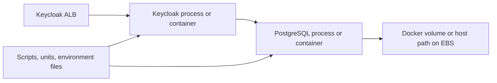

# Workflow-Free AWS Account Migration Runbook

- **Source account:** `917848404243` using AWS CLI profile `sandbox`
- **Target account:** `982081049921` using AWS CLI profile `default`
- **Source Region:** `eu-north-1`
- **Target Region:** `eu-central-1`, except CloudFront certificates in `us-east-1`
- **Purpose:** Migrate the remaining sandbox workloads without running repository workflows
- **Status:** Instructions only; every write operation requires an approved migration window

## 1. Short Answer

Yes. The remaining workloads can be migrated without running GitHub Actions or
another repository workflow. Use AWS service-native copy operations and the AWS
CLI from an administrator workstation.

Not every AWS resource supports a literal cross-account clone:

| Component | Workflow-free migration method |
|---|---|
| Keycloak EC2 host | Create a source AMI, share it, copy it into the target account, and launch it in the existing target network |
| PostgreSQL on the EC2 host | Create and test a logical backup; restore the final backup during cutover |
| Host configuration | Copy with the AMI, then replace source-account settings and secrets |
| ECR images | Pull/tag/push with Docker, or copy registry-to-registry with `skopeo` |
| ECS nginx service | Export its configuration and recreate the task definition and service in the target account |
| S3 objects | Run cross-account `aws s3 sync` operations |
| CloudFront | Recreate the distribution, then move its alternate domain name |
| ACM certificates | Request new certificates in the target account; certificates cannot be transferred |
| Load balancers | Create new dedicated target ALBs; source ALBs remain only for rollback and are never migrated |
| Route 53 names | Keep the source hosted zone initially and change only the application records at cutover |

No new VPC and no VPC migration are part of this runbook.

## 2. Safest Overall Order

Start with operations that cannot affect production traffic. Move the stateful
Keycloak database only after every target component has passed isolated testing.

| Order | Operation | Source impact |
|---|---|---|
| 1 | Confirm identities, permissions, target IDs, maintenance window, and rollback owners | None |
| 2 | Request target ACM certificates and validate them through the existing DNS zone | None |
| 3 | Copy all required ECR images under fixed migration tags | None |
| 4 | Initial-copy both S3 buckets | None |
| 5 | Recreate CloudFront with a temporary wildcard alias and test through a temporary hostname | None |
| 6 | Recreate nginx ECS and test the target ALB with `curl --connect-to` | None |
| 7 | Create a baseline Keycloak AMI, copy it to the target, and launch an isolated target instance | One controlled source reboot |
| 8 | Restore a rehearsal PostgreSQL dump and test Keycloak through a temporary hostname | No production change |
| 9 | Lower DNS TTLs and run the final S3 sync | None |
| 10 | Cut over the stateless nginx proxy | Short DNS propagation only |
| 11 | Stop Keycloak writes, take the final PostgreSQL dump, restore it, and cut over Keycloak | Planned Keycloak maintenance |
| 12 | Move the wallet CloudFront alias and then update metadata references | Short wallet cutover |
| 13 | Monitor and retain all source resources for the agreed rollback period | None |

This order keeps the source applications active while the target environment is
built and tested. The public wallet is moved last because it depends on the proxy,
Keycloak, metadata, S3, and CloudFront behavior.

## 3. Operator Guardrails

Run commands from a controlled administrator workstation. Examples below use shell
variables so account and Region selection remains visible.

```bash
export SOURCE_REGION=eu-north-1
export TARGET_REGION=eu-central-1
export SOURCE_ACCOUNT_ID=917848404243
export TARGET_ACCOUNT_ID=982081049921

aws sts get-caller-identity --profile sandbox
aws sts get-caller-identity --profile default
```

Before any write operation, verify that the returned account IDs exactly match the
values above. Stop if they do not.

Additional rules:

- Replace every `<placeholder>` before running a command.
- Do not commit exported task definitions, database dumps, container inspections,
  environment files, private keys, or secret-bearing configuration.
- Do not delete source resources during migration.
- Do not use `aws s3 sync --delete`.
- Use fixed image tags or digests instead of `latest` during migration.
- Record each new target resource ID in the migration log.
- Treat all database backups and AMIs as sensitive artifacts.

## 4. Understand the Keycloak Host Before Copying It

Keycloak and PostgreSQL share the `Keycloak-demo` EC2 host. Confirm whether each
one is a systemd-managed process, a Docker container, or started by a custom script.
Do not assume that an AMI alone explains the startup sequence.

Current logical dependency:



Run non-destructive inventory commands on the source host:

```bash
sudo systemctl list-units --type=service --state=running
sudo systemctl status keycloak postgresql
ps -ef
docker ps --no-trunc
docker compose ls
docker volume ls
lsblk -f
df -h
```

Some commands may report that a service does not exist; that is useful evidence
that the service is started another way. Record:

- Keycloak and PostgreSQL versions
- Process or container names
- Startup mechanism and service dependencies
- Listening ports and the Keycloak-to-PostgreSQL connection address
- Compose files, scripts, systemd units, cron jobs, and environment-file paths
- Docker volume names and bind-mount paths
- Whether database data is on the root EBS volume or another attached volume
- Provider JARs, themes, realm imports, keystores, and certificates
- File ownership and permissions
- ECR image names and immutable digests
- External dependencies and every source-account ARN

`docker inspect` and environment files can expose credentials. Store their output
only in a restricted migration location and never in this repository.

## 5. Is an AMI Enough for Keycloak and PostgreSQL?

### What the AMI Copies

For this host, a baseline AMI is a good way to reproduce the machine configuration
quickly. An EBS-backed AMI can preserve:

- Ubuntu, installed packages, Docker, and system configuration
- Keycloak scripts, provider files, themes, and systemd definitions on EBS
- Locally cached container images
- PostgreSQL files and Docker volumes when they are stored on included EBS volumes
- File ownership, permissions, and the disk layout captured by the image

### What the AMI Does Not Copy

The AMI does not move:

- The VPC, subnet, security groups, ENI, private/public IP, or instance ID
- The IAM instance profile
- The load balancer, target group, listeners, certificate, or DNS records
- ECR repositories or CloudWatch log groups
- Secrets Manager values, Parameter Store values, or KMS keys
- Data on instance-store disks or external file systems
- Process memory or active network connections
- Database changes written after the AMI snapshot

It can also copy unwanted source-account credentials, old SSH material, shell
history, source ARNs, and passwords stored on disk. Review and replace those items
on the isolated target instance before exposing it to traffic.

### Recommended Decision

Use both artifacts:

1. **Baseline AMI:** copies the operating system, scripts, runtime, and configuration
   so the target host can be prepared and tested early.
2. **PostgreSQL logical backup:** is the authoritative transfer of Keycloak state.
   Take a rehearsal backup first and a final backup after stopping Keycloak writes.

Do not rely only on a live, `--no-reboot` AMI. That gives, at best, a
crash-consistent view of PostgreSQL and AWS does not guarantee file-system integrity.

A final AMI made while both services are stopped can be used as an emergency
lift-and-shift method, but it causes longer downtime because AMI creation, sharing,
copying, launching, and account-specific corrections all occur inside the outage.

## 6. Create, Share, and Copy the Baseline AMI

### 6.1 Prepare the Source Host

1. Take and checksum a rehearsal PostgreSQL backup as described in section 7.
2. Confirm that all durable files are on EBS-backed paths.
3. Record attached volumes and their mount points.
4. Stop Keycloak cleanly so no new database writes are accepted.
5. Stop PostgreSQL cleanly after the backup.
6. Run `sync` on the host.
7. Confirm both processes have stopped.

Use the appropriate service mechanism discovered during inventory:

```bash
# Systemd examples
sudo systemctl stop keycloak
sudo systemctl stop postgresql
sudo sync

# Docker examples; use the real names discovered during inventory
docker stop <keycloak-container>
docker stop <postgres-container>
sudo sync
```

### 6.2 Create the AMI in the Source Account

The in-scope source instance is `i-03eac5cc262731ede`.

```bash
export SOURCE_INSTANCE_ID=i-03eac5cc262731ede
export AMI_NAME=keycloak-demo-baseline-20260811

aws ec2 create-image \
  --profile sandbox \
  --region "$SOURCE_REGION" \
  --instance-id "$SOURCE_INSTANCE_ID" \
  --name "$AMI_NAME" \
  --description "Keycloak and PostgreSQL migration baseline" \
  --tag-specifications \
    'ResourceType=image,Tags=[{Key=Name,Value=keycloak-demo-migration},{Key=Purpose,Value=account-migration}]' \
  --query ImageId \
  --output text
```

Do not add `--no-reboot`. The default controlled reboot gives AWS a consistent file
system. Because the services were stopped first, PostgreSQL is also cleanly closed.
After the source instance returns, explicitly confirm that PostgreSQL and Keycloak
are running and that the source ALB works.

Wait for the AMI to become available:

```bash
aws ec2 wait image-available \
  --profile sandbox \
  --region "$SOURCE_REGION" \
  --image-ids <source-ami-id>
```

### 6.3 Share the Source AMI for a Target-Owned Copy

The verified source root EBS volume is currently unencrypted, which avoids the
cross-account KMS restriction at the sharing stage. Verify this again before use.

```bash
aws ec2 describe-images \
  --profile sandbox \
  --region "$SOURCE_REGION" \
  --image-ids <source-ami-id> \
  --query 'Images[0].BlockDeviceMappings[].Ebs.SnapshotId'
```

Grant target launch permission on the AMI:

```bash
aws ec2 modify-image-attribute \
  --profile sandbox \
  --region "$SOURCE_REGION" \
  --image-id <source-ami-id> \
  --launch-permission "Add=[{UserId=$TARGET_ACCOUNT_ID}]"
```

To allow the target account to make its own AMI copy, grant create-volume permission
on every unencrypted backing snapshot:

```bash
aws ec2 modify-snapshot-attribute \
  --profile sandbox \
  --region "$SOURCE_REGION" \
  --snapshot-id <source-snapshot-id> \
  --attribute createVolumePermission \
  --operation-type add \
  --user-ids "$TARGET_ACCOUNT_ID"
```

If any snapshot is encrypted, it cannot be shared when it uses the AWS-managed
`aws/ebs` key. First make a source copy encrypted with a customer-managed KMS key,
grant the target account use of that key, and then share the AMI. Never make the AMI
or snapshot public.

### 6.4 Copy and Encrypt the AMI in the Target Account

Copying makes the target account the owner of an independent AMI. Encrypt the target
copy even though the source disk is unencrypted.

```bash
aws ec2 copy-image \
  --profile default \
  --region "$TARGET_REGION" \
  --source-region "$SOURCE_REGION" \
  --source-image-id <source-ami-id> \
  --name keycloak-demo-target-20260811 \
  --description "Target-owned encrypted Keycloak migration image" \
  --encrypted \
  --query ImageId \
  --output text

aws ec2 wait image-available \
  --profile default \
  --region "$TARGET_REGION" \
  --image-ids <target-ami-id>
```

Use `--kms-key-id <target-key-arn>` when the target account requires a specific
customer-managed key. Otherwise, the target account's applicable EBS encryption
default is used.

### 6.5 Launch in the Existing Target Infrastructure

Launch the target-owned AMI using:

- The existing approved target subnet
- An application-specific target security group
- The target EC2 instance profile
- `t3.medium` initially, matching the source architecture and size
- Encrypted EBS volumes
- IMDSv2 required with response hop limit 2 for container compatibility
- No public PostgreSQL port

Do not register it with the production target group yet. First isolate it and:

1. Replace source-account ECR URIs with target ECR URIs.
2. Replace source-account ARNs and log destinations.
3. Remove embedded AWS credentials and obsolete SSH keys.
4. Move secret values to the approved target secret store.
5. Confirm hostname and proxy settings without changing the public issuer URL.
6. Confirm file permissions and volume mounts.
7. Disable outbound calls to source services unless explicitly required for testing.
8. Start PostgreSQL, restore the rehearsal dump, and then start Keycloak.
9. Test through a temporary ALB hostname.

The public Keycloak hostname remains
`https://keycloak-demo.solutions.adorsys.com`; only its DNS target changes later.

## 7. Transfer PostgreSQL Safely

### 7.1 Rehearsal Backup

Stop Keycloak or otherwise block writes. PostgreSQL can remain running while its
logical backup is taken.

For a host-installed PostgreSQL service:

```bash
sudo -u postgres pg_dumpall --globals-only > keycloak-globals.sql
sudo -u postgres pg_dump --format=custom --dbname=<keycloak-database> \
  --file=keycloak-database.dump
sha256sum keycloak-globals.sql keycloak-database.dump
```

For PostgreSQL in Docker:

```bash
docker exec <postgres-container> pg_dumpall \
  --globals-only --username=<postgres-user> > keycloak-globals.sql
docker exec <postgres-container> pg_dump \
  --format=custom \
  --username=<postgres-user> \
  --dbname=<keycloak-database> > keycloak-database.dump
sha256sum keycloak-globals.sql keycloak-database.dump
```

Do not put a password directly in the command or shell history. Use the existing
restricted authentication mechanism. Store the dump with mode `0600`, encrypt it
in transit and at rest, and never commit it.

### 7.2 Restore Rehearsal

Use the same PostgreSQL major version initially. On the isolated target:

1. Stop target Keycloak.
2. Start target PostgreSQL with an empty migration database.
3. Restore required roles from `keycloak-globals.sql`.
4. Restore the database dump with `pg_restore`.
5. Start Keycloak.
6. Validate realms, clients, users, sessions policy, signing material, and row counts.

Example restore shape:

```bash
psql --username=<postgres-admin> --file=keycloak-globals.sql postgres
createdb --username=<postgres-admin> --owner=<keycloak-owner> <keycloak-database>
pg_restore --username=<postgres-admin> \
  --dbname=<keycloak-database> \
  --no-owner \
  --exit-on-error \
  keycloak-database.dump
```

Adapt the commands if the target PostgreSQL is containerized. Do not start target
Keycloak against the source database.

### 7.3 Final Database Cutover

1. Announce the Keycloak maintenance window.
2. Stop source Keycloak; leave source PostgreSQL running for the dump.
3. Take a new globals backup and database dump.
4. Generate and verify SHA-256 checksums after transfer.
5. Stop target Keycloak.
6. Replace the rehearsal target database with the final restored database.
7. Start target PostgreSQL and Keycloak.
8. Test the target temporary hostname and its ALB health.
9. Change the production Keycloak DNS record only after validation passes.
10. Keep source Keycloak stopped to prevent split-brain writes, but keep the source
    instance recoverable for rollback.

If rollback is declared, stop target Keycloak before restarting source Keycloak.
Never allow both installations to accept writes independently after cutover.

## 8. Copy ECR Images Without a Repository Workflow

Copy these repositories before creating target services:

- `kc_wazuh`
- `keycloak-wazuh`
- `nginx_datev_wallet` — deployed OCI index
  `sha256:2f7482aeaa9a2599e2bf09fcaf32fe3132bb6d2e43c9636349fb9f2dbba9167b`

The first migration should copy the exact deployed binary images. Rebuilding them
from source can be done later after the target deployment is stable.

### 8.1 Create or Confirm Target Repositories

```bash
aws ecr describe-repositories \
  --profile default \
  --region "$TARGET_REGION" \
  --repository-names kc_wazuh keycloak-wazuh nginx_datev_wallet
```

Create only missing repositories. Configure registry scanning and immutable
migration tags according to the target account standard.

### 8.2 Docker Pull, Tag, and Push

Authenticate the same trusted workstation to both registries:

```bash
aws ecr get-login-password --profile sandbox --region "$SOURCE_REGION" \
  | docker login --username AWS --password-stdin \
    "$SOURCE_ACCOUNT_ID.dkr.ecr.$SOURCE_REGION.amazonaws.com"

aws ecr get-login-password --profile default --region "$TARGET_REGION" \
  | docker login --username AWS --password-stdin \
    "$TARGET_ACCOUNT_ID.dkr.ecr.$TARGET_REGION.amazonaws.com"
```

For each required source digest:

```bash
docker pull \
  "$SOURCE_ACCOUNT_ID.dkr.ecr.$SOURCE_REGION.amazonaws.com/<repository>@<digest>"

docker tag \
  "$SOURCE_ACCOUNT_ID.dkr.ecr.$SOURCE_REGION.amazonaws.com/<repository>@<digest>" \
  "$TARGET_ACCOUNT_ID.dkr.ecr.$TARGET_REGION.amazonaws.com/<repository>:migration-20260811"

docker push \
  "$TARGET_ACCOUNT_ID.dkr.ecr.$TARGET_REGION.amazonaws.com/<repository>:migration-20260811"
```

Docker copies only the platform selected for the workstation. If an image is a
multi-architecture manifest, use `skopeo copy --all` or another OCI-aware registry
copy tool so all platforms and the manifest list are preserved.

Verify the target digest and scan findings before referencing it from EC2 or ECS.
Do not depend on ECR replication to backfill images that already existed.

## 9. Recreate nginx ECS and a New Target ALB

ECS definitions, services, ALBs, target groups, roles, and security groups are
account-scoped. Recreate them in the target; do not copy or migrate source ARNs.

### 9.1 Verified Source Baseline

Use these source values as the behavioral baseline:

| Setting | Verified value |
|---|---|
| ECS | `Datev_Wallet/nginx-cors`, task `cors_proxy:6` |
| Fargate | Linux x86_64, platform 1.4.0, CPU 1024, memory 3072 |
| Container | `nginx-proxy`, port 8080, no environment variables or secrets |
| Image | `nginx_datev_wallet` OCI index digest `sha256:2f7482aeaa9a2599e2bf09fcaf32fe3132bb6d2e43c9636349fb9f2dbba9167b` |
| Logs | awslogs group `/ecs/cors_proxy` |
| Deployment | desired 1; rolling 100/200; circuit breaker rollback enabled |
| Target health | target type `ip`, HTTP 8080, path `/`, matcher 200 |
| Public endpoint | `https://proxy.solutions.adorsys.com` via source `corsproxy` ALB |

The running endpoint returned root HTTP 200 and an OPTIONS preflight returned 204
with GET/POST/OPTIONS plus Authorization, DPoP, and client-attestation headers.

### Verified Target-Ready State Before Cutover - 2026-08-13

The deployment completed successfully and an immediate idempotent rerun reused
the existing resources without creating duplicate security-group rules, task
definitions, or ECS deployments:

- Target ALB: `nginx-proxy-migration-1538385164.eu-central-1.elb.amazonaws.com`
- Target group: `nginx-proxy-targets`
- Task definition: `cors_proxy:1`
- ECS service: desired/running `1/1`, pending `0`
- ALB target health: `1/1` healthy
- Direct target tests: HTTPS root 200 and CORS OPTIONS 204
- Source and target root bodies: byte-identical
- Production DNS: still points to source ALB `corsproxy`
- Successful verification log:
  `.migration-logs/nginx-proxy-deploy-20260813T133026Z-1672267.log`

The service was intentionally scaled from two tasks to one on 2026-08-13 after
the owner confirmed its low usage. This reduces Fargate cost but accepts a short
possible interruption if the single task fails or is replaced.

This records the pre-cutover gate. The production cutover described below has now
completed.

### Completed Production Cutover - 2026-08-13

`scripts/migrate-nginx-proxy.sh --cutover` completed successfully:

- Production record: `proxy.solutions.adorsys.com`
- New alias target:
  `dualstack.nginx-proxy-migration-1538385164.eu-central-1.elb.amazonaws.com`
- Target ALB canonical hosted-zone ID: `Z215JYRZR1TBD5`
- Target ECS service: desired/running `1/1`, pending `0`, rollout `COMPLETED`
- Target health: `10.0.3.48:8080` healthy
- Production root: HTTPS 200
- Production CORS preflight: 204 with the required methods and headers
- Route 53 change: `INSYNC`
- Cutover log:
  `.migration-logs/nginx-proxy-cutover-20260813T150217Z-1751476.log`
- Saved pre-cutover DNS record:
  `.migration-logs/nginx-proxy-dns-before-cutover-20260813T150301Z.json`

The source service remains active at desired/running `1/1` for rollback. Do not
retire its ECS service, ALB, target group, or ECR image until monitoring, a real
wallet flow, and owner approval are complete. The temporary
`proxy-migration.solutions.adorsys.com` CNAME may be removed after monitoring.

### 9.2 Use the Idempotent Migration Script

Use [`scripts/migrate-nginx-proxy.sh`](scripts/migrate-nginx-proxy.sh). It keeps
target deployment, production cutover, and rollback as separate operations:

```bash
# Read-only source/target checks and CREATE/REUSE plan
scripts/migrate-nginx-proxy.sh --dry-run

# Create/reuse target ECR, ECS, and the new ALB; test without changing DNS
scripts/migrate-nginx-proxy.sh

# Run only after target acceptance
scripts/migrate-nginx-proxy.sh --cutover

# Restore the sandbox ALB alias if rollback is required
scripts/migrate-nginx-proxy.sh --rollback
```

Every mode writes a private Git-ignored log under `.migration-logs/`. The default
deployment must finish with `TARGET READY` before cutover is considered. The
script never deletes or scales down the source stack.

### 9.3 Copy the Exact nginx Image

Create only the target nginx repository first:

```bash
aws ecr create-repository \
  --profile default \
  --region eu-central-1 \
  --repository-name nginx_datev_wallet \
  --image-tag-mutability IMMUTABLE \
  --encryption-configuration encryptionType=AES256
```

The source is a multi-architecture OCI index. The migration script uses
`docker buildx imagetools create` to copy the complete index and assigns a fixed
digest-derived migration tag. It then verifies that the target digest equals the
source index digest. The current Fargate task itself requires
Linux/amd64 child digest
`sha256:7966b3ab99e0366a1ece8eeaa095fbe8e470085eed6731db96d6aaf2d9faa235`.

After copying, verify the target manifest/digest with `describe-images` and
`batch-get-image`. Register the ECS task against a fixed tag or digest, never
mutable `latest`.

### 9.4 Target Network and Security

Use existing target VPC `vpc-073150aef0868a8af`; create no VPC.

| Purpose | Existing subnets |
|---|---|
| New public nginx ALB | `subnet-053b37b6b4a517afb`, `subnet-003d0ccab3982e90a`, `subnet-0f88842f7789cc09a` |
| Private ECS tasks | `subnet-01ea66e1eadb764b8`, `subnet-02f5858452931cb05`, `subnet-0419198c0dda051f3` |

Create separate security groups:

- `nginx-proxy-alb-sg`: inbound HTTPS 443 from clients.
- `nginx-proxy-task-sg`: inbound TCP 8080 only from the ALB SG; outbound traffic
  required for ECR/logs and HTTP/HTTPS proxy destinations.

Do not reuse the source default security group, which exposes unnecessary ports.

### 9.5 Create Target ECS Prerequisites

Before migration the target had no nginx repository, ECS cluster, execution role,
or log group. The migration created:

- Cluster `Datev_Wallet`
- Log group `/ecs/cors_proxy` in `eu-central-1` with an agreed retention
- Execution role trusted by `ecs-tasks.amazonaws.com` with managed policy
  `AmazonECSTaskExecutionRolePolicy`

Do not set a task role: the current nginx task has no AWS API integration. Do not
copy the source role's verifier-secret or CloudWatch-full-access policies.

### 9.6 Create the New nginx ALB

Create, rather than migrate, these resources in `eu-central-1`:

1. Target group `nginx-proxy-targets`, protocol HTTP, port 8080, target type `ip`, VPC
   `vpc-073150aef0868a8af`, health path `/`, matcher 200.
2. Internet-facing application load balancer `nginx-proxy-migration` in all three public
   subnets with `nginx-proxy-alb-sg`.
3. HTTPS listener 443 forwarding to the target group, using certificate
   `arn:aws:acm:eu-central-1:982081049921:certificate/d556613f-db8a-44cb-b4f2-bf360443346a`.
4. No HTTP listener is created; this preserves the verified HTTPS-only source behavior.

### 9.7 Register the Clean Task Definition and Service

Register a clean `cors_proxy` task definition with:

- `requiresCompatibilities: [FARGATE]`, `networkMode: awsvpc`
- CPU `1024`, memory `3072`, Linux `X86_64`
- Target execution role; no task role
- Container `nginx-proxy`, fixed target image, port 8080
- awslogs group `/ecs/cors_proxy`, Region `eu-central-1`

Create service `nginx-cors` with desired count 1 for this low-traffic proxy, no public IP,
the three private subnets, `nginx-proxy-task-sg`, the new target group, and deployment circuit
breaker rollback enabled. Wait for service stability and healthy target status.

This owner-approved count saves Fargate cost but has no task-level redundancy;
a task failure or replacement may briefly interrupt the proxy. Run the migration
script with `TARGET_DESIRED_COUNT=2` if that tradeoff changes.

### 9.8 Test Without Temporary DNS and Cut Over Production

1. The default script run uses `curl --connect-to` so the connection reaches the
   target ALB while TLS SNI and the HTTP Host remain `proxy.solutions.adorsys.com`.
   No temporary hostname or DNS record is created.
2. It requires root HTTP 200, OPTIONS 204, the expected CORS/Authorization/DPoP
   headers, valid TLS, healthy targets, stable ECS, and byte-identical source and
   target root responses.
3. `--cutover` repeats target health and endpoint tests, verifies production DNS
   still has the expected source or target value, saves the previous record under
   `.migration-logs/`, and performs one Route 53 `UPSERT` to the new ALB DNS
   name and canonical hosted-zone ID. It never deletes the DNS record first.
4. During DNS caching, old clients reach the healthy source and new clients reach
   the healthy target. Validate the real wallet flow immediately after cutover.
5. `--rollback` first tests the source directly and then performs an idempotent
   `UPSERT` back to source ALB `corsproxy-2023641953.eu-north-1.elb.amazonaws.com`.
6. Keep all source nginx resources unchanged throughout the rollback period.
7. After monitoring and separate approval, scale source ECS to zero and retire the
   old source ALB, target group, service, and ECR image.

The final public name remains `proxy.solutions.adorsys.com`; no domain purchase,
hosted-zone transfer, or load-balancer migration is required.

## 10. Copy the S3 Buckets Without a Workflow

Use uniquely named target buckets; the existing global bucket names cannot be
owned simultaneously by both accounts.

Selected mappings:

| Source bucket | Target bucket | Reason |
|---|---|---|
| `wallet-react-app` | `wallet-react-app-main` | The wallet application is built from the main branch |
| `wallet-app-metadata` | `wallet-app-metadata-main` | The metadata has no repository deployment source; `main` keeps the migration naming consistent |

Both target names returned `404 Not Found` during the read-only availability check
on 2026-08-11. S3 names remain globally allocated on a first-creator basis, so the
script still treats the create operation as the final availability check.

Configure both with bucket-owner-enforced ownership, encryption, and versioning.
Keep `wallet-react-app-main` fully private for CloudFront OAC. For
`wallet-app-metadata-main`, block public ACLs but allow its bucket policy and
recreate `PublicReadGetObject` because metadata is served directly from S3.

### 10.1 Run the Idempotent Migration Script

Use [`scripts/migrate-s3-buckets.sh`](scripts/migrate-s3-buckets.sh). It requires
AWS CLI v2, Bash, `jq`, and valid `sandbox` and `default` profiles.

First run the read-only check:

```bash
scripts/migrate-s3-buckets.sh --dry-run
```

Every invocation writes its console output to `.migration-logs/` in the repository.
The directory is ignored by Git. Log files and the directory use restrictive local
permissions.

The dry run must end with `DRY RUN RESULT: PASS`. Find and review the newest log:

```bash
ls -1t .migration-logs/s3-migration-dry-run-*.log | head -n 1
less "$(ls -1t .migration-logs/s3-migration-dry-run-*.log | head -n 1)"
```

Confirm the source/target accounts, Regions, source object counts and bytes, target
bucket-name status, and the final PASS line. A dry run does not exercise target
write permissions because doing so would mutate AWS.

Only after the dry-run log is approved, create, secure, and populate both target
buckets:

```bash
scripts/migrate-s3-buckets.sh
```

The script never changes source bucket policies. It does not clone the wallet's
public policy or stale CloudFront ARN: `wallet-react-app-main` remains private and
accepts an OAC-only statement after its target distribution ID is supplied. For
`wallet-app-metadata-main`, the script intentionally recreates the source
`PublicReadGetObject` statement with the new target bucket ARN. The target profile
cannot list either source bucket, so a direct target-profile `aws s3 sync` would
fail.

Instead, the script:

1. Verifies that `sandbox` is account `917848404243` and `default` is account
   `982081049921`.
2. Reuses each target bucket only when it is owned by the expected target account.
3. Creates missing buckets in `eu-central-1`; a global name collision stops the run.
4. Reapplies bucket-specific public-access settings, bucket-owner-enforced ownership,
   SSE-S3 encryption, and versioning safely on every run.
5. Reads each source object with `sandbox` and writes it with `default` through a
   permission-restricted temporary directory.
6. Preserves content type, cache headers, other HTTP metadata, custom metadata, and
   object tags.
7. Compares target bytes and metadata and skips objects that are already identical.
8. Compares tags independently and changes them only when needed.
9. Reports copied, unchanged, and tag-updated counts for every bucket.
10. Optionally validates the wallet CloudFront distribution and idempotently manages
    its OAC-only statement; independently ensures metadata has
    `PublicReadGetObject`. Unrelated statements are preserved.
11. Never deletes source objects or extra target objects.
12. Verifies the final object count and total byte count.

Run it now for the initial copy and run the same command again immediately before
wallet cutover. Expected source baselines are 55 wallet objects and 14,021,505 bytes,
plus nine metadata objects and 525,653 bytes.

The script creates no temporary cross-account policy and performs no source-bucket
mutation. On rerun, identical object data and metadata are logged as `Unchanged`
and are not uploaded again.

## 11. Recreate CloudFront and Move the Wallet Domain

CloudFront distributions cannot be copied between accounts. The verified source
distribution is `E32T5I17KDIDEL`, with hostname
`drwwifcf65h6p.cloudfront.net` and alias
`wallet.solutions.adorsys.com`.

| Source setting | Verified value |
|---|---|
| Origin | S3 REST origin `wallet-react-app.s3.eu-north-1.amazonaws.com` |
| Origin access | OAC `E2VH0OB5LO1RD`, SigV4, always sign |
| Default root | `index.html` |
| Viewer behavior | Redirect HTTP to HTTPS; `GET`/`HEAD`; compression enabled |
| Cache policy | Managed CachingOptimized `658327ea-f89d-4fab-a63d-7e88639e58f6` |
| SPA errors | 403 and 404 map to `/index.html` as HTTP 200 with 10-second error TTL |
| TLS/protocol | `TLSv1.2_2021`, SNI, HTTP/2, IPv6 |
| Price class | `PriceClass_All` |
| Edge extensions | No extra behaviors, Functions, Lambda@Edge, or WAF |
| Logging | Disabled |
| DNS | Route 53 A alias only; no AAAA alias |

The source wallet bucket is public and its OAC policy names stale distribution
`EV91S993MFIKU`, which no longer exists. Public read currently masks that defect.
Do not copy this exposure. The target uses a private S3 REST origin with OAC, all
public-access-block settings enabled, and no S3 website hosting.

Create a new target distribution using:

- The private target wallet bucket as origin
- Origin Access Control
- Default root object `index.html`
- HTTP-to-HTTPS redirection
- Compression
- SPA handling that maps 403 and 404 to `/index.html` with response code 200
- The issued target-account `us-east-1` ACM certificate
- Temporary wildcard alias `*.solutions.adorsys.com`; the exact production alias
  remains on the source distribution until cutover

Keep `wallet-react-app-main` private. The target bucket policy must grant only the
CloudFront service principal and must condition access on the new target
distribution ARN. Do not copy the source bucket's public-read statement or its
stale distribution ID.

### How OAC and the S3 Bucket Policy Work Together

Origin Access Control (OAC) allows CloudFront to sign requests to the private S3
origin using AWS Signature Version 4. The OAC configuration and the S3 permission
are two halves of the same connection:

```text
Browser -> CloudFront -> OAC-signed request -> private S3 bucket
```

- `create-wallet-cloudfront.sh` creates or reuses the OAC and attaches it to the
  target distribution's `wallet-react-app-main` origin.
- `migrate-s3-buckets.sh --wallet-cloudfront-distribution-id <ID>` validates that
  the distribution belongs to the target account and uses the expected bucket,
  then adds the corresponding S3 bucket-policy statement.
- The bucket policy grants only `s3:GetObject` to the CloudFront service principal
  and restricts it with `AWS:SourceArn` to that one target distribution ARN. The
  policy references the distribution ARN rather than the OAC ID.
- `wallet-app-metadata-main` is independent: it does not use CloudFront or OAC and
  retains its separate `PublicReadGetObject` policy.

Creating the OAC alone is insufficient because S3 would still reject the signed
request. Adding the bucket policy alone is also insufficient because CloudFront
must use OAC to sign its origin request. With both configured, direct S3 access is
denied while access through the approved CloudFront distribution succeeds.

First prepare both target certificates. Their validation CNAMEs must be written to
the publicly authoritative sandbox hosted zone, not the duplicate non-delegated
target zone:

```bash
scripts/prepare-target-certificates.sh --dry-run
scripts/prepare-target-certificates.sh
```

The script reuses a matching `ISSUED` or `PENDING_VALIDATION` certificate instead
of requesting a duplicate. It requests a certificate only when neither exists in
the required Region. Both target certificates are now `ISSUED`: `eu-central-1` for
the ALBs and `us-east-1` for CloudFront.

Continue only after both regional results report
`TARGET_CERTIFICATE_STATUS=ISSUED`.

Preview and then create or reuse the target OAC and distribution:

```bash
scripts/create-wallet-cloudfront.sh --dry-run
scripts/create-wallet-cloudfront.sh
```

### Verified preparation state — 2026-08-12

The real preparation run completed successfully and a read-only follow-up check
confirmed:

| Resource | Verified target state |
|---|---|
| Distribution | `E1Z7SXTDZF3Z54`, enabled and `Deployed` |
| CloudFront hostname | `d2djz6pfk882cv.cloudfront.net` |
| Preparation alias | `*.solutions.adorsys.com` |
| Certificate | Target `us-east-1` ACM certificate `919aff23-6bd4-405e-9eb7-e4f1086680ac` |
| Origin | `wallet-react-app-main.s3.eu-central-1.amazonaws.com` |
| OAC | `ER4JW7O110RQV`, S3/SigV4/always-sign |
| Ownership proof | `_wallet.solutions.adorsys.com TXT d2djz6pfk882cv.cloudfront.net` resolves publicly |
| Production DNS | Still points to sandbox distribution `E32T5I17KDIDEL` |

The OAC-restricted target bucket policy was subsequently applied for distribution
`E1Z7SXTDZF3Z54`. Read-only verification confirmed:

- `/` returns HTTP 200 and the migrated `index.html`.
- An arbitrary deep link returns the identical SPA document as HTTP 200.
- The JavaScript, CSS, manifest, and icon objects present in S3 return HTTP 200
  through CloudFront with their expected content types.
- Direct S3 access to `index.html` returns HTTP 403, proving the bucket remains
  private while OAC access works.
- TLS serves the issued `*.solutions.adorsys.com` certificate.

The deployed `index.html` references `assets/runtime-config.js`, which is absent
from both source and target buckets; both old and new CloudFront therefore return
the SPA HTML fallback for that URL. It also references an intentionally or
accidentally zero-byte `styles.ef46db3751d8e999.css`, identical in both buckets.
These are pre-existing source-build artifacts, not migration differences. Confirm
in a browser that the current wallet works without the runtime config before
cutover, or provide the intended file in both deployment processes.

The preparation script performs only non-traffic-changing work:

- Creates or reuses the target OAC and distribution
- Attaches the issued target `us-east-1` certificate
- Adds the temporary wildcard CloudFront alias `*.solutions.adorsys.com`
- Creates or verifies `_wallet.solutions.adorsys.com` TXT pointing to the new
  CloudFront hostname in authoritative sandbox zone `Z02911502N07V5SNAMLHL`
- Leaves the existing wallet A alias and source distribution unchanged

The TXT record proves cross-account control to CloudFront. It is separate from the
ACM validation CNAME and carries no application traffic.

Using the printed distribution ID, first validate the S3 policy plan without
writes, then apply it:

```bash
scripts/migrate-s3-buckets.sh --dry-run \
  --wallet-cloudfront-distribution-id <target-distribution-id>

scripts/migrate-s3-buckets.sh \
  --wallet-cloudfront-distribution-id <target-distribution-id>
```

The second command also checks every existing object, but uploads only content or
metadata that differs. It skips already identical data.

Do not add the exact `wallet.solutions.adorsys.com` alias initially. For testing,
create this temporary record in the authoritative sandbox Route 53 zone:

```text
Name:  wallet-migration.solutions.adorsys.com
Type:  CNAME
Value: d2djz6pfk882cv.cloudfront.net
TTL:   300
```

Use a normal CNAME because this is a non-apex test name. The Route 53 console's
“Alias to CloudFront distribution” picker in the sandbox account does not list a
distribution owned by the target account. A CNAME crosses that account boundary
without needing the distribution to appear in the picker. The target distribution's
`*.solutions.adorsys.com` alias and certificate cover the temporary hostname.

This is only a DNS record under the existing domain, not a new registered domain.
It does not change `wallet.solutions.adorsys.com`. Test the wallet through the
temporary HTTPS hostname, then remove this CNAME after migration.

On 2026-08-12, the temporary CNAME was created and publicly verified:

- `wallet-migration.solutions.adorsys.com` resolves to
  `d2djz6pfk882cv.cloudfront.net`.
- The root returns HTTP 200 through CloudFront.
- A deep link returns the same SPA document as HTTP 200.
- The production wallet hostname still returns HTTP 200 and remains on the source
  distribution.

Infrastructure testing is complete. Application owners must now test login,
redirects, APIs, browser console/network errors, and the complete wallet flow before
authorizing production cutover.

The final idempotent S3 run completed successfully on 2026-08-12. Its ignored log
is `.migration-logs/s3-migration-run-20260812T133443Z-1234104.log`:

- Wallet: 55 objects, 14,021,505 bytes; copied 0, unchanged 55.
- Metadata: 9 objects, 525,653 bytes; copied 0, unchanged 9.
- Wallet OAC policy applied for distribution `E1Z7SXTDZF3Z54`.
- Metadata `PublicReadGetObject` policy was already correct and unchanged.
- Source buckets were not modified.

### Production alias cutover — separate approval required

#### Current intermediate state — 2026-08-12

The production Route 53 A alias has been changed to target hostname
`d2djz6pfk882cv.cloudfront.net`. Production is nevertheless still served by the
sandbox distribution because source distribution `E32T5I17KDIDEL` still owns the
more-specific exact alias `wallet.solutions.adorsys.com`; the target owns only
`*.solutions.adorsys.com`.

This was verified from the origin response metadata:

- Production returned the source `index.html` last-modified date
  `2026-05-08` and no S3 version ID.
- The temporary target hostname returned last-modified `2026-08-11` and target
  version ID `RFoeL1eOy36SZ5ah77eco_RIcoJhXiIS`.

DNS selection alone does not override CloudFront's global exact-alias ownership.

The source exact alias was removed and the source update reached `Deployed` on
2026-08-12. Follow-up verification proves production is now served from the target:

- Source distribution `E32T5I17KDIDEL` has no aliases.
- Target distribution `E1Z7SXTDZF3Z54` is `Deployed` and its wildcard covers
  the production hostname.
- Production returned target S3 version ID
  `RFoeL1eOy36SZ5ah77eco_RIcoJhXiIS` and target last-modified date
  `2026-08-11`.
- Production and the temporary target hostname returned byte-identical SPA HTML.

Production traffic has therefore moved to the target account.

The exact `wallet.solutions.adorsys.com` alias was subsequently added to target
distribution `E1Z7SXTDZF3Z54`, and the update reached `Deployed`. Final read-only
verification confirmed:

- The target owns both `*.solutions.adorsys.com` and the exact wallet alias.
- The source distribution remains enabled for rollback but owns no aliases.
- Production returns target S3 version
  `RFoeL1eOy36SZ5ah77eco_RIcoJhXiIS` as HTTP 200.
- A production deep link returns the identical SPA document as HTTP 200.
- Direct access to target S3 remains HTTP 403.

The wallet S3 and CloudFront cutover is complete. Keep the wildcard, temporary test
CNAME, ownership TXT, source distribution, and source bucket during the agreed
rollback period. Cleanup must be a separate approved operation after application
acceptance and monitoring.

The preparation script does not execute these production-changing steps:

1. Confirm the target distribution is `Deployed`, its OAC bucket policy is active,
   the ownership TXT resolves publicly, and the temporary test hostname passes.
2. Update the existing Route 53 A alias for `wallet.solutions.adorsys.com` so it
   points to the target distribution. Do not create a duplicate record.
3. Remove the exact `wallet.solutions.adorsys.com` alias from source distribution
   `E32T5I17KDIDEL`. Until this is removed, CloudFront's more-specific source alias
   continues to win even though DNS points to the target hostname.
4. Wait for the source update to become `Deployed`. The target wildcard now covers
   the wallet hostname.
5. Add the exact `wallet.solutions.adorsys.com` alias to the target distribution
   and wait until it becomes `Deployed`.
6. Validate TLS, `/`, deep links, assets, cache behavior, and the wallet flow.
7. Retain the source distribution for rollback. After the agreed stability period,
   remove the temporary wildcard alias, temporary test record, and ownership TXT if
   it is no longer required for rollback.

Wait for every CloudFront update to finish before moving to the next step.

Before wallet DNS cutover, verify all of the following:

- The target distribution is enabled and reports `Deployed`.
- The temporary HTTPS test hostname returns `index.html` for `/` and a
  client-side deep link.
- JavaScript and CSS assets return 200 with correct content types.
- HTTP redirects to HTTPS.
- Direct target S3 object access returns 403 while CloudFront access succeeds,
  proving that the bucket is private and the OAC policy uses the correct ARN.
- The target certificate covers `wallet.solutions.adorsys.com`.
- After cutover, Route 53 resolves to the target distribution and the complete
  wallet flow succeeds.

After migration stability, consider short/no-cache metadata for `index.html`,
long immutable caching for hashed assets, a security response-headers policy,
approved CloudFront logging, an AAAA alias, and a lower price class if global
coverage is unnecessary. Treat these as separate tested improvements, not part of
the initial like-for-like migration.

## 12. Recreate Certificates, Load-Balancer Routes, and DNS

### Certificates

ACM certificates cannot be transferred across accounts. Request and DNS-validate:

- `*.solutions.adorsys.com` in `eu-central-1` for ALB HTTPS
- `*.solutions.adorsys.com` in `us-east-1` for CloudFront

The target `eu-central-1` certificate ARN is
`arn:aws:acm:eu-central-1:982081049921:certificate/d556613f-db8a-44cb-b4f2-bf360443346a`.
It became `ISSUED` after this validation record was added to the authoritative
sandbox zone `Z02911502N07V5SNAMLHL`:

```text
_6878d810540ccb0bc9697193272cc087.solutions.adorsys.com. CNAME
_9f1686825e797c1bfc4d2907d298d30b.jkddzztszm.acm-validations.aws.
```

The target `us-east-1` CloudFront certificate received the same validation name
and value and is also `ISSUED`. ACM can reuse one DNS validation record for
certificates covering the same domain in multiple Regions of the same account.
This does not make the certificates interchangeable: the `eu-central-1`
certificate serves regional ALBs, while CloudFront must use the separate
`us-east-1` certificate.

The same record in target zone `Z05071841EFF9JQA59TZL` was insufficient because
public DNS still delegates `solutions.adorsys.com` to the sandbox zone. ACM must
resolve its validation CNAME through the publicly authoritative name servers.

The certificate script searches each target Region before requesting anything:

| Existing matching certificate | Behavior |
|---|---|
| One `ISSUED` certificate | Reuse its ARN; request nothing |
| One `PENDING_VALIDATION` certificate | Reuse it and ensure its CNAME exists |
| No pending or issued certificate | Request one certificate and create its CNAME |
| Multiple pending/issued certificates | Stop for operator resolution |

Therefore, rerunning the script does not duplicate the issued `eu-central-1`
certificate. It requests a `us-east-1` certificate only when no reusable one
exists there. Retain both validation CNAMEs for ACM managed renewal.

Verify certificate status and public validation with:

```bash
aws acm list-certificates --profile default --region eu-central-1 \
  --certificate-statuses PENDING_VALIDATION ISSUED
aws acm list-certificates --profile default --region us-east-1 \
  --certificate-statuses PENDING_VALIDATION ISSUED
dig +short CNAME <validation-record-name>
```

Before deleting the sandbox hosted zone, copy all active records—including ACM
validation CNAMEs—to the target zone, change the parent delegation, verify public
DNS, and keep the source zone through the rollback period.

### Keycloak Load-Balancer Route

Create a new dedicated target Keycloak ALB; do not migrate or reuse the source
`keycloak-demo-LB`. Configure:

- Host `keycloak-demo.solutions.adorsys.com`
- Target target-account EC2 application port
- Target health endpoint that returns HTTP 200
- Target ACM certificate

Do not repeat the source mismatch where `/` returns 302 but the target group accepts
only 200. Use a proper Keycloak readiness endpoint, or temporarily allow `200-399`
until one is available.

### nginx Load Balancer

Create a new dedicated target ALB; do not migrate or reuse source `corsproxy`:

- Public name after cutover: `proxy.solutions.adorsys.com`
- New target group type `ip`, port 8080
- Health path `/` returning 200
- Target `eu-central-1` ACM certificate
- Public ALB subnets and private Fargate task subnets in existing target VPC

### DNS

Keep the `solutions.adorsys.com` hosted zone in the source account during workload
migration. Lower the application-record TTLs at least one old-TTL period before the
cutover.

Change only one record at a time and validate it before continuing:

1. `proxy.solutions.adorsys.com` to the target nginx route - completed 2026-08-13
2. `keycloak-demo.solutions.adorsys.com` to the target Keycloak route
3. `wallet.solutions.adorsys.com` to target CloudFront during the alias move

The public names do not need to change. Route 53 hosted-zone migration remains a
separate, optional project after the workloads are stable.

## 13. Final Cutover Checklist

### Before the Window

- [ ] Source and target account identities verified
- [ ] Target certificate status is `ISSUED`
- [ ] All three target ECR images verified by digest
- [ ] Initial and final-preparation S3 syncs verified
- [ ] Target CloudFront tested through the temporary HTTPS hostname
- [x] Target nginx passed `curl --connect-to` TLS, root, and CORS tests without a DNS change
- [ ] Baseline AMI copied, encrypted, and owned by the target account
- [ ] Rehearsal PostgreSQL restore passed
- [ ] Target Keycloak passed isolated functional testing
- [ ] Target ALB health checks are healthy
- [ ] DNS TTL reduction has taken effect
- [ ] Rollback owner and decision deadline confirmed

### During the Window

1. Run the final S3 sync and verify it.
2. Cut over nginx proxy DNS and validate wallet proxy calls. DNS cutover is
   complete; full wallet-flow acceptance remains pending.
3. Stop source Keycloak writes.
4. Create, checksum, transfer, and restore the final PostgreSQL backup.
5. Start and validate target Keycloak.
6. Change Keycloak DNS and validate login, discovery, redirects, and OID4VC endpoints.
7. Move the wallet CloudFront alias and DNS.
8. Update and validate metadata URLs.
9. Keep source Keycloak stopped after the successful stateful cutover.

### After the Window

- [ ] Monitor target ALB, ECS, EC2, Keycloak, PostgreSQL, and CloudFront logs
- [ ] Validate full wallet issuance and verification flows
- [ ] Validate restart recovery for target EC2 and ECS
- [ ] Confirm target backup and restore procedures
- [ ] Remove temporary cross-account S3 permissions
- [ ] Remove AMI and snapshot sharing after the target owns its copy
- [ ] Keep source resources unchanged through the rollback period
- [ ] Decommission only after explicit owner approval

## 14. Rollback Rules

### Stateless nginx or Wallet Rollback

Restore the previous DNS record or CloudFront alias, then validate the old endpoint.
No application database reconciliation is needed.

### Keycloak Rollback

1. Stop target Keycloak so it cannot accept more writes.
2. Decide whether target writes must be exported and reconciled.
3. Start source PostgreSQL and source Keycloak.
4. Restore Keycloak DNS to the source ALB.
5. Validate the source issuer and wallet login.

If the target has accepted writes, rollback is a data-reconciliation event, not only
a DNS change. The migration owner must decide how to handle those writes.

## 15. Evidence to Retain

Retain sanitized evidence, not secrets:

- Source and target resource IDs
- Source and target image digests
- AMI and snapshot IDs plus encryption status
- Backup timestamps and SHA-256 checksums
- S3 object counts and total sizes
- Target task-definition revision and service deployment result
- Certificate validation and expiry status
- ALB health and temporary-endpoint test results
- DNS values before and after cutover
- Cutover and rollback decision timestamps

## 16. AWS References

- [AWS Certificate Manager DNS validation](https://docs.aws.amazon.com/acm/latest/userguide/dns-validation.html)
- [CloudFront certificate requirements](https://docs.aws.amazon.com/AmazonCloudFront/latest/DeveloperGuide/cnames-and-https-requirements.html)

- [Create an EBS-backed AMI](https://docs.aws.amazon.com/AWSEC2/latest/UserGuide/creating-an-ami-ebs.html)
- [Share an AMI with specific AWS accounts](https://docs.aws.amazon.com/AWSEC2/latest/UserGuide/sharingamis-explicit.html)
- [Copy a shared AMI](https://docs.aws.amazon.com/AWSEC2/latest/UserGuide/CopyingAMIs.html)
- [How AMI cross-account copying works](https://docs.aws.amazon.com/AWSEC2/latest/UserGuide/how-ami-copy-works.html)
- [Migrate images into ECR](https://docs.aws.amazon.com/AmazonECR/latest/userguide/migrate-from-third-party.html)
- [Register an ECS task definition](https://docs.aws.amazon.com/AmazonECS/latest/developerguide/task_definition_parameters.html)
- [Cross-account S3 copy with the AWS CLI](https://docs.aws.amazon.com/prescriptive-guidance/latest/patterns/copy-data-from-an-s3-bucket-to-another-account-and-region-by-using-the-aws-cli.html)
- [Move a CloudFront alternate domain name](https://docs.aws.amazon.com/AmazonCloudFront/latest/DeveloperGuide/alternate-domain-names-move-options.html)
